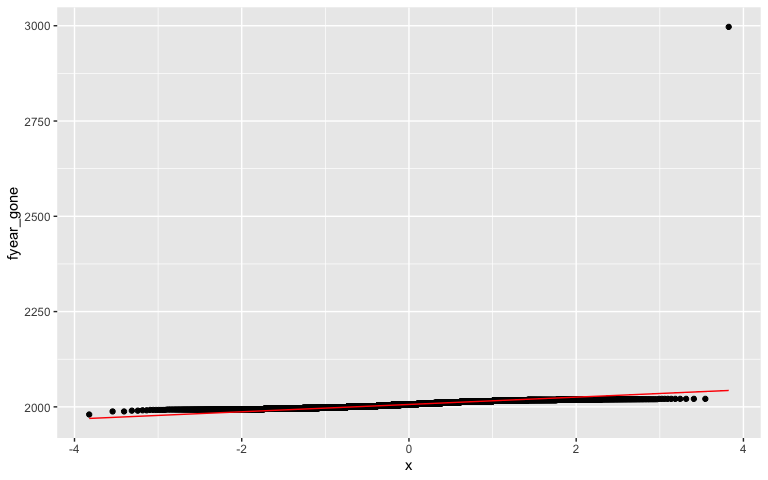
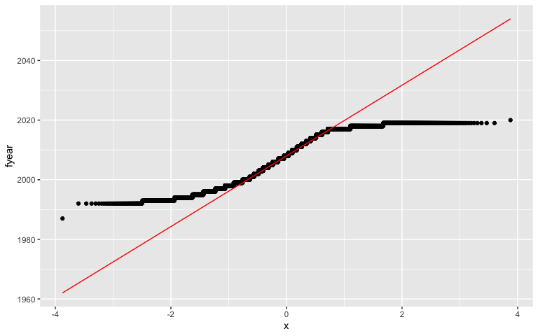
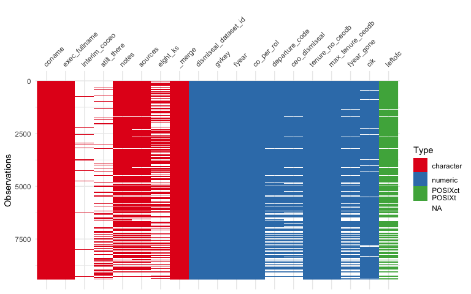
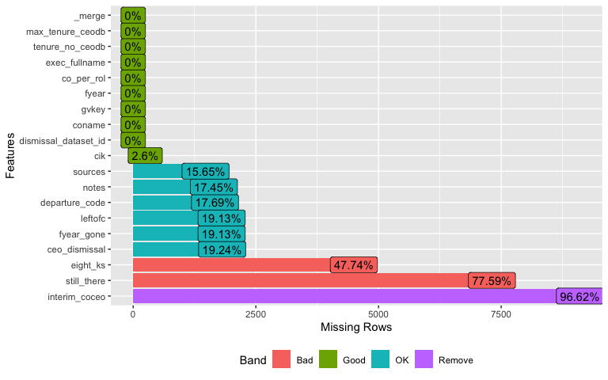
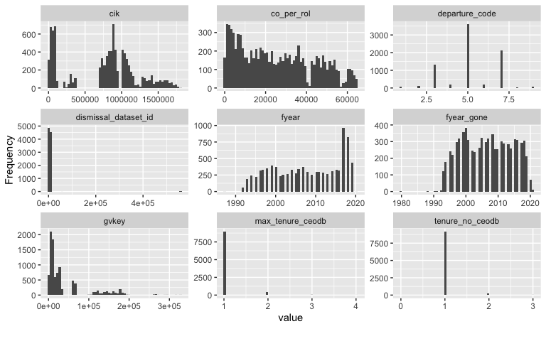
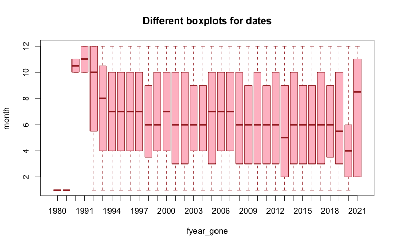
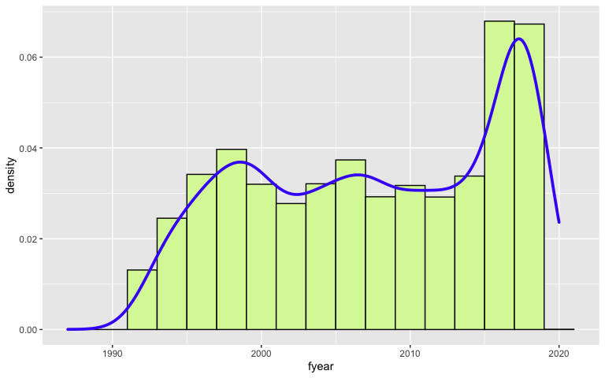
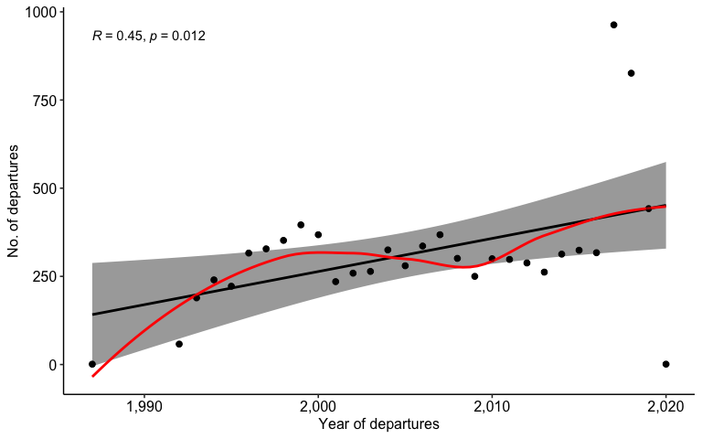

[This assignment is for ETC5521 Assignment 1 by Team  comprising of Qin Xu, Raunak Bhivpathaki, Pian Li, and Nishtha Arora.]{style="color:#006DAE;"}


\section*{PART A: NISHTHA-Intro/Motivation, Data Desc, data exploration, data collection}

# Introduction and motivation

The chief executive officers (CEO's) and the management team play a vital role for the performance of the company as they provide strategic decisions that directs company in the direction of success. However, since the beginning of the early 1980s, there has been a series of studies that have argued that the effect of “CEO” has been largely over estimated [12].  

In order to understand the CEO succession phenomena deeply, we carry an analysis involving CEO dismissals, their departure reasons, year of dismissal and more.The data set used for the analysis, is an open source data set which includes records for reasons of CEO departures in S&P 1500 firms from 1980 to 2021.

In order to carry out the analysis, we will answer the following **research questions**:

- What is the most popular reason of CEO departure from 1987 to 2020 ?

- Compare and contrast involuntary and voluntary CEO departures.

- How many CEO with higher experience left companies from 1987 to 2020? Guess which company is more attractive.

- Give details of the CEO's for the company which has had maximum CEO's over the years.

- Has the no. of CEO departures increased over the years?

# Data description


## Source of the data


The data set has been extracted from [TidyTuesday-RforDataScience github](https://github.com/rfordatascience/tidytuesday/blob/master/data/2021/2021-04-27) which further has been taken from Gentry et al.'s article available at [Wiley Online Library](https://onlinelibrary.wiley.com/doi/abs/10.1002/smj.3278). The original data source for the article is [*zenodo.org*](https://zenodo.org/record/4543893#.YUIAey0Rq9Y), which is a  data center hub and contains open data sources for research.

## Structure of the data

The data set contains the data for CEO details, their name, company name, year of departure, year of serving and dismissal reasons. The number of rows in the data set are 9423 and the number of columns are 19. The list of variable names with their description are mentioned below in Table 2.1:

### Variable description and datatypes

<div style="border: 1px solid #ddd; padding: 0px; overflow-y: scroll; height:300px; overflow-x: scroll; width:100%; "><table class="table lightable-paper lightable-hover" style='margin-left: auto; margin-right: auto; font-family: "Arial Narrow", arial, helvetica, sans-serif; width: auto !important; margin-left: auto; margin-right: auto;'>
<caption>(\#tab:unnamed-chunk-1)Data Dictonary</caption>
 <thead>
  <tr>
   <th style="text-align:left;position: sticky; top:0; background-color: #FFFFFF;"> VARIABLES </th>
   <th style="text-align:left;position: sticky; top:0; background-color: #FFFFFF;"> CLASS/ TYPE </th>
   <th style="text-align:left;position: sticky; top:0; background-color: #FFFFFF;"> DESCRIPTION </th>
  </tr>
 </thead>
<tbody>
  <tr>
   <td style="text-align:left;"> dismissal_dataset_id </td>
   <td style="text-align:left;"> double </td>
   <td style="text-align:left;"> The primary key. This will change from one version to the next. gvkey-year is also a unique identifier </td>
  </tr>
  <tr>
   <td style="text-align:left;"> coname </td>
   <td style="text-align:left;"> character </td>
   <td style="text-align:left;"> The Compustat Company Name </td>
  </tr>
  <tr>
   <td style="text-align:left;"> gvkey </td>
   <td style="text-align:left;"> double </td>
   <td style="text-align:left;"> The Compustat Company identifier </td>
  </tr>
  <tr>
   <td style="text-align:left;"> fyear </td>
   <td style="text-align:left;"> double </td>
   <td style="text-align:left;"> The fiscal year in which the event occured </td>
  </tr>
  <tr>
   <td style="text-align:left;"> co_per_rol </td>
   <td style="text-align:left;"> double </td>
   <td style="text-align:left;"> The executive/company identifier from Execucomp </td>
  </tr>
  <tr>
   <td style="text-align:left;"> exec_fullname </td>
   <td style="text-align:left;"> character </td>
   <td style="text-align:left;"> The executive full name as listed in Execucomp </td>
  </tr>
  <tr>
   <td style="text-align:left;"> departure_code </td>
   <td style="text-align:left;"> double </td>
   <td style="text-align:left;"> The departure reason coded from criteria above </td>
  </tr>
  <tr>
   <td style="text-align:left;"> ceo_dismissal </td>
   <td style="text-align:left;"> double </td>
   <td style="text-align:left;"> A dummy code for involuntary, non-health related turnover (Codes 3 &amp; 4). </td>
  </tr>
  <tr>
   <td style="text-align:left;"> interim_coceo </td>
   <td style="text-align:left;"> character </td>
   <td style="text-align:left;"> A descriptor of whether the CEO was listed as co-CEO or as an interim CEO (sometimes interim positions last a couple years) </td>
  </tr>
  <tr>
   <td style="text-align:left;"> tenure_no_ceodb </td>
   <td style="text-align:left;"> double </td>
   <td style="text-align:left;"> For CEOs who return, this value should capture whether this is the first or second time in office </td>
  </tr>
  <tr>
   <td style="text-align:left;"> max_tenure_ceodb </td>
   <td style="text-align:left;"> double </td>
   <td style="text-align:left;"> For this CEO, how many times did s/he serve as CEO </td>
  </tr>
  <tr>
   <td style="text-align:left;"> fyear_gone </td>
   <td style="text-align:left;"> double </td>
   <td style="text-align:left;"> An attempt to determine the fiscal year of the CEO’s effective departure date. Occasionally, looking at departures on Execucomp does not agree with the leftofc date that we have. They apparently try to balance between the CEO serving one month in the fiscal year against documenting who was CEO on the date of record. I would stick to the Execucomp’s fiscal year, departure indication for consistency with prior work </td>
  </tr>
  <tr>
   <td style="text-align:left;"> leftofc </td>
   <td style="text-align:left;"> double </td>
   <td style="text-align:left;"> Left office of CEO, modified occasionally from execucomp but same interpretation. The date of effective departure from the office of CEO </td>
  </tr>
  <tr>
   <td style="text-align:left;"> still_there </td>
   <td style="text-align:left;"> character </td>
   <td style="text-align:left;"> A date that indicates the last time we checked to see if the CEO was in office. If no date, then it looks like the CEO is still in office but we are in the process of checking </td>
  </tr>
  <tr>
   <td style="text-align:left;"> notes </td>
   <td style="text-align:left;"> character </td>
   <td style="text-align:left;"> Long-form description and justification for the coding scheme assignment. </td>
  </tr>
  <tr>
   <td style="text-align:left;"> sources </td>
   <td style="text-align:left;"> character </td>
   <td style="text-align:left;"> URL(s) of relevant sources from internet or library sources. </td>
  </tr>
  <tr>
   <td style="text-align:left;"> eight_ks </td>
   <td style="text-align:left;"> character </td>
   <td style="text-align:left;"> URL(s) of 8k filing from the Securities and Exchange Commission from 270 days before through 270 days after the CEO’s leftofc date which might relate to the turnover. Included here are any 8k filing 5.02 (departure of directors or principal executives) or simply item 5 if it is an older filing. These were collected without examining their content. </td>
  </tr>
  <tr>
   <td style="text-align:left;"> cik </td>
   <td style="text-align:left;"> double </td>
   <td style="text-align:left;"> The company’s Central Index Key </td>
  </tr>
  <tr>
   <td style="text-align:left;"> _merge </td>
   <td style="text-align:left;"> character </td>
   <td style="text-align:left;"> Merge details </td>
  </tr>
</tbody>
</table></div>

The *departure code* is a *double/numeric* variable and hence, is a numeric digit (code value). The description for each digit is depicted below in Table 2.2:

<div style="border: 1px solid #ddd; padding: 0px; overflow-y: scroll; height:300px; overflow-x: scroll; width:100%; "><table class="table lightable-paper lightable-hover" style='margin-left: auto; margin-right: auto; font-family: "Arial Narrow", arial, helvetica, sans-serif; width: auto !important; margin-left: auto; margin-right: auto;'>
<caption>(\#tab:unnamed-chunk-2)CEO Departure Code Description </caption>
 <thead>
  <tr>
   <th style="text-align:right;position: sticky; top:0; background-color: #FFFFFF;"> CODE NUMBER </th>
   <th style="text-align:left;position: sticky; top:0; background-color: #FFFFFF;"> TYPE </th>
   <th style="text-align:left;position: sticky; top:0; background-color: #FFFFFF;"> DESCRIPTION </th>
  </tr>
 </thead>
<tbody>
  <tr>
   <td style="text-align:right;"> 1 </td>
   <td style="text-align:left;"> Involuntary - CEO death </td>
   <td style="text-align:left;"> The CEO died while in office and did not have an opportunity to resign before health failed. </td>
  </tr>
  <tr>
   <td style="text-align:right;"> 2 </td>
   <td style="text-align:left;"> Involuntary - CEO illness </td>
   <td style="text-align:left;"> Required announcement that the CEO was leaving for health concerns rather than removed during a health crisis. </td>
  </tr>
  <tr>
   <td style="text-align:right;"> 3 </td>
   <td style="text-align:left;"> Involuntary – CEO dismissed for job performance </td>
   <td style="text-align:left;"> The CEO stepped down for reasons related to job performance. This included situations where the CEO was immediately terminated as well as when the CEO was given some transition period, but the media coverage was negative. Often the media cited financial performance or some other failing of CEO job performance (e.g., leadership deficiencies, innovation weaknesses, etc.). </td>
  </tr>
  <tr>
   <td style="text-align:right;"> 4 </td>
   <td style="text-align:left;"> Involuntary - CEO dismissed for legal violations or concerns </td>
   <td style="text-align:left;"> The CEO was terminated for behavioral or policy-related problems. The CEO's departure was almost always immediate, and the announcement cited an instance where the CEO violated company HR policy, expense account cheating, etc. </td>
  </tr>
  <tr>
   <td style="text-align:right;"> 5 </td>
   <td style="text-align:left;"> Voluntary - CEO retired </td>
   <td style="text-align:left;"> Voluntary retirement based on how the turnover was reported in the media. Here the departure did not sound forced, and the CEO often had a voice or comment in the succession announcement. Media coverage of voluntary turnover was more valedictory than critical. Firms use different mandatory retirement ages, so we could not use 65 or older and facing mandatory retirement as a cut off. We examined coverage around the event and subsequent coverage of the CEO’s career when it sounded unclear. </td>
  </tr>
  <tr>
   <td style="text-align:right;"> 6 </td>
   <td style="text-align:left;"> Voluntary - new opportunity (new career driven succession) </td>
   <td style="text-align:left;"> The CEO left to pursue a new venture or to work at another company. This frequently occurred in startup firms and for founders. </td>
  </tr>
  <tr>
   <td style="text-align:right;"> 7 </td>
   <td style="text-align:left;"> Other </td>
   <td style="text-align:left;"> Interim CEOs, CEO departure following a merger or acquisition, company ceased to exist, company changed key identifiers so it is not an actual turnover, and CEO may or may not have taken over the new company. </td>
  </tr>
  <tr>
   <td style="text-align:right;"> 8 </td>
   <td style="text-align:left;"> Missing </td>
   <td style="text-align:left;"> Despite attempts to collect information, there was not sufficient data to assign a code to the turnover event. These will remain the subject of further investigation and expansion. </td>
  </tr>
  <tr>
   <td style="text-align:right;"> 9 </td>
   <td style="text-align:left;"> Execucomp error </td>
   <td style="text-align:left;"> If a researcher were to create a dataset of all potential turnovers using execucomp (co_per_rol != l.co_per_rol), several instances will appear of what looks like a turnover when there was no actual event. This code captures those. </td>
  </tr>
</tbody>
</table></div>

# Data Exploration

## Finding Outliers and Duplicates


After sub-setting the duplicate rows from the original data using R, it was found out that **there are 0 duplicate data entries**.

Further we find outliers in the time variables of the data set.

<div class="figure">

<p class="caption">(\#fig:out)Finding outliers in fyear_gone</p>
</div>

Figure \@ref(fig:out) shows that there is an outlier in the *fyear_gone* column i.e. showing a year '2997' which is not possible as the present year is '2021'. This needs to be removed.

<div class="figure">

<p class="caption">(\#fig:outt)Finding outliers in fyear</p>
</div>

Though figure \@ref(fig:outt) is not symmetrical but no outliers are detected here. The *fyear* variable ranges from 1987 to 2020, which is possible and correct.

## Variable Description (after correction)


The outlier found in figure \@ref(fig:out) is corrected i.e. the row with the year "2997" is removed and a cleaned data set is formed.

### Variable datatypes visualization


All the variables are in the correct data types which are displayed below in \@ref(fig:viz):

<div class="figure">

<p class="caption">(\#fig:viz)Visualization for variable types</p>
</div>
It is observed that most of the variables are of numeric type. Most amount of NULL values are found in character type variables. The exact percentage of missing values for each variable is shown below in \@ref(fig:plot):

<div class="figure">

<p class="caption">(\#fig:plot)Missing values in Variables</p>
</div>
*These missing values will be removed for the analysis as and when required.*

## Checking the data quality

The quality of the data set is checked using the *Skim* function in R. Below displayed is the summary of the data set, the no. of variables for each data type, missing, unique, minimum and maximum values for each variable and their mean and standard deviation (sd).


<table style='width: auto;'
        class='table table-condensed'>
<caption>(\#tab:skim)Data summary</caption>
 <thead>
  <tr>
   <th style="text-align:left;">   </th>
   <th style="text-align:left;">   </th>
  </tr>
 </thead>
<tbody>
  <tr>
   <td style="text-align:left;"> Name </td>
   <td style="text-align:left;"> clean </td>
  </tr>
  <tr>
   <td style="text-align:left;"> Number of rows </td>
   <td style="text-align:left;"> 9422 </td>
  </tr>
  <tr>
   <td style="text-align:left;"> Number of columns </td>
   <td style="text-align:left;"> 19 </td>
  </tr>
  <tr>
   <td style="text-align:left;"> _______________________ </td>
   <td style="text-align:left;">  </td>
  </tr>
  <tr>
   <td style="text-align:left;"> Column type frequency: </td>
   <td style="text-align:left;">  </td>
  </tr>
  <tr>
   <td style="text-align:left;"> character </td>
   <td style="text-align:left;"> 8 </td>
  </tr>
  <tr>
   <td style="text-align:left;"> numeric </td>
   <td style="text-align:left;"> 10 </td>
  </tr>
  <tr>
   <td style="text-align:left;"> POSIXct </td>
   <td style="text-align:left;"> 1 </td>
  </tr>
  <tr>
   <td style="text-align:left;"> ________________________ </td>
   <td style="text-align:left;">  </td>
  </tr>
  <tr>
   <td style="text-align:left;"> Group variables </td>
   <td style="text-align:left;"> None </td>
  </tr>
</tbody>
</table>


**Variable type: character**

<table>
 <thead>
  <tr>
   <th style="text-align:left;"> skim_variable </th>
   <th style="text-align:right;"> n_missing </th>
   <th style="text-align:right;"> complete_rate </th>
   <th style="text-align:right;"> min </th>
   <th style="text-align:right;"> max </th>
   <th style="text-align:right;"> empty </th>
   <th style="text-align:right;"> n_unique </th>
   <th style="text-align:right;"> whitespace </th>
  </tr>
 </thead>
<tbody>
  <tr>
   <td style="text-align:left;"> coname </td>
   <td style="text-align:right;"> 0 </td>
   <td style="text-align:right;"> 1.00 </td>
   <td style="text-align:right;"> 2 </td>
   <td style="text-align:right;"> 30 </td>
   <td style="text-align:right;"> 0 </td>
   <td style="text-align:right;"> 3859 </td>
   <td style="text-align:right;"> 0 </td>
  </tr>
  <tr>
   <td style="text-align:left;"> exec_fullname </td>
   <td style="text-align:right;"> 0 </td>
   <td style="text-align:right;"> 1.00 </td>
   <td style="text-align:right;"> 5 </td>
   <td style="text-align:right;"> 790 </td>
   <td style="text-align:right;"> 0 </td>
   <td style="text-align:right;"> 8700 </td>
   <td style="text-align:right;"> 0 </td>
  </tr>
  <tr>
   <td style="text-align:left;"> interim_coceo </td>
   <td style="text-align:right;"> 9104 </td>
   <td style="text-align:right;"> 0.03 </td>
   <td style="text-align:right;"> 6 </td>
   <td style="text-align:right;"> 7 </td>
   <td style="text-align:right;"> 0 </td>
   <td style="text-align:right;"> 6 </td>
   <td style="text-align:right;"> 0 </td>
  </tr>
  <tr>
   <td style="text-align:left;"> still_there </td>
   <td style="text-align:right;"> 7311 </td>
   <td style="text-align:right;"> 0.22 </td>
   <td style="text-align:right;"> 3 </td>
   <td style="text-align:right;"> 10 </td>
   <td style="text-align:right;"> 0 </td>
   <td style="text-align:right;"> 77 </td>
   <td style="text-align:right;"> 0 </td>
  </tr>
  <tr>
   <td style="text-align:left;"> notes </td>
   <td style="text-align:right;"> 1644 </td>
   <td style="text-align:right;"> 0.83 </td>
   <td style="text-align:right;"> 5 </td>
   <td style="text-align:right;"> 3117 </td>
   <td style="text-align:right;"> 0 </td>
   <td style="text-align:right;"> 7754 </td>
   <td style="text-align:right;"> 0 </td>
  </tr>
  <tr>
   <td style="text-align:left;"> sources </td>
   <td style="text-align:right;"> 1475 </td>
   <td style="text-align:right;"> 0.84 </td>
   <td style="text-align:right;"> 18 </td>
   <td style="text-align:right;"> 1843 </td>
   <td style="text-align:right;"> 0 </td>
   <td style="text-align:right;"> 7914 </td>
   <td style="text-align:right;"> 0 </td>
  </tr>
  <tr>
   <td style="text-align:left;"> eight_ks </td>
   <td style="text-align:right;"> 4498 </td>
   <td style="text-align:right;"> 0.52 </td>
   <td style="text-align:right;"> 69 </td>
   <td style="text-align:right;"> 3884 </td>
   <td style="text-align:right;"> 0 </td>
   <td style="text-align:right;"> 4914 </td>
   <td style="text-align:right;"> 0 </td>
  </tr>
  <tr>
   <td style="text-align:left;"> _merge </td>
   <td style="text-align:right;"> 0 </td>
   <td style="text-align:right;"> 1.00 </td>
   <td style="text-align:right;"> 11 </td>
   <td style="text-align:right;"> 11 </td>
   <td style="text-align:right;"> 0 </td>
   <td style="text-align:right;"> 1 </td>
   <td style="text-align:right;"> 0 </td>
  </tr>
</tbody>
</table>


**Variable type: numeric**

<table>
 <thead>
  <tr>
   <th style="text-align:left;"> skim_variable </th>
   <th style="text-align:right;"> n_missing </th>
   <th style="text-align:right;"> complete_rate </th>
   <th style="text-align:right;"> mean </th>
   <th style="text-align:right;"> sd </th>
   <th style="text-align:right;"> p0 </th>
   <th style="text-align:right;"> p25 </th>
   <th style="text-align:right;"> p50 </th>
   <th style="text-align:right;"> p75 </th>
   <th style="text-align:right;"> p100 </th>
   <th style="text-align:left;"> hist </th>
  </tr>
 </thead>
<tbody>
  <tr>
   <td style="text-align:left;"> dismissal_dataset_id </td>
   <td style="text-align:right;"> 0 </td>
   <td style="text-align:right;"> 1.00 </td>
   <td style="text-align:right;"> 5684.55 </td>
   <td style="text-align:right;"> 25006.75 </td>
   <td style="text-align:right;"> 1 </td>
   <td style="text-align:right;"> 2306.25 </td>
   <td style="text-align:right;"> 4593.5 </td>
   <td style="text-align:right;"> 6812.75 </td>
   <td style="text-align:right;"> 559044 </td>
   <td style="text-align:left;"> ▇▁▁▁▁ </td>
  </tr>
  <tr>
   <td style="text-align:left;"> gvkey </td>
   <td style="text-align:right;"> 0 </td>
   <td style="text-align:right;"> 1.00 </td>
   <td style="text-align:right;"> 40136.22 </td>
   <td style="text-align:right;"> 53922.97 </td>
   <td style="text-align:right;"> 1004 </td>
   <td style="text-align:right;"> 7343.00 </td>
   <td style="text-align:right;"> 14385.0 </td>
   <td style="text-align:right;"> 60900.75 </td>
   <td style="text-align:right;"> 328795 </td>
   <td style="text-align:left;"> ▇▁▁▁▁ </td>
  </tr>
  <tr>
   <td style="text-align:left;"> fyear </td>
   <td style="text-align:right;"> 0 </td>
   <td style="text-align:right;"> 1.00 </td>
   <td style="text-align:right;"> 2007.74 </td>
   <td style="text-align:right;"> 8.19 </td>
   <td style="text-align:right;"> 1987 </td>
   <td style="text-align:right;"> 2000.00 </td>
   <td style="text-align:right;"> 2008.0 </td>
   <td style="text-align:right;"> 2016.00 </td>
   <td style="text-align:right;"> 2020 </td>
   <td style="text-align:left;"> ▁▆▅▅▇ </td>
  </tr>
  <tr>
   <td style="text-align:left;"> co_per_rol </td>
   <td style="text-align:right;"> 0 </td>
   <td style="text-align:right;"> 1.00 </td>
   <td style="text-align:right;"> 25582.30 </td>
   <td style="text-align:right;"> 18202.22 </td>
   <td style="text-align:right;"> -1 </td>
   <td style="text-align:right;"> 8559.50 </td>
   <td style="text-align:right;"> 22982.0 </td>
   <td style="text-align:right;"> 39275.75 </td>
   <td style="text-align:right;"> 64602 </td>
   <td style="text-align:left;"> ▇▆▅▃▃ </td>
  </tr>
  <tr>
   <td style="text-align:left;"> departure_code </td>
   <td style="text-align:right;"> 1667 </td>
   <td style="text-align:right;"> 0.82 </td>
   <td style="text-align:right;"> 5.20 </td>
   <td style="text-align:right;"> 1.53 </td>
   <td style="text-align:right;"> 1 </td>
   <td style="text-align:right;"> 5.00 </td>
   <td style="text-align:right;"> 5.0 </td>
   <td style="text-align:right;"> 7.00 </td>
   <td style="text-align:right;"> 9 </td>
   <td style="text-align:left;"> ▁▃▇▅▁ </td>
  </tr>
  <tr>
   <td style="text-align:left;"> ceo_dismissal </td>
   <td style="text-align:right;"> 1813 </td>
   <td style="text-align:right;"> 0.81 </td>
   <td style="text-align:right;"> 0.20 </td>
   <td style="text-align:right;"> 0.40 </td>
   <td style="text-align:right;"> 0 </td>
   <td style="text-align:right;"> 0.00 </td>
   <td style="text-align:right;"> 0.0 </td>
   <td style="text-align:right;"> 0.00 </td>
   <td style="text-align:right;"> 1 </td>
   <td style="text-align:left;"> ▇▁▁▁▂ </td>
  </tr>
  <tr>
   <td style="text-align:left;"> tenure_no_ceodb </td>
   <td style="text-align:right;"> 0 </td>
   <td style="text-align:right;"> 1.00 </td>
   <td style="text-align:right;"> 1.03 </td>
   <td style="text-align:right;"> 0.17 </td>
   <td style="text-align:right;"> 0 </td>
   <td style="text-align:right;"> 1.00 </td>
   <td style="text-align:right;"> 1.0 </td>
   <td style="text-align:right;"> 1.00 </td>
   <td style="text-align:right;"> 3 </td>
   <td style="text-align:left;"> ▁▇▁▁▁ </td>
  </tr>
  <tr>
   <td style="text-align:left;"> max_tenure_ceodb </td>
   <td style="text-align:right;"> 0 </td>
   <td style="text-align:right;"> 1.00 </td>
   <td style="text-align:right;"> 1.05 </td>
   <td style="text-align:right;"> 0.24 </td>
   <td style="text-align:right;"> 1 </td>
   <td style="text-align:right;"> 1.00 </td>
   <td style="text-align:right;"> 1.0 </td>
   <td style="text-align:right;"> 1.00 </td>
   <td style="text-align:right;"> 4 </td>
   <td style="text-align:left;"> ▇▁▁▁▁ </td>
  </tr>
  <tr>
   <td style="text-align:left;"> fyear_gone </td>
   <td style="text-align:right;"> 1802 </td>
   <td style="text-align:right;"> 0.81 </td>
   <td style="text-align:right;"> 2006.51 </td>
   <td style="text-align:right;"> 7.55 </td>
   <td style="text-align:right;"> 1980 </td>
   <td style="text-align:right;"> 2000.00 </td>
   <td style="text-align:right;"> 2007.0 </td>
   <td style="text-align:right;"> 2013.00 </td>
   <td style="text-align:right;"> 2021 </td>
   <td style="text-align:left;"> ▁▂▇▇▇ </td>
  </tr>
  <tr>
   <td style="text-align:left;"> cik </td>
   <td style="text-align:right;"> 245 </td>
   <td style="text-align:right;"> 0.97 </td>
   <td style="text-align:right;"> 741545.85 </td>
   <td style="text-align:right;"> 486522.47 </td>
   <td style="text-align:right;"> 1750 </td>
   <td style="text-align:right;"> 106413.00 </td>
   <td style="text-align:right;"> 857323.0 </td>
   <td style="text-align:right;"> 1050377.00 </td>
   <td style="text-align:right;"> 1808065 </td>
   <td style="text-align:left;"> ▆▁▇▂▁ </td>
  </tr>
</tbody>
</table>


**Variable type: POSIXct**

<table>
 <thead>
  <tr>
   <th style="text-align:left;"> skim_variable </th>
   <th style="text-align:right;"> n_missing </th>
   <th style="text-align:right;"> complete_rate </th>
   <th style="text-align:left;"> min </th>
   <th style="text-align:left;"> max </th>
   <th style="text-align:left;"> median </th>
   <th style="text-align:right;"> n_unique </th>
  </tr>
 </thead>
<tbody>
  <tr>
   <td style="text-align:left;"> leftofc </td>
   <td style="text-align:right;"> 1802 </td>
   <td style="text-align:right;"> 0.81 </td>
   <td style="text-align:left;"> 1981-01-01 </td>
   <td style="text-align:left;"> 2021-12-01 </td>
   <td style="text-align:left;"> 2006-12-31 </td>
   <td style="text-align:right;"> 3626 </td>
  </tr>
</tbody>
</table>

In the figure below i.e.\@ref(fig:hist) , histograms for each variable is displayed.

<div class="figure">

<p class="caption">(\#fig:hist)Variable values districution</p>
</div>
The histograms show depict the range of values/skewness of values for each variable, for example, the histogram *gvkey* is left skewed.

## Time frame of collection

**The \@ref(fig:boxplot) shows the time frame for the date of departure(fyear_gone) of the CEO.** 

<div class="figure">

<p class="caption">(\#fig:boxplot)Time frame for CEO departure event </p>
</div>
We see that the data set has a single data value at 1980 and numerous values from 1988 to 2021. 

**The \@ref(fig:time) shows the time frame for the year when the event took place (fyear).**

<div class="figure">

<p class="caption">(\#fig:time)Time frame for event occurence (CEO dismissal)</p>
</div>
It is seen that the data is collected from 1987 to 2020, with single data in 1987 and 2020 and numerous data rows for the years from 1992 to 2019.

Therefore, overall we can say that the data has been collected from **1980 to 2021**

# Data Collection Method

- The data was collected by  by Richard J. Gentry, Joseph S. Harrison, Steven Boivie and Timothy J, as a part of their research on the CEO turnover and their dismissals in S&P firms [5].

- This data was collected from a range of different news coverage and SEC filings (Financial Statement submitted to Securities and Exchange Commission) from the web and university libraries.

- Then the data was then coded by paid undergraduate students in a computer lab under the direct supervision of two strategy PhD students at a major university in the southeastern United States.

- During th COVID-19 pandemic, the process of data coding was through a data collection company outside of the United States as in-person coding was not possible due to restriction in the United States. 

# Analysis

*(Please use PLOTLY (click on the region/plot/shape) to get more information about the plots/figures in the report further from here)*

\section*{PART B: PIAN- Q1, Q2, Q3(new question by Pian)}

## What is the most popular reason of CEO departure from 1987 to 2020 ?

The variables, "Departure code" and "Dismissal," are used to analyze the reasons for CEO departure and generate data insights, then compare the proportion of each type of dismissal for companies from S&P 1500.   

<div class="figure">

```{=html}
<div id="htmlwidget-057e4f3f5533d78aa071" style="width:768px;height:480px;" class="plotly html-widget"></div>
<script type="application/json" data-for="htmlwidget-057e4f3f5533d78aa071">{"x":{"data":[{"orientation":"v","width":0.9,"base":0,"x":[2],"y":[84],"text":"reorder(Dismissal, number): death<br />number:   84<br />Dismissal: death","type":"bar","marker":{"autocolorscale":false,"color":"rgba(179,226,205,1)","line":{"width":1.88976377952756,"color":"transparent"}},"name":"death","legendgroup":"death","showlegend":true,"xaxis":"x","yaxis":"y","hoverinfo":"text","frame":null},{"orientation":"v","width":0.9,"base":0,"x":[3],"y":[97],"text":"reorder(Dismissal, number): Illness<br />number:   97<br />Dismissal: Illness","type":"bar","marker":{"autocolorscale":false,"color":"rgba(253,205,172,1)","line":{"width":1.88976377952756,"color":"transparent"}},"name":"Illness","legendgroup":"Illness","showlegend":true,"xaxis":"x","yaxis":"y","hoverinfo":"text","frame":null},{"orientation":"v","width":0.9,"base":0,"x":[6],"y":[1320],"text":"reorder(Dismissal, number): Job performance<br />number: 1320<br />Dismissal: Job performance","type":"bar","marker":{"autocolorscale":false,"color":"rgba(203,213,232,1)","line":{"width":1.88976377952756,"color":"transparent"}},"name":"Job performance","legendgroup":"Job performance","showlegend":true,"xaxis":"x","yaxis":"y","hoverinfo":"text","frame":null},{"orientation":"v","width":0.9,"base":0,"x":[5],"y":[195],"text":"reorder(Dismissal, number): legal violations or concerns<br />number:  195<br />Dismissal: legal violations or concerns","type":"bar","marker":{"autocolorscale":false,"color":"rgba(244,202,228,1)","line":{"width":1.88976377952756,"color":"transparent"}},"name":"legal violations or concerns","legendgroup":"legal violations or concerns","showlegend":true,"xaxis":"x","yaxis":"y","hoverinfo":"text","frame":null},{"orientation":"v","width":0.899999999999999,"base":0,"x":[8],"y":[3598],"text":"reorder(Dismissal, number): CEO retired<br />number: 3598<br />Dismissal: CEO retired","type":"bar","marker":{"autocolorscale":false,"color":"rgba(230,245,201,1)","line":{"width":1.88976377952756,"color":"transparent"}},"name":"CEO retired","legendgroup":"CEO retired","showlegend":true,"xaxis":"x","yaxis":"y","hoverinfo":"text","frame":null},{"orientation":"v","width":0.9,"base":0,"x":[4],"y":[183],"text":"reorder(Dismissal, number): New opportunity<br />number:  183<br />Dismissal: New opportunity","type":"bar","marker":{"autocolorscale":false,"color":"rgba(255,242,174,1)","line":{"width":1.88976377952756,"color":"transparent"}},"name":"New opportunity","legendgroup":"New opportunity","showlegend":true,"xaxis":"x","yaxis":"y","hoverinfo":"text","frame":null},{"orientation":"v","width":0.9,"base":0,"x":[7],"y":[2132],"text":"reorder(Dismissal, number): Other<br />number: 2132<br />Dismissal: Other","type":"bar","marker":{"autocolorscale":false,"color":"rgba(241,226,204,1)","line":{"width":1.88976377952756,"color":"transparent"}},"name":"Other","legendgroup":"Other","showlegend":true,"xaxis":"x","yaxis":"y","hoverinfo":"text","frame":null},{"orientation":"v","width":0.9,"base":0,"x":[1],"y":[53],"text":"reorder(Dismissal, number): Missing<br />number:   53<br />Dismissal: Missing","type":"bar","marker":{"autocolorscale":false,"color":"rgba(204,204,204,1)","line":{"width":1.88976377952756,"color":"transparent"}},"name":"Missing","legendgroup":"Missing","showlegend":true,"xaxis":"x","yaxis":"y","hoverinfo":"text","frame":null},{"x":[2],"y":[84],"text":84,"hovertext":"reorder(Dismissal, number): death<br />number:   84<br />Dismissal: death<br />number:   84","textfont":{"size":8.31496062992126,"color":"rgba(0,0,0,1)"},"type":"scatter","mode":"text","hoveron":"points","name":"death","legendgroup":"death","showlegend":false,"xaxis":"x","yaxis":"y","hoverinfo":"text","frame":null},{"x":[3],"y":[97],"text":97,"hovertext":"reorder(Dismissal, number): Illness<br />number:   97<br />Dismissal: Illness<br />number:   97","textfont":{"size":8.31496062992126,"color":"rgba(0,0,0,1)"},"type":"scatter","mode":"text","hoveron":"points","name":"Illness","legendgroup":"Illness","showlegend":false,"xaxis":"x","yaxis":"y","hoverinfo":"text","frame":null},{"x":[6],"y":[1320],"text":1320,"hovertext":"reorder(Dismissal, number): Job performance<br />number: 1320<br />Dismissal: Job performance<br />number: 1320","textfont":{"size":8.31496062992126,"color":"rgba(0,0,0,1)"},"type":"scatter","mode":"text","hoveron":"points","name":"Job performance","legendgroup":"Job performance","showlegend":false,"xaxis":"x","yaxis":"y","hoverinfo":"text","frame":null},{"x":[5],"y":[195],"text":195,"hovertext":"reorder(Dismissal, number): legal violations or concerns<br />number:  195<br />Dismissal: legal violations or concerns<br />number:  195","textfont":{"size":8.31496062992126,"color":"rgba(0,0,0,1)"},"type":"scatter","mode":"text","hoveron":"points","name":"legal violations or concerns","legendgroup":"legal violations or concerns","showlegend":false,"xaxis":"x","yaxis":"y","hoverinfo":"text","frame":null},{"x":[8],"y":[3598],"text":3598,"hovertext":"reorder(Dismissal, number): CEO retired<br />number: 3598<br />Dismissal: CEO retired<br />number: 3598","textfont":{"size":8.31496062992126,"color":"rgba(0,0,0,1)"},"type":"scatter","mode":"text","hoveron":"points","name":"CEO retired","legendgroup":"CEO retired","showlegend":false,"xaxis":"x","yaxis":"y","hoverinfo":"text","frame":null},{"x":[4],"y":[183],"text":183,"hovertext":"reorder(Dismissal, number): New opportunity<br />number:  183<br />Dismissal: New opportunity<br />number:  183","textfont":{"size":8.31496062992126,"color":"rgba(0,0,0,1)"},"type":"scatter","mode":"text","hoveron":"points","name":"New opportunity","legendgroup":"New opportunity","showlegend":false,"xaxis":"x","yaxis":"y","hoverinfo":"text","frame":null},{"x":[7],"y":[2132],"text":2132,"hovertext":"reorder(Dismissal, number): Other<br />number: 2132<br />Dismissal: Other<br />number: 2132","textfont":{"size":8.31496062992126,"color":"rgba(0,0,0,1)"},"type":"scatter","mode":"text","hoveron":"points","name":"Other","legendgroup":"Other","showlegend":false,"xaxis":"x","yaxis":"y","hoverinfo":"text","frame":null},{"x":[1],"y":[53],"text":53,"hovertext":"reorder(Dismissal, number): Missing<br />number:   53<br />Dismissal: Missing<br />number:   53","textfont":{"size":8.31496062992126,"color":"rgba(0,0,0,1)"},"type":"scatter","mode":"text","hoveron":"points","name":"Missing","legendgroup":"Missing","showlegend":false,"xaxis":"x","yaxis":"y","hoverinfo":"text","frame":null}],"layout":{"margin":{"t":27.689497716895,"r":7.30593607305936,"b":41.6438356164384,"l":48.9497716894977},"plot_bgcolor":"rgba(255,255,255,1)","paper_bgcolor":"rgba(255,255,255,1)","font":{"color":"rgba(0,0,0,1)","family":"","size":14.6118721461187},"xaxis":{"domain":[0,1],"automargin":true,"type":"linear","autorange":false,"range":[0.4,8.6],"tickmode":"array","ticktext":["Missing","death","Illness","New opportunity","legal violations or concerns","Job performance","Other","CEO retired"],"tickvals":[1,2,3,4,5,6,7,8],"categoryorder":"array","categoryarray":["Missing","death","Illness","New opportunity","legal violations or concerns","Job performance","Other","CEO retired"],"nticks":null,"ticks":"outside","tickcolor":"rgba(51,51,51,1)","ticklen":3.65296803652968,"tickwidth":0.66417600664176,"showticklabels":true,"tickfont":{"color":"rgba(77,77,77,1)","family":"","size":11.689497716895},"tickangle":-30,"showline":false,"linecolor":null,"linewidth":0,"showgrid":true,"gridcolor":"rgba(190,190,190,1)","gridwidth":0.66417600664176,"zeroline":false,"anchor":"y","title":{"text":"Dismissal reasons","font":{"color":"rgba(0,0,0,1)","family":"","size":14.6118721461187}},"hoverformat":".2f"},"yaxis":{"domain":[0,1],"automargin":true,"type":"linear","autorange":false,"range":[-179.9,3777.9],"tickmode":"array","ticktext":["0","1000","2000","3000"],"tickvals":[0,1000,2000,3000],"categoryorder":"array","categoryarray":["0","1000","2000","3000"],"nticks":null,"ticks":"outside","tickcolor":"rgba(51,51,51,1)","ticklen":3.65296803652968,"tickwidth":0.66417600664176,"showticklabels":true,"tickfont":{"color":"rgba(77,77,77,1)","family":"","size":11.689497716895},"tickangle":-0,"showline":false,"linecolor":null,"linewidth":0,"showgrid":true,"gridcolor":"rgba(190,190,190,1)","gridwidth":0.66417600664176,"zeroline":false,"anchor":"x","title":{"text":"Count","font":{"color":"rgba(0,0,0,1)","family":"","size":14.6118721461187}},"hoverformat":".2f"},"shapes":[{"type":"rect","fillcolor":null,"line":{"color":null,"width":0,"linetype":[]},"yref":"paper","xref":"paper","x0":0,"x1":1,"y0":0,"y1":1}],"showlegend":true,"legend":{"bgcolor":"rgba(255,255,255,1)","bordercolor":"transparent","borderwidth":1.88976377952756,"font":{"color":"rgba(0,0,0,1)","family":"","size":11.689497716895},"y":0.913385826771654},"annotations":[{"text":"Dismissal","x":1.02,"y":1,"showarrow":false,"ax":0,"ay":0,"font":{"color":"rgba(0,0,0,1)","family":"","size":14.6118721461187},"xref":"paper","yref":"paper","textangle":-0,"xanchor":"left","yanchor":"bottom","legendTitle":true}],"hovermode":"closest","barmode":"relative"},"config":{"doubleClick":"reset","showSendToCloud":false},"source":"A","attrs":{"93d70650649":{"x":{},"y":{},"fill":{},"type":"bar"},"93d787fdc44":{"x":{},"y":{},"fill":{},"label":{}}},"cur_data":"93d70650649","visdat":{"93d70650649":["function (y) ","x"],"93d787fdc44":["function (y) ","x"]},"highlight":{"on":"plotly_click","persistent":false,"dynamic":false,"selectize":false,"opacityDim":0.2,"selected":{"opacity":1},"debounce":0},"shinyEvents":["plotly_hover","plotly_click","plotly_selected","plotly_relayout","plotly_brushed","plotly_brushing","plotly_clickannotation","plotly_doubleclick","plotly_deselect","plotly_afterplot","plotly_sunburstclick"],"base_url":"https://plot.ly"},"evals":[],"jsHooks":[]}</script>
```

<p class="caption">(\#fig:plot1)The reasons for CEO departures</p>
</div>
- Figure \@ref(fig:plot1) shows that the **primary reason for CEO departure is CEO retirement** (accounting for 47% of CEO departures). 

- From this, **an interesting finding** is that *the top three reasons for CEO departures (CEO retirement, Other, and job performances) were accounted for over 92% of the total number of CEO departures from 1987 to 2020, which suggest that within S&P 1500 companies, CEO departures are primarily due to the age of CEO.*

**Comparing distribution of the top 3 CEO departures** 

Figure \@ref(fig:plot1) shows that the top three reasons for CEO departure (CEO retirement, Other, and job performances) accounted for over 90% of the total CEO departure in S&P companies from 1987 to 1990. *Therefore, the change of the three dismissal reasons will be shown in the following graph.*

<div class="figure">

```{=html}
<div id="htmlwidget-a36a9e703d8cbf0728fb" style="width:768px;height:480px;" class="plotly html-widget"></div>
<script type="application/json" data-for="htmlwidget-a36a9e703d8cbf0728fb">{"x":{"data":[{"x":[1987,1987.0626223092,1987.1252446184,1987.18786692759,1987.25048923679,1987.31311154599,1987.37573385519,1987.43835616438,1987.50097847358,1987.56360078278,1987.62622309198,1987.68884540117,1987.75146771037,1987.81409001957,1987.87671232877,1987.93933463796,1988.00195694716,1988.06457925636,1988.12720156556,1988.18982387476,1988.25244618395,1988.31506849315,1988.37769080235,1988.44031311155,1988.50293542074,1988.56555772994,1988.62818003914,1988.69080234834,1988.75342465753,1988.81604696673,1988.87866927593,1988.94129158513,1989.00391389432,1989.06653620352,1989.12915851272,1989.19178082192,1989.25440313112,1989.31702544031,1989.37964774951,1989.44227005871,1989.50489236791,1989.5675146771,1989.6301369863,1989.6927592955,1989.7553816047,1989.81800391389,1989.88062622309,1989.94324853229,1990.00587084149,1990.06849315068,1990.13111545988,1990.19373776908,1990.25636007828,1990.31898238748,1990.38160469667,1990.44422700587,1990.50684931507,1990.56947162427,1990.63209393346,1990.69471624266,1990.75733855186,1990.81996086106,1990.88258317025,1990.94520547945,1991.00782778865,1991.07045009785,1991.13307240705,1991.19569471624,1991.25831702544,1991.32093933464,1991.38356164384,1991.44618395303,1991.50880626223,1991.57142857143,1991.63405088063,1991.69667318982,1991.75929549902,1991.82191780822,1991.88454011742,1991.94716242661,1992.00978473581,1992.07240704501,1992.13502935421,1992.19765166341,1992.2602739726,1992.3228962818,1992.385518591,1992.4481409002,1992.51076320939,1992.57338551859,1992.63600782779,1992.69863013699,1992.76125244618,1992.82387475538,1992.88649706458,1992.94911937378,1993.01174168297,1993.07436399217,1993.13698630137,1993.19960861057,1993.26223091977,1993.32485322896,1993.38747553816,1993.45009784736,1993.51272015656,1993.57534246575,1993.63796477495,1993.70058708415,1993.76320939335,1993.82583170254,1993.88845401174,1993.95107632094,1994.01369863014,1994.07632093933,1994.13894324853,1994.20156555773,1994.26418786693,1994.32681017613,1994.38943248532,1994.45205479452,1994.51467710372,1994.57729941292,1994.63992172211,1994.70254403131,1994.76516634051,1994.82778864971,1994.8904109589,1994.9530332681,1995.0156555773,1995.0782778865,1995.14090019569,1995.20352250489,1995.26614481409,1995.32876712329,1995.39138943249,1995.45401174168,1995.51663405088,1995.57925636008,1995.64187866928,1995.70450097847,1995.76712328767,1995.82974559687,1995.89236790607,1995.95499021526,1996.01761252446,1996.08023483366,1996.14285714286,1996.20547945205,1996.26810176125,1996.33072407045,1996.39334637965,1996.45596868885,1996.51859099804,1996.58121330724,1996.64383561644,1996.70645792564,1996.76908023483,1996.83170254403,1996.89432485323,1996.95694716243,1997.01956947162,1997.08219178082,1997.14481409002,1997.20743639922,1997.27005870841,1997.33268101761,1997.39530332681,1997.45792563601,1997.52054794521,1997.5831702544,1997.6457925636,1997.7084148728,1997.771037182,1997.83365949119,1997.89628180039,1997.95890410959,1998.02152641879,1998.08414872798,1998.14677103718,1998.20939334638,1998.27201565558,1998.33463796477,1998.39726027397,1998.45988258317,1998.52250489237,1998.58512720157,1998.64774951076,1998.71037181996,1998.77299412916,1998.83561643836,1998.89823874755,1998.96086105675,1999.02348336595,1999.08610567515,1999.14872798434,1999.21135029354,1999.27397260274,1999.33659491194,1999.39921722114,1999.46183953033,1999.52446183953,1999.58708414873,1999.64970645793,1999.71232876712,1999.77495107632,1999.83757338552,1999.90019569472,1999.96281800391,2000.02544031311,2000.08806262231,2000.15068493151,2000.2133072407,2000.2759295499,2000.3385518591,2000.4011741683,2000.4637964775,2000.52641878669,2000.58904109589,2000.65166340509,2000.71428571429,2000.77690802348,2000.83953033268,2000.90215264188,2000.96477495108,2001.02739726027,2001.09001956947,2001.15264187867,2001.21526418787,2001.27788649706,2001.34050880626,2001.40313111546,2001.46575342466,2001.52837573386,2001.59099804305,2001.65362035225,2001.71624266145,2001.77886497065,2001.84148727984,2001.90410958904,2001.96673189824,2002.02935420744,2002.09197651663,2002.15459882583,2002.21722113503,2002.27984344423,2002.34246575342,2002.40508806262,2002.46771037182,2002.53033268102,2002.59295499022,2002.65557729941,2002.71819960861,2002.78082191781,2002.84344422701,2002.9060665362,2002.9686888454,2003.0313111546,2003.0939334638,2003.15655577299,2003.21917808219,2003.28180039139,2003.34442270059,2003.40704500978,2003.46966731898,2003.53228962818,2003.59491193738,2003.65753424658,2003.72015655577,2003.78277886497,2003.84540117417,2003.90802348337,2003.97064579256,2004.03326810176,2004.09589041096,2004.15851272016,2004.22113502935,2004.28375733855,2004.34637964775,2004.40900195695,2004.47162426614,2004.53424657534,2004.59686888454,2004.65949119374,2004.72211350294,2004.78473581213,2004.84735812133,2004.90998043053,2004.97260273973,2005.03522504892,2005.09784735812,2005.16046966732,2005.22309197652,2005.28571428571,2005.34833659491,2005.41095890411,2005.47358121331,2005.5362035225,2005.5988258317,2005.6614481409,2005.7240704501,2005.7866927593,2005.84931506849,2005.91193737769,2005.97455968689,2006.03718199609,2006.09980430528,2006.16242661448,2006.22504892368,2006.28767123288,2006.35029354207,2006.41291585127,2006.47553816047,2006.53816046967,2006.60078277886,2006.66340508806,2006.72602739726,2006.78864970646,2006.85127201566,2006.91389432485,2006.97651663405,2007.03913894325,2007.10176125245,2007.16438356164,2007.22700587084,2007.28962818004,2007.35225048924,2007.41487279843,2007.47749510763,2007.54011741683,2007.60273972603,2007.66536203523,2007.72798434442,2007.79060665362,2007.85322896282,2007.91585127202,2007.97847358121,2008.04109589041,2008.10371819961,2008.16634050881,2008.228962818,2008.2915851272,2008.3542074364,2008.4168297456,2008.47945205479,2008.54207436399,2008.60469667319,2008.66731898239,2008.72994129159,2008.79256360078,2008.85518590998,2008.91780821918,2008.98043052838,2009.04305283757,2009.10567514677,2009.16829745597,2009.23091976517,2009.29354207436,2009.35616438356,2009.41878669276,2009.48140900196,2009.54403131115,2009.60665362035,2009.66927592955,2009.73189823875,2009.79452054795,2009.85714285714,2009.91976516634,2009.98238747554,2010.04500978474,2010.10763209393,2010.17025440313,2010.23287671233,2010.29549902153,2010.35812133072,2010.42074363992,2010.48336594912,2010.54598825832,2010.60861056751,2010.67123287671,2010.73385518591,2010.79647749511,2010.85909980431,2010.9217221135,2010.9843444227,2011.0469667319,2011.1095890411,2011.17221135029,2011.23483365949,2011.29745596869,2011.36007827789,2011.42270058708,2011.48532289628,2011.54794520548,2011.61056751468,2011.67318982387,2011.73581213307,2011.79843444227,2011.86105675147,2011.92367906067,2011.98630136986,2012.04892367906,2012.11154598826,2012.17416829746,2012.23679060665,2012.29941291585,2012.36203522505,2012.42465753425,2012.48727984344,2012.54990215264,2012.61252446184,2012.67514677104,2012.73776908023,2012.80039138943,2012.86301369863,2012.92563600783,2012.98825831703,2013.05088062622,2013.11350293542,2013.17612524462,2013.23874755382,2013.30136986301,2013.36399217221,2013.42661448141,2013.48923679061,2013.5518590998,2013.614481409,2013.6771037182,2013.7397260274,2013.80234833659,2013.86497064579,2013.92759295499,2013.99021526419,2014.05283757339,2014.11545988258,2014.17808219178,2014.24070450098,2014.30332681018,2014.36594911937,2014.42857142857,2014.49119373777,2014.55381604697,2014.61643835616,2014.67906066536,2014.74168297456,2014.80430528376,2014.86692759295,2014.92954990215,2014.99217221135,2015.05479452055,2015.11741682975,2015.18003913894,2015.24266144814,2015.30528375734,2015.36790606654,2015.43052837573,2015.49315068493,2015.55577299413,2015.61839530333,2015.68101761252,2015.74363992172,2015.80626223092,2015.86888454012,2015.93150684932,2015.99412915851,2016.05675146771,2016.11937377691,2016.18199608611,2016.2446183953,2016.3072407045,2016.3698630137,2016.4324853229,2016.49510763209,2016.55772994129,2016.62035225049,2016.68297455969,2016.74559686888,2016.80821917808,2016.87084148728,2016.93346379648,2016.99608610568,2017.05870841487,2017.12133072407,2017.18395303327,2017.24657534247,2017.30919765166,2017.37181996086,2017.43444227006,2017.49706457926,2017.55968688845,2017.62230919765,2017.68493150685,2017.74755381605,2017.81017612524,2017.87279843444,2017.93542074364,2017.99804305284,2018.06066536204,2018.12328767123,2018.18590998043,2018.24853228963,2018.31115459883,2018.37377690802,2018.43639921722,2018.49902152642,2018.56164383562,2018.62426614481,2018.68688845401,2018.74951076321,2018.81213307241,2018.8747553816,2018.9373776908,2019,2019,2018.9373776908,2018.8747553816,2018.81213307241,2018.74951076321,2018.68688845401,2018.62426614481,2018.56164383562,2018.49902152642,2018.43639921722,2018.37377690802,2018.31115459883,2018.24853228963,2018.18590998043,2018.12328767123,2018.06066536204,2017.99804305284,2017.93542074364,2017.87279843444,2017.81017612524,2017.74755381605,2017.68493150685,2017.62230919765,2017.55968688845,2017.49706457926,2017.43444227006,2017.37181996086,2017.30919765166,2017.24657534247,2017.18395303327,2017.12133072407,2017.05870841487,2016.99608610568,2016.93346379648,2016.87084148728,2016.80821917808,2016.74559686888,2016.68297455969,2016.62035225049,2016.55772994129,2016.49510763209,2016.4324853229,2016.3698630137,2016.3072407045,2016.2446183953,2016.18199608611,2016.11937377691,2016.05675146771,2015.99412915851,2015.93150684932,2015.86888454012,2015.80626223092,2015.74363992172,2015.68101761252,2015.61839530333,2015.55577299413,2015.49315068493,2015.43052837573,2015.36790606654,2015.30528375734,2015.24266144814,2015.18003913894,2015.11741682975,2015.05479452055,2014.99217221135,2014.92954990215,2014.86692759295,2014.80430528376,2014.74168297456,2014.67906066536,2014.61643835616,2014.55381604697,2014.49119373777,2014.42857142857,2014.36594911937,2014.30332681018,2014.24070450098,2014.17808219178,2014.11545988258,2014.05283757339,2013.99021526419,2013.92759295499,2013.86497064579,2013.80234833659,2013.7397260274,2013.6771037182,2013.614481409,2013.5518590998,2013.48923679061,2013.42661448141,2013.36399217221,2013.30136986301,2013.23874755382,2013.17612524462,2013.11350293542,2013.05088062622,2012.98825831703,2012.92563600783,2012.86301369863,2012.80039138943,2012.73776908023,2012.67514677104,2012.61252446184,2012.54990215264,2012.48727984344,2012.42465753425,2012.36203522505,2012.29941291585,2012.23679060665,2012.17416829746,2012.11154598826,2012.04892367906,2011.98630136986,2011.92367906067,2011.86105675147,2011.79843444227,2011.73581213307,2011.67318982387,2011.61056751468,2011.54794520548,2011.48532289628,2011.42270058708,2011.36007827789,2011.29745596869,2011.23483365949,2011.17221135029,2011.1095890411,2011.0469667319,2010.9843444227,2010.9217221135,2010.85909980431,2010.79647749511,2010.73385518591,2010.67123287671,2010.60861056751,2010.54598825832,2010.48336594912,2010.42074363992,2010.35812133072,2010.29549902153,2010.23287671233,2010.17025440313,2010.10763209393,2010.04500978474,2009.98238747554,2009.91976516634,2009.85714285714,2009.79452054795,2009.73189823875,2009.66927592955,2009.60665362035,2009.54403131115,2009.48140900196,2009.41878669276,2009.35616438356,2009.29354207436,2009.23091976517,2009.16829745597,2009.10567514677,2009.04305283757,2008.98043052838,2008.91780821918,2008.85518590998,2008.79256360078,2008.72994129159,2008.66731898239,2008.60469667319,2008.54207436399,2008.47945205479,2008.4168297456,2008.3542074364,2008.2915851272,2008.228962818,2008.16634050881,2008.10371819961,2008.04109589041,2007.97847358121,2007.91585127202,2007.85322896282,2007.79060665362,2007.72798434442,2007.66536203523,2007.60273972603,2007.54011741683,2007.47749510763,2007.41487279843,2007.35225048924,2007.28962818004,2007.22700587084,2007.16438356164,2007.10176125245,2007.03913894325,2006.97651663405,2006.91389432485,2006.85127201566,2006.78864970646,2006.72602739726,2006.66340508806,2006.60078277886,2006.53816046967,2006.47553816047,2006.41291585127,2006.35029354207,2006.28767123288,2006.22504892368,2006.16242661448,2006.09980430528,2006.03718199609,2005.97455968689,2005.91193737769,2005.84931506849,2005.7866927593,2005.7240704501,2005.6614481409,2005.5988258317,2005.5362035225,2005.47358121331,2005.41095890411,2005.34833659491,2005.28571428571,2005.22309197652,2005.16046966732,2005.09784735812,2005.03522504892,2004.97260273973,2004.90998043053,2004.84735812133,2004.78473581213,2004.72211350294,2004.65949119374,2004.59686888454,2004.53424657534,2004.47162426614,2004.40900195695,2004.34637964775,2004.28375733855,2004.22113502935,2004.15851272016,2004.09589041096,2004.03326810176,2003.97064579256,2003.90802348337,2003.84540117417,2003.78277886497,2003.72015655577,2003.65753424658,2003.59491193738,2003.53228962818,2003.46966731898,2003.40704500978,2003.34442270059,2003.28180039139,2003.21917808219,2003.15655577299,2003.0939334638,2003.0313111546,2002.9686888454,2002.9060665362,2002.84344422701,2002.78082191781,2002.71819960861,2002.65557729941,2002.59295499022,2002.53033268102,2002.46771037182,2002.40508806262,2002.34246575342,2002.27984344423,2002.21722113503,2002.15459882583,2002.09197651663,2002.02935420744,2001.96673189824,2001.90410958904,2001.84148727984,2001.77886497065,2001.71624266145,2001.65362035225,2001.59099804305,2001.52837573386,2001.46575342466,2001.40313111546,2001.34050880626,2001.27788649706,2001.21526418787,2001.15264187867,2001.09001956947,2001.02739726027,2000.96477495108,2000.90215264188,2000.83953033268,2000.77690802348,2000.71428571429,2000.65166340509,2000.58904109589,2000.52641878669,2000.4637964775,2000.4011741683,2000.3385518591,2000.2759295499,2000.2133072407,2000.15068493151,2000.08806262231,2000.02544031311,1999.96281800391,1999.90019569472,1999.83757338552,1999.77495107632,1999.71232876712,1999.64970645793,1999.58708414873,1999.52446183953,1999.46183953033,1999.39921722114,1999.33659491194,1999.27397260274,1999.21135029354,1999.14872798434,1999.08610567515,1999.02348336595,1998.96086105675,1998.89823874755,1998.83561643836,1998.77299412916,1998.71037181996,1998.64774951076,1998.58512720157,1998.52250489237,1998.45988258317,1998.39726027397,1998.33463796477,1998.27201565558,1998.20939334638,1998.14677103718,1998.08414872798,1998.02152641879,1997.95890410959,1997.89628180039,1997.83365949119,1997.771037182,1997.7084148728,1997.6457925636,1997.5831702544,1997.52054794521,1997.45792563601,1997.39530332681,1997.33268101761,1997.27005870841,1997.20743639922,1997.14481409002,1997.08219178082,1997.01956947162,1996.95694716243,1996.89432485323,1996.83170254403,1996.76908023483,1996.70645792564,1996.64383561644,1996.58121330724,1996.51859099804,1996.45596868885,1996.39334637965,1996.33072407045,1996.26810176125,1996.20547945205,1996.14285714286,1996.08023483366,1996.01761252446,1995.95499021526,1995.89236790607,1995.82974559687,1995.76712328767,1995.70450097847,1995.64187866928,1995.57925636008,1995.51663405088,1995.45401174168,1995.39138943249,1995.32876712329,1995.26614481409,1995.20352250489,1995.14090019569,1995.0782778865,1995.0156555773,1994.9530332681,1994.8904109589,1994.82778864971,1994.76516634051,1994.70254403131,1994.63992172211,1994.57729941292,1994.51467710372,1994.45205479452,1994.38943248532,1994.32681017613,1994.26418786693,1994.20156555773,1994.13894324853,1994.07632093933,1994.01369863014,1993.95107632094,1993.88845401174,1993.82583170254,1993.76320939335,1993.70058708415,1993.63796477495,1993.57534246575,1993.51272015656,1993.45009784736,1993.38747553816,1993.32485322896,1993.26223091977,1993.19960861057,1993.13698630137,1993.07436399217,1993.01174168297,1992.94911937378,1992.88649706458,1992.82387475538,1992.76125244618,1992.69863013699,1992.63600782779,1992.57338551859,1992.51076320939,1992.4481409002,1992.385518591,1992.3228962818,1992.2602739726,1992.19765166341,1992.13502935421,1992.07240704501,1992.00978473581,1991.94716242661,1991.88454011742,1991.82191780822,1991.75929549902,1991.69667318982,1991.63405088063,1991.57142857143,1991.50880626223,1991.44618395303,1991.38356164384,1991.32093933464,1991.25831702544,1991.19569471624,1991.13307240705,1991.07045009785,1991.00782778865,1990.94520547945,1990.88258317025,1990.81996086106,1990.75733855186,1990.69471624266,1990.63209393346,1990.56947162427,1990.50684931507,1990.44422700587,1990.38160469667,1990.31898238748,1990.25636007828,1990.19373776908,1990.13111545988,1990.06849315068,1990.00587084149,1989.94324853229,1989.88062622309,1989.81800391389,1989.7553816047,1989.6927592955,1989.6301369863,1989.5675146771,1989.50489236791,1989.44227005871,1989.37964774951,1989.31702544031,1989.25440313112,1989.19178082192,1989.12915851272,1989.06653620352,1989.00391389432,1988.94129158513,1988.87866927593,1988.81604696673,1988.75342465753,1988.69080234834,1988.62818003914,1988.56555772994,1988.50293542074,1988.44031311155,1988.37769080235,1988.31506849315,1988.25244618395,1988.18982387476,1988.12720156556,1988.06457925636,1988.00195694716,1987.93933463796,1987.87671232877,1987.81409001957,1987.75146771037,1987.68884540117,1987.62622309198,1987.56360078278,1987.50097847358,1987.43835616438,1987.37573385519,1987.31311154599,1987.25048923679,1987.18786692759,1987.1252446184,1987.0626223092,1987,1987],"y":[0,0,0,0,0,0,0,0,0,0,0,0,0,0,0,0,0,0,0,0,0,0,0,0,0,0,0,0,0,0,0,0,0,0,0,0,0,0,0,0,0,0,0,0,0,0,0,0,0,0,0,0,0,0,0,0,0,0,0,0,0,0,0,0,0,0,0,0,0,0,0,0,0,0,0,0,0,0,0,0,0,0,0,0,0,0,0,0,0,0,0,0,0,0,0,0,0,0,0,0,0,0,0,0,0,0,0,0,0,0,0,0,0,0,0,0,0,0,0,0,0,0,0,0,0,0,0,0,0,0,0,0,0,0,0,0,0,0,0,0,0,0,0,0,0,0,0,0,0,0,0,0,0,0,0,0,0,0,0,0,0,0,0,0,0,0,0,0,0,0,0,0,0,0,0,0,0,0,0,0,0,0,0,0,0,0,0,0,0,0,0,0,0,0,0,0,0,0,0,0,0,0,0,0,0,0,0,0,0,0,0,0,0,0,0,0,0,0,0,0,0,0,0,0,0,0,0,0,0,0,0,0,0,0,0,0,0,0,0,0,0,0,0,0,0,0,0,0,0,0,0,0,0,0,0,0,0,0,0,0,0,0,0,0,0,0,0,0,0,0,0,0,0,0,0,0,0,0,0,0,0,0,0,0,0,0,0,0,0,0,0,0,0,0,0,0,0,0,0,0,0,0,0,0,0,0,0,0,0,0,0,0,0,0,0,0,0,0,0,0,0,0,0,0,0,0,0,0,0,0,0,0,0,0,0,0,0,0,0,0,0,0,0,0,0,0,0,0,0,0,0,0,0,0,0,0,0,0,0,0,0,0,0,0,0,0,0,0,0,0,0,0,0,0,0,0,0,0,0,0,0,0,0,0,0,0,0,0,0,0,0,0,0,0,0,0,0,0,0,0,0,0,0,0,0,0,0,0,0,0,0,0,0,0,0,0,0,0,0,0,0,0,0,0,0,0,0,0,0,0,0,0,0,0,0,0,0,0,0,0,0,0,0,0,0,0,0,0,0,0,0,0,0,0,0,0,0,0,0,0,0,0,0,0,0,0,0,0,0,0,0,0,0,0,0,0,0,0,0,0,0,0,0,0,0,0,0,0,0,0,0,0,0,0,0,0,0,0,0,0,0,0,0,0,0,0,0,0,0,0,0,0,0.0173952978805634,0.0180486681815812,0.0187065259399945,0.0193698051652485,0.0200353140649415,0.020702539669284,0.0213709941586934,0.0220391463346608,0.02270618566055,0.0233716806260886,0.0240332287551306,0.0246906194219962,0.0253437445714199,0.0259912380897588,0.0266300093882494,0.0272620239473458,0.0278869286680451,0.028500544158943,0.0291036606508151,0.0296975872316642,0.0302812839971516,0.0308489327509151,0.0314057325886925,0.0319514767036249,0.032481806313571,0.0329967587783706,0.0334995451274941,0.0339900276296677,0.0344600939674099,0.0349171294216851,0.0353612916641793,0.0357891552243282,0.0361990399326293,0.036595890125879,0.0369797113069677,0.0373436610264204,0.0376933918688932,0.0380303392262601,0.0383524532852701,0.0386562287058984,0.0389477215541039,0.0392270271190466,0.0394890761972521,0.0397371926796268,0.0399738257782229,0.0401982180698491,0.0404054664927288,0.0406020260667084,0.0407880233402761,0.0409600659628428,0.0411193221841373,0.0412688441755381,0.041408758914237,0.0415335981824133,0.0416494266432954,0.0417564558392194,0.0418526258319237,0.0419374530390522,0.0420142528753655,0.0420831407866207,0.0421402928375144,0.0421893988419839,0.0422313219918615,0.0422649954547238,0.0422888438415913,0.0423062161722898,0.0423172202187577,0.0423193450685335,0.0423145452890085,0.0423040815560386,0.0422876127889226,0.0422630410937885,0.042233527247756,0.0421991850377897,0.0421585855396185,0.0421125207991074,0.0420623851656819,0.0420082972772672,0.0419482928906157,0.0418849952512388,0.0418185389292669,0.0417483428025127,0.0416745965061118,0.041598502009202,0.0415201840615618,0.0414389115332086,0.0413559207469013,0.0412715080215866,0.0411856291332115,0.0410984177342295,0.0410105474725212,0.0409221300400327,0.0408332751550705,0.0407444037097274,0.0406556651093538,0.0405672061805171,0.040479531547886,0.040392576345731,0.0403064199729546,0.0402215687138976,0.0401381770260125,0.0400560454680339,0.0399752434045404,0.0398968611207228,0.0398201005222072,0.039745007325497,0.0396721476918726,0.0396018178744451,0.0395334239420595,0.0394670028055902,0.0394037796056308,0.03934289306841,0.0392842006252744,0.0392281762829053,0.039175538113891,0.039125318189824,0.0390775537574038,0.0390335098400408,0.0389925904041335,0.0389544012590294,0.038919280389599,0.0388886692455496,0.0388611338996927,0.0388367356661871,0.0388168217118042,0.0388012689357311,0.0387892939868562,0.0387810106240905,0.0387790131360984,0.0387810990104411,0.0387873502177178,0.0387991400355029,0.0388170681000974,0.0388396947948556,0.0388671005624087,0.0389022629933831,0.0389430087287633,0.0389890109716186,0.0390414174504049,0.0391017665524163,0.0391677225128191,0.0392393224697899,0.0393193155514802,0.0394060195267936,0.0394984640291205,0.0395972527852853,0.0397047107768379,0.0398177171361355,0.0399362084969781,0.0400620731478915,0.0401943235678872,0.0403314529817359,0.0404734194901924,0.0406224445987095,0.0407753717217405,0.0409320093167781,0.0410929898771458,0.04125769603789,0.0414247074007228,0.0415937826516729,0.0417650592035662,0.0419370322695655,0.0421093088080288,0.0422814084876459,0.0424521071328776,0.0426211489547796,0.0427882221779445,0.0429513157405252,0.0431102705001485,0.0432652076305526,0.0434152147176247,0.0435571858805323,0.0436931587917566,0.0438228465143751,0.0439430054012052,0.0440536671385865,0.0441563180107686,0.0442504978450004,0.0443303611631502,0.0444008288697201,0.0444617352635165,0.0445098426215719,0.0445442608422495,0.0445682616062197,0.0445817512033784,0.0445784492123856,0.0445636806527342,0.0445381476499146,0.0444996052041051,0.0444458444668502,0.0443815790853591,0.0443068929120745,0.0442171057970087,0.0441159901787661,0.0440052864295229,0.0438840835400001,0.0437494412233438,0.0436064490040639,0.043455330864922,0.0432935562342319,0.0431231300434857,0.0429461829076775,0.0427628073571101,0.0425706333201102,0.042373737428978,0.0421724083597136,0.0419659886293274,0.0417554442365205,0.0415423633226928,0.0413270379890629,0.041109358392009,0.0408909348128244,0.0406721326844829,0.0404534127853198,0.0402358532499412,0.0400196771963451,0.0398051428220787,0.0395939359771202,0.0393860510359159,0.0391813825721178,0.0389806854028986,0.0387862071175801,0.0385963337780169,0.0384112592393066,0.0382334644182,0.0380626934834738,0.0378978730268239,0.0377394141451547,0.037591418361247,0.0374503276177227,0.0373162671951867,0.0371917306722771,0.0370772228359865,0.0369704694107755,0.0368715673382194,0.0367854720250214,0.0367080809803603,0.0366390389679195,0.0365803251826678,0.0365337466325631,0.0364958235355867,0.0364665858905864,0.0364504243019465,0.0364442519058497,0.0364468309119042,0.0364593212519888,0.0364848719613665,0.0365190259171581,0.0365617382891865,0.0366163463621603,0.0366811212508273,0.0367540320611133,0.0368353450810245,0.0369290382351973,0.0370302053572341,0.0371387181706413,0.0372565937816339,0.0373833008358029,0.037516401772862,0.0376557326345574,0.0378042406250681,0.0379582149414241,0.0381171908689071,0.0382819018730602,0.0384523273004156,0.0386263203858162,0.0388036451729729,0.0389851069939791,0.0391688988181287,0.0393543887265957,0.0395414020173855,0.0397293092566617,0.0399171664707883,0.0401046981140373,0.0402909306255098,0.0404751015447731,0.0406571369083002,0.0408365928982105,0.0410109506680072,0.0411813810073847,0.0413476164751156,0.0415076226798468,0.0416605286595642,0.0418075591714683,0.0419484666054795,0.0420785768882806,0.0422010422414139,0.0423159111300895,0.0424209647564861,0.0425141603280456,0.0425985284236187,0.0426739040178786,0.0427351476375192,0.0427854421808944,0.0428258744497266,0.0428548194820154,0.0428685007276244,0.0428717961333535,0.0428646606707796,0.0428425943812167,0.0428077206841138,0.0427623376326083,0.0427058533099175,0.0426329778902788,0.0425498878483332,0.0424566671936363,0.0423501758024936,0.0422310799708936,0.0421025663263278,0.041964767697028,0.0418127028304135,0.0416519576535884,0.0414829922640967,0.0413041904441058,0.0411151142497159,0.0409191013645893,0.0407163626409637,0.0405042172821391,0.0402858129999645,0.0400621208709903,0.0398326978426212,0.0395968347181132,0.0393571526874058,0.0391138739571688,0.038866145156978,0.0386153604327948,0.0383623714659452,0.0381072926948085,0.037849970847265,0.03759169127567,0.0373326247475648,0.0370729402591486,0.0368132049140489,0.0365536807992531,0.0362945043114827,0.0360364133370835,0.0357793060958068,0.0355232528387273,0.0352687017239073,0.035016089938516,0.0347649903837312,0.0345154535889005,0.0342684472473799,0.0340233688985985,0.0337800391196228,0.0335387602509335,0.0333000931210328,0.0330631725752832,0.032827983708627,0.0325952194038854,0.032364398067627,0.0321351408958246,0.0319075172311777,0.0316821134107618,0.0314580189912468,0.0312351891042358,0.0310139414349076,0.0307940434768104,0.0305751030976326,0.0303570716656653,0.0301402968291636,0.0299241732887929,0.0297086384849279,0.0294937382178784,0.0292793496212156,0.0290652324578199,0.02885133831703,0.0286376035487312,0.0284238364520537,0.0282099769551208,0.0279959262193105,0.0277814335782089,0.0275665232849096,0.0273511434277924,0.0271349183496706,0.0269178117309555,0.0266998795873583,0.0264809820140488,0.0262604315246375,0.026038660709341,0.0258156043235192,0.0255906337187829,0.0253636017085518,0.0251348376819016,0.0249042702309884,0.0246704436933149,0.0244343826167138,0.0241960320543443,0.0239546230147798,0.0237095999059248,0.0234617927188049,0.0232111265748179,0.0229557852213372,0.0226968865854776,0.0224346690153664,0.0221684394066136,0.0218969695905168,0.0216217959199502,0.0213428693764744,0.0210583618842396,0.0207691571445844,0.0204759630693523,0.0201784062629637,0.0198745551293819,0.019566646518677,0.0192546902776393,0.0189372676879248,0.0186148016603386,0.0182884621839486,0.0179582910971314,0.0176221155601116,0.0172824466918129,0.0169393847424062,0.0165922037283702,0.0162409679839941,0.0158869951956306,0.0155304028109424,0.0151702559344448,0.014808012113012,0.014444037956017,0.0140782856951826,0.0137109817675436,0.013342990619843,0.0129744834023313,0.0126057973648962,0.0122375505548765,0.0118699499045713,0.011503305216306,0.0111387983571018,0.0107761366239504,0.0104155031499371,0.0100581413602672,0.00970445124672424,0.00935395411549005,0.00900683553002017,0.00866597545565619,0.00832938370735631,0.0079972105811878,0.00767101785061914,0.00735171834339267,0.00703774255693914,0.00672921576940229,0.00642959202024135,0.00613651054761056,0.00584956302689967,0.0055700625048634,0.00529994682959598,0.00503644384301143,0.00477960766736091,0.00453267255104442,0.00429380259406684,0.00406182364495883,0.00383744293088449,0.0036237216454701,0.00341691176594519,0.00321699692065964,0.00302649253670879,0.00284454578567328,0.00266929582566195,0.00250076452371426,0.00234282894755607,0.00219123988855025,0.00204592922796838,0.00190852194151445,0.00177916607566041,0.0016555999952233,0.00153774165229962,0.0014284350730017,0.00132478749089666,0.00122627034849608,0.00113371251143887,0.0010479741669774,0.000966751973428086,0.000889950263951164,0.000819318186339344,0.000753287615083272,0.00069105761823495,0.000632895126769733,0.00057997696836555,0.000530261499973584,0.000483660649551261,0.000441110339024595,0.000401960791928679,0.000365378111818494,0.000331319124949139,0.000300940421848252,0.000272635634471774,0.000246335875903973,0.000222463994281149,0.000200886028377043,0.000180893827535444,0.000162427922658926,0.00014612554749799,0.000131152816766772,0.000117362294911124,0.000104902554649508,9.38587858293391e-05,8.37128008625975e-05,7.44259314894346e-05,6.62816322844168e-05,5.89304459398382e-05,5.22186217519895e-05,4.61742367174966e-05,4.09310844185317e-05,3.61542218455493e-05,3.18212137271838e-05,2.8041637285558e-05,2.4695055330765e-05,2.16658870188335e-05,1.89429771869277e-05,1.663616305554e-05,1.45516402513285e-05,0],"text":["density: 1.455164e-05<br />fyear: 1987.000<br />Dismissal: Job performance","density: 1.663616e-05<br />fyear: 1987.063<br />Dismissal: Job performance","density: 1.894298e-05<br />fyear: 1987.125<br />Dismissal: Job performance","density: 2.166589e-05<br />fyear: 1987.188<br />Dismissal: Job performance","density: 2.469506e-05<br />fyear: 1987.250<br />Dismissal: Job performance","density: 2.804164e-05<br />fyear: 1987.313<br />Dismissal: Job performance","density: 3.182121e-05<br />fyear: 1987.376<br />Dismissal: Job performance","density: 3.615422e-05<br />fyear: 1987.438<br />Dismissal: Job performance","density: 4.093108e-05<br />fyear: 1987.501<br />Dismissal: Job performance","density: 4.617424e-05<br />fyear: 1987.564<br />Dismissal: Job performance","density: 5.221862e-05<br />fyear: 1987.626<br />Dismissal: Job performance","density: 5.893045e-05<br />fyear: 1987.689<br />Dismissal: Job performance","density: 6.628163e-05<br />fyear: 1987.751<br />Dismissal: Job performance","density: 7.442593e-05<br />fyear: 1987.814<br />Dismissal: Job performance","density: 8.371280e-05<br />fyear: 1987.877<br />Dismissal: Job performance","density: 9.385879e-05<br />fyear: 1987.939<br />Dismissal: Job performance","density: 1.049026e-04<br />fyear: 1988.002<br />Dismissal: Job performance","density: 1.173623e-04<br />fyear: 1988.065<br />Dismissal: Job performance","density: 1.311528e-04<br />fyear: 1988.127<br />Dismissal: Job performance","density: 1.461255e-04<br />fyear: 1988.190<br />Dismissal: Job performance","density: 1.624279e-04<br />fyear: 1988.252<br />Dismissal: Job performance","density: 1.808938e-04<br />fyear: 1988.315<br />Dismissal: Job performance","density: 2.008860e-04<br />fyear: 1988.378<br />Dismissal: Job performance","density: 2.224640e-04<br />fyear: 1988.440<br />Dismissal: Job performance","density: 2.463359e-04<br />fyear: 1988.503<br />Dismissal: Job performance","density: 2.726356e-04<br />fyear: 1988.566<br />Dismissal: Job performance","density: 3.009404e-04<br />fyear: 1988.628<br />Dismissal: Job performance","density: 3.313191e-04<br />fyear: 1988.691<br />Dismissal: Job performance","density: 3.653781e-04<br />fyear: 1988.753<br />Dismissal: Job performance","density: 4.019608e-04<br />fyear: 1988.816<br />Dismissal: Job performance","density: 4.411103e-04<br />fyear: 1988.879<br />Dismissal: Job performance","density: 4.836606e-04<br />fyear: 1988.941<br />Dismissal: Job performance","density: 5.302615e-04<br />fyear: 1989.004<br />Dismissal: Job performance","density: 5.799770e-04<br />fyear: 1989.067<br />Dismissal: Job performance","density: 6.328951e-04<br />fyear: 1989.129<br />Dismissal: Job performance","density: 6.910576e-04<br />fyear: 1989.192<br />Dismissal: Job performance","density: 7.532876e-04<br />fyear: 1989.254<br />Dismissal: Job performance","density: 8.193182e-04<br />fyear: 1989.317<br />Dismissal: Job performance","density: 8.899503e-04<br />fyear: 1989.380<br />Dismissal: Job performance","density: 9.667520e-04<br />fyear: 1989.442<br />Dismissal: Job performance","density: 1.047974e-03<br />fyear: 1989.505<br />Dismissal: Job performance","density: 1.133713e-03<br />fyear: 1989.568<br />Dismissal: Job performance","density: 1.226270e-03<br />fyear: 1989.630<br />Dismissal: Job performance","density: 1.324787e-03<br />fyear: 1989.693<br />Dismissal: Job performance","density: 1.428435e-03<br />fyear: 1989.755<br />Dismissal: Job performance","density: 1.537742e-03<br />fyear: 1989.818<br />Dismissal: Job performance","density: 1.655600e-03<br />fyear: 1989.881<br />Dismissal: Job performance","density: 1.779166e-03<br />fyear: 1989.943<br />Dismissal: Job performance","density: 1.908522e-03<br />fyear: 1990.006<br />Dismissal: Job performance","density: 2.045929e-03<br />fyear: 1990.068<br />Dismissal: Job performance","density: 2.191240e-03<br />fyear: 1990.131<br />Dismissal: Job performance","density: 2.342829e-03<br />fyear: 1990.194<br />Dismissal: Job performance","density: 2.500765e-03<br />fyear: 1990.256<br />Dismissal: Job performance","density: 2.669296e-03<br />fyear: 1990.319<br />Dismissal: Job performance","density: 2.844546e-03<br />fyear: 1990.382<br />Dismissal: Job performance","density: 3.026493e-03<br />fyear: 1990.444<br />Dismissal: Job performance","density: 3.216997e-03<br />fyear: 1990.507<br />Dismissal: Job performance","density: 3.416912e-03<br />fyear: 1990.569<br />Dismissal: Job performance","density: 3.623722e-03<br />fyear: 1990.632<br />Dismissal: Job performance","density: 3.837443e-03<br />fyear: 1990.695<br />Dismissal: Job performance","density: 4.061824e-03<br />fyear: 1990.757<br />Dismissal: Job performance","density: 4.293803e-03<br />fyear: 1990.820<br />Dismissal: Job performance","density: 4.532673e-03<br />fyear: 1990.883<br />Dismissal: Job performance","density: 4.779608e-03<br />fyear: 1990.945<br />Dismissal: Job performance","density: 5.036444e-03<br />fyear: 1991.008<br />Dismissal: Job performance","density: 5.299947e-03<br />fyear: 1991.070<br />Dismissal: Job performance","density: 5.570063e-03<br />fyear: 1991.133<br />Dismissal: Job performance","density: 5.849563e-03<br />fyear: 1991.196<br />Dismissal: Job performance","density: 6.136511e-03<br />fyear: 1991.258<br />Dismissal: Job performance","density: 6.429592e-03<br />fyear: 1991.321<br />Dismissal: Job performance","density: 6.729216e-03<br />fyear: 1991.384<br />Dismissal: Job performance","density: 7.037743e-03<br />fyear: 1991.446<br />Dismissal: Job performance","density: 7.351718e-03<br />fyear: 1991.509<br />Dismissal: Job performance","density: 7.671018e-03<br />fyear: 1991.571<br />Dismissal: Job performance","density: 7.997211e-03<br />fyear: 1991.634<br />Dismissal: Job performance","density: 8.329384e-03<br />fyear: 1991.697<br />Dismissal: Job performance","density: 8.665975e-03<br />fyear: 1991.759<br />Dismissal: Job performance","density: 9.006836e-03<br />fyear: 1991.822<br />Dismissal: Job performance","density: 9.353954e-03<br />fyear: 1991.885<br />Dismissal: Job performance","density: 9.704451e-03<br />fyear: 1991.947<br />Dismissal: Job performance","density: 1.005814e-02<br />fyear: 1992.010<br />Dismissal: Job performance","density: 1.041550e-02<br />fyear: 1992.072<br />Dismissal: Job performance","density: 1.077614e-02<br />fyear: 1992.135<br />Dismissal: Job performance","density: 1.113880e-02<br />fyear: 1992.198<br />Dismissal: Job performance","density: 1.150331e-02<br />fyear: 1992.260<br />Dismissal: Job performance","density: 1.186995e-02<br />fyear: 1992.323<br />Dismissal: Job performance","density: 1.223755e-02<br />fyear: 1992.386<br />Dismissal: Job performance","density: 1.260580e-02<br />fyear: 1992.448<br />Dismissal: Job performance","density: 1.297448e-02<br />fyear: 1992.511<br />Dismissal: Job performance","density: 1.334299e-02<br />fyear: 1992.573<br />Dismissal: Job performance","density: 1.371098e-02<br />fyear: 1992.636<br />Dismissal: Job performance","density: 1.407829e-02<br />fyear: 1992.699<br />Dismissal: Job performance","density: 1.444404e-02<br />fyear: 1992.761<br />Dismissal: Job performance","density: 1.480801e-02<br />fyear: 1992.824<br />Dismissal: Job performance","density: 1.517026e-02<br />fyear: 1992.886<br />Dismissal: Job performance","density: 1.553040e-02<br />fyear: 1992.949<br />Dismissal: Job performance","density: 1.588700e-02<br />fyear: 1993.012<br />Dismissal: Job performance","density: 1.624097e-02<br />fyear: 1993.074<br />Dismissal: Job performance","density: 1.659220e-02<br />fyear: 1993.137<br />Dismissal: Job performance","density: 1.693938e-02<br />fyear: 1993.200<br />Dismissal: Job performance","density: 1.728245e-02<br />fyear: 1993.262<br />Dismissal: Job performance","density: 1.762212e-02<br />fyear: 1993.325<br />Dismissal: Job performance","density: 1.795829e-02<br />fyear: 1993.387<br />Dismissal: Job performance","density: 1.828846e-02<br />fyear: 1993.450<br />Dismissal: Job performance","density: 1.861480e-02<br />fyear: 1993.513<br />Dismissal: Job performance","density: 1.893727e-02<br />fyear: 1993.575<br />Dismissal: Job performance","density: 1.925469e-02<br />fyear: 1993.638<br />Dismissal: Job performance","density: 1.956665e-02<br />fyear: 1993.701<br />Dismissal: Job performance","density: 1.987456e-02<br />fyear: 1993.763<br />Dismissal: Job performance","density: 2.017841e-02<br />fyear: 1993.826<br />Dismissal: Job performance","density: 2.047596e-02<br />fyear: 1993.888<br />Dismissal: Job performance","density: 2.076916e-02<br />fyear: 1993.951<br />Dismissal: Job performance","density: 2.105836e-02<br />fyear: 1994.014<br />Dismissal: Job performance","density: 2.134287e-02<br />fyear: 1994.076<br />Dismissal: Job performance","density: 2.162180e-02<br />fyear: 1994.139<br />Dismissal: Job performance","density: 2.189697e-02<br />fyear: 1994.202<br />Dismissal: Job performance","density: 2.216844e-02<br />fyear: 1994.264<br />Dismissal: Job performance","density: 2.243467e-02<br />fyear: 1994.327<br />Dismissal: Job performance","density: 2.269689e-02<br />fyear: 1994.389<br />Dismissal: Job performance","density: 2.295579e-02<br />fyear: 1994.452<br />Dismissal: Job performance","density: 2.321113e-02<br />fyear: 1994.515<br />Dismissal: Job performance","density: 2.346179e-02<br />fyear: 1994.577<br />Dismissal: Job performance","density: 2.370960e-02<br />fyear: 1994.640<br />Dismissal: Job performance","density: 2.395462e-02<br />fyear: 1994.703<br />Dismissal: Job performance","density: 2.419603e-02<br />fyear: 1994.765<br />Dismissal: Job performance","density: 2.443438e-02<br />fyear: 1994.828<br />Dismissal: Job performance","density: 2.467044e-02<br />fyear: 1994.890<br />Dismissal: Job performance","density: 2.490427e-02<br />fyear: 1994.953<br />Dismissal: Job performance","density: 2.513484e-02<br />fyear: 1995.016<br />Dismissal: Job performance","density: 2.536360e-02<br />fyear: 1995.078<br />Dismissal: Job performance","density: 2.559063e-02<br />fyear: 1995.141<br />Dismissal: Job performance","density: 2.581560e-02<br />fyear: 1995.204<br />Dismissal: Job performance","density: 2.603866e-02<br />fyear: 1995.266<br />Dismissal: Job performance","density: 2.626043e-02<br />fyear: 1995.329<br />Dismissal: Job performance","density: 2.648098e-02<br />fyear: 1995.391<br />Dismissal: Job performance","density: 2.669988e-02<br />fyear: 1995.454<br />Dismissal: Job performance","density: 2.691781e-02<br />fyear: 1995.517<br />Dismissal: Job performance","density: 2.713492e-02<br />fyear: 1995.579<br />Dismissal: Job performance","density: 2.735114e-02<br />fyear: 1995.642<br />Dismissal: Job performance","density: 2.756652e-02<br />fyear: 1995.705<br />Dismissal: Job performance","density: 2.778143e-02<br />fyear: 1995.767<br />Dismissal: Job performance","density: 2.799593e-02<br />fyear: 1995.830<br />Dismissal: Job performance","density: 2.820998e-02<br />fyear: 1995.892<br />Dismissal: Job performance","density: 2.842384e-02<br />fyear: 1995.955<br />Dismissal: Job performance","density: 2.863760e-02<br />fyear: 1996.018<br />Dismissal: Job performance","density: 2.885134e-02<br />fyear: 1996.080<br />Dismissal: Job performance","density: 2.906523e-02<br />fyear: 1996.143<br />Dismissal: Job performance","density: 2.927935e-02<br />fyear: 1996.205<br />Dismissal: Job performance","density: 2.949374e-02<br />fyear: 1996.268<br />Dismissal: Job performance","density: 2.970864e-02<br />fyear: 1996.331<br />Dismissal: Job performance","density: 2.992417e-02<br />fyear: 1996.393<br />Dismissal: Job performance","density: 3.014030e-02<br />fyear: 1996.456<br />Dismissal: Job performance","density: 3.035707e-02<br />fyear: 1996.519<br />Dismissal: Job performance","density: 3.057510e-02<br />fyear: 1996.581<br />Dismissal: Job performance","density: 3.079404e-02<br />fyear: 1996.644<br />Dismissal: Job performance","density: 3.101394e-02<br />fyear: 1996.706<br />Dismissal: Job performance","density: 3.123519e-02<br />fyear: 1996.769<br />Dismissal: Job performance","density: 3.145802e-02<br />fyear: 1996.832<br />Dismissal: Job performance","density: 3.168211e-02<br />fyear: 1996.894<br />Dismissal: Job performance","density: 3.190752e-02<br />fyear: 1996.957<br />Dismissal: Job performance","density: 3.213514e-02<br />fyear: 1997.020<br />Dismissal: Job performance","density: 3.236440e-02<br />fyear: 1997.082<br />Dismissal: Job performance","density: 3.259522e-02<br />fyear: 1997.145<br />Dismissal: Job performance","density: 3.282798e-02<br />fyear: 1997.207<br />Dismissal: Job performance","density: 3.306317e-02<br />fyear: 1997.270<br />Dismissal: Job performance","density: 3.330009e-02<br />fyear: 1997.333<br />Dismissal: Job performance","density: 3.353876e-02<br />fyear: 1997.395<br />Dismissal: Job performance","density: 3.378004e-02<br />fyear: 1997.458<br />Dismissal: Job performance","density: 3.402337e-02<br />fyear: 1997.521<br />Dismissal: Job performance","density: 3.426845e-02<br />fyear: 1997.583<br />Dismissal: Job performance","density: 3.451545e-02<br />fyear: 1997.646<br />Dismissal: Job performance","density: 3.476499e-02<br />fyear: 1997.708<br />Dismissal: Job performance","density: 3.501609e-02<br />fyear: 1997.771<br />Dismissal: Job performance","density: 3.526870e-02<br />fyear: 1997.834<br />Dismissal: Job performance","density: 3.552325e-02<br />fyear: 1997.896<br />Dismissal: Job performance","density: 3.577931e-02<br />fyear: 1997.959<br />Dismissal: Job performance","density: 3.603641e-02<br />fyear: 1998.022<br />Dismissal: Job performance","density: 3.629450e-02<br />fyear: 1998.084<br />Dismissal: Job performance","density: 3.655368e-02<br />fyear: 1998.147<br />Dismissal: Job performance","density: 3.681320e-02<br />fyear: 1998.209<br />Dismissal: Job performance","density: 3.707294e-02<br />fyear: 1998.272<br />Dismissal: Job performance","density: 3.733262e-02<br />fyear: 1998.335<br />Dismissal: Job performance","density: 3.759169e-02<br />fyear: 1998.397<br />Dismissal: Job performance","density: 3.784997e-02<br />fyear: 1998.460<br />Dismissal: Job performance","density: 3.810729e-02<br />fyear: 1998.523<br />Dismissal: Job performance","density: 3.836237e-02<br />fyear: 1998.585<br />Dismissal: Job performance","density: 3.861536e-02<br />fyear: 1998.648<br />Dismissal: Job performance","density: 3.886615e-02<br />fyear: 1998.710<br />Dismissal: Job performance","density: 3.911387e-02<br />fyear: 1998.773<br />Dismissal: Job performance","density: 3.935715e-02<br />fyear: 1998.836<br />Dismissal: Job performance","density: 3.959683e-02<br />fyear: 1998.898<br />Dismissal: Job performance","density: 3.983270e-02<br />fyear: 1998.961<br />Dismissal: Job performance","density: 4.006212e-02<br />fyear: 1999.023<br />Dismissal: Job performance","density: 4.028581e-02<br />fyear: 1999.086<br />Dismissal: Job performance","density: 4.050422e-02<br />fyear: 1999.149<br />Dismissal: Job performance","density: 4.071636e-02<br />fyear: 1999.211<br />Dismissal: Job performance","density: 4.091910e-02<br />fyear: 1999.274<br />Dismissal: Job performance","density: 4.111511e-02<br />fyear: 1999.337<br />Dismissal: Job performance","density: 4.130419e-02<br />fyear: 1999.399<br />Dismissal: Job performance","density: 4.148299e-02<br />fyear: 1999.462<br />Dismissal: Job performance","density: 4.165196e-02<br />fyear: 1999.524<br />Dismissal: Job performance","density: 4.181270e-02<br />fyear: 1999.587<br />Dismissal: Job performance","density: 4.196477e-02<br />fyear: 1999.650<br />Dismissal: Job performance","density: 4.210257e-02<br />fyear: 1999.712<br />Dismissal: Job performance","density: 4.223108e-02<br />fyear: 1999.775<br />Dismissal: Job performance","density: 4.235018e-02<br />fyear: 1999.838<br />Dismissal: Job performance","density: 4.245667e-02<br />fyear: 1999.900<br />Dismissal: Job performance","density: 4.254989e-02<br />fyear: 1999.963<br />Dismissal: Job performance","density: 4.263298e-02<br />fyear: 2000.025<br />Dismissal: Job performance","density: 4.270585e-02<br />fyear: 2000.088<br />Dismissal: Job performance","density: 4.276234e-02<br />fyear: 2000.151<br />Dismissal: Job performance","density: 4.280772e-02<br />fyear: 2000.213<br />Dismissal: Job performance","density: 4.284259e-02<br />fyear: 2000.276<br />Dismissal: Job performance","density: 4.286466e-02<br />fyear: 2000.339<br />Dismissal: Job performance","density: 4.287180e-02<br />fyear: 2000.401<br />Dismissal: Job performance","density: 4.286850e-02<br />fyear: 2000.464<br />Dismissal: Job performance","density: 4.285482e-02<br />fyear: 2000.526<br />Dismissal: Job performance","density: 4.282587e-02<br />fyear: 2000.589<br />Dismissal: Job performance","density: 4.278544e-02<br />fyear: 2000.652<br />Dismissal: Job performance","density: 4.273515e-02<br />fyear: 2000.714<br />Dismissal: Job performance","density: 4.267390e-02<br />fyear: 2000.777<br />Dismissal: Job performance","density: 4.259853e-02<br />fyear: 2000.840<br />Dismissal: Job performance","density: 4.251416e-02<br />fyear: 2000.902<br />Dismissal: Job performance","density: 4.242096e-02<br />fyear: 2000.965<br />Dismissal: Job performance","density: 4.231591e-02<br />fyear: 2001.027<br />Dismissal: Job performance","density: 4.220104e-02<br />fyear: 2001.090<br />Dismissal: Job performance","density: 4.207858e-02<br />fyear: 2001.153<br />Dismissal: Job performance","density: 4.194847e-02<br />fyear: 2001.215<br />Dismissal: Job performance","density: 4.180756e-02<br />fyear: 2001.278<br />Dismissal: Job performance","density: 4.166053e-02<br />fyear: 2001.341<br />Dismissal: Job performance","density: 4.150762e-02<br />fyear: 2001.403<br />Dismissal: Job performance","density: 4.134762e-02<br />fyear: 2001.466<br />Dismissal: Job performance","density: 4.118138e-02<br />fyear: 2001.528<br />Dismissal: Job performance","density: 4.101095e-02<br />fyear: 2001.591<br />Dismissal: Job performance","density: 4.083659e-02<br />fyear: 2001.654<br />Dismissal: Job performance","density: 4.065714e-02<br />fyear: 2001.716<br />Dismissal: Job performance","density: 4.047510e-02<br />fyear: 2001.779<br />Dismissal: Job performance","density: 4.029093e-02<br />fyear: 2001.841<br />Dismissal: Job performance","density: 4.010470e-02<br />fyear: 2001.904<br />Dismissal: Job performance","density: 3.991717e-02<br />fyear: 2001.967<br />Dismissal: Job performance","density: 3.972931e-02<br />fyear: 2002.029<br />Dismissal: Job performance","density: 3.954140e-02<br />fyear: 2002.092<br />Dismissal: Job performance","density: 3.935439e-02<br />fyear: 2002.155<br />Dismissal: Job performance","density: 3.916890e-02<br />fyear: 2002.217<br />Dismissal: Job performance","density: 3.898511e-02<br />fyear: 2002.280<br />Dismissal: Job performance","density: 3.880365e-02<br />fyear: 2002.342<br />Dismissal: Job performance","density: 3.862632e-02<br />fyear: 2002.405<br />Dismissal: Job performance","density: 3.845233e-02<br />fyear: 2002.468<br />Dismissal: Job performance","density: 3.828190e-02<br />fyear: 2002.530<br />Dismissal: Job performance","density: 3.811719e-02<br />fyear: 2002.593<br />Dismissal: Job performance","density: 3.795821e-02<br />fyear: 2002.656<br />Dismissal: Job performance","density: 3.780424e-02<br />fyear: 2002.718<br />Dismissal: Job performance","density: 3.765573e-02<br />fyear: 2002.781<br />Dismissal: Job performance","density: 3.751640e-02<br />fyear: 2002.843<br />Dismissal: Job performance","density: 3.738330e-02<br />fyear: 2002.906<br />Dismissal: Job performance","density: 3.725659e-02<br />fyear: 2002.969<br />Dismissal: Job performance","density: 3.713872e-02<br />fyear: 2003.031<br />Dismissal: Job performance","density: 3.703021e-02<br />fyear: 2003.094<br />Dismissal: Job performance","density: 3.692904e-02<br />fyear: 2003.157<br />Dismissal: Job performance","density: 3.683535e-02<br />fyear: 2003.219<br />Dismissal: Job performance","density: 3.675403e-02<br />fyear: 2003.282<br />Dismissal: Job performance","density: 3.668112e-02<br />fyear: 2003.344<br />Dismissal: Job performance","density: 3.661635e-02<br />fyear: 2003.407<br />Dismissal: Job performance","density: 3.656174e-02<br />fyear: 2003.470<br />Dismissal: Job performance","density: 3.651903e-02<br />fyear: 2003.532<br />Dismissal: Job performance","density: 3.648487e-02<br />fyear: 2003.595<br />Dismissal: Job performance","density: 3.645932e-02<br />fyear: 2003.658<br />Dismissal: Job performance","density: 3.644683e-02<br />fyear: 2003.720<br />Dismissal: Job performance","density: 3.644425e-02<br />fyear: 2003.783<br />Dismissal: Job performance","density: 3.645042e-02<br />fyear: 2003.845<br />Dismissal: Job performance","density: 3.646659e-02<br />fyear: 2003.908<br />Dismissal: Job performance","density: 3.649582e-02<br />fyear: 2003.971<br />Dismissal: Job performance","density: 3.653375e-02<br />fyear: 2004.033<br />Dismissal: Job performance","density: 3.658033e-02<br />fyear: 2004.096<br />Dismissal: Job performance","density: 3.663904e-02<br />fyear: 2004.159<br />Dismissal: Job performance","density: 3.670808e-02<br />fyear: 2004.221<br />Dismissal: Job performance","density: 3.678547e-02<br />fyear: 2004.284<br />Dismissal: Job performance","density: 3.687157e-02<br />fyear: 2004.346<br />Dismissal: Job performance","density: 3.697047e-02<br />fyear: 2004.409<br />Dismissal: Job performance","density: 3.707722e-02<br />fyear: 2004.472<br />Dismissal: Job performance","density: 3.719173e-02<br />fyear: 2004.534<br />Dismissal: Job performance","density: 3.731627e-02<br />fyear: 2004.597<br />Dismissal: Job performance","density: 3.745033e-02<br />fyear: 2004.659<br />Dismissal: Job performance","density: 3.759142e-02<br />fyear: 2004.722<br />Dismissal: Job performance","density: 3.773941e-02<br />fyear: 2004.785<br />Dismissal: Job performance","density: 3.789787e-02<br />fyear: 2004.847<br />Dismissal: Job performance","density: 3.806269e-02<br />fyear: 2004.910<br />Dismissal: Job performance","density: 3.823346e-02<br />fyear: 2004.973<br />Dismissal: Job performance","density: 3.841126e-02<br />fyear: 2005.035<br />Dismissal: Job performance","density: 3.859633e-02<br />fyear: 2005.098<br />Dismissal: Job performance","density: 3.878621e-02<br />fyear: 2005.160<br />Dismissal: Job performance","density: 3.898069e-02<br />fyear: 2005.223<br />Dismissal: Job performance","density: 3.918138e-02<br />fyear: 2005.286<br />Dismissal: Job performance","density: 3.938605e-02<br />fyear: 2005.348<br />Dismissal: Job performance","density: 3.959394e-02<br />fyear: 2005.411<br />Dismissal: Job performance","density: 3.980514e-02<br />fyear: 2005.474<br />Dismissal: Job performance","density: 4.001968e-02<br />fyear: 2005.536<br />Dismissal: Job performance","density: 4.023585e-02<br />fyear: 2005.599<br />Dismissal: Job performance","density: 4.045341e-02<br />fyear: 2005.661<br />Dismissal: Job performance","density: 4.067213e-02<br />fyear: 2005.724<br />Dismissal: Job performance","density: 4.089093e-02<br />fyear: 2005.787<br />Dismissal: Job performance","density: 4.110936e-02<br />fyear: 2005.849<br />Dismissal: Job performance","density: 4.132704e-02<br />fyear: 2005.912<br />Dismissal: Job performance","density: 4.154236e-02<br />fyear: 2005.975<br />Dismissal: Job performance","density: 4.175544e-02<br />fyear: 2006.037<br />Dismissal: Job performance","density: 4.196599e-02<br />fyear: 2006.100<br />Dismissal: Job performance","density: 4.217241e-02<br />fyear: 2006.162<br />Dismissal: Job performance","density: 4.237374e-02<br />fyear: 2006.225<br />Dismissal: Job performance","density: 4.257063e-02<br />fyear: 2006.288<br />Dismissal: Job performance","density: 4.276281e-02<br />fyear: 2006.350<br />Dismissal: Job performance","density: 4.294618e-02<br />fyear: 2006.413<br />Dismissal: Job performance","density: 4.312313e-02<br />fyear: 2006.476<br />Dismissal: Job performance","density: 4.329356e-02<br />fyear: 2006.538<br />Dismissal: Job performance","density: 4.345533e-02<br />fyear: 2006.601<br />Dismissal: Job performance","density: 4.360645e-02<br />fyear: 2006.663<br />Dismissal: Job performance","density: 4.374944e-02<br />fyear: 2006.726<br />Dismissal: Job performance","density: 4.388408e-02<br />fyear: 2006.789<br />Dismissal: Job performance","density: 4.400529e-02<br />fyear: 2006.851<br />Dismissal: Job performance","density: 4.411599e-02<br />fyear: 2006.914<br />Dismissal: Job performance","density: 4.421711e-02<br />fyear: 2006.977<br />Dismissal: Job performance","density: 4.430689e-02<br />fyear: 2007.039<br />Dismissal: Job performance","density: 4.438158e-02<br />fyear: 2007.102<br />Dismissal: Job performance","density: 4.444584e-02<br />fyear: 2007.164<br />Dismissal: Job performance","density: 4.449961e-02<br />fyear: 2007.227<br />Dismissal: Job performance","density: 4.453815e-02<br />fyear: 2007.290<br />Dismissal: Job performance","density: 4.456368e-02<br />fyear: 2007.352<br />Dismissal: Job performance","density: 4.457845e-02<br />fyear: 2007.415<br />Dismissal: Job performance","density: 4.458175e-02<br />fyear: 2007.477<br />Dismissal: Job performance","density: 4.456826e-02<br />fyear: 2007.540<br />Dismissal: Job performance","density: 4.454426e-02<br />fyear: 2007.603<br />Dismissal: Job performance","density: 4.450984e-02<br />fyear: 2007.665<br />Dismissal: Job performance","density: 4.446174e-02<br />fyear: 2007.728<br />Dismissal: Job performance","density: 4.440083e-02<br />fyear: 2007.791<br />Dismissal: Job performance","density: 4.433036e-02<br />fyear: 2007.853<br />Dismissal: Job performance","density: 4.425050e-02<br />fyear: 2007.916<br />Dismissal: Job performance","density: 4.415632e-02<br />fyear: 2007.978<br />Dismissal: Job performance","density: 4.405367e-02<br />fyear: 2008.041<br />Dismissal: Job performance","density: 4.394301e-02<br />fyear: 2008.104<br />Dismissal: Job performance","density: 4.382285e-02<br />fyear: 2008.166<br />Dismissal: Job performance","density: 4.369316e-02<br />fyear: 2008.229<br />Dismissal: Job performance","density: 4.355719e-02<br />fyear: 2008.292<br />Dismissal: Job performance","density: 4.341521e-02<br />fyear: 2008.354<br />Dismissal: Job performance","density: 4.326521e-02<br />fyear: 2008.417<br />Dismissal: Job performance","density: 4.311027e-02<br />fyear: 2008.479<br />Dismissal: Job performance","density: 4.295132e-02<br />fyear: 2008.542<br />Dismissal: Job performance","density: 4.278822e-02<br />fyear: 2008.605<br />Dismissal: Job performance","density: 4.262115e-02<br />fyear: 2008.667<br />Dismissal: Job performance","density: 4.245211e-02<br />fyear: 2008.730<br />Dismissal: Job performance","density: 4.228141e-02<br />fyear: 2008.793<br />Dismissal: Job performance","density: 4.210931e-02<br />fyear: 2008.855<br />Dismissal: Job performance","density: 4.193703e-02<br />fyear: 2008.918<br />Dismissal: Job performance","density: 4.176506e-02<br />fyear: 2008.980<br />Dismissal: Job performance","density: 4.159378e-02<br />fyear: 2009.043<br />Dismissal: Job performance","density: 4.142471e-02<br />fyear: 2009.106<br />Dismissal: Job performance","density: 4.125770e-02<br />fyear: 2009.168<br />Dismissal: Job performance","density: 4.109299e-02<br />fyear: 2009.231<br />Dismissal: Job performance","density: 4.093201e-02<br />fyear: 2009.294<br />Dismissal: Job performance","density: 4.077537e-02<br />fyear: 2009.356<br />Dismissal: Job performance","density: 4.062244e-02<br />fyear: 2009.419<br />Dismissal: Job performance","density: 4.047342e-02<br />fyear: 2009.481<br />Dismissal: Job performance","density: 4.033145e-02<br />fyear: 2009.544<br />Dismissal: Job performance","density: 4.019432e-02<br />fyear: 2009.607<br />Dismissal: Job performance","density: 4.006207e-02<br />fyear: 2009.669<br />Dismissal: Job performance","density: 3.993621e-02<br />fyear: 2009.732<br />Dismissal: Job performance","density: 3.981772e-02<br />fyear: 2009.795<br />Dismissal: Job performance","density: 3.970471e-02<br />fyear: 2009.857<br />Dismissal: Job performance","density: 3.959725e-02<br />fyear: 2009.920<br />Dismissal: Job performance","density: 3.949846e-02<br />fyear: 2009.982<br />Dismissal: Job performance","density: 3.940602e-02<br />fyear: 2010.045<br />Dismissal: Job performance","density: 3.931932e-02<br />fyear: 2010.108<br />Dismissal: Job performance","density: 3.923932e-02<br />fyear: 2010.170<br />Dismissal: Job performance","density: 3.916772e-02<br />fyear: 2010.233<br />Dismissal: Job performance","density: 3.910177e-02<br />fyear: 2010.295<br />Dismissal: Job performance","density: 3.904142e-02<br />fyear: 2010.358<br />Dismissal: Job performance","density: 3.898901e-02<br />fyear: 2010.421<br />Dismissal: Job performance","density: 3.894301e-02<br />fyear: 2010.483<br />Dismissal: Job performance","density: 3.890226e-02<br />fyear: 2010.546<br />Dismissal: Job performance","density: 3.886710e-02<br />fyear: 2010.609<br />Dismissal: Job performance","density: 3.883969e-02<br />fyear: 2010.671<br />Dismissal: Job performance","density: 3.881707e-02<br />fyear: 2010.734<br />Dismissal: Job performance","density: 3.879914e-02<br />fyear: 2010.796<br />Dismissal: Job performance","density: 3.878735e-02<br />fyear: 2010.859<br />Dismissal: Job performance","density: 3.878110e-02<br />fyear: 2010.922<br />Dismissal: Job performance","density: 3.877901e-02<br />fyear: 2010.984<br />Dismissal: Job performance","density: 3.878101e-02<br />fyear: 2011.047<br />Dismissal: Job performance","density: 3.878929e-02<br />fyear: 2011.110<br />Dismissal: Job performance","density: 3.880127e-02<br />fyear: 2011.172<br />Dismissal: Job performance","density: 3.881682e-02<br />fyear: 2011.235<br />Dismissal: Job performance","density: 3.883674e-02<br />fyear: 2011.297<br />Dismissal: Job performance","density: 3.886113e-02<br />fyear: 2011.360<br />Dismissal: Job performance","density: 3.888867e-02<br />fyear: 2011.423<br />Dismissal: Job performance","density: 3.891928e-02<br />fyear: 2011.485<br />Dismissal: Job performance","density: 3.895440e-02<br />fyear: 2011.548<br />Dismissal: Job performance","density: 3.899259e-02<br />fyear: 2011.611<br />Dismissal: Job performance","density: 3.903351e-02<br />fyear: 2011.673<br />Dismissal: Job performance","density: 3.907755e-02<br />fyear: 2011.736<br />Dismissal: Job performance","density: 3.912532e-02<br />fyear: 2011.798<br />Dismissal: Job performance","density: 3.917554e-02<br />fyear: 2011.861<br />Dismissal: Job performance","density: 3.922818e-02<br />fyear: 2011.924<br />Dismissal: Job performance","density: 3.928420e-02<br />fyear: 2011.986<br />Dismissal: Job performance","density: 3.934289e-02<br />fyear: 2012.049<br />Dismissal: Job performance","density: 3.940378e-02<br />fyear: 2012.112<br />Dismissal: Job performance","density: 3.946700e-02<br />fyear: 2012.174<br />Dismissal: Job performance","density: 3.953342e-02<br />fyear: 2012.237<br />Dismissal: Job performance","density: 3.960182e-02<br />fyear: 2012.299<br />Dismissal: Job performance","density: 3.967215e-02<br />fyear: 2012.362<br />Dismissal: Job performance","density: 3.974501e-02<br />fyear: 2012.425<br />Dismissal: Job performance","density: 3.982010e-02<br />fyear: 2012.487<br />Dismissal: Job performance","density: 3.989686e-02<br />fyear: 2012.550<br />Dismissal: Job performance","density: 3.997524e-02<br />fyear: 2012.613<br />Dismissal: Job performance","density: 4.005605e-02<br />fyear: 2012.675<br />Dismissal: Job performance","density: 4.013818e-02<br />fyear: 2012.738<br />Dismissal: Job performance","density: 4.022157e-02<br />fyear: 2012.800<br />Dismissal: Job performance","density: 4.030642e-02<br />fyear: 2012.863<br />Dismissal: Job performance","density: 4.039258e-02<br />fyear: 2012.926<br />Dismissal: Job performance","density: 4.047953e-02<br />fyear: 2012.988<br />Dismissal: Job performance","density: 4.056721e-02<br />fyear: 2013.051<br />Dismissal: Job performance","density: 4.065567e-02<br />fyear: 2013.114<br />Dismissal: Job performance","density: 4.074440e-02<br />fyear: 2013.176<br />Dismissal: Job performance","density: 4.083328e-02<br />fyear: 2013.239<br />Dismissal: Job performance","density: 4.092213e-02<br />fyear: 2013.301<br />Dismissal: Job performance","density: 4.101055e-02<br />fyear: 2013.364<br />Dismissal: Job performance","density: 4.109842e-02<br />fyear: 2013.427<br />Dismissal: Job performance","density: 4.118563e-02<br />fyear: 2013.489<br />Dismissal: Job performance","density: 4.127151e-02<br />fyear: 2013.552<br />Dismissal: Job performance","density: 4.135592e-02<br />fyear: 2013.614<br />Dismissal: Job performance","density: 4.143891e-02<br />fyear: 2013.677<br />Dismissal: Job performance","density: 4.152018e-02<br />fyear: 2013.740<br />Dismissal: Job performance","density: 4.159850e-02<br />fyear: 2013.802<br />Dismissal: Job performance","density: 4.167460e-02<br />fyear: 2013.865<br />Dismissal: Job performance","density: 4.174834e-02<br />fyear: 2013.928<br />Dismissal: Job performance","density: 4.181854e-02<br />fyear: 2013.990<br />Dismissal: Job performance","density: 4.188500e-02<br />fyear: 2014.053<br />Dismissal: Job performance","density: 4.194829e-02<br />fyear: 2014.115<br />Dismissal: Job performance","density: 4.200830e-02<br />fyear: 2014.178<br />Dismissal: Job performance","density: 4.206239e-02<br />fyear: 2014.241<br />Dismissal: Job performance","density: 4.211252e-02<br />fyear: 2014.303<br />Dismissal: Job performance","density: 4.215859e-02<br />fyear: 2014.366<br />Dismissal: Job performance","density: 4.219919e-02<br />fyear: 2014.429<br />Dismissal: Job performance","density: 4.223353e-02<br />fyear: 2014.491<br />Dismissal: Job performance","density: 4.226304e-02<br />fyear: 2014.554<br />Dismissal: Job performance","density: 4.228761e-02<br />fyear: 2014.616<br />Dismissal: Job performance","density: 4.230408e-02<br />fyear: 2014.679<br />Dismissal: Job performance","density: 4.231455e-02<br />fyear: 2014.742<br />Dismissal: Job performance","density: 4.231935e-02<br />fyear: 2014.804<br />Dismissal: Job performance","density: 4.231722e-02<br />fyear: 2014.867<br />Dismissal: Job performance","density: 4.230622e-02<br />fyear: 2014.930<br />Dismissal: Job performance","density: 4.228884e-02<br />fyear: 2014.992<br />Dismissal: Job performance","density: 4.226500e-02<br />fyear: 2015.055<br />Dismissal: Job performance","density: 4.223132e-02<br />fyear: 2015.117<br />Dismissal: Job performance","density: 4.218940e-02<br />fyear: 2015.180<br />Dismissal: Job performance","density: 4.214029e-02<br />fyear: 2015.243<br />Dismissal: Job performance","density: 4.208314e-02<br />fyear: 2015.305<br />Dismissal: Job performance","density: 4.201425e-02<br />fyear: 2015.368<br />Dismissal: Job performance","density: 4.193745e-02<br />fyear: 2015.431<br />Dismissal: Job performance","density: 4.185263e-02<br />fyear: 2015.493<br />Dismissal: Job performance","density: 4.175646e-02<br />fyear: 2015.556<br />Dismissal: Job performance","density: 4.164943e-02<br />fyear: 2015.618<br />Dismissal: Job performance","density: 4.153360e-02<br />fyear: 2015.681<br />Dismissal: Job performance","density: 4.140876e-02<br />fyear: 2015.744<br />Dismissal: Job performance","density: 4.126884e-02<br />fyear: 2015.806<br />Dismissal: Job performance","density: 4.111932e-02<br />fyear: 2015.869<br />Dismissal: Job performance","density: 4.096007e-02<br />fyear: 2015.932<br />Dismissal: Job performance","density: 4.078802e-02<br />fyear: 2015.994<br />Dismissal: Job performance","density: 4.060203e-02<br />fyear: 2016.057<br />Dismissal: Job performance","density: 4.040547e-02<br />fyear: 2016.119<br />Dismissal: Job performance","density: 4.019822e-02<br />fyear: 2016.182<br />Dismissal: Job performance","density: 3.997383e-02<br />fyear: 2016.245<br />Dismissal: Job performance","density: 3.973719e-02<br />fyear: 2016.307<br />Dismissal: Job performance","density: 3.948908e-02<br />fyear: 2016.370<br />Dismissal: Job performance","density: 3.922703e-02<br />fyear: 2016.432<br />Dismissal: Job performance","density: 3.894772e-02<br />fyear: 2016.495<br />Dismissal: Job performance","density: 3.865623e-02<br />fyear: 2016.558<br />Dismissal: Job performance","density: 3.835245e-02<br />fyear: 2016.620<br />Dismissal: Job performance","density: 3.803034e-02<br />fyear: 2016.683<br />Dismissal: Job performance","density: 3.769339e-02<br />fyear: 2016.746<br />Dismissal: Job performance","density: 3.734366e-02<br />fyear: 2016.808<br />Dismissal: Job performance","density: 3.697971e-02<br />fyear: 2016.871<br />Dismissal: Job performance","density: 3.659589e-02<br />fyear: 2016.933<br />Dismissal: Job performance","density: 3.619904e-02<br />fyear: 2016.996<br />Dismissal: Job performance","density: 3.578916e-02<br />fyear: 2017.059<br />Dismissal: Job performance","density: 3.536129e-02<br />fyear: 2017.121<br />Dismissal: Job performance","density: 3.491713e-02<br />fyear: 2017.184<br />Dismissal: Job performance","density: 3.446009e-02<br />fyear: 2017.247<br />Dismissal: Job performance","density: 3.399003e-02<br />fyear: 2017.309<br />Dismissal: Job performance","density: 3.349955e-02<br />fyear: 2017.372<br />Dismissal: Job performance","density: 3.299676e-02<br />fyear: 2017.434<br />Dismissal: Job performance","density: 3.248181e-02<br />fyear: 2017.497<br />Dismissal: Job performance","density: 3.195148e-02<br />fyear: 2017.560<br />Dismissal: Job performance","density: 3.140573e-02<br />fyear: 2017.622<br />Dismissal: Job performance","density: 3.084893e-02<br />fyear: 2017.685<br />Dismissal: Job performance","density: 3.028128e-02<br />fyear: 2017.748<br />Dismissal: Job performance","density: 2.969759e-02<br />fyear: 2017.810<br />Dismissal: Job performance","density: 2.910366e-02<br />fyear: 2017.873<br />Dismissal: Job performance","density: 2.850054e-02<br />fyear: 2017.935<br />Dismissal: Job performance","density: 2.788693e-02<br />fyear: 2017.998<br />Dismissal: Job performance","density: 2.726202e-02<br />fyear: 2018.061<br />Dismissal: Job performance","density: 2.663001e-02<br />fyear: 2018.123<br />Dismissal: Job performance","density: 2.599124e-02<br />fyear: 2018.186<br />Dismissal: Job performance","density: 2.534374e-02<br />fyear: 2018.249<br />Dismissal: Job performance","density: 2.469062e-02<br />fyear: 2018.311<br />Dismissal: Job performance","density: 2.403323e-02<br />fyear: 2018.374<br />Dismissal: Job performance","density: 2.337168e-02<br />fyear: 2018.436<br />Dismissal: Job performance","density: 2.270619e-02<br />fyear: 2018.499<br />Dismissal: Job performance","density: 2.203915e-02<br />fyear: 2018.562<br />Dismissal: Job performance","density: 2.137099e-02<br />fyear: 2018.624<br />Dismissal: Job performance","density: 2.070254e-02<br />fyear: 2018.687<br />Dismissal: Job performance","density: 2.003531e-02<br />fyear: 2018.750<br />Dismissal: Job performance","density: 1.936981e-02<br />fyear: 2018.812<br />Dismissal: Job performance","density: 1.870653e-02<br />fyear: 2018.875<br />Dismissal: Job performance","density: 1.804867e-02<br />fyear: 2018.937<br />Dismissal: Job performance","density: 1.739530e-02<br />fyear: 2019.000<br />Dismissal: Job performance","density: 1.739530e-02<br />fyear: 2019.000<br />Dismissal: Job performance","density: 1.804867e-02<br />fyear: 2018.937<br />Dismissal: Job performance","density: 1.870653e-02<br />fyear: 2018.875<br />Dismissal: Job performance","density: 1.936981e-02<br />fyear: 2018.812<br />Dismissal: Job performance","density: 2.003531e-02<br />fyear: 2018.750<br />Dismissal: Job performance","density: 2.070254e-02<br />fyear: 2018.687<br />Dismissal: Job performance","density: 2.137099e-02<br />fyear: 2018.624<br />Dismissal: Job performance","density: 2.203915e-02<br />fyear: 2018.562<br />Dismissal: Job performance","density: 2.270619e-02<br />fyear: 2018.499<br />Dismissal: Job performance","density: 2.337168e-02<br />fyear: 2018.436<br />Dismissal: Job performance","density: 2.403323e-02<br />fyear: 2018.374<br />Dismissal: Job performance","density: 2.469062e-02<br />fyear: 2018.311<br />Dismissal: Job performance","density: 2.534374e-02<br />fyear: 2018.249<br />Dismissal: Job performance","density: 2.599124e-02<br />fyear: 2018.186<br />Dismissal: Job performance","density: 2.663001e-02<br />fyear: 2018.123<br />Dismissal: Job performance","density: 2.726202e-02<br />fyear: 2018.061<br />Dismissal: Job performance","density: 2.788693e-02<br />fyear: 2017.998<br />Dismissal: Job performance","density: 2.850054e-02<br />fyear: 2017.935<br />Dismissal: Job performance","density: 2.910366e-02<br />fyear: 2017.873<br />Dismissal: Job performance","density: 2.969759e-02<br />fyear: 2017.810<br />Dismissal: Job performance","density: 3.028128e-02<br />fyear: 2017.748<br />Dismissal: Job performance","density: 3.084893e-02<br />fyear: 2017.685<br />Dismissal: Job performance","density: 3.140573e-02<br />fyear: 2017.622<br />Dismissal: Job performance","density: 3.195148e-02<br />fyear: 2017.560<br />Dismissal: Job performance","density: 3.248181e-02<br />fyear: 2017.497<br />Dismissal: Job performance","density: 3.299676e-02<br />fyear: 2017.434<br />Dismissal: Job performance","density: 3.349955e-02<br />fyear: 2017.372<br />Dismissal: Job performance","density: 3.399003e-02<br />fyear: 2017.309<br />Dismissal: Job performance","density: 3.446009e-02<br />fyear: 2017.247<br />Dismissal: Job performance","density: 3.491713e-02<br />fyear: 2017.184<br />Dismissal: Job performance","density: 3.536129e-02<br />fyear: 2017.121<br />Dismissal: Job performance","density: 3.578916e-02<br />fyear: 2017.059<br />Dismissal: Job performance","density: 3.619904e-02<br />fyear: 2016.996<br />Dismissal: Job performance","density: 3.659589e-02<br />fyear: 2016.933<br />Dismissal: Job performance","density: 3.697971e-02<br />fyear: 2016.871<br />Dismissal: Job performance","density: 3.734366e-02<br />fyear: 2016.808<br />Dismissal: Job performance","density: 3.769339e-02<br />fyear: 2016.746<br />Dismissal: Job performance","density: 3.803034e-02<br />fyear: 2016.683<br />Dismissal: Job performance","density: 3.835245e-02<br />fyear: 2016.620<br />Dismissal: Job performance","density: 3.865623e-02<br />fyear: 2016.558<br />Dismissal: Job performance","density: 3.894772e-02<br />fyear: 2016.495<br />Dismissal: Job performance","density: 3.922703e-02<br />fyear: 2016.432<br />Dismissal: Job performance","density: 3.948908e-02<br />fyear: 2016.370<br />Dismissal: Job performance","density: 3.973719e-02<br />fyear: 2016.307<br />Dismissal: Job performance","density: 3.997383e-02<br />fyear: 2016.245<br />Dismissal: Job performance","density: 4.019822e-02<br />fyear: 2016.182<br />Dismissal: Job performance","density: 4.040547e-02<br />fyear: 2016.119<br />Dismissal: Job performance","density: 4.060203e-02<br />fyear: 2016.057<br />Dismissal: Job performance","density: 4.078802e-02<br />fyear: 2015.994<br />Dismissal: Job performance","density: 4.096007e-02<br />fyear: 2015.932<br />Dismissal: Job performance","density: 4.111932e-02<br />fyear: 2015.869<br />Dismissal: Job performance","density: 4.126884e-02<br />fyear: 2015.806<br />Dismissal: Job performance","density: 4.140876e-02<br />fyear: 2015.744<br />Dismissal: Job performance","density: 4.153360e-02<br />fyear: 2015.681<br />Dismissal: Job performance","density: 4.164943e-02<br />fyear: 2015.618<br />Dismissal: Job performance","density: 4.175646e-02<br />fyear: 2015.556<br />Dismissal: Job performance","density: 4.185263e-02<br />fyear: 2015.493<br />Dismissal: Job performance","density: 4.193745e-02<br />fyear: 2015.431<br />Dismissal: Job performance","density: 4.201425e-02<br />fyear: 2015.368<br />Dismissal: Job performance","density: 4.208314e-02<br />fyear: 2015.305<br />Dismissal: Job performance","density: 4.214029e-02<br />fyear: 2015.243<br />Dismissal: Job performance","density: 4.218940e-02<br />fyear: 2015.180<br />Dismissal: Job performance","density: 4.223132e-02<br />fyear: 2015.117<br />Dismissal: Job performance","density: 4.226500e-02<br />fyear: 2015.055<br />Dismissal: Job performance","density: 4.228884e-02<br />fyear: 2014.992<br />Dismissal: Job performance","density: 4.230622e-02<br />fyear: 2014.930<br />Dismissal: Job performance","density: 4.231722e-02<br />fyear: 2014.867<br />Dismissal: Job performance","density: 4.231935e-02<br />fyear: 2014.804<br />Dismissal: Job performance","density: 4.231455e-02<br />fyear: 2014.742<br />Dismissal: Job performance","density: 4.230408e-02<br />fyear: 2014.679<br />Dismissal: Job performance","density: 4.228761e-02<br />fyear: 2014.616<br />Dismissal: Job performance","density: 4.226304e-02<br />fyear: 2014.554<br />Dismissal: Job performance","density: 4.223353e-02<br />fyear: 2014.491<br />Dismissal: Job performance","density: 4.219919e-02<br />fyear: 2014.429<br />Dismissal: Job performance","density: 4.215859e-02<br />fyear: 2014.366<br />Dismissal: Job performance","density: 4.211252e-02<br />fyear: 2014.303<br />Dismissal: Job performance","density: 4.206239e-02<br />fyear: 2014.241<br />Dismissal: Job performance","density: 4.200830e-02<br />fyear: 2014.178<br />Dismissal: Job performance","density: 4.194829e-02<br />fyear: 2014.115<br />Dismissal: Job performance","density: 4.188500e-02<br />fyear: 2014.053<br />Dismissal: Job performance","density: 4.181854e-02<br />fyear: 2013.990<br />Dismissal: Job performance","density: 4.174834e-02<br />fyear: 2013.928<br />Dismissal: Job performance","density: 4.167460e-02<br />fyear: 2013.865<br />Dismissal: Job performance","density: 4.159850e-02<br />fyear: 2013.802<br />Dismissal: Job performance","density: 4.152018e-02<br />fyear: 2013.740<br />Dismissal: Job performance","density: 4.143891e-02<br />fyear: 2013.677<br />Dismissal: Job performance","density: 4.135592e-02<br />fyear: 2013.614<br />Dismissal: Job performance","density: 4.127151e-02<br />fyear: 2013.552<br />Dismissal: Job performance","density: 4.118563e-02<br />fyear: 2013.489<br />Dismissal: Job performance","density: 4.109842e-02<br />fyear: 2013.427<br />Dismissal: Job performance","density: 4.101055e-02<br />fyear: 2013.364<br />Dismissal: Job performance","density: 4.092213e-02<br />fyear: 2013.301<br />Dismissal: Job performance","density: 4.083328e-02<br />fyear: 2013.239<br />Dismissal: Job performance","density: 4.074440e-02<br />fyear: 2013.176<br />Dismissal: Job performance","density: 4.065567e-02<br />fyear: 2013.114<br />Dismissal: Job performance","density: 4.056721e-02<br />fyear: 2013.051<br />Dismissal: Job performance","density: 4.047953e-02<br />fyear: 2012.988<br />Dismissal: Job performance","density: 4.039258e-02<br />fyear: 2012.926<br />Dismissal: Job performance","density: 4.030642e-02<br />fyear: 2012.863<br />Dismissal: Job performance","density: 4.022157e-02<br />fyear: 2012.800<br />Dismissal: Job performance","density: 4.013818e-02<br />fyear: 2012.738<br />Dismissal: Job performance","density: 4.005605e-02<br />fyear: 2012.675<br />Dismissal: Job performance","density: 3.997524e-02<br />fyear: 2012.613<br />Dismissal: Job performance","density: 3.989686e-02<br />fyear: 2012.550<br />Dismissal: Job performance","density: 3.982010e-02<br />fyear: 2012.487<br />Dismissal: Job performance","density: 3.974501e-02<br />fyear: 2012.425<br />Dismissal: Job performance","density: 3.967215e-02<br />fyear: 2012.362<br />Dismissal: Job performance","density: 3.960182e-02<br />fyear: 2012.299<br />Dismissal: Job performance","density: 3.953342e-02<br />fyear: 2012.237<br />Dismissal: Job performance","density: 3.946700e-02<br />fyear: 2012.174<br />Dismissal: Job performance","density: 3.940378e-02<br />fyear: 2012.112<br />Dismissal: Job performance","density: 3.934289e-02<br />fyear: 2012.049<br />Dismissal: Job performance","density: 3.928420e-02<br />fyear: 2011.986<br />Dismissal: Job performance","density: 3.922818e-02<br />fyear: 2011.924<br />Dismissal: Job performance","density: 3.917554e-02<br />fyear: 2011.861<br />Dismissal: Job performance","density: 3.912532e-02<br />fyear: 2011.798<br />Dismissal: Job performance","density: 3.907755e-02<br />fyear: 2011.736<br />Dismissal: Job performance","density: 3.903351e-02<br />fyear: 2011.673<br />Dismissal: Job performance","density: 3.899259e-02<br />fyear: 2011.611<br />Dismissal: Job performance","density: 3.895440e-02<br />fyear: 2011.548<br />Dismissal: Job performance","density: 3.891928e-02<br />fyear: 2011.485<br />Dismissal: Job performance","density: 3.888867e-02<br />fyear: 2011.423<br />Dismissal: Job performance","density: 3.886113e-02<br />fyear: 2011.360<br />Dismissal: Job performance","density: 3.883674e-02<br />fyear: 2011.297<br />Dismissal: Job performance","density: 3.881682e-02<br />fyear: 2011.235<br />Dismissal: Job performance","density: 3.880127e-02<br />fyear: 2011.172<br />Dismissal: Job performance","density: 3.878929e-02<br />fyear: 2011.110<br />Dismissal: Job performance","density: 3.878101e-02<br />fyear: 2011.047<br />Dismissal: Job performance","density: 3.877901e-02<br />fyear: 2010.984<br />Dismissal: Job performance","density: 3.878110e-02<br />fyear: 2010.922<br />Dismissal: Job performance","density: 3.878735e-02<br />fyear: 2010.859<br />Dismissal: Job performance","density: 3.879914e-02<br />fyear: 2010.796<br />Dismissal: Job performance","density: 3.881707e-02<br />fyear: 2010.734<br />Dismissal: Job performance","density: 3.883969e-02<br />fyear: 2010.671<br />Dismissal: Job performance","density: 3.886710e-02<br />fyear: 2010.609<br />Dismissal: Job performance","density: 3.890226e-02<br />fyear: 2010.546<br />Dismissal: Job performance","density: 3.894301e-02<br />fyear: 2010.483<br />Dismissal: Job performance","density: 3.898901e-02<br />fyear: 2010.421<br />Dismissal: Job performance","density: 3.904142e-02<br />fyear: 2010.358<br />Dismissal: Job performance","density: 3.910177e-02<br />fyear: 2010.295<br />Dismissal: Job performance","density: 3.916772e-02<br />fyear: 2010.233<br />Dismissal: Job performance","density: 3.923932e-02<br />fyear: 2010.170<br />Dismissal: Job performance","density: 3.931932e-02<br />fyear: 2010.108<br />Dismissal: Job performance","density: 3.940602e-02<br />fyear: 2010.045<br />Dismissal: Job performance","density: 3.949846e-02<br />fyear: 2009.982<br />Dismissal: Job performance","density: 3.959725e-02<br />fyear: 2009.920<br />Dismissal: Job performance","density: 3.970471e-02<br />fyear: 2009.857<br />Dismissal: Job performance","density: 3.981772e-02<br />fyear: 2009.795<br />Dismissal: Job performance","density: 3.993621e-02<br />fyear: 2009.732<br />Dismissal: Job performance","density: 4.006207e-02<br />fyear: 2009.669<br />Dismissal: Job performance","density: 4.019432e-02<br />fyear: 2009.607<br />Dismissal: Job performance","density: 4.033145e-02<br />fyear: 2009.544<br />Dismissal: Job performance","density: 4.047342e-02<br />fyear: 2009.481<br />Dismissal: Job performance","density: 4.062244e-02<br />fyear: 2009.419<br />Dismissal: Job performance","density: 4.077537e-02<br />fyear: 2009.356<br />Dismissal: Job performance","density: 4.093201e-02<br />fyear: 2009.294<br />Dismissal: Job performance","density: 4.109299e-02<br />fyear: 2009.231<br />Dismissal: Job performance","density: 4.125770e-02<br />fyear: 2009.168<br />Dismissal: Job performance","density: 4.142471e-02<br />fyear: 2009.106<br />Dismissal: Job performance","density: 4.159378e-02<br />fyear: 2009.043<br />Dismissal: Job performance","density: 4.176506e-02<br />fyear: 2008.980<br />Dismissal: Job performance","density: 4.193703e-02<br />fyear: 2008.918<br />Dismissal: Job performance","density: 4.210931e-02<br />fyear: 2008.855<br />Dismissal: Job performance","density: 4.228141e-02<br />fyear: 2008.793<br />Dismissal: Job performance","density: 4.245211e-02<br />fyear: 2008.730<br />Dismissal: Job performance","density: 4.262115e-02<br />fyear: 2008.667<br />Dismissal: Job performance","density: 4.278822e-02<br />fyear: 2008.605<br />Dismissal: Job performance","density: 4.295132e-02<br />fyear: 2008.542<br />Dismissal: Job performance","density: 4.311027e-02<br />fyear: 2008.479<br />Dismissal: Job performance","density: 4.326521e-02<br />fyear: 2008.417<br />Dismissal: Job performance","density: 4.341521e-02<br />fyear: 2008.354<br />Dismissal: Job performance","density: 4.355719e-02<br />fyear: 2008.292<br />Dismissal: Job performance","density: 4.369316e-02<br />fyear: 2008.229<br />Dismissal: Job performance","density: 4.382285e-02<br />fyear: 2008.166<br />Dismissal: Job performance","density: 4.394301e-02<br />fyear: 2008.104<br />Dismissal: Job performance","density: 4.405367e-02<br />fyear: 2008.041<br />Dismissal: Job performance","density: 4.415632e-02<br />fyear: 2007.978<br />Dismissal: Job performance","density: 4.425050e-02<br />fyear: 2007.916<br />Dismissal: Job performance","density: 4.433036e-02<br />fyear: 2007.853<br />Dismissal: Job performance","density: 4.440083e-02<br />fyear: 2007.791<br />Dismissal: Job performance","density: 4.446174e-02<br />fyear: 2007.728<br />Dismissal: Job performance","density: 4.450984e-02<br />fyear: 2007.665<br />Dismissal: Job performance","density: 4.454426e-02<br />fyear: 2007.603<br />Dismissal: Job performance","density: 4.456826e-02<br />fyear: 2007.540<br />Dismissal: Job performance","density: 4.458175e-02<br />fyear: 2007.477<br />Dismissal: Job performance","density: 4.457845e-02<br />fyear: 2007.415<br />Dismissal: Job performance","density: 4.456368e-02<br />fyear: 2007.352<br />Dismissal: Job performance","density: 4.453815e-02<br />fyear: 2007.290<br />Dismissal: Job performance","density: 4.449961e-02<br />fyear: 2007.227<br />Dismissal: Job performance","density: 4.444584e-02<br />fyear: 2007.164<br />Dismissal: Job performance","density: 4.438158e-02<br />fyear: 2007.102<br />Dismissal: Job performance","density: 4.430689e-02<br />fyear: 2007.039<br />Dismissal: Job performance","density: 4.421711e-02<br />fyear: 2006.977<br />Dismissal: Job performance","density: 4.411599e-02<br />fyear: 2006.914<br />Dismissal: Job performance","density: 4.400529e-02<br />fyear: 2006.851<br />Dismissal: Job performance","density: 4.388408e-02<br />fyear: 2006.789<br />Dismissal: Job performance","density: 4.374944e-02<br />fyear: 2006.726<br />Dismissal: Job performance","density: 4.360645e-02<br />fyear: 2006.663<br />Dismissal: Job performance","density: 4.345533e-02<br />fyear: 2006.601<br />Dismissal: Job performance","density: 4.329356e-02<br />fyear: 2006.538<br />Dismissal: Job performance","density: 4.312313e-02<br />fyear: 2006.476<br />Dismissal: Job performance","density: 4.294618e-02<br />fyear: 2006.413<br />Dismissal: Job performance","density: 4.276281e-02<br />fyear: 2006.350<br />Dismissal: Job performance","density: 4.257063e-02<br />fyear: 2006.288<br />Dismissal: Job performance","density: 4.237374e-02<br />fyear: 2006.225<br />Dismissal: Job performance","density: 4.217241e-02<br />fyear: 2006.162<br />Dismissal: Job performance","density: 4.196599e-02<br />fyear: 2006.100<br />Dismissal: Job performance","density: 4.175544e-02<br />fyear: 2006.037<br />Dismissal: Job performance","density: 4.154236e-02<br />fyear: 2005.975<br />Dismissal: Job performance","density: 4.132704e-02<br />fyear: 2005.912<br />Dismissal: Job performance","density: 4.110936e-02<br />fyear: 2005.849<br />Dismissal: Job performance","density: 4.089093e-02<br />fyear: 2005.787<br />Dismissal: Job performance","density: 4.067213e-02<br />fyear: 2005.724<br />Dismissal: Job performance","density: 4.045341e-02<br />fyear: 2005.661<br />Dismissal: Job performance","density: 4.023585e-02<br />fyear: 2005.599<br />Dismissal: Job performance","density: 4.001968e-02<br />fyear: 2005.536<br />Dismissal: Job performance","density: 3.980514e-02<br />fyear: 2005.474<br />Dismissal: Job performance","density: 3.959394e-02<br />fyear: 2005.411<br />Dismissal: Job performance","density: 3.938605e-02<br />fyear: 2005.348<br />Dismissal: Job performance","density: 3.918138e-02<br />fyear: 2005.286<br />Dismissal: Job performance","density: 3.898069e-02<br />fyear: 2005.223<br />Dismissal: Job performance","density: 3.878621e-02<br />fyear: 2005.160<br />Dismissal: Job performance","density: 3.859633e-02<br />fyear: 2005.098<br />Dismissal: Job performance","density: 3.841126e-02<br />fyear: 2005.035<br />Dismissal: Job performance","density: 3.823346e-02<br />fyear: 2004.973<br />Dismissal: Job performance","density: 3.806269e-02<br />fyear: 2004.910<br />Dismissal: Job performance","density: 3.789787e-02<br />fyear: 2004.847<br />Dismissal: Job performance","density: 3.773941e-02<br />fyear: 2004.785<br />Dismissal: Job performance","density: 3.759142e-02<br />fyear: 2004.722<br />Dismissal: Job performance","density: 3.745033e-02<br />fyear: 2004.659<br />Dismissal: Job performance","density: 3.731627e-02<br />fyear: 2004.597<br />Dismissal: Job performance","density: 3.719173e-02<br />fyear: 2004.534<br />Dismissal: Job performance","density: 3.707722e-02<br />fyear: 2004.472<br />Dismissal: Job performance","density: 3.697047e-02<br />fyear: 2004.409<br />Dismissal: Job performance","density: 3.687157e-02<br />fyear: 2004.346<br />Dismissal: Job performance","density: 3.678547e-02<br />fyear: 2004.284<br />Dismissal: Job performance","density: 3.670808e-02<br />fyear: 2004.221<br />Dismissal: Job performance","density: 3.663904e-02<br />fyear: 2004.159<br />Dismissal: Job performance","density: 3.658033e-02<br />fyear: 2004.096<br />Dismissal: Job performance","density: 3.653375e-02<br />fyear: 2004.033<br />Dismissal: Job performance","density: 3.649582e-02<br />fyear: 2003.971<br />Dismissal: Job performance","density: 3.646659e-02<br />fyear: 2003.908<br />Dismissal: Job performance","density: 3.645042e-02<br />fyear: 2003.845<br />Dismissal: Job performance","density: 3.644425e-02<br />fyear: 2003.783<br />Dismissal: Job performance","density: 3.644683e-02<br />fyear: 2003.720<br />Dismissal: Job performance","density: 3.645932e-02<br />fyear: 2003.658<br />Dismissal: Job performance","density: 3.648487e-02<br />fyear: 2003.595<br />Dismissal: Job performance","density: 3.651903e-02<br />fyear: 2003.532<br />Dismissal: Job performance","density: 3.656174e-02<br />fyear: 2003.470<br />Dismissal: Job performance","density: 3.661635e-02<br />fyear: 2003.407<br />Dismissal: Job performance","density: 3.668112e-02<br />fyear: 2003.344<br />Dismissal: Job performance","density: 3.675403e-02<br />fyear: 2003.282<br />Dismissal: Job performance","density: 3.683535e-02<br />fyear: 2003.219<br />Dismissal: Job performance","density: 3.692904e-02<br />fyear: 2003.157<br />Dismissal: Job performance","density: 3.703021e-02<br />fyear: 2003.094<br />Dismissal: Job performance","density: 3.713872e-02<br />fyear: 2003.031<br />Dismissal: Job performance","density: 3.725659e-02<br />fyear: 2002.969<br />Dismissal: Job performance","density: 3.738330e-02<br />fyear: 2002.906<br />Dismissal: Job performance","density: 3.751640e-02<br />fyear: 2002.843<br />Dismissal: Job performance","density: 3.765573e-02<br />fyear: 2002.781<br />Dismissal: Job performance","density: 3.780424e-02<br />fyear: 2002.718<br />Dismissal: Job performance","density: 3.795821e-02<br />fyear: 2002.656<br />Dismissal: Job performance","density: 3.811719e-02<br />fyear: 2002.593<br />Dismissal: Job performance","density: 3.828190e-02<br />fyear: 2002.530<br />Dismissal: Job performance","density: 3.845233e-02<br />fyear: 2002.468<br />Dismissal: Job performance","density: 3.862632e-02<br />fyear: 2002.405<br />Dismissal: Job performance","density: 3.880365e-02<br />fyear: 2002.342<br />Dismissal: Job performance","density: 3.898511e-02<br />fyear: 2002.280<br />Dismissal: Job performance","density: 3.916890e-02<br />fyear: 2002.217<br />Dismissal: Job performance","density: 3.935439e-02<br />fyear: 2002.155<br />Dismissal: Job performance","density: 3.954140e-02<br />fyear: 2002.092<br />Dismissal: Job performance","density: 3.972931e-02<br />fyear: 2002.029<br />Dismissal: Job performance","density: 3.991717e-02<br />fyear: 2001.967<br />Dismissal: Job performance","density: 4.010470e-02<br />fyear: 2001.904<br />Dismissal: Job performance","density: 4.029093e-02<br />fyear: 2001.841<br />Dismissal: Job performance","density: 4.047510e-02<br />fyear: 2001.779<br />Dismissal: Job performance","density: 4.065714e-02<br />fyear: 2001.716<br />Dismissal: Job performance","density: 4.083659e-02<br />fyear: 2001.654<br />Dismissal: Job performance","density: 4.101095e-02<br />fyear: 2001.591<br />Dismissal: Job performance","density: 4.118138e-02<br />fyear: 2001.528<br />Dismissal: Job performance","density: 4.134762e-02<br />fyear: 2001.466<br />Dismissal: Job performance","density: 4.150762e-02<br />fyear: 2001.403<br />Dismissal: Job performance","density: 4.166053e-02<br />fyear: 2001.341<br />Dismissal: Job performance","density: 4.180756e-02<br />fyear: 2001.278<br />Dismissal: Job performance","density: 4.194847e-02<br />fyear: 2001.215<br />Dismissal: Job performance","density: 4.207858e-02<br />fyear: 2001.153<br />Dismissal: Job performance","density: 4.220104e-02<br />fyear: 2001.090<br />Dismissal: Job performance","density: 4.231591e-02<br />fyear: 2001.027<br />Dismissal: Job performance","density: 4.242096e-02<br />fyear: 2000.965<br />Dismissal: Job performance","density: 4.251416e-02<br />fyear: 2000.902<br />Dismissal: Job performance","density: 4.259853e-02<br />fyear: 2000.840<br />Dismissal: Job performance","density: 4.267390e-02<br />fyear: 2000.777<br />Dismissal: Job performance","density: 4.273515e-02<br />fyear: 2000.714<br />Dismissal: Job performance","density: 4.278544e-02<br />fyear: 2000.652<br />Dismissal: Job performance","density: 4.282587e-02<br />fyear: 2000.589<br />Dismissal: Job performance","density: 4.285482e-02<br />fyear: 2000.526<br />Dismissal: Job performance","density: 4.286850e-02<br />fyear: 2000.464<br />Dismissal: Job performance","density: 4.287180e-02<br />fyear: 2000.401<br />Dismissal: Job performance","density: 4.286466e-02<br />fyear: 2000.339<br />Dismissal: Job performance","density: 4.284259e-02<br />fyear: 2000.276<br />Dismissal: Job performance","density: 4.280772e-02<br />fyear: 2000.213<br />Dismissal: Job performance","density: 4.276234e-02<br />fyear: 2000.151<br />Dismissal: Job performance","density: 4.270585e-02<br />fyear: 2000.088<br />Dismissal: Job performance","density: 4.263298e-02<br />fyear: 2000.025<br />Dismissal: Job performance","density: 4.254989e-02<br />fyear: 1999.963<br />Dismissal: Job performance","density: 4.245667e-02<br />fyear: 1999.900<br />Dismissal: Job performance","density: 4.235018e-02<br />fyear: 1999.838<br />Dismissal: Job performance","density: 4.223108e-02<br />fyear: 1999.775<br />Dismissal: Job performance","density: 4.210257e-02<br />fyear: 1999.712<br />Dismissal: Job performance","density: 4.196477e-02<br />fyear: 1999.650<br />Dismissal: Job performance","density: 4.181270e-02<br />fyear: 1999.587<br />Dismissal: Job performance","density: 4.165196e-02<br />fyear: 1999.524<br />Dismissal: Job performance","density: 4.148299e-02<br />fyear: 1999.462<br />Dismissal: Job performance","density: 4.130419e-02<br />fyear: 1999.399<br />Dismissal: Job performance","density: 4.111511e-02<br />fyear: 1999.337<br />Dismissal: Job performance","density: 4.091910e-02<br />fyear: 1999.274<br />Dismissal: Job performance","density: 4.071636e-02<br />fyear: 1999.211<br />Dismissal: Job performance","density: 4.050422e-02<br />fyear: 1999.149<br />Dismissal: Job performance","density: 4.028581e-02<br />fyear: 1999.086<br />Dismissal: Job performance","density: 4.006212e-02<br />fyear: 1999.023<br />Dismissal: Job performance","density: 3.983270e-02<br />fyear: 1998.961<br />Dismissal: Job performance","density: 3.959683e-02<br />fyear: 1998.898<br />Dismissal: Job performance","density: 3.935715e-02<br />fyear: 1998.836<br />Dismissal: Job performance","density: 3.911387e-02<br />fyear: 1998.773<br />Dismissal: Job performance","density: 3.886615e-02<br />fyear: 1998.710<br />Dismissal: Job performance","density: 3.861536e-02<br />fyear: 1998.648<br />Dismissal: Job performance","density: 3.836237e-02<br />fyear: 1998.585<br />Dismissal: Job performance","density: 3.810729e-02<br />fyear: 1998.523<br />Dismissal: Job performance","density: 3.784997e-02<br />fyear: 1998.460<br />Dismissal: Job performance","density: 3.759169e-02<br />fyear: 1998.397<br />Dismissal: Job performance","density: 3.733262e-02<br />fyear: 1998.335<br />Dismissal: Job performance","density: 3.707294e-02<br />fyear: 1998.272<br />Dismissal: Job performance","density: 3.681320e-02<br />fyear: 1998.209<br />Dismissal: Job performance","density: 3.655368e-02<br />fyear: 1998.147<br />Dismissal: Job performance","density: 3.629450e-02<br />fyear: 1998.084<br />Dismissal: Job performance","density: 3.603641e-02<br />fyear: 1998.022<br />Dismissal: Job performance","density: 3.577931e-02<br />fyear: 1997.959<br />Dismissal: Job performance","density: 3.552325e-02<br />fyear: 1997.896<br />Dismissal: Job performance","density: 3.526870e-02<br />fyear: 1997.834<br />Dismissal: Job performance","density: 3.501609e-02<br />fyear: 1997.771<br />Dismissal: Job performance","density: 3.476499e-02<br />fyear: 1997.708<br />Dismissal: Job performance","density: 3.451545e-02<br />fyear: 1997.646<br />Dismissal: Job performance","density: 3.426845e-02<br />fyear: 1997.583<br />Dismissal: Job performance","density: 3.402337e-02<br />fyear: 1997.521<br />Dismissal: Job performance","density: 3.378004e-02<br />fyear: 1997.458<br />Dismissal: Job performance","density: 3.353876e-02<br />fyear: 1997.395<br />Dismissal: Job performance","density: 3.330009e-02<br />fyear: 1997.333<br />Dismissal: Job performance","density: 3.306317e-02<br />fyear: 1997.270<br />Dismissal: Job performance","density: 3.282798e-02<br />fyear: 1997.207<br />Dismissal: Job performance","density: 3.259522e-02<br />fyear: 1997.145<br />Dismissal: Job performance","density: 3.236440e-02<br />fyear: 1997.082<br />Dismissal: Job performance","density: 3.213514e-02<br />fyear: 1997.020<br />Dismissal: Job performance","density: 3.190752e-02<br />fyear: 1996.957<br />Dismissal: Job performance","density: 3.168211e-02<br />fyear: 1996.894<br />Dismissal: Job performance","density: 3.145802e-02<br />fyear: 1996.832<br />Dismissal: Job performance","density: 3.123519e-02<br />fyear: 1996.769<br />Dismissal: Job performance","density: 3.101394e-02<br />fyear: 1996.706<br />Dismissal: Job performance","density: 3.079404e-02<br />fyear: 1996.644<br />Dismissal: Job performance","density: 3.057510e-02<br />fyear: 1996.581<br />Dismissal: Job performance","density: 3.035707e-02<br />fyear: 1996.519<br />Dismissal: Job performance","density: 3.014030e-02<br />fyear: 1996.456<br />Dismissal: Job performance","density: 2.992417e-02<br />fyear: 1996.393<br />Dismissal: Job performance","density: 2.970864e-02<br />fyear: 1996.331<br />Dismissal: Job performance","density: 2.949374e-02<br />fyear: 1996.268<br />Dismissal: Job performance","density: 2.927935e-02<br />fyear: 1996.205<br />Dismissal: Job performance","density: 2.906523e-02<br />fyear: 1996.143<br />Dismissal: Job performance","density: 2.885134e-02<br />fyear: 1996.080<br />Dismissal: Job performance","density: 2.863760e-02<br />fyear: 1996.018<br />Dismissal: Job performance","density: 2.842384e-02<br />fyear: 1995.955<br />Dismissal: Job performance","density: 2.820998e-02<br />fyear: 1995.892<br />Dismissal: Job performance","density: 2.799593e-02<br />fyear: 1995.830<br />Dismissal: Job performance","density: 2.778143e-02<br />fyear: 1995.767<br />Dismissal: Job performance","density: 2.756652e-02<br />fyear: 1995.705<br />Dismissal: Job performance","density: 2.735114e-02<br />fyear: 1995.642<br />Dismissal: Job performance","density: 2.713492e-02<br />fyear: 1995.579<br />Dismissal: Job performance","density: 2.691781e-02<br />fyear: 1995.517<br />Dismissal: Job performance","density: 2.669988e-02<br />fyear: 1995.454<br />Dismissal: Job performance","density: 2.648098e-02<br />fyear: 1995.391<br />Dismissal: Job performance","density: 2.626043e-02<br />fyear: 1995.329<br />Dismissal: Job performance","density: 2.603866e-02<br />fyear: 1995.266<br />Dismissal: Job performance","density: 2.581560e-02<br />fyear: 1995.204<br />Dismissal: Job performance","density: 2.559063e-02<br />fyear: 1995.141<br />Dismissal: Job performance","density: 2.536360e-02<br />fyear: 1995.078<br />Dismissal: Job performance","density: 2.513484e-02<br />fyear: 1995.016<br />Dismissal: Job performance","density: 2.490427e-02<br />fyear: 1994.953<br />Dismissal: Job performance","density: 2.467044e-02<br />fyear: 1994.890<br />Dismissal: Job performance","density: 2.443438e-02<br />fyear: 1994.828<br />Dismissal: Job performance","density: 2.419603e-02<br />fyear: 1994.765<br />Dismissal: Job performance","density: 2.395462e-02<br />fyear: 1994.703<br />Dismissal: Job performance","density: 2.370960e-02<br />fyear: 1994.640<br />Dismissal: Job performance","density: 2.346179e-02<br />fyear: 1994.577<br />Dismissal: Job performance","density: 2.321113e-02<br />fyear: 1994.515<br />Dismissal: Job performance","density: 2.295579e-02<br />fyear: 1994.452<br />Dismissal: Job performance","density: 2.269689e-02<br />fyear: 1994.389<br />Dismissal: Job performance","density: 2.243467e-02<br />fyear: 1994.327<br />Dismissal: Job performance","density: 2.216844e-02<br />fyear: 1994.264<br />Dismissal: Job performance","density: 2.189697e-02<br />fyear: 1994.202<br />Dismissal: Job performance","density: 2.162180e-02<br />fyear: 1994.139<br />Dismissal: Job performance","density: 2.134287e-02<br />fyear: 1994.076<br />Dismissal: Job performance","density: 2.105836e-02<br />fyear: 1994.014<br />Dismissal: Job performance","density: 2.076916e-02<br />fyear: 1993.951<br />Dismissal: Job performance","density: 2.047596e-02<br />fyear: 1993.888<br />Dismissal: Job performance","density: 2.017841e-02<br />fyear: 1993.826<br />Dismissal: Job performance","density: 1.987456e-02<br />fyear: 1993.763<br />Dismissal: Job performance","density: 1.956665e-02<br />fyear: 1993.701<br />Dismissal: Job performance","density: 1.925469e-02<br />fyear: 1993.638<br />Dismissal: Job performance","density: 1.893727e-02<br />fyear: 1993.575<br />Dismissal: Job performance","density: 1.861480e-02<br />fyear: 1993.513<br />Dismissal: Job performance","density: 1.828846e-02<br />fyear: 1993.450<br />Dismissal: Job performance","density: 1.795829e-02<br />fyear: 1993.387<br />Dismissal: Job performance","density: 1.762212e-02<br />fyear: 1993.325<br />Dismissal: Job performance","density: 1.728245e-02<br />fyear: 1993.262<br />Dismissal: Job performance","density: 1.693938e-02<br />fyear: 1993.200<br />Dismissal: Job performance","density: 1.659220e-02<br />fyear: 1993.137<br />Dismissal: Job performance","density: 1.624097e-02<br />fyear: 1993.074<br />Dismissal: Job performance","density: 1.588700e-02<br />fyear: 1993.012<br />Dismissal: Job performance","density: 1.553040e-02<br />fyear: 1992.949<br />Dismissal: Job performance","density: 1.517026e-02<br />fyear: 1992.886<br />Dismissal: Job performance","density: 1.480801e-02<br />fyear: 1992.824<br />Dismissal: Job performance","density: 1.444404e-02<br />fyear: 1992.761<br />Dismissal: Job performance","density: 1.407829e-02<br />fyear: 1992.699<br />Dismissal: Job performance","density: 1.371098e-02<br />fyear: 1992.636<br />Dismissal: Job performance","density: 1.334299e-02<br />fyear: 1992.573<br />Dismissal: Job performance","density: 1.297448e-02<br />fyear: 1992.511<br />Dismissal: Job performance","density: 1.260580e-02<br />fyear: 1992.448<br />Dismissal: Job performance","density: 1.223755e-02<br />fyear: 1992.386<br />Dismissal: Job performance","density: 1.186995e-02<br />fyear: 1992.323<br />Dismissal: Job performance","density: 1.150331e-02<br />fyear: 1992.260<br />Dismissal: Job performance","density: 1.113880e-02<br />fyear: 1992.198<br />Dismissal: Job performance","density: 1.077614e-02<br />fyear: 1992.135<br />Dismissal: Job performance","density: 1.041550e-02<br />fyear: 1992.072<br />Dismissal: Job performance","density: 1.005814e-02<br />fyear: 1992.010<br />Dismissal: Job performance","density: 9.704451e-03<br />fyear: 1991.947<br />Dismissal: Job performance","density: 9.353954e-03<br />fyear: 1991.885<br />Dismissal: Job performance","density: 9.006836e-03<br />fyear: 1991.822<br />Dismissal: Job performance","density: 8.665975e-03<br />fyear: 1991.759<br />Dismissal: Job performance","density: 8.329384e-03<br />fyear: 1991.697<br />Dismissal: Job performance","density: 7.997211e-03<br />fyear: 1991.634<br />Dismissal: Job performance","density: 7.671018e-03<br />fyear: 1991.571<br />Dismissal: Job performance","density: 7.351718e-03<br />fyear: 1991.509<br />Dismissal: Job performance","density: 7.037743e-03<br />fyear: 1991.446<br />Dismissal: Job performance","density: 6.729216e-03<br />fyear: 1991.384<br />Dismissal: Job performance","density: 6.429592e-03<br />fyear: 1991.321<br />Dismissal: Job performance","density: 6.136511e-03<br />fyear: 1991.258<br />Dismissal: Job performance","density: 5.849563e-03<br />fyear: 1991.196<br />Dismissal: Job performance","density: 5.570063e-03<br />fyear: 1991.133<br />Dismissal: Job performance","density: 5.299947e-03<br />fyear: 1991.070<br />Dismissal: Job performance","density: 5.036444e-03<br />fyear: 1991.008<br />Dismissal: Job performance","density: 4.779608e-03<br />fyear: 1990.945<br />Dismissal: Job performance","density: 4.532673e-03<br />fyear: 1990.883<br />Dismissal: Job performance","density: 4.293803e-03<br />fyear: 1990.820<br />Dismissal: Job performance","density: 4.061824e-03<br />fyear: 1990.757<br />Dismissal: Job performance","density: 3.837443e-03<br />fyear: 1990.695<br />Dismissal: Job performance","density: 3.623722e-03<br />fyear: 1990.632<br />Dismissal: Job performance","density: 3.416912e-03<br />fyear: 1990.569<br />Dismissal: Job performance","density: 3.216997e-03<br />fyear: 1990.507<br />Dismissal: Job performance","density: 3.026493e-03<br />fyear: 1990.444<br />Dismissal: Job performance","density: 2.844546e-03<br />fyear: 1990.382<br />Dismissal: Job performance","density: 2.669296e-03<br />fyear: 1990.319<br />Dismissal: Job performance","density: 2.500765e-03<br />fyear: 1990.256<br />Dismissal: Job performance","density: 2.342829e-03<br />fyear: 1990.194<br />Dismissal: Job performance","density: 2.191240e-03<br />fyear: 1990.131<br />Dismissal: Job performance","density: 2.045929e-03<br />fyear: 1990.068<br />Dismissal: Job performance","density: 1.908522e-03<br />fyear: 1990.006<br />Dismissal: Job performance","density: 1.779166e-03<br />fyear: 1989.943<br />Dismissal: Job performance","density: 1.655600e-03<br />fyear: 1989.881<br />Dismissal: Job performance","density: 1.537742e-03<br />fyear: 1989.818<br />Dismissal: Job performance","density: 1.428435e-03<br />fyear: 1989.755<br />Dismissal: Job performance","density: 1.324787e-03<br />fyear: 1989.693<br />Dismissal: Job performance","density: 1.226270e-03<br />fyear: 1989.630<br />Dismissal: Job performance","density: 1.133713e-03<br />fyear: 1989.568<br />Dismissal: Job performance","density: 1.047974e-03<br />fyear: 1989.505<br />Dismissal: Job performance","density: 9.667520e-04<br />fyear: 1989.442<br />Dismissal: Job performance","density: 8.899503e-04<br />fyear: 1989.380<br />Dismissal: Job performance","density: 8.193182e-04<br />fyear: 1989.317<br />Dismissal: Job performance","density: 7.532876e-04<br />fyear: 1989.254<br />Dismissal: Job performance","density: 6.910576e-04<br />fyear: 1989.192<br />Dismissal: Job performance","density: 6.328951e-04<br />fyear: 1989.129<br />Dismissal: Job performance","density: 5.799770e-04<br />fyear: 1989.067<br />Dismissal: Job performance","density: 5.302615e-04<br />fyear: 1989.004<br />Dismissal: Job performance","density: 4.836606e-04<br />fyear: 1988.941<br />Dismissal: Job performance","density: 4.411103e-04<br />fyear: 1988.879<br />Dismissal: Job performance","density: 4.019608e-04<br />fyear: 1988.816<br />Dismissal: Job performance","density: 3.653781e-04<br />fyear: 1988.753<br />Dismissal: Job performance","density: 3.313191e-04<br />fyear: 1988.691<br />Dismissal: Job performance","density: 3.009404e-04<br />fyear: 1988.628<br />Dismissal: Job performance","density: 2.726356e-04<br />fyear: 1988.566<br />Dismissal: Job performance","density: 2.463359e-04<br />fyear: 1988.503<br />Dismissal: Job performance","density: 2.224640e-04<br />fyear: 1988.440<br />Dismissal: Job performance","density: 2.008860e-04<br />fyear: 1988.378<br />Dismissal: Job performance","density: 1.808938e-04<br />fyear: 1988.315<br />Dismissal: Job performance","density: 1.624279e-04<br />fyear: 1988.252<br />Dismissal: Job performance","density: 1.461255e-04<br />fyear: 1988.190<br />Dismissal: Job performance","density: 1.311528e-04<br />fyear: 1988.127<br />Dismissal: Job performance","density: 1.173623e-04<br />fyear: 1988.065<br />Dismissal: Job performance","density: 1.049026e-04<br />fyear: 1988.002<br />Dismissal: Job performance","density: 9.385879e-05<br />fyear: 1987.939<br />Dismissal: Job performance","density: 8.371280e-05<br />fyear: 1987.877<br />Dismissal: Job performance","density: 7.442593e-05<br />fyear: 1987.814<br />Dismissal: Job performance","density: 6.628163e-05<br />fyear: 1987.751<br />Dismissal: Job performance","density: 5.893045e-05<br />fyear: 1987.689<br />Dismissal: Job performance","density: 5.221862e-05<br />fyear: 1987.626<br />Dismissal: Job performance","density: 4.617424e-05<br />fyear: 1987.564<br />Dismissal: Job performance","density: 4.093108e-05<br />fyear: 1987.501<br />Dismissal: Job performance","density: 3.615422e-05<br />fyear: 1987.438<br />Dismissal: Job performance","density: 3.182121e-05<br />fyear: 1987.376<br />Dismissal: Job performance","density: 2.804164e-05<br />fyear: 1987.313<br />Dismissal: Job performance","density: 2.469506e-05<br />fyear: 1987.250<br />Dismissal: Job performance","density: 2.166589e-05<br />fyear: 1987.188<br />Dismissal: Job performance","density: 1.894298e-05<br />fyear: 1987.125<br />Dismissal: Job performance","density: 1.663616e-05<br />fyear: 1987.063<br />Dismissal: Job performance","density: 1.455164e-05<br />fyear: 1987.000<br />Dismissal: Job performance","density: 1.455164e-05<br />fyear: 1987.000<br />Dismissal: Job performance"],"type":"scatter","mode":"lines","line":{"width":1.88976377952756,"color":"rgba(0,0,0,0.4)","dash":"solid"},"fill":"toself","fillcolor":"rgba(248,118,109,0.4)","hoveron":"points","name":"Job performance","legendgroup":"Job performance","showlegend":true,"xaxis":"x","yaxis":"y","hoverinfo":"text","frame":null},{"x":[1987,1987.0626223092,1987.1252446184,1987.18786692759,1987.25048923679,1987.31311154599,1987.37573385519,1987.43835616438,1987.50097847358,1987.56360078278,1987.62622309198,1987.68884540117,1987.75146771037,1987.81409001957,1987.87671232877,1987.93933463796,1988.00195694716,1988.06457925636,1988.12720156556,1988.18982387476,1988.25244618395,1988.31506849315,1988.37769080235,1988.44031311155,1988.50293542074,1988.56555772994,1988.62818003914,1988.69080234834,1988.75342465753,1988.81604696673,1988.87866927593,1988.94129158513,1989.00391389432,1989.06653620352,1989.12915851272,1989.19178082192,1989.25440313112,1989.31702544031,1989.37964774951,1989.44227005871,1989.50489236791,1989.5675146771,1989.6301369863,1989.6927592955,1989.7553816047,1989.81800391389,1989.88062622309,1989.94324853229,1990.00587084149,1990.06849315068,1990.13111545988,1990.19373776908,1990.25636007828,1990.31898238748,1990.38160469667,1990.44422700587,1990.50684931507,1990.56947162427,1990.63209393346,1990.69471624266,1990.75733855186,1990.81996086106,1990.88258317025,1990.94520547945,1991.00782778865,1991.07045009785,1991.13307240705,1991.19569471624,1991.25831702544,1991.32093933464,1991.38356164384,1991.44618395303,1991.50880626223,1991.57142857143,1991.63405088063,1991.69667318982,1991.75929549902,1991.82191780822,1991.88454011742,1991.94716242661,1992.00978473581,1992.07240704501,1992.13502935421,1992.19765166341,1992.2602739726,1992.3228962818,1992.385518591,1992.4481409002,1992.51076320939,1992.57338551859,1992.63600782779,1992.69863013699,1992.76125244618,1992.82387475538,1992.88649706458,1992.94911937378,1993.01174168297,1993.07436399217,1993.13698630137,1993.19960861057,1993.26223091977,1993.32485322896,1993.38747553816,1993.45009784736,1993.51272015656,1993.57534246575,1993.63796477495,1993.70058708415,1993.76320939335,1993.82583170254,1993.88845401174,1993.95107632094,1994.01369863014,1994.07632093933,1994.13894324853,1994.20156555773,1994.26418786693,1994.32681017613,1994.38943248532,1994.45205479452,1994.51467710372,1994.57729941292,1994.63992172211,1994.70254403131,1994.76516634051,1994.82778864971,1994.8904109589,1994.9530332681,1995.0156555773,1995.0782778865,1995.14090019569,1995.20352250489,1995.26614481409,1995.32876712329,1995.39138943249,1995.45401174168,1995.51663405088,1995.57925636008,1995.64187866928,1995.70450097847,1995.76712328767,1995.82974559687,1995.89236790607,1995.95499021526,1996.01761252446,1996.08023483366,1996.14285714286,1996.20547945205,1996.26810176125,1996.33072407045,1996.39334637965,1996.45596868885,1996.51859099804,1996.58121330724,1996.64383561644,1996.70645792564,1996.76908023483,1996.83170254403,1996.89432485323,1996.95694716243,1997.01956947162,1997.08219178082,1997.14481409002,1997.20743639922,1997.27005870841,1997.33268101761,1997.39530332681,1997.45792563601,1997.52054794521,1997.5831702544,1997.6457925636,1997.7084148728,1997.771037182,1997.83365949119,1997.89628180039,1997.95890410959,1998.02152641879,1998.08414872798,1998.14677103718,1998.20939334638,1998.27201565558,1998.33463796477,1998.39726027397,1998.45988258317,1998.52250489237,1998.58512720157,1998.64774951076,1998.71037181996,1998.77299412916,1998.83561643836,1998.89823874755,1998.96086105675,1999.02348336595,1999.08610567515,1999.14872798434,1999.21135029354,1999.27397260274,1999.33659491194,1999.39921722114,1999.46183953033,1999.52446183953,1999.58708414873,1999.64970645793,1999.71232876712,1999.77495107632,1999.83757338552,1999.90019569472,1999.96281800391,2000.02544031311,2000.08806262231,2000.15068493151,2000.2133072407,2000.2759295499,2000.3385518591,2000.4011741683,2000.4637964775,2000.52641878669,2000.58904109589,2000.65166340509,2000.71428571429,2000.77690802348,2000.83953033268,2000.90215264188,2000.96477495108,2001.02739726027,2001.09001956947,2001.15264187867,2001.21526418787,2001.27788649706,2001.34050880626,2001.40313111546,2001.46575342466,2001.52837573386,2001.59099804305,2001.65362035225,2001.71624266145,2001.77886497065,2001.84148727984,2001.90410958904,2001.96673189824,2002.02935420744,2002.09197651663,2002.15459882583,2002.21722113503,2002.27984344423,2002.34246575342,2002.40508806262,2002.46771037182,2002.53033268102,2002.59295499022,2002.65557729941,2002.71819960861,2002.78082191781,2002.84344422701,2002.9060665362,2002.9686888454,2003.0313111546,2003.0939334638,2003.15655577299,2003.21917808219,2003.28180039139,2003.34442270059,2003.40704500978,2003.46966731898,2003.53228962818,2003.59491193738,2003.65753424658,2003.72015655577,2003.78277886497,2003.84540117417,2003.90802348337,2003.97064579256,2004.03326810176,2004.09589041096,2004.15851272016,2004.22113502935,2004.28375733855,2004.34637964775,2004.40900195695,2004.47162426614,2004.53424657534,2004.59686888454,2004.65949119374,2004.72211350294,2004.78473581213,2004.84735812133,2004.90998043053,2004.97260273973,2005.03522504892,2005.09784735812,2005.16046966732,2005.22309197652,2005.28571428571,2005.34833659491,2005.41095890411,2005.47358121331,2005.5362035225,2005.5988258317,2005.6614481409,2005.7240704501,2005.7866927593,2005.84931506849,2005.91193737769,2005.97455968689,2006.03718199609,2006.09980430528,2006.16242661448,2006.22504892368,2006.28767123288,2006.35029354207,2006.41291585127,2006.47553816047,2006.53816046967,2006.60078277886,2006.66340508806,2006.72602739726,2006.78864970646,2006.85127201566,2006.91389432485,2006.97651663405,2007.03913894325,2007.10176125245,2007.16438356164,2007.22700587084,2007.28962818004,2007.35225048924,2007.41487279843,2007.47749510763,2007.54011741683,2007.60273972603,2007.66536203523,2007.72798434442,2007.79060665362,2007.85322896282,2007.91585127202,2007.97847358121,2008.04109589041,2008.10371819961,2008.16634050881,2008.228962818,2008.2915851272,2008.3542074364,2008.4168297456,2008.47945205479,2008.54207436399,2008.60469667319,2008.66731898239,2008.72994129159,2008.79256360078,2008.85518590998,2008.91780821918,2008.98043052838,2009.04305283757,2009.10567514677,2009.16829745597,2009.23091976517,2009.29354207436,2009.35616438356,2009.41878669276,2009.48140900196,2009.54403131115,2009.60665362035,2009.66927592955,2009.73189823875,2009.79452054795,2009.85714285714,2009.91976516634,2009.98238747554,2010.04500978474,2010.10763209393,2010.17025440313,2010.23287671233,2010.29549902153,2010.35812133072,2010.42074363992,2010.48336594912,2010.54598825832,2010.60861056751,2010.67123287671,2010.73385518591,2010.79647749511,2010.85909980431,2010.9217221135,2010.9843444227,2011.0469667319,2011.1095890411,2011.17221135029,2011.23483365949,2011.29745596869,2011.36007827789,2011.42270058708,2011.48532289628,2011.54794520548,2011.61056751468,2011.67318982387,2011.73581213307,2011.79843444227,2011.86105675147,2011.92367906067,2011.98630136986,2012.04892367906,2012.11154598826,2012.17416829746,2012.23679060665,2012.29941291585,2012.36203522505,2012.42465753425,2012.48727984344,2012.54990215264,2012.61252446184,2012.67514677104,2012.73776908023,2012.80039138943,2012.86301369863,2012.92563600783,2012.98825831703,2013.05088062622,2013.11350293542,2013.17612524462,2013.23874755382,2013.30136986301,2013.36399217221,2013.42661448141,2013.48923679061,2013.5518590998,2013.614481409,2013.6771037182,2013.7397260274,2013.80234833659,2013.86497064579,2013.92759295499,2013.99021526419,2014.05283757339,2014.11545988258,2014.17808219178,2014.24070450098,2014.30332681018,2014.36594911937,2014.42857142857,2014.49119373777,2014.55381604697,2014.61643835616,2014.67906066536,2014.74168297456,2014.80430528376,2014.86692759295,2014.92954990215,2014.99217221135,2015.05479452055,2015.11741682975,2015.18003913894,2015.24266144814,2015.30528375734,2015.36790606654,2015.43052837573,2015.49315068493,2015.55577299413,2015.61839530333,2015.68101761252,2015.74363992172,2015.80626223092,2015.86888454012,2015.93150684932,2015.99412915851,2016.05675146771,2016.11937377691,2016.18199608611,2016.2446183953,2016.3072407045,2016.3698630137,2016.4324853229,2016.49510763209,2016.55772994129,2016.62035225049,2016.68297455969,2016.74559686888,2016.80821917808,2016.87084148728,2016.93346379648,2016.99608610568,2017.05870841487,2017.12133072407,2017.18395303327,2017.24657534247,2017.30919765166,2017.37181996086,2017.43444227006,2017.49706457926,2017.55968688845,2017.62230919765,2017.68493150685,2017.74755381605,2017.81017612524,2017.87279843444,2017.93542074364,2017.99804305284,2018.06066536204,2018.12328767123,2018.18590998043,2018.24853228963,2018.31115459883,2018.37377690802,2018.43639921722,2018.49902152642,2018.56164383562,2018.62426614481,2018.68688845401,2018.74951076321,2018.81213307241,2018.8747553816,2018.9373776908,2019,2019,2018.9373776908,2018.8747553816,2018.81213307241,2018.74951076321,2018.68688845401,2018.62426614481,2018.56164383562,2018.49902152642,2018.43639921722,2018.37377690802,2018.31115459883,2018.24853228963,2018.18590998043,2018.12328767123,2018.06066536204,2017.99804305284,2017.93542074364,2017.87279843444,2017.81017612524,2017.74755381605,2017.68493150685,2017.62230919765,2017.55968688845,2017.49706457926,2017.43444227006,2017.37181996086,2017.30919765166,2017.24657534247,2017.18395303327,2017.12133072407,2017.05870841487,2016.99608610568,2016.93346379648,2016.87084148728,2016.80821917808,2016.74559686888,2016.68297455969,2016.62035225049,2016.55772994129,2016.49510763209,2016.4324853229,2016.3698630137,2016.3072407045,2016.2446183953,2016.18199608611,2016.11937377691,2016.05675146771,2015.99412915851,2015.93150684932,2015.86888454012,2015.80626223092,2015.74363992172,2015.68101761252,2015.61839530333,2015.55577299413,2015.49315068493,2015.43052837573,2015.36790606654,2015.30528375734,2015.24266144814,2015.18003913894,2015.11741682975,2015.05479452055,2014.99217221135,2014.92954990215,2014.86692759295,2014.80430528376,2014.74168297456,2014.67906066536,2014.61643835616,2014.55381604697,2014.49119373777,2014.42857142857,2014.36594911937,2014.30332681018,2014.24070450098,2014.17808219178,2014.11545988258,2014.05283757339,2013.99021526419,2013.92759295499,2013.86497064579,2013.80234833659,2013.7397260274,2013.6771037182,2013.614481409,2013.5518590998,2013.48923679061,2013.42661448141,2013.36399217221,2013.30136986301,2013.23874755382,2013.17612524462,2013.11350293542,2013.05088062622,2012.98825831703,2012.92563600783,2012.86301369863,2012.80039138943,2012.73776908023,2012.67514677104,2012.61252446184,2012.54990215264,2012.48727984344,2012.42465753425,2012.36203522505,2012.29941291585,2012.23679060665,2012.17416829746,2012.11154598826,2012.04892367906,2011.98630136986,2011.92367906067,2011.86105675147,2011.79843444227,2011.73581213307,2011.67318982387,2011.61056751468,2011.54794520548,2011.48532289628,2011.42270058708,2011.36007827789,2011.29745596869,2011.23483365949,2011.17221135029,2011.1095890411,2011.0469667319,2010.9843444227,2010.9217221135,2010.85909980431,2010.79647749511,2010.73385518591,2010.67123287671,2010.60861056751,2010.54598825832,2010.48336594912,2010.42074363992,2010.35812133072,2010.29549902153,2010.23287671233,2010.17025440313,2010.10763209393,2010.04500978474,2009.98238747554,2009.91976516634,2009.85714285714,2009.79452054795,2009.73189823875,2009.66927592955,2009.60665362035,2009.54403131115,2009.48140900196,2009.41878669276,2009.35616438356,2009.29354207436,2009.23091976517,2009.16829745597,2009.10567514677,2009.04305283757,2008.98043052838,2008.91780821918,2008.85518590998,2008.79256360078,2008.72994129159,2008.66731898239,2008.60469667319,2008.54207436399,2008.47945205479,2008.4168297456,2008.3542074364,2008.2915851272,2008.228962818,2008.16634050881,2008.10371819961,2008.04109589041,2007.97847358121,2007.91585127202,2007.85322896282,2007.79060665362,2007.72798434442,2007.66536203523,2007.60273972603,2007.54011741683,2007.47749510763,2007.41487279843,2007.35225048924,2007.28962818004,2007.22700587084,2007.16438356164,2007.10176125245,2007.03913894325,2006.97651663405,2006.91389432485,2006.85127201566,2006.78864970646,2006.72602739726,2006.66340508806,2006.60078277886,2006.53816046967,2006.47553816047,2006.41291585127,2006.35029354207,2006.28767123288,2006.22504892368,2006.16242661448,2006.09980430528,2006.03718199609,2005.97455968689,2005.91193737769,2005.84931506849,2005.7866927593,2005.7240704501,2005.6614481409,2005.5988258317,2005.5362035225,2005.47358121331,2005.41095890411,2005.34833659491,2005.28571428571,2005.22309197652,2005.16046966732,2005.09784735812,2005.03522504892,2004.97260273973,2004.90998043053,2004.84735812133,2004.78473581213,2004.72211350294,2004.65949119374,2004.59686888454,2004.53424657534,2004.47162426614,2004.40900195695,2004.34637964775,2004.28375733855,2004.22113502935,2004.15851272016,2004.09589041096,2004.03326810176,2003.97064579256,2003.90802348337,2003.84540117417,2003.78277886497,2003.72015655577,2003.65753424658,2003.59491193738,2003.53228962818,2003.46966731898,2003.40704500978,2003.34442270059,2003.28180039139,2003.21917808219,2003.15655577299,2003.0939334638,2003.0313111546,2002.9686888454,2002.9060665362,2002.84344422701,2002.78082191781,2002.71819960861,2002.65557729941,2002.59295499022,2002.53033268102,2002.46771037182,2002.40508806262,2002.34246575342,2002.27984344423,2002.21722113503,2002.15459882583,2002.09197651663,2002.02935420744,2001.96673189824,2001.90410958904,2001.84148727984,2001.77886497065,2001.71624266145,2001.65362035225,2001.59099804305,2001.52837573386,2001.46575342466,2001.40313111546,2001.34050880626,2001.27788649706,2001.21526418787,2001.15264187867,2001.09001956947,2001.02739726027,2000.96477495108,2000.90215264188,2000.83953033268,2000.77690802348,2000.71428571429,2000.65166340509,2000.58904109589,2000.52641878669,2000.4637964775,2000.4011741683,2000.3385518591,2000.2759295499,2000.2133072407,2000.15068493151,2000.08806262231,2000.02544031311,1999.96281800391,1999.90019569472,1999.83757338552,1999.77495107632,1999.71232876712,1999.64970645793,1999.58708414873,1999.52446183953,1999.46183953033,1999.39921722114,1999.33659491194,1999.27397260274,1999.21135029354,1999.14872798434,1999.08610567515,1999.02348336595,1998.96086105675,1998.89823874755,1998.83561643836,1998.77299412916,1998.71037181996,1998.64774951076,1998.58512720157,1998.52250489237,1998.45988258317,1998.39726027397,1998.33463796477,1998.27201565558,1998.20939334638,1998.14677103718,1998.08414872798,1998.02152641879,1997.95890410959,1997.89628180039,1997.83365949119,1997.771037182,1997.7084148728,1997.6457925636,1997.5831702544,1997.52054794521,1997.45792563601,1997.39530332681,1997.33268101761,1997.27005870841,1997.20743639922,1997.14481409002,1997.08219178082,1997.01956947162,1996.95694716243,1996.89432485323,1996.83170254403,1996.76908023483,1996.70645792564,1996.64383561644,1996.58121330724,1996.51859099804,1996.45596868885,1996.39334637965,1996.33072407045,1996.26810176125,1996.20547945205,1996.14285714286,1996.08023483366,1996.01761252446,1995.95499021526,1995.89236790607,1995.82974559687,1995.76712328767,1995.70450097847,1995.64187866928,1995.57925636008,1995.51663405088,1995.45401174168,1995.39138943249,1995.32876712329,1995.26614481409,1995.20352250489,1995.14090019569,1995.0782778865,1995.0156555773,1994.9530332681,1994.8904109589,1994.82778864971,1994.76516634051,1994.70254403131,1994.63992172211,1994.57729941292,1994.51467710372,1994.45205479452,1994.38943248532,1994.32681017613,1994.26418786693,1994.20156555773,1994.13894324853,1994.07632093933,1994.01369863014,1993.95107632094,1993.88845401174,1993.82583170254,1993.76320939335,1993.70058708415,1993.63796477495,1993.57534246575,1993.51272015656,1993.45009784736,1993.38747553816,1993.32485322896,1993.26223091977,1993.19960861057,1993.13698630137,1993.07436399217,1993.01174168297,1992.94911937378,1992.88649706458,1992.82387475538,1992.76125244618,1992.69863013699,1992.63600782779,1992.57338551859,1992.51076320939,1992.4481409002,1992.385518591,1992.3228962818,1992.2602739726,1992.19765166341,1992.13502935421,1992.07240704501,1992.00978473581,1991.94716242661,1991.88454011742,1991.82191780822,1991.75929549902,1991.69667318982,1991.63405088063,1991.57142857143,1991.50880626223,1991.44618395303,1991.38356164384,1991.32093933464,1991.25831702544,1991.19569471624,1991.13307240705,1991.07045009785,1991.00782778865,1990.94520547945,1990.88258317025,1990.81996086106,1990.75733855186,1990.69471624266,1990.63209393346,1990.56947162427,1990.50684931507,1990.44422700587,1990.38160469667,1990.31898238748,1990.25636007828,1990.19373776908,1990.13111545988,1990.06849315068,1990.00587084149,1989.94324853229,1989.88062622309,1989.81800391389,1989.7553816047,1989.6927592955,1989.6301369863,1989.5675146771,1989.50489236791,1989.44227005871,1989.37964774951,1989.31702544031,1989.25440313112,1989.19178082192,1989.12915851272,1989.06653620352,1989.00391389432,1988.94129158513,1988.87866927593,1988.81604696673,1988.75342465753,1988.69080234834,1988.62818003914,1988.56555772994,1988.50293542074,1988.44031311155,1988.37769080235,1988.31506849315,1988.25244618395,1988.18982387476,1988.12720156556,1988.06457925636,1988.00195694716,1987.93933463796,1987.87671232877,1987.81409001957,1987.75146771037,1987.68884540117,1987.62622309198,1987.56360078278,1987.50097847358,1987.43835616438,1987.37573385519,1987.31311154599,1987.25048923679,1987.18786692759,1987.1252446184,1987.0626223092,1987,1987],"y":[0,0,0,0,0,0,0,0,0,0,0,0,0,0,0,0,0,0,0,0,0,0,0,0,0,0,0,0,0,0,0,0,0,0,0,0,0,0,0,0,0,0,0,0,0,0,0,0,0,0,0,0,0,0,0,0,0,0,0,0,0,0,0,0,0,0,0,0,0,0,0,0,0,0,0,0,0,0,0,0,0,0,0,0,0,0,0,0,0,0,0,0,0,0,0,0,0,0,0,0,0,0,0,0,0,0,0,0,0,0,0,0,0,0,0,0,0,0,0,0,0,0,0,0,0,0,0,0,0,0,0,0,0,0,0,0,0,0,0,0,0,0,0,0,0,0,0,0,0,0,0,0,0,0,0,0,0,0,0,0,0,0,0,0,0,0,0,0,0,0,0,0,0,0,0,0,0,0,0,0,0,0,0,0,0,0,0,0,0,0,0,0,0,0,0,0,0,0,0,0,0,0,0,0,0,0,0,0,0,0,0,0,0,0,0,0,0,0,0,0,0,0,0,0,0,0,0,0,0,0,0,0,0,0,0,0,0,0,0,0,0,0,0,0,0,0,0,0,0,0,0,0,0,0,0,0,0,0,0,0,0,0,0,0,0,0,0,0,0,0,0,0,0,0,0,0,0,0,0,0,0,0,0,0,0,0,0,0,0,0,0,0,0,0,0,0,0,0,0,0,0,0,0,0,0,0,0,0,0,0,0,0,0,0,0,0,0,0,0,0,0,0,0,0,0,0,0,0,0,0,0,0,0,0,0,0,0,0,0,0,0,0,0,0,0,0,0,0,0,0,0,0,0,0,0,0,0,0,0,0,0,0,0,0,0,0,0,0,0,0,0,0,0,0,0,0,0,0,0,0,0,0,0,0,0,0,0,0,0,0,0,0,0,0,0,0,0,0,0,0,0,0,0,0,0,0,0,0,0,0,0,0,0,0,0,0,0,0,0,0,0,0,0,0,0,0,0,0,0,0,0,0,0,0,0,0,0,0,0,0,0,0,0,0,0,0,0,0,0,0,0,0,0,0,0,0,0,0,0,0,0,0,0,0,0,0,0,0,0,0,0,0,0,0,0,0,0,0,0,0,0,0,0,0,0,0,0,0,0,0,0,0,0,0,0,0,0,0,0,0,0,0,0,0,0,0,0,0,0,0,0,0,0.0134286559984856,0.0140876779533464,0.0147586448063919,0.0154360913013997,0.0161189503378503,0.0168062933617668,0.0174975276803578,0.0181895556610102,0.0188813011202337,0.0195717863979389,0.0202578820323917,0.0209387800037423,0.0216137363742508,0.0222818402157134,0.022937999586046,0.0235833672809449,0.0242178316610454,0.0248406545152658,0.0254455372518715,0.0260350858547242,0.0266100131424774,0.0271698293808377,0.0277078285144985,0.0282274822418254,0.0287303699506976,0.0292162823578004,0.0296788140588614,0.0301217363767029,0.0305473814613508,0.0309558051975043,0.031341419136157,0.0317078300159214,0.032057884747623,0.032391848886357,0.0327052270668938,0.0330011441831341,0.0332826595039635,0.0335501676946812,0.0338003098778575,0.034035565198064,0.0342589092265456,0.0344707790363859,0.0346688153315558,0.0348548161345453,0.0350314461267939,0.0351991097451896,0.0353562072341958,0.0355039066631638,0.0356444423132167,0.0357781352396832,0.0359038813030769,0.0360223124804781,0.0361352283825967,0.0362428455023973,0.0363443300939449,0.0364398806682225,0.0365309511900826,0.0366176598197587,0.0366992920086974,0.0367757057658405,0.0368481498336002,0.036916669923313,0.0369806002715667,0.0370395379969755,0.037094670286993,0.0371460054907908,0.0371929214923172,0.0372348266494057,0.0372729524757226,0.0373073041342222,0.0373373359333965,0.0373623408259377,0.0373836381639044,0.0374012557225166,0.0374147663566367,0.0374234280825759,0.0374286244023156,0.0374304193954865,0.0374285339872179,0.0374222788164214,0.0374130230701579,0.0374008685632661,0.0373856895514686,0.0373669376773541,0.037345857950234,0.0373225814555543,0.0372971151505299,0.0372691300039866,0.0372396325739964,0.037208768378423,0.0371766362869532,0.0371431818772891,0.0371090791649101,0.0370744704324932,0.0370394951908802,0.0370043933900229,0.0369694513124055,0.0369347904865078,0.0369005400651898,0.0368672091065059,0.036834691546897,0.0368030731633779,0.036772439220473,0.0367434717717231,0.0367157447832517,0.0366892905734146,0.0366641481008563,0.0366409923755371,0.0366192413797986,0.0365988497317993,0.0365798062677879,0.036562641776215,0.036546751142252,0.0365320195344242,0.0365183900565794,0.0365061543194541,0.0364947931736657,0.036484154933654,0.0364741505351085,0.0364647987403823,0.0364557400992777,0.0364468364472613,0.0364379887970014,0.0364289809644752,0.0364196468746672,0.0364099166604243,0.0363997097416405,0.0363886815022361,0.0363768559664454,0.0363642720227018,0.0363508970464474,0.036336414600896,0.0363210089967384,0.0363048338598193,0.0362879287222469,0.0362701794563827,0.0362518893936167,0.0362332827229168,0.0362144830693038,0.0361957295048357,0.0361774068951291,0.0361597109519874,0.0361428436457291,0.0361274853194247,0.0361140787973208,0.0361026485647302,0.036093449421749,0.0360876003074835,0.0360855931814161,0.0360871229730246,0.0360924544840481,0.0361030440229373,0.0361194288201978,0.0361408414047506,0.0361675035116176,0.0362010249840063,0.0362419715238213,0.0362890509234606,0.0363423890107186,0.0364035197042238,0.0364729875854528,0.0365490209002112,0.0366316085411215,0.0367219828442535,0.036820571159251,0.0369252921871198,0.037035978626924,0.0371533890651832,0.0372776908498514,0.0374067775486408,0.0375403340445106,0.0376785640843469,0.0378212031833805,0.0379664789885239,0.0381139648288358,0.0382633359051333,0.0384137293128442,0.0385640778511007,0.0387139018517927,0.0388624730358392,0.0390082131487793,0.0391510690290963,0.0392905785236952,0.03942580280671,0.0395544246167259,0.0396775822559167,0.0397949005638987,0.0399054457251836,0.0400062613305899,0.0400996745238369,0.0401854525563339,0.0402628563514924,0.0403285196942112,0.0403857603608924,0.0404345189155692,0.0404743747947501,0.0405018864796146,0.04052099197808,0.0405318057505947,0.040534261009884,0.0405252271449445,0.0405087799371097,0.0404851780880017,0.0404546551925391,0.0404147559009606,0.0403691857816589,0.0403182939303504,0.0402624300779772,0.0402002698891622,0.0401345198482097,0.0400656161047613,0.0399939305311947,0.0399192017264822,0.0398430239919687,0.0397657974696382,0.0396878495703461,0.0396096754774696,0.0395318975595069,0.0394547563802507,0.0393784822910727,0.0393039452898155,0.0392310489665831,0.039159810981626,0.0390903362002563,0.0390235015452978,0.0389587872414783,0.038896000917738,0.0388351224097875,0.0387767573702459,0.0387202363582997,0.0386652395657621,0.0386116494326592,0.0385596586331347,0.0385086559955128,0.0384583196276723,0.0384084819006056,0.0383589278520285,0.0383092290793831,0.0382591899625415,0.0382086486233863,0.0381571114848703,0.0381043815281727,0.0380504792789214,0.0379953008674461,0.0379382796410906,0.0378794480094947,0.0378190618636586,0.0377571139017,0.0376931897104663,0.0376275308493928,0.0375605621297382,0.0374923913645021,0.0374229490038312,0.0373526755086717,0.0372820174894715,0.037211194536752,0.0371406037145276,0.0370709005954777,0.0370023486500541,0.036935256030723,0.0368705180433147,0.0368090487816123,0.0367507010218051,0.0366958330196646,0.0366457792981137,0.036601768746952,0.0365630340709487,0.036529935874538,0.0365041130822534,0.0364871532378234,0.0364775178797839,0.0364755192266712,0.036482915685848,0.0365016550349746,0.03652936913509,0.0365662743162868,0.0366140453208617,0.0366749223631155,0.0367457660058486,0.0368266583070495,0.0369190025801515,0.0370251770868165,0.0371414569303711,0.0372677658902717,0.0374050943370836,0.0375557159929887,0.0377156273450826,0.0378845882934956,0.0380631045170991,0.0382530315295398,0.0384504895809841,0.0386550894467943,0.0388668620872062,0.039086895334789,0.03931188732203,0.0395413338869473,0.0397748806086775,0.0400125110783991,0.0402519495658189,0.0404926264586295,0.0407339538150113,0.0409745410635004,0.0412135180715002,0.0414503076272063,0.041684274323255,0.041912498354164,0.0421357687253507,0.042353558289652,0.0425653407983646,0.0427667483134423,0.0429602277204381,0.0431453805542728,0.0433217803230006,0.0434842501804616,0.043636311906543,0.0437778927657741,0.0439086994443588,0.0440232289998587,0.044125626481814,0.0442162238090264,0.0442948755987293,0.0443561925057901,0.0444045117326797,0.0444405807781463,0.0444643986491661,0.0444710421377999,0.044464679896836,0.044446423088666,0.0444163968586272,0.0443703875316512,0.0443121349040401,0.0442430142295451,0.0441632493664556,0.0440694695213769,0.0439648347399375,0.0438508571623031,0.0437278286068739,0.04359325902516,0.0434496785947081,0.04329860100218,0.0431403565836621,0.0429733005026349,0.0427993632992512,0.0426199319158365,0.0424353495573112,0.0422447297810122,0.0420494881217093,0.0418507732249167,0.0416489195121064,0.0414436780853466,0.0412360620189966,0.0410268924299396,0.0408164758809106,0.0406050572608738,0.0403933634938459,0.0401818256431101,0.0399707040136646,0.0397605774955467,0.0395519861296933,0.039344941136357,0.0391396376430262,0.0389368189153104,0.0387369029011658,0.0385394928786428,0.0383446996781845,0.0381532603045376,0.0379654870252279,0.0377806395877717,0.0375987272470094,0.0374203221815003,0.037245589687336,0.0370735723567556,0.0369041657716975,0.0367376473688181,0.0365739337598507,0.0364120423959509,0.0362517520560409,0.0360929614025904,0.0359351826082572,0.0357776593539923,0.0356200626790915,0.0354618882403891,0.0353020514496125,0.0351403140770141,0.0349762624532983,0.0348090314938598,0.0346367400005605,0.0344599685347836,0.0342782554343155,0.0340904803242816,0.0338937967819828,0.0336898718377055,0.0334782436545735,0.0332576909462858,0.0330243086870267,0.0327810380494748,0.0325274711924171,0.0322624652057056,0.0319810807162725,0.0316875956624367,0.0313817102884038,0.0310625337363326,0.0307242666657575,0.0303724262981123,0.0300068676707355,0.0296270879304131,0.0292267665564748,0.0288123852278492,0.0283839860101027,0.027941524384122,0.0274786514665037,0.0270023679188474,0.0265129149367072,0.0260105361507327,0.0254899339159811,0.0249575746655623,0.024414044463406,0.0238597745198812,0.0232911797510828,0.0227135320962213,0.0221277281322605,0.0215343522121863,0.020931740880539,0.0203237348249962,0.0197113460791713,0.0190952588699064,0.0184757368919325,0.0178551263101923,0.0172343173342202,0.0166140290797946,0.0159962659526302,0.0153819799367617,0.0147716981692284,0.0141661069856567,0.0135686113931823,0.0129790000100086,0.0123972314038248,0.0118238981127871,0.0112633690199854,0.0107145819549119,0.0101767906140148,0.00965044733016621,0.00914041640567978,0.00864512495769357,0.00816307548828819,0.0076945535362723,0.00724447987689852,0.00681108871312932,0.00639217956192748,0.00598786609738915,0.00560276412921871,0.00523517308005254,0.00488232052194993,0.00454416288195714,0.00422475587147978,0.00392264194336848,0.00363466599591988,0.00336065683443633,0.00310396930424925,0.00286348278437171,0.00263587526281035,0.00242088619493909,0.00222113304553814,0.00203585250060138,0.00186176568816214,0.00169856295339552,0.00154816932925159,0.00141014486792499,0.00128143149437916,0.00116170689550097,0.00105230137493877,0.000953032334406002,0.00086119064403443,0.000776470027978416,0.000699728249312197,0.000630962375663691,0.000567884746348583,0.000510224234931757,0.000458489614151008,0.00041278369420418,0.000371260971162234,0.000333695161863125,0.000300355405419135,0.000271389386307989,0.000245373364719427,0.000222127808417953,0.000201769615563833,0.000184447222090072,0.000169111167856109,0.000155625187707054,0.000144017961839806,0.000134410931029688,0.000126068066162213,0.000118889969490328,0.000112860481055904,0.000108060073266474,0.000104002919281858,0.000100619222440312,9.78753034904237e-05,9.58071590972116e-05,9.4120659251801e-05,9.27688369784005e-05,9.1716460302189e-05,9.09589310969809e-05,9.03433712641651e-05,8.98400186864975e-05,8.94205211988806e-05,8.90484399830138e-05,8.86703023935879e-05,8.82691657531641e-05,8.78271035546206e-05,8.72874332979466e-05,0],"text":["density: 8.728743e-05<br />fyear: 1987.000<br />Dismissal: CEO retired","density: 8.782710e-05<br />fyear: 1987.063<br />Dismissal: CEO retired","density: 8.826917e-05<br />fyear: 1987.125<br />Dismissal: CEO retired","density: 8.867030e-05<br />fyear: 1987.188<br />Dismissal: CEO retired","density: 8.904844e-05<br />fyear: 1987.250<br />Dismissal: CEO retired","density: 8.942052e-05<br />fyear: 1987.313<br />Dismissal: CEO retired","density: 8.984002e-05<br />fyear: 1987.376<br />Dismissal: CEO retired","density: 9.034337e-05<br />fyear: 1987.438<br />Dismissal: CEO retired","density: 9.095893e-05<br />fyear: 1987.501<br />Dismissal: CEO retired","density: 9.171646e-05<br />fyear: 1987.564<br />Dismissal: CEO retired","density: 9.276884e-05<br />fyear: 1987.626<br />Dismissal: CEO retired","density: 9.412066e-05<br />fyear: 1987.689<br />Dismissal: CEO retired","density: 9.580716e-05<br />fyear: 1987.751<br />Dismissal: CEO retired","density: 9.787530e-05<br />fyear: 1987.814<br />Dismissal: CEO retired","density: 1.006192e-04<br />fyear: 1987.877<br />Dismissal: CEO retired","density: 1.040029e-04<br />fyear: 1987.939<br />Dismissal: CEO retired","density: 1.080601e-04<br />fyear: 1988.002<br />Dismissal: CEO retired","density: 1.128605e-04<br />fyear: 1988.065<br />Dismissal: CEO retired","density: 1.188900e-04<br />fyear: 1988.127<br />Dismissal: CEO retired","density: 1.260681e-04<br />fyear: 1988.190<br />Dismissal: CEO retired","density: 1.344109e-04<br />fyear: 1988.252<br />Dismissal: CEO retired","density: 1.440180e-04<br />fyear: 1988.315<br />Dismissal: CEO retired","density: 1.556252e-04<br />fyear: 1988.378<br />Dismissal: CEO retired","density: 1.691112e-04<br />fyear: 1988.440<br />Dismissal: CEO retired","density: 1.844472e-04<br />fyear: 1988.503<br />Dismissal: CEO retired","density: 2.017696e-04<br />fyear: 1988.566<br />Dismissal: CEO retired","density: 2.221278e-04<br />fyear: 1988.628<br />Dismissal: CEO retired","density: 2.453734e-04<br />fyear: 1988.691<br />Dismissal: CEO retired","density: 2.713894e-04<br />fyear: 1988.753<br />Dismissal: CEO retired","density: 3.003554e-04<br />fyear: 1988.816<br />Dismissal: CEO retired","density: 3.336952e-04<br />fyear: 1988.879<br />Dismissal: CEO retired","density: 3.712610e-04<br />fyear: 1988.941<br />Dismissal: CEO retired","density: 4.127837e-04<br />fyear: 1989.004<br />Dismissal: CEO retired","density: 4.584896e-04<br />fyear: 1989.067<br />Dismissal: CEO retired","density: 5.102242e-04<br />fyear: 1989.129<br />Dismissal: CEO retired","density: 5.678847e-04<br />fyear: 1989.192<br />Dismissal: CEO retired","density: 6.309624e-04<br />fyear: 1989.254<br />Dismissal: CEO retired","density: 6.997282e-04<br />fyear: 1989.317<br />Dismissal: CEO retired","density: 7.764700e-04<br />fyear: 1989.380<br />Dismissal: CEO retired","density: 8.611906e-04<br />fyear: 1989.442<br />Dismissal: CEO retired","density: 9.530323e-04<br />fyear: 1989.505<br />Dismissal: CEO retired","density: 1.052301e-03<br />fyear: 1989.568<br />Dismissal: CEO retired","density: 1.161707e-03<br />fyear: 1989.630<br />Dismissal: CEO retired","density: 1.281431e-03<br />fyear: 1989.693<br />Dismissal: CEO retired","density: 1.410145e-03<br />fyear: 1989.755<br />Dismissal: CEO retired","density: 1.548169e-03<br />fyear: 1989.818<br />Dismissal: CEO retired","density: 1.698563e-03<br />fyear: 1989.881<br />Dismissal: CEO retired","density: 1.861766e-03<br />fyear: 1989.943<br />Dismissal: CEO retired","density: 2.035853e-03<br />fyear: 1990.006<br />Dismissal: CEO retired","density: 2.221133e-03<br />fyear: 1990.068<br />Dismissal: CEO retired","density: 2.420886e-03<br />fyear: 1990.131<br />Dismissal: CEO retired","density: 2.635875e-03<br />fyear: 1990.194<br />Dismissal: CEO retired","density: 2.863483e-03<br />fyear: 1990.256<br />Dismissal: CEO retired","density: 3.103969e-03<br />fyear: 1990.319<br />Dismissal: CEO retired","density: 3.360657e-03<br />fyear: 1990.382<br />Dismissal: CEO retired","density: 3.634666e-03<br />fyear: 1990.444<br />Dismissal: CEO retired","density: 3.922642e-03<br />fyear: 1990.507<br />Dismissal: CEO retired","density: 4.224756e-03<br />fyear: 1990.569<br />Dismissal: CEO retired","density: 4.544163e-03<br />fyear: 1990.632<br />Dismissal: CEO retired","density: 4.882321e-03<br />fyear: 1990.695<br />Dismissal: CEO retired","density: 5.235173e-03<br />fyear: 1990.757<br />Dismissal: CEO retired","density: 5.602764e-03<br />fyear: 1990.820<br />Dismissal: CEO retired","density: 5.987866e-03<br />fyear: 1990.883<br />Dismissal: CEO retired","density: 6.392180e-03<br />fyear: 1990.945<br />Dismissal: CEO retired","density: 6.811089e-03<br />fyear: 1991.008<br />Dismissal: CEO retired","density: 7.244480e-03<br />fyear: 1991.070<br />Dismissal: CEO retired","density: 7.694554e-03<br />fyear: 1991.133<br />Dismissal: CEO retired","density: 8.163075e-03<br />fyear: 1991.196<br />Dismissal: CEO retired","density: 8.645125e-03<br />fyear: 1991.258<br />Dismissal: CEO retired","density: 9.140416e-03<br />fyear: 1991.321<br />Dismissal: CEO retired","density: 9.650447e-03<br />fyear: 1991.384<br />Dismissal: CEO retired","density: 1.017679e-02<br />fyear: 1991.446<br />Dismissal: CEO retired","density: 1.071458e-02<br />fyear: 1991.509<br />Dismissal: CEO retired","density: 1.126337e-02<br />fyear: 1991.571<br />Dismissal: CEO retired","density: 1.182390e-02<br />fyear: 1991.634<br />Dismissal: CEO retired","density: 1.239723e-02<br />fyear: 1991.697<br />Dismissal: CEO retired","density: 1.297900e-02<br />fyear: 1991.759<br />Dismissal: CEO retired","density: 1.356861e-02<br />fyear: 1991.822<br />Dismissal: CEO retired","density: 1.416611e-02<br />fyear: 1991.885<br />Dismissal: CEO retired","density: 1.477170e-02<br />fyear: 1991.947<br />Dismissal: CEO retired","density: 1.538198e-02<br />fyear: 1992.010<br />Dismissal: CEO retired","density: 1.599627e-02<br />fyear: 1992.072<br />Dismissal: CEO retired","density: 1.661403e-02<br />fyear: 1992.135<br />Dismissal: CEO retired","density: 1.723432e-02<br />fyear: 1992.198<br />Dismissal: CEO retired","density: 1.785513e-02<br />fyear: 1992.260<br />Dismissal: CEO retired","density: 1.847574e-02<br />fyear: 1992.323<br />Dismissal: CEO retired","density: 1.909526e-02<br />fyear: 1992.386<br />Dismissal: CEO retired","density: 1.971135e-02<br />fyear: 1992.448<br />Dismissal: CEO retired","density: 2.032373e-02<br />fyear: 1992.511<br />Dismissal: CEO retired","density: 2.093174e-02<br />fyear: 1992.573<br />Dismissal: CEO retired","density: 2.153435e-02<br />fyear: 1992.636<br />Dismissal: CEO retired","density: 2.212773e-02<br />fyear: 1992.699<br />Dismissal: CEO retired","density: 2.271353e-02<br />fyear: 1992.761<br />Dismissal: CEO retired","density: 2.329118e-02<br />fyear: 1992.824<br />Dismissal: CEO retired","density: 2.385977e-02<br />fyear: 1992.886<br />Dismissal: CEO retired","density: 2.441404e-02<br />fyear: 1992.949<br />Dismissal: CEO retired","density: 2.495757e-02<br />fyear: 1993.012<br />Dismissal: CEO retired","density: 2.548993e-02<br />fyear: 1993.074<br />Dismissal: CEO retired","density: 2.601054e-02<br />fyear: 1993.137<br />Dismissal: CEO retired","density: 2.651291e-02<br />fyear: 1993.200<br />Dismissal: CEO retired","density: 2.700237e-02<br />fyear: 1993.262<br />Dismissal: CEO retired","density: 2.747865e-02<br />fyear: 1993.325<br />Dismissal: CEO retired","density: 2.794152e-02<br />fyear: 1993.387<br />Dismissal: CEO retired","density: 2.838399e-02<br />fyear: 1993.450<br />Dismissal: CEO retired","density: 2.881239e-02<br />fyear: 1993.513<br />Dismissal: CEO retired","density: 2.922677e-02<br />fyear: 1993.575<br />Dismissal: CEO retired","density: 2.962709e-02<br />fyear: 1993.638<br />Dismissal: CEO retired","density: 3.000687e-02<br />fyear: 1993.701<br />Dismissal: CEO retired","density: 3.037243e-02<br />fyear: 1993.763<br />Dismissal: CEO retired","density: 3.072427e-02<br />fyear: 1993.826<br />Dismissal: CEO retired","density: 3.106253e-02<br />fyear: 1993.888<br />Dismissal: CEO retired","density: 3.138171e-02<br />fyear: 1993.951<br />Dismissal: CEO retired","density: 3.168760e-02<br />fyear: 1994.014<br />Dismissal: CEO retired","density: 3.198108e-02<br />fyear: 1994.076<br />Dismissal: CEO retired","density: 3.226247e-02<br />fyear: 1994.139<br />Dismissal: CEO retired","density: 3.252747e-02<br />fyear: 1994.202<br />Dismissal: CEO retired","density: 3.278104e-02<br />fyear: 1994.264<br />Dismissal: CEO retired","density: 3.302431e-02<br />fyear: 1994.327<br />Dismissal: CEO retired","density: 3.325769e-02<br />fyear: 1994.389<br />Dismissal: CEO retired","density: 3.347824e-02<br />fyear: 1994.452<br />Dismissal: CEO retired","density: 3.368987e-02<br />fyear: 1994.515<br />Dismissal: CEO retired","density: 3.389380e-02<br />fyear: 1994.577<br />Dismissal: CEO retired","density: 3.409048e-02<br />fyear: 1994.640<br />Dismissal: CEO retired","density: 3.427826e-02<br />fyear: 1994.703<br />Dismissal: CEO retired","density: 3.445997e-02<br />fyear: 1994.765<br />Dismissal: CEO retired","density: 3.463674e-02<br />fyear: 1994.828<br />Dismissal: CEO retired","density: 3.480903e-02<br />fyear: 1994.890<br />Dismissal: CEO retired","density: 3.497626e-02<br />fyear: 1994.953<br />Dismissal: CEO retired","density: 3.514031e-02<br />fyear: 1995.016<br />Dismissal: CEO retired","density: 3.530205e-02<br />fyear: 1995.078<br />Dismissal: CEO retired","density: 3.546189e-02<br />fyear: 1995.141<br />Dismissal: CEO retired","density: 3.562006e-02<br />fyear: 1995.204<br />Dismissal: CEO retired","density: 3.577766e-02<br />fyear: 1995.266<br />Dismissal: CEO retired","density: 3.593518e-02<br />fyear: 1995.329<br />Dismissal: CEO retired","density: 3.609296e-02<br />fyear: 1995.391<br />Dismissal: CEO retired","density: 3.625175e-02<br />fyear: 1995.454<br />Dismissal: CEO retired","density: 3.641204e-02<br />fyear: 1995.517<br />Dismissal: CEO retired","density: 3.657393e-02<br />fyear: 1995.579<br />Dismissal: CEO retired","density: 3.673765e-02<br />fyear: 1995.642<br />Dismissal: CEO retired","density: 3.690417e-02<br />fyear: 1995.705<br />Dismissal: CEO retired","density: 3.707357e-02<br />fyear: 1995.767<br />Dismissal: CEO retired","density: 3.724559e-02<br />fyear: 1995.830<br />Dismissal: CEO retired","density: 3.742032e-02<br />fyear: 1995.892<br />Dismissal: CEO retired","density: 3.759873e-02<br />fyear: 1995.955<br />Dismissal: CEO retired","density: 3.778064e-02<br />fyear: 1996.018<br />Dismissal: CEO retired","density: 3.796549e-02<br />fyear: 1996.080<br />Dismissal: CEO retired","density: 3.815326e-02<br />fyear: 1996.143<br />Dismissal: CEO retired","density: 3.834470e-02<br />fyear: 1996.205<br />Dismissal: CEO retired","density: 3.853949e-02<br />fyear: 1996.268<br />Dismissal: CEO retired","density: 3.873690e-02<br />fyear: 1996.331<br />Dismissal: CEO retired","density: 3.893682e-02<br />fyear: 1996.393<br />Dismissal: CEO retired","density: 3.913964e-02<br />fyear: 1996.456<br />Dismissal: CEO retired","density: 3.934494e-02<br />fyear: 1996.519<br />Dismissal: CEO retired","density: 3.955199e-02<br />fyear: 1996.581<br />Dismissal: CEO retired","density: 3.976058e-02<br />fyear: 1996.644<br />Dismissal: CEO retired","density: 3.997070e-02<br />fyear: 1996.706<br />Dismissal: CEO retired","density: 4.018183e-02<br />fyear: 1996.769<br />Dismissal: CEO retired","density: 4.039336e-02<br />fyear: 1996.832<br />Dismissal: CEO retired","density: 4.060506e-02<br />fyear: 1996.894<br />Dismissal: CEO retired","density: 4.081648e-02<br />fyear: 1996.957<br />Dismissal: CEO retired","density: 4.102689e-02<br />fyear: 1997.020<br />Dismissal: CEO retired","density: 4.123606e-02<br />fyear: 1997.082<br />Dismissal: CEO retired","density: 4.144368e-02<br />fyear: 1997.145<br />Dismissal: CEO retired","density: 4.164892e-02<br />fyear: 1997.207<br />Dismissal: CEO retired","density: 4.185077e-02<br />fyear: 1997.270<br />Dismissal: CEO retired","density: 4.204949e-02<br />fyear: 1997.333<br />Dismissal: CEO retired","density: 4.224473e-02<br />fyear: 1997.395<br />Dismissal: CEO retired","density: 4.243535e-02<br />fyear: 1997.458<br />Dismissal: CEO retired","density: 4.261993e-02<br />fyear: 1997.521<br />Dismissal: CEO retired","density: 4.279936e-02<br />fyear: 1997.583<br />Dismissal: CEO retired","density: 4.297330e-02<br />fyear: 1997.646<br />Dismissal: CEO retired","density: 4.314036e-02<br />fyear: 1997.708<br />Dismissal: CEO retired","density: 4.329860e-02<br />fyear: 1997.771<br />Dismissal: CEO retired","density: 4.344968e-02<br />fyear: 1997.834<br />Dismissal: CEO retired","density: 4.359326e-02<br />fyear: 1997.896<br />Dismissal: CEO retired","density: 4.372783e-02<br />fyear: 1997.959<br />Dismissal: CEO retired","density: 4.385086e-02<br />fyear: 1998.022<br />Dismissal: CEO retired","density: 4.396483e-02<br />fyear: 1998.084<br />Dismissal: CEO retired","density: 4.406947e-02<br />fyear: 1998.147<br />Dismissal: CEO retired","density: 4.416325e-02<br />fyear: 1998.209<br />Dismissal: CEO retired","density: 4.424301e-02<br />fyear: 1998.272<br />Dismissal: CEO retired","density: 4.431213e-02<br />fyear: 1998.335<br />Dismissal: CEO retired","density: 4.437039e-02<br />fyear: 1998.397<br />Dismissal: CEO retired","density: 4.441640e-02<br />fyear: 1998.460<br />Dismissal: CEO retired","density: 4.444642e-02<br />fyear: 1998.523<br />Dismissal: CEO retired","density: 4.446468e-02<br />fyear: 1998.585<br />Dismissal: CEO retired","density: 4.447104e-02<br />fyear: 1998.648<br />Dismissal: CEO retired","density: 4.446440e-02<br />fyear: 1998.710<br />Dismissal: CEO retired","density: 4.444058e-02<br />fyear: 1998.773<br />Dismissal: CEO retired","density: 4.440451e-02<br />fyear: 1998.836<br />Dismissal: CEO retired","density: 4.435619e-02<br />fyear: 1998.898<br />Dismissal: CEO retired","density: 4.429488e-02<br />fyear: 1998.961<br />Dismissal: CEO retired","density: 4.421622e-02<br />fyear: 1999.023<br />Dismissal: CEO retired","density: 4.412563e-02<br />fyear: 1999.086<br />Dismissal: CEO retired","density: 4.402323e-02<br />fyear: 1999.149<br />Dismissal: CEO retired","density: 4.390870e-02<br />fyear: 1999.211<br />Dismissal: CEO retired","density: 4.377789e-02<br />fyear: 1999.274<br />Dismissal: CEO retired","density: 4.363631e-02<br />fyear: 1999.337<br />Dismissal: CEO retired","density: 4.348425e-02<br />fyear: 1999.399<br />Dismissal: CEO retired","density: 4.332178e-02<br />fyear: 1999.462<br />Dismissal: CEO retired","density: 4.314538e-02<br />fyear: 1999.524<br />Dismissal: CEO retired","density: 4.296023e-02<br />fyear: 1999.587<br />Dismissal: CEO retired","density: 4.276675e-02<br />fyear: 1999.650<br />Dismissal: CEO retired","density: 4.256534e-02<br />fyear: 1999.712<br />Dismissal: CEO retired","density: 4.235356e-02<br />fyear: 1999.775<br />Dismissal: CEO retired","density: 4.213577e-02<br />fyear: 1999.838<br />Dismissal: CEO retired","density: 4.191250e-02<br />fyear: 1999.900<br />Dismissal: CEO retired","density: 4.168427e-02<br />fyear: 1999.963<br />Dismissal: CEO retired","density: 4.145031e-02<br />fyear: 2000.025<br />Dismissal: CEO retired","density: 4.121352e-02<br />fyear: 2000.088<br />Dismissal: CEO retired","density: 4.097454e-02<br />fyear: 2000.151<br />Dismissal: CEO retired","density: 4.073395e-02<br />fyear: 2000.213<br />Dismissal: CEO retired","density: 4.049263e-02<br />fyear: 2000.276<br />Dismissal: CEO retired","density: 4.025195e-02<br />fyear: 2000.339<br />Dismissal: CEO retired","density: 4.001251e-02<br />fyear: 2000.401<br />Dismissal: CEO retired","density: 3.977488e-02<br />fyear: 2000.464<br />Dismissal: CEO retired","density: 3.954133e-02<br />fyear: 2000.526<br />Dismissal: CEO retired","density: 3.931189e-02<br />fyear: 2000.589<br />Dismissal: CEO retired","density: 3.908690e-02<br />fyear: 2000.652<br />Dismissal: CEO retired","density: 3.886686e-02<br />fyear: 2000.714<br />Dismissal: CEO retired","density: 3.865509e-02<br />fyear: 2000.777<br />Dismissal: CEO retired","density: 3.845049e-02<br />fyear: 2000.840<br />Dismissal: CEO retired","density: 3.825303e-02<br />fyear: 2000.902<br />Dismissal: CEO retired","density: 3.806310e-02<br />fyear: 2000.965<br />Dismissal: CEO retired","density: 3.788459e-02<br />fyear: 2001.027<br />Dismissal: CEO retired","density: 3.771563e-02<br />fyear: 2001.090<br />Dismissal: CEO retired","density: 3.755572e-02<br />fyear: 2001.153<br />Dismissal: CEO retired","density: 3.740509e-02<br />fyear: 2001.215<br />Dismissal: CEO retired","density: 3.726777e-02<br />fyear: 2001.278<br />Dismissal: CEO retired","density: 3.714146e-02<br />fyear: 2001.341<br />Dismissal: CEO retired","density: 3.702518e-02<br />fyear: 2001.403<br />Dismissal: CEO retired","density: 3.691900e-02<br />fyear: 2001.466<br />Dismissal: CEO retired","density: 3.682666e-02<br />fyear: 2001.528<br />Dismissal: CEO retired","density: 3.674577e-02<br />fyear: 2001.591<br />Dismissal: CEO retired","density: 3.667492e-02<br />fyear: 2001.654<br />Dismissal: CEO retired","density: 3.661405e-02<br />fyear: 2001.716<br />Dismissal: CEO retired","density: 3.656627e-02<br />fyear: 2001.779<br />Dismissal: CEO retired","density: 3.652937e-02<br />fyear: 2001.841<br />Dismissal: CEO retired","density: 3.650166e-02<br />fyear: 2001.904<br />Dismissal: CEO retired","density: 3.648292e-02<br />fyear: 2001.967<br />Dismissal: CEO retired","density: 3.647552e-02<br />fyear: 2002.029<br />Dismissal: CEO retired","density: 3.647752e-02<br />fyear: 2002.092<br />Dismissal: CEO retired","density: 3.648715e-02<br />fyear: 2002.155<br />Dismissal: CEO retired","density: 3.650411e-02<br />fyear: 2002.217<br />Dismissal: CEO retired","density: 3.652994e-02<br />fyear: 2002.280<br />Dismissal: CEO retired","density: 3.656303e-02<br />fyear: 2002.342<br />Dismissal: CEO retired","density: 3.660177e-02<br />fyear: 2002.405<br />Dismissal: CEO retired","density: 3.664578e-02<br />fyear: 2002.468<br />Dismissal: CEO retired","density: 3.669583e-02<br />fyear: 2002.530<br />Dismissal: CEO retired","density: 3.675070e-02<br />fyear: 2002.593<br />Dismissal: CEO retired","density: 3.680905e-02<br />fyear: 2002.656<br />Dismissal: CEO retired","density: 3.687052e-02<br />fyear: 2002.718<br />Dismissal: CEO retired","density: 3.693526e-02<br />fyear: 2002.781<br />Dismissal: CEO retired","density: 3.700235e-02<br />fyear: 2002.843<br />Dismissal: CEO retired","density: 3.707090e-02<br />fyear: 2002.906<br />Dismissal: CEO retired","density: 3.714060e-02<br />fyear: 2002.969<br />Dismissal: CEO retired","density: 3.721119e-02<br />fyear: 2003.031<br />Dismissal: CEO retired","density: 3.728202e-02<br />fyear: 2003.094<br />Dismissal: CEO retired","density: 3.735268e-02<br />fyear: 2003.157<br />Dismissal: CEO retired","density: 3.742295e-02<br />fyear: 2003.219<br />Dismissal: CEO retired","density: 3.749239e-02<br />fyear: 2003.282<br />Dismissal: CEO retired","density: 3.756056e-02<br />fyear: 2003.344<br />Dismissal: CEO retired","density: 3.762753e-02<br />fyear: 2003.407<br />Dismissal: CEO retired","density: 3.769319e-02<br />fyear: 2003.470<br />Dismissal: CEO retired","density: 3.775711e-02<br />fyear: 2003.532<br />Dismissal: CEO retired","density: 3.781906e-02<br />fyear: 2003.595<br />Dismissal: CEO retired","density: 3.787945e-02<br />fyear: 2003.658<br />Dismissal: CEO retired","density: 3.793828e-02<br />fyear: 2003.720<br />Dismissal: CEO retired","density: 3.799530e-02<br />fyear: 2003.783<br />Dismissal: CEO retired","density: 3.805048e-02<br />fyear: 2003.845<br />Dismissal: CEO retired","density: 3.810438e-02<br />fyear: 2003.908<br />Dismissal: CEO retired","density: 3.815711e-02<br />fyear: 2003.971<br />Dismissal: CEO retired","density: 3.820865e-02<br />fyear: 2004.033<br />Dismissal: CEO retired","density: 3.825919e-02<br />fyear: 2004.096<br />Dismissal: CEO retired","density: 3.830923e-02<br />fyear: 2004.159<br />Dismissal: CEO retired","density: 3.835893e-02<br />fyear: 2004.221<br />Dismissal: CEO retired","density: 3.840848e-02<br />fyear: 2004.284<br />Dismissal: CEO retired","density: 3.845832e-02<br />fyear: 2004.346<br />Dismissal: CEO retired","density: 3.850866e-02<br />fyear: 2004.409<br />Dismissal: CEO retired","density: 3.855966e-02<br />fyear: 2004.472<br />Dismissal: CEO retired","density: 3.861165e-02<br />fyear: 2004.534<br />Dismissal: CEO retired","density: 3.866524e-02<br />fyear: 2004.597<br />Dismissal: CEO retired","density: 3.872024e-02<br />fyear: 2004.659<br />Dismissal: CEO retired","density: 3.877676e-02<br />fyear: 2004.722<br />Dismissal: CEO retired","density: 3.883512e-02<br />fyear: 2004.785<br />Dismissal: CEO retired","density: 3.889600e-02<br />fyear: 2004.847<br />Dismissal: CEO retired","density: 3.895879e-02<br />fyear: 2004.910<br />Dismissal: CEO retired","density: 3.902350e-02<br />fyear: 2004.973<br />Dismissal: CEO retired","density: 3.909034e-02<br />fyear: 2005.035<br />Dismissal: CEO retired","density: 3.915981e-02<br />fyear: 2005.098<br />Dismissal: CEO retired","density: 3.923105e-02<br />fyear: 2005.160<br />Dismissal: CEO retired","density: 3.930395e-02<br />fyear: 2005.223<br />Dismissal: CEO retired","density: 3.937848e-02<br />fyear: 2005.286<br />Dismissal: CEO retired","density: 3.945476e-02<br />fyear: 2005.348<br />Dismissal: CEO retired","density: 3.953190e-02<br />fyear: 2005.411<br />Dismissal: CEO retired","density: 3.960968e-02<br />fyear: 2005.474<br />Dismissal: CEO retired","density: 3.968785e-02<br />fyear: 2005.536<br />Dismissal: CEO retired","density: 3.976580e-02<br />fyear: 2005.599<br />Dismissal: CEO retired","density: 3.984302e-02<br />fyear: 2005.661<br />Dismissal: CEO retired","density: 3.991920e-02<br />fyear: 2005.724<br />Dismissal: CEO retired","density: 3.999393e-02<br />fyear: 2005.787<br />Dismissal: CEO retired","density: 4.006562e-02<br />fyear: 2005.849<br />Dismissal: CEO retired","density: 4.013452e-02<br />fyear: 2005.912<br />Dismissal: CEO retired","density: 4.020027e-02<br />fyear: 2005.975<br />Dismissal: CEO retired","density: 4.026243e-02<br />fyear: 2006.037<br />Dismissal: CEO retired","density: 4.031829e-02<br />fyear: 2006.100<br />Dismissal: CEO retired","density: 4.036919e-02<br />fyear: 2006.162<br />Dismissal: CEO retired","density: 4.041476e-02<br />fyear: 2006.225<br />Dismissal: CEO retired","density: 4.045466e-02<br />fyear: 2006.288<br />Dismissal: CEO retired","density: 4.048518e-02<br />fyear: 2006.350<br />Dismissal: CEO retired","density: 4.050878e-02<br />fyear: 2006.413<br />Dismissal: CEO retired","density: 4.052523e-02<br />fyear: 2006.476<br />Dismissal: CEO retired","density: 4.053426e-02<br />fyear: 2006.538<br />Dismissal: CEO retired","density: 4.053181e-02<br />fyear: 2006.601<br />Dismissal: CEO retired","density: 4.052099e-02<br />fyear: 2006.663<br />Dismissal: CEO retired","density: 4.050189e-02<br />fyear: 2006.726<br />Dismissal: CEO retired","density: 4.047437e-02<br />fyear: 2006.789<br />Dismissal: CEO retired","density: 4.043452e-02<br />fyear: 2006.851<br />Dismissal: CEO retired","density: 4.038576e-02<br />fyear: 2006.914<br />Dismissal: CEO retired","density: 4.032852e-02<br />fyear: 2006.977<br />Dismissal: CEO retired","density: 4.026286e-02<br />fyear: 2007.039<br />Dismissal: CEO retired","density: 4.018545e-02<br />fyear: 2007.102<br />Dismissal: CEO retired","density: 4.009967e-02<br />fyear: 2007.164<br />Dismissal: CEO retired","density: 4.000626e-02<br />fyear: 2007.227<br />Dismissal: CEO retired","density: 3.990545e-02<br />fyear: 2007.290<br />Dismissal: CEO retired","density: 3.979490e-02<br />fyear: 2007.352<br />Dismissal: CEO retired","density: 3.967758e-02<br />fyear: 2007.415<br />Dismissal: CEO retired","density: 3.955442e-02<br />fyear: 2007.477<br />Dismissal: CEO retired","density: 3.942580e-02<br />fyear: 2007.540<br />Dismissal: CEO retired","density: 3.929058e-02<br />fyear: 2007.603<br />Dismissal: CEO retired","density: 3.915107e-02<br />fyear: 2007.665<br />Dismissal: CEO retired","density: 3.900821e-02<br />fyear: 2007.728<br />Dismissal: CEO retired","density: 3.886247e-02<br />fyear: 2007.791<br />Dismissal: CEO retired","density: 3.871390e-02<br />fyear: 2007.853<br />Dismissal: CEO retired","density: 3.856408e-02<br />fyear: 2007.916<br />Dismissal: CEO retired","density: 3.841373e-02<br />fyear: 2007.978<br />Dismissal: CEO retired","density: 3.826334e-02<br />fyear: 2008.041<br />Dismissal: CEO retired","density: 3.811396e-02<br />fyear: 2008.104<br />Dismissal: CEO retired","density: 3.796648e-02<br />fyear: 2008.166<br />Dismissal: CEO retired","density: 3.782120e-02<br />fyear: 2008.229<br />Dismissal: CEO retired","density: 3.767856e-02<br />fyear: 2008.292<br />Dismissal: CEO retired","density: 3.754033e-02<br />fyear: 2008.354<br />Dismissal: CEO retired","density: 3.740678e-02<br />fyear: 2008.417<br />Dismissal: CEO retired","density: 3.727769e-02<br />fyear: 2008.479<br />Dismissal: CEO retired","density: 3.715339e-02<br />fyear: 2008.542<br />Dismissal: CEO retired","density: 3.703598e-02<br />fyear: 2008.605<br />Dismissal: CEO retired","density: 3.692529e-02<br />fyear: 2008.667<br />Dismissal: CEO retired","density: 3.682057e-02<br />fyear: 2008.730<br />Dismissal: CEO retired","density: 3.672198e-02<br />fyear: 2008.793<br />Dismissal: CEO retired","density: 3.663161e-02<br />fyear: 2008.855<br />Dismissal: CEO retired","density: 3.654902e-02<br />fyear: 2008.918<br />Dismissal: CEO retired","density: 3.647299e-02<br />fyear: 2008.980<br />Dismissal: CEO retired","density: 3.640352e-02<br />fyear: 2009.043<br />Dismissal: CEO retired","density: 3.634239e-02<br />fyear: 2009.106<br />Dismissal: CEO retired","density: 3.628905e-02<br />fyear: 2009.168<br />Dismissal: CEO retired","density: 3.624197e-02<br />fyear: 2009.231<br />Dismissal: CEO retired","density: 3.620102e-02<br />fyear: 2009.294<br />Dismissal: CEO retired","density: 3.616750e-02<br />fyear: 2009.356<br />Dismissal: CEO retired","density: 3.614084e-02<br />fyear: 2009.419<br />Dismissal: CEO retired","density: 3.611943e-02<br />fyear: 2009.481<br />Dismissal: CEO retired","density: 3.610304e-02<br />fyear: 2009.544<br />Dismissal: CEO retired","density: 3.609245e-02<br />fyear: 2009.607<br />Dismissal: CEO retired","density: 3.608712e-02<br />fyear: 2009.669<br />Dismissal: CEO retired","density: 3.608559e-02<br />fyear: 2009.732<br />Dismissal: CEO retired","density: 3.608760e-02<br />fyear: 2009.795<br />Dismissal: CEO retired","density: 3.609345e-02<br />fyear: 2009.857<br />Dismissal: CEO retired","density: 3.610265e-02<br />fyear: 2009.920<br />Dismissal: CEO retired","density: 3.611408e-02<br />fyear: 2009.982<br />Dismissal: CEO retired","density: 3.612749e-02<br />fyear: 2010.045<br />Dismissal: CEO retired","density: 3.614284e-02<br />fyear: 2010.108<br />Dismissal: CEO retired","density: 3.615971e-02<br />fyear: 2010.170<br />Dismissal: CEO retired","density: 3.617741e-02<br />fyear: 2010.233<br />Dismissal: CEO retired","density: 3.619573e-02<br />fyear: 2010.295<br />Dismissal: CEO retired","density: 3.621448e-02<br />fyear: 2010.358<br />Dismissal: CEO retired","density: 3.623328e-02<br />fyear: 2010.421<br />Dismissal: CEO retired","density: 3.625189e-02<br />fyear: 2010.483<br />Dismissal: CEO retired","density: 3.627018e-02<br />fyear: 2010.546<br />Dismissal: CEO retired","density: 3.628793e-02<br />fyear: 2010.609<br />Dismissal: CEO retired","density: 3.630483e-02<br />fyear: 2010.671<br />Dismissal: CEO retired","density: 3.632101e-02<br />fyear: 2010.734<br />Dismissal: CEO retired","density: 3.633641e-02<br />fyear: 2010.796<br />Dismissal: CEO retired","density: 3.635090e-02<br />fyear: 2010.859<br />Dismissal: CEO retired","density: 3.636427e-02<br />fyear: 2010.922<br />Dismissal: CEO retired","density: 3.637686e-02<br />fyear: 2010.984<br />Dismissal: CEO retired","density: 3.638868e-02<br />fyear: 2011.047<br />Dismissal: CEO retired","density: 3.639971e-02<br />fyear: 2011.110<br />Dismissal: CEO retired","density: 3.640992e-02<br />fyear: 2011.172<br />Dismissal: CEO retired","density: 3.641965e-02<br />fyear: 2011.235<br />Dismissal: CEO retired","density: 3.642898e-02<br />fyear: 2011.297<br />Dismissal: CEO retired","density: 3.643799e-02<br />fyear: 2011.360<br />Dismissal: CEO retired","density: 3.644684e-02<br />fyear: 2011.423<br />Dismissal: CEO retired","density: 3.645574e-02<br />fyear: 2011.485<br />Dismissal: CEO retired","density: 3.646480e-02<br />fyear: 2011.548<br />Dismissal: CEO retired","density: 3.647415e-02<br />fyear: 2011.611<br />Dismissal: CEO retired","density: 3.648415e-02<br />fyear: 2011.673<br />Dismissal: CEO retired","density: 3.649479e-02<br />fyear: 2011.736<br />Dismissal: CEO retired","density: 3.650615e-02<br />fyear: 2011.798<br />Dismissal: CEO retired","density: 3.651839e-02<br />fyear: 2011.861<br />Dismissal: CEO retired","density: 3.653202e-02<br />fyear: 2011.924<br />Dismissal: CEO retired","density: 3.654675e-02<br />fyear: 2011.986<br />Dismissal: CEO retired","density: 3.656264e-02<br />fyear: 2012.049<br />Dismissal: CEO retired","density: 3.657981e-02<br />fyear: 2012.112<br />Dismissal: CEO retired","density: 3.659885e-02<br />fyear: 2012.174<br />Dismissal: CEO retired","density: 3.661924e-02<br />fyear: 2012.237<br />Dismissal: CEO retired","density: 3.664099e-02<br />fyear: 2012.299<br />Dismissal: CEO retired","density: 3.666415e-02<br />fyear: 2012.362<br />Dismissal: CEO retired","density: 3.668929e-02<br />fyear: 2012.425<br />Dismissal: CEO retired","density: 3.671574e-02<br />fyear: 2012.487<br />Dismissal: CEO retired","density: 3.674347e-02<br />fyear: 2012.550<br />Dismissal: CEO retired","density: 3.677244e-02<br />fyear: 2012.613<br />Dismissal: CEO retired","density: 3.680307e-02<br />fyear: 2012.675<br />Dismissal: CEO retired","density: 3.683469e-02<br />fyear: 2012.738<br />Dismissal: CEO retired","density: 3.686721e-02<br />fyear: 2012.800<br />Dismissal: CEO retired","density: 3.690054e-02<br />fyear: 2012.863<br />Dismissal: CEO retired","density: 3.693479e-02<br />fyear: 2012.926<br />Dismissal: CEO retired","density: 3.696945e-02<br />fyear: 2012.988<br />Dismissal: CEO retired","density: 3.700439e-02<br />fyear: 2013.051<br />Dismissal: CEO retired","density: 3.703950e-02<br />fyear: 2013.114<br />Dismissal: CEO retired","density: 3.707447e-02<br />fyear: 2013.176<br />Dismissal: CEO retired","density: 3.710908e-02<br />fyear: 2013.239<br />Dismissal: CEO retired","density: 3.714318e-02<br />fyear: 2013.301<br />Dismissal: CEO retired","density: 3.717664e-02<br />fyear: 2013.364<br />Dismissal: CEO retired","density: 3.720877e-02<br />fyear: 2013.427<br />Dismissal: CEO retired","density: 3.723963e-02<br />fyear: 2013.489<br />Dismissal: CEO retired","density: 3.726913e-02<br />fyear: 2013.552<br />Dismissal: CEO retired","density: 3.729712e-02<br />fyear: 2013.614<br />Dismissal: CEO retired","density: 3.732258e-02<br />fyear: 2013.677<br />Dismissal: CEO retired","density: 3.734586e-02<br />fyear: 2013.740<br />Dismissal: CEO retired","density: 3.736694e-02<br />fyear: 2013.802<br />Dismissal: CEO retired","density: 3.738569e-02<br />fyear: 2013.865<br />Dismissal: CEO retired","density: 3.740087e-02<br />fyear: 2013.928<br />Dismissal: CEO retired","density: 3.741302e-02<br />fyear: 2013.990<br />Dismissal: CEO retired","density: 3.742228e-02<br />fyear: 2014.053<br />Dismissal: CEO retired","density: 3.742853e-02<br />fyear: 2014.115<br />Dismissal: CEO retired","density: 3.743042e-02<br />fyear: 2014.178<br />Dismissal: CEO retired","density: 3.742862e-02<br />fyear: 2014.241<br />Dismissal: CEO retired","density: 3.742343e-02<br />fyear: 2014.303<br />Dismissal: CEO retired","density: 3.741477e-02<br />fyear: 2014.366<br />Dismissal: CEO retired","density: 3.740126e-02<br />fyear: 2014.429<br />Dismissal: CEO retired","density: 3.738364e-02<br />fyear: 2014.491<br />Dismissal: CEO retired","density: 3.736234e-02<br />fyear: 2014.554<br />Dismissal: CEO retired","density: 3.733734e-02<br />fyear: 2014.616<br />Dismissal: CEO retired","density: 3.730730e-02<br />fyear: 2014.679<br />Dismissal: CEO retired","density: 3.727295e-02<br />fyear: 2014.742<br />Dismissal: CEO retired","density: 3.723483e-02<br />fyear: 2014.804<br />Dismissal: CEO retired","density: 3.719292e-02<br />fyear: 2014.867<br />Dismissal: CEO retired","density: 3.714601e-02<br />fyear: 2014.930<br />Dismissal: CEO retired","density: 3.709467e-02<br />fyear: 2014.992<br />Dismissal: CEO retired","density: 3.703954e-02<br />fyear: 2015.055<br />Dismissal: CEO retired","density: 3.698060e-02<br />fyear: 2015.117<br />Dismissal: CEO retired","density: 3.691667e-02<br />fyear: 2015.180<br />Dismissal: CEO retired","density: 3.684815e-02<br />fyear: 2015.243<br />Dismissal: CEO retired","density: 3.677571e-02<br />fyear: 2015.305<br />Dismissal: CEO retired","density: 3.669929e-02<br />fyear: 2015.368<br />Dismissal: CEO retired","density: 3.661766e-02<br />fyear: 2015.431<br />Dismissal: CEO retired","density: 3.653095e-02<br />fyear: 2015.493<br />Dismissal: CEO retired","density: 3.643988e-02<br />fyear: 2015.556<br />Dismissal: CEO retired","density: 3.634433e-02<br />fyear: 2015.618<br />Dismissal: CEO retired","density: 3.624285e-02<br />fyear: 2015.681<br />Dismissal: CEO retired","density: 3.613523e-02<br />fyear: 2015.744<br />Dismissal: CEO retired","density: 3.602231e-02<br />fyear: 2015.806<br />Dismissal: CEO retired","density: 3.590388e-02<br />fyear: 2015.869<br />Dismissal: CEO retired","density: 3.577814e-02<br />fyear: 2015.932<br />Dismissal: CEO retired","density: 3.564444e-02<br />fyear: 2015.994<br />Dismissal: CEO retired","density: 3.550391e-02<br />fyear: 2016.057<br />Dismissal: CEO retired","density: 3.535621e-02<br />fyear: 2016.119<br />Dismissal: CEO retired","density: 3.519911e-02<br />fyear: 2016.182<br />Dismissal: CEO retired","density: 3.503145e-02<br />fyear: 2016.245<br />Dismissal: CEO retired","density: 3.485482e-02<br />fyear: 2016.307<br />Dismissal: CEO retired","density: 3.466882e-02<br />fyear: 2016.370<br />Dismissal: CEO retired","density: 3.447078e-02<br />fyear: 2016.432<br />Dismissal: CEO retired","density: 3.425891e-02<br />fyear: 2016.495<br />Dismissal: CEO retired","density: 3.403557e-02<br />fyear: 2016.558<br />Dismissal: CEO retired","density: 3.380031e-02<br />fyear: 2016.620<br />Dismissal: CEO retired","density: 3.355017e-02<br />fyear: 2016.683<br />Dismissal: CEO retired","density: 3.328266e-02<br />fyear: 2016.746<br />Dismissal: CEO retired","density: 3.300114e-02<br />fyear: 2016.808<br />Dismissal: CEO retired","density: 3.270523e-02<br />fyear: 2016.871<br />Dismissal: CEO retired","density: 3.239185e-02<br />fyear: 2016.933<br />Dismissal: CEO retired","density: 3.205788e-02<br />fyear: 2016.996<br />Dismissal: CEO retired","density: 3.170783e-02<br />fyear: 2017.059<br />Dismissal: CEO retired","density: 3.134142e-02<br />fyear: 2017.121<br />Dismissal: CEO retired","density: 3.095581e-02<br />fyear: 2017.184<br />Dismissal: CEO retired","density: 3.054738e-02<br />fyear: 2017.247<br />Dismissal: CEO retired","density: 3.012174e-02<br />fyear: 2017.309<br />Dismissal: CEO retired","density: 2.967881e-02<br />fyear: 2017.372<br />Dismissal: CEO retired","density: 2.921628e-02<br />fyear: 2017.434<br />Dismissal: CEO retired","density: 2.873037e-02<br />fyear: 2017.497<br />Dismissal: CEO retired","density: 2.822748e-02<br />fyear: 2017.560<br />Dismissal: CEO retired","density: 2.770783e-02<br />fyear: 2017.622<br />Dismissal: CEO retired","density: 2.716983e-02<br />fyear: 2017.685<br />Dismissal: CEO retired","density: 2.661001e-02<br />fyear: 2017.748<br />Dismissal: CEO retired","density: 2.603509e-02<br />fyear: 2017.810<br />Dismissal: CEO retired","density: 2.544554e-02<br />fyear: 2017.873<br />Dismissal: CEO retired","density: 2.484065e-02<br />fyear: 2017.935<br />Dismissal: CEO retired","density: 2.421783e-02<br />fyear: 2017.998<br />Dismissal: CEO retired","density: 2.358337e-02<br />fyear: 2018.061<br />Dismissal: CEO retired","density: 2.293800e-02<br />fyear: 2018.123<br />Dismissal: CEO retired","density: 2.228184e-02<br />fyear: 2018.186<br />Dismissal: CEO retired","density: 2.161374e-02<br />fyear: 2018.249<br />Dismissal: CEO retired","density: 2.093878e-02<br />fyear: 2018.311<br />Dismissal: CEO retired","density: 2.025788e-02<br />fyear: 2018.374<br />Dismissal: CEO retired","density: 1.957179e-02<br />fyear: 2018.436<br />Dismissal: CEO retired","density: 1.888130e-02<br />fyear: 2018.499<br />Dismissal: CEO retired","density: 1.818956e-02<br />fyear: 2018.562<br />Dismissal: CEO retired","density: 1.749753e-02<br />fyear: 2018.624<br />Dismissal: CEO retired","density: 1.680629e-02<br />fyear: 2018.687<br />Dismissal: CEO retired","density: 1.611895e-02<br />fyear: 2018.750<br />Dismissal: CEO retired","density: 1.543609e-02<br />fyear: 2018.812<br />Dismissal: CEO retired","density: 1.475864e-02<br />fyear: 2018.875<br />Dismissal: CEO retired","density: 1.408768e-02<br />fyear: 2018.937<br />Dismissal: CEO retired","density: 1.342866e-02<br />fyear: 2019.000<br />Dismissal: CEO retired","density: 1.342866e-02<br />fyear: 2019.000<br />Dismissal: CEO retired","density: 1.408768e-02<br />fyear: 2018.937<br />Dismissal: CEO retired","density: 1.475864e-02<br />fyear: 2018.875<br />Dismissal: CEO retired","density: 1.543609e-02<br />fyear: 2018.812<br />Dismissal: CEO retired","density: 1.611895e-02<br />fyear: 2018.750<br />Dismissal: CEO retired","density: 1.680629e-02<br />fyear: 2018.687<br />Dismissal: CEO retired","density: 1.749753e-02<br />fyear: 2018.624<br />Dismissal: CEO retired","density: 1.818956e-02<br />fyear: 2018.562<br />Dismissal: CEO retired","density: 1.888130e-02<br />fyear: 2018.499<br />Dismissal: CEO retired","density: 1.957179e-02<br />fyear: 2018.436<br />Dismissal: CEO retired","density: 2.025788e-02<br />fyear: 2018.374<br />Dismissal: CEO retired","density: 2.093878e-02<br />fyear: 2018.311<br />Dismissal: CEO retired","density: 2.161374e-02<br />fyear: 2018.249<br />Dismissal: CEO retired","density: 2.228184e-02<br />fyear: 2018.186<br />Dismissal: CEO retired","density: 2.293800e-02<br />fyear: 2018.123<br />Dismissal: CEO retired","density: 2.358337e-02<br />fyear: 2018.061<br />Dismissal: CEO retired","density: 2.421783e-02<br />fyear: 2017.998<br />Dismissal: CEO retired","density: 2.484065e-02<br />fyear: 2017.935<br />Dismissal: CEO retired","density: 2.544554e-02<br />fyear: 2017.873<br />Dismissal: CEO retired","density: 2.603509e-02<br />fyear: 2017.810<br />Dismissal: CEO retired","density: 2.661001e-02<br />fyear: 2017.748<br />Dismissal: CEO retired","density: 2.716983e-02<br />fyear: 2017.685<br />Dismissal: CEO retired","density: 2.770783e-02<br />fyear: 2017.622<br />Dismissal: CEO retired","density: 2.822748e-02<br />fyear: 2017.560<br />Dismissal: CEO retired","density: 2.873037e-02<br />fyear: 2017.497<br />Dismissal: CEO retired","density: 2.921628e-02<br />fyear: 2017.434<br />Dismissal: CEO retired","density: 2.967881e-02<br />fyear: 2017.372<br />Dismissal: CEO retired","density: 3.012174e-02<br />fyear: 2017.309<br />Dismissal: CEO retired","density: 3.054738e-02<br />fyear: 2017.247<br />Dismissal: CEO retired","density: 3.095581e-02<br />fyear: 2017.184<br />Dismissal: CEO retired","density: 3.134142e-02<br />fyear: 2017.121<br />Dismissal: CEO retired","density: 3.170783e-02<br />fyear: 2017.059<br />Dismissal: CEO retired","density: 3.205788e-02<br />fyear: 2016.996<br />Dismissal: CEO retired","density: 3.239185e-02<br />fyear: 2016.933<br />Dismissal: CEO retired","density: 3.270523e-02<br />fyear: 2016.871<br />Dismissal: CEO retired","density: 3.300114e-02<br />fyear: 2016.808<br />Dismissal: CEO retired","density: 3.328266e-02<br />fyear: 2016.746<br />Dismissal: CEO retired","density: 3.355017e-02<br />fyear: 2016.683<br />Dismissal: CEO retired","density: 3.380031e-02<br />fyear: 2016.620<br />Dismissal: CEO retired","density: 3.403557e-02<br />fyear: 2016.558<br />Dismissal: CEO retired","density: 3.425891e-02<br />fyear: 2016.495<br />Dismissal: CEO retired","density: 3.447078e-02<br />fyear: 2016.432<br />Dismissal: CEO retired","density: 3.466882e-02<br />fyear: 2016.370<br />Dismissal: CEO retired","density: 3.485482e-02<br />fyear: 2016.307<br />Dismissal: CEO retired","density: 3.503145e-02<br />fyear: 2016.245<br />Dismissal: CEO retired","density: 3.519911e-02<br />fyear: 2016.182<br />Dismissal: CEO retired","density: 3.535621e-02<br />fyear: 2016.119<br />Dismissal: CEO retired","density: 3.550391e-02<br />fyear: 2016.057<br />Dismissal: CEO retired","density: 3.564444e-02<br />fyear: 2015.994<br />Dismissal: CEO retired","density: 3.577814e-02<br />fyear: 2015.932<br />Dismissal: CEO retired","density: 3.590388e-02<br />fyear: 2015.869<br />Dismissal: CEO retired","density: 3.602231e-02<br />fyear: 2015.806<br />Dismissal: CEO retired","density: 3.613523e-02<br />fyear: 2015.744<br />Dismissal: CEO retired","density: 3.624285e-02<br />fyear: 2015.681<br />Dismissal: CEO retired","density: 3.634433e-02<br />fyear: 2015.618<br />Dismissal: CEO retired","density: 3.643988e-02<br />fyear: 2015.556<br />Dismissal: CEO retired","density: 3.653095e-02<br />fyear: 2015.493<br />Dismissal: CEO retired","density: 3.661766e-02<br />fyear: 2015.431<br />Dismissal: CEO retired","density: 3.669929e-02<br />fyear: 2015.368<br />Dismissal: CEO retired","density: 3.677571e-02<br />fyear: 2015.305<br />Dismissal: CEO retired","density: 3.684815e-02<br />fyear: 2015.243<br />Dismissal: CEO retired","density: 3.691667e-02<br />fyear: 2015.180<br />Dismissal: CEO retired","density: 3.698060e-02<br />fyear: 2015.117<br />Dismissal: CEO retired","density: 3.703954e-02<br />fyear: 2015.055<br />Dismissal: CEO retired","density: 3.709467e-02<br />fyear: 2014.992<br />Dismissal: CEO retired","density: 3.714601e-02<br />fyear: 2014.930<br />Dismissal: CEO retired","density: 3.719292e-02<br />fyear: 2014.867<br />Dismissal: CEO retired","density: 3.723483e-02<br />fyear: 2014.804<br />Dismissal: CEO retired","density: 3.727295e-02<br />fyear: 2014.742<br />Dismissal: CEO retired","density: 3.730730e-02<br />fyear: 2014.679<br />Dismissal: CEO retired","density: 3.733734e-02<br />fyear: 2014.616<br />Dismissal: CEO retired","density: 3.736234e-02<br />fyear: 2014.554<br />Dismissal: CEO retired","density: 3.738364e-02<br />fyear: 2014.491<br />Dismissal: CEO retired","density: 3.740126e-02<br />fyear: 2014.429<br />Dismissal: CEO retired","density: 3.741477e-02<br />fyear: 2014.366<br />Dismissal: CEO retired","density: 3.742343e-02<br />fyear: 2014.303<br />Dismissal: CEO retired","density: 3.742862e-02<br />fyear: 2014.241<br />Dismissal: CEO retired","density: 3.743042e-02<br />fyear: 2014.178<br />Dismissal: CEO retired","density: 3.742853e-02<br />fyear: 2014.115<br />Dismissal: CEO retired","density: 3.742228e-02<br />fyear: 2014.053<br />Dismissal: CEO retired","density: 3.741302e-02<br />fyear: 2013.990<br />Dismissal: CEO retired","density: 3.740087e-02<br />fyear: 2013.928<br />Dismissal: CEO retired","density: 3.738569e-02<br />fyear: 2013.865<br />Dismissal: CEO retired","density: 3.736694e-02<br />fyear: 2013.802<br />Dismissal: CEO retired","density: 3.734586e-02<br />fyear: 2013.740<br />Dismissal: CEO retired","density: 3.732258e-02<br />fyear: 2013.677<br />Dismissal: CEO retired","density: 3.729712e-02<br />fyear: 2013.614<br />Dismissal: CEO retired","density: 3.726913e-02<br />fyear: 2013.552<br />Dismissal: CEO retired","density: 3.723963e-02<br />fyear: 2013.489<br />Dismissal: CEO retired","density: 3.720877e-02<br />fyear: 2013.427<br />Dismissal: CEO retired","density: 3.717664e-02<br />fyear: 2013.364<br />Dismissal: CEO retired","density: 3.714318e-02<br />fyear: 2013.301<br />Dismissal: CEO retired","density: 3.710908e-02<br />fyear: 2013.239<br />Dismissal: CEO retired","density: 3.707447e-02<br />fyear: 2013.176<br />Dismissal: CEO retired","density: 3.703950e-02<br />fyear: 2013.114<br />Dismissal: CEO retired","density: 3.700439e-02<br />fyear: 2013.051<br />Dismissal: CEO retired","density: 3.696945e-02<br />fyear: 2012.988<br />Dismissal: CEO retired","density: 3.693479e-02<br />fyear: 2012.926<br />Dismissal: CEO retired","density: 3.690054e-02<br />fyear: 2012.863<br />Dismissal: CEO retired","density: 3.686721e-02<br />fyear: 2012.800<br />Dismissal: CEO retired","density: 3.683469e-02<br />fyear: 2012.738<br />Dismissal: CEO retired","density: 3.680307e-02<br />fyear: 2012.675<br />Dismissal: CEO retired","density: 3.677244e-02<br />fyear: 2012.613<br />Dismissal: CEO retired","density: 3.674347e-02<br />fyear: 2012.550<br />Dismissal: CEO retired","density: 3.671574e-02<br />fyear: 2012.487<br />Dismissal: CEO retired","density: 3.668929e-02<br />fyear: 2012.425<br />Dismissal: CEO retired","density: 3.666415e-02<br />fyear: 2012.362<br />Dismissal: CEO retired","density: 3.664099e-02<br />fyear: 2012.299<br />Dismissal: CEO retired","density: 3.661924e-02<br />fyear: 2012.237<br />Dismissal: CEO retired","density: 3.659885e-02<br />fyear: 2012.174<br />Dismissal: CEO retired","density: 3.657981e-02<br />fyear: 2012.112<br />Dismissal: CEO retired","density: 3.656264e-02<br />fyear: 2012.049<br />Dismissal: CEO retired","density: 3.654675e-02<br />fyear: 2011.986<br />Dismissal: CEO retired","density: 3.653202e-02<br />fyear: 2011.924<br />Dismissal: CEO retired","density: 3.651839e-02<br />fyear: 2011.861<br />Dismissal: CEO retired","density: 3.650615e-02<br />fyear: 2011.798<br />Dismissal: CEO retired","density: 3.649479e-02<br />fyear: 2011.736<br />Dismissal: CEO retired","density: 3.648415e-02<br />fyear: 2011.673<br />Dismissal: CEO retired","density: 3.647415e-02<br />fyear: 2011.611<br />Dismissal: CEO retired","density: 3.646480e-02<br />fyear: 2011.548<br />Dismissal: CEO retired","density: 3.645574e-02<br />fyear: 2011.485<br />Dismissal: CEO retired","density: 3.644684e-02<br />fyear: 2011.423<br />Dismissal: CEO retired","density: 3.643799e-02<br />fyear: 2011.360<br />Dismissal: CEO retired","density: 3.642898e-02<br />fyear: 2011.297<br />Dismissal: CEO retired","density: 3.641965e-02<br />fyear: 2011.235<br />Dismissal: CEO retired","density: 3.640992e-02<br />fyear: 2011.172<br />Dismissal: CEO retired","density: 3.639971e-02<br />fyear: 2011.110<br />Dismissal: CEO retired","density: 3.638868e-02<br />fyear: 2011.047<br />Dismissal: CEO retired","density: 3.637686e-02<br />fyear: 2010.984<br />Dismissal: CEO retired","density: 3.636427e-02<br />fyear: 2010.922<br />Dismissal: CEO retired","density: 3.635090e-02<br />fyear: 2010.859<br />Dismissal: CEO retired","density: 3.633641e-02<br />fyear: 2010.796<br />Dismissal: CEO retired","density: 3.632101e-02<br />fyear: 2010.734<br />Dismissal: CEO retired","density: 3.630483e-02<br />fyear: 2010.671<br />Dismissal: CEO retired","density: 3.628793e-02<br />fyear: 2010.609<br />Dismissal: CEO retired","density: 3.627018e-02<br />fyear: 2010.546<br />Dismissal: CEO retired","density: 3.625189e-02<br />fyear: 2010.483<br />Dismissal: CEO retired","density: 3.623328e-02<br />fyear: 2010.421<br />Dismissal: CEO retired","density: 3.621448e-02<br />fyear: 2010.358<br />Dismissal: CEO retired","density: 3.619573e-02<br />fyear: 2010.295<br />Dismissal: CEO retired","density: 3.617741e-02<br />fyear: 2010.233<br />Dismissal: CEO retired","density: 3.615971e-02<br />fyear: 2010.170<br />Dismissal: CEO retired","density: 3.614284e-02<br />fyear: 2010.108<br />Dismissal: CEO retired","density: 3.612749e-02<br />fyear: 2010.045<br />Dismissal: CEO retired","density: 3.611408e-02<br />fyear: 2009.982<br />Dismissal: CEO retired","density: 3.610265e-02<br />fyear: 2009.920<br />Dismissal: CEO retired","density: 3.609345e-02<br />fyear: 2009.857<br />Dismissal: CEO retired","density: 3.608760e-02<br />fyear: 2009.795<br />Dismissal: CEO retired","density: 3.608559e-02<br />fyear: 2009.732<br />Dismissal: CEO retired","density: 3.608712e-02<br />fyear: 2009.669<br />Dismissal: CEO retired","density: 3.609245e-02<br />fyear: 2009.607<br />Dismissal: CEO retired","density: 3.610304e-02<br />fyear: 2009.544<br />Dismissal: CEO retired","density: 3.611943e-02<br />fyear: 2009.481<br />Dismissal: CEO retired","density: 3.614084e-02<br />fyear: 2009.419<br />Dismissal: CEO retired","density: 3.616750e-02<br />fyear: 2009.356<br />Dismissal: CEO retired","density: 3.620102e-02<br />fyear: 2009.294<br />Dismissal: CEO retired","density: 3.624197e-02<br />fyear: 2009.231<br />Dismissal: CEO retired","density: 3.628905e-02<br />fyear: 2009.168<br />Dismissal: CEO retired","density: 3.634239e-02<br />fyear: 2009.106<br />Dismissal: CEO retired","density: 3.640352e-02<br />fyear: 2009.043<br />Dismissal: CEO retired","density: 3.647299e-02<br />fyear: 2008.980<br />Dismissal: CEO retired","density: 3.654902e-02<br />fyear: 2008.918<br />Dismissal: CEO retired","density: 3.663161e-02<br />fyear: 2008.855<br />Dismissal: CEO retired","density: 3.672198e-02<br />fyear: 2008.793<br />Dismissal: CEO retired","density: 3.682057e-02<br />fyear: 2008.730<br />Dismissal: CEO retired","density: 3.692529e-02<br />fyear: 2008.667<br />Dismissal: CEO retired","density: 3.703598e-02<br />fyear: 2008.605<br />Dismissal: CEO retired","density: 3.715339e-02<br />fyear: 2008.542<br />Dismissal: CEO retired","density: 3.727769e-02<br />fyear: 2008.479<br />Dismissal: CEO retired","density: 3.740678e-02<br />fyear: 2008.417<br />Dismissal: CEO retired","density: 3.754033e-02<br />fyear: 2008.354<br />Dismissal: CEO retired","density: 3.767856e-02<br />fyear: 2008.292<br />Dismissal: CEO retired","density: 3.782120e-02<br />fyear: 2008.229<br />Dismissal: CEO retired","density: 3.796648e-02<br />fyear: 2008.166<br />Dismissal: CEO retired","density: 3.811396e-02<br />fyear: 2008.104<br />Dismissal: CEO retired","density: 3.826334e-02<br />fyear: 2008.041<br />Dismissal: CEO retired","density: 3.841373e-02<br />fyear: 2007.978<br />Dismissal: CEO retired","density: 3.856408e-02<br />fyear: 2007.916<br />Dismissal: CEO retired","density: 3.871390e-02<br />fyear: 2007.853<br />Dismissal: CEO retired","density: 3.886247e-02<br />fyear: 2007.791<br />Dismissal: CEO retired","density: 3.900821e-02<br />fyear: 2007.728<br />Dismissal: CEO retired","density: 3.915107e-02<br />fyear: 2007.665<br />Dismissal: CEO retired","density: 3.929058e-02<br />fyear: 2007.603<br />Dismissal: CEO retired","density: 3.942580e-02<br />fyear: 2007.540<br />Dismissal: CEO retired","density: 3.955442e-02<br />fyear: 2007.477<br />Dismissal: CEO retired","density: 3.967758e-02<br />fyear: 2007.415<br />Dismissal: CEO retired","density: 3.979490e-02<br />fyear: 2007.352<br />Dismissal: CEO retired","density: 3.990545e-02<br />fyear: 2007.290<br />Dismissal: CEO retired","density: 4.000626e-02<br />fyear: 2007.227<br />Dismissal: CEO retired","density: 4.009967e-02<br />fyear: 2007.164<br />Dismissal: CEO retired","density: 4.018545e-02<br />fyear: 2007.102<br />Dismissal: CEO retired","density: 4.026286e-02<br />fyear: 2007.039<br />Dismissal: CEO retired","density: 4.032852e-02<br />fyear: 2006.977<br />Dismissal: CEO retired","density: 4.038576e-02<br />fyear: 2006.914<br />Dismissal: CEO retired","density: 4.043452e-02<br />fyear: 2006.851<br />Dismissal: CEO retired","density: 4.047437e-02<br />fyear: 2006.789<br />Dismissal: CEO retired","density: 4.050189e-02<br />fyear: 2006.726<br />Dismissal: CEO retired","density: 4.052099e-02<br />fyear: 2006.663<br />Dismissal: CEO retired","density: 4.053181e-02<br />fyear: 2006.601<br />Dismissal: CEO retired","density: 4.053426e-02<br />fyear: 2006.538<br />Dismissal: CEO retired","density: 4.052523e-02<br />fyear: 2006.476<br />Dismissal: CEO retired","density: 4.050878e-02<br />fyear: 2006.413<br />Dismissal: CEO retired","density: 4.048518e-02<br />fyear: 2006.350<br />Dismissal: CEO retired","density: 4.045466e-02<br />fyear: 2006.288<br />Dismissal: CEO retired","density: 4.041476e-02<br />fyear: 2006.225<br />Dismissal: CEO retired","density: 4.036919e-02<br />fyear: 2006.162<br />Dismissal: CEO retired","density: 4.031829e-02<br />fyear: 2006.100<br />Dismissal: CEO retired","density: 4.026243e-02<br />fyear: 2006.037<br />Dismissal: CEO retired","density: 4.020027e-02<br />fyear: 2005.975<br />Dismissal: CEO retired","density: 4.013452e-02<br />fyear: 2005.912<br />Dismissal: CEO retired","density: 4.006562e-02<br />fyear: 2005.849<br />Dismissal: CEO retired","density: 3.999393e-02<br />fyear: 2005.787<br />Dismissal: CEO retired","density: 3.991920e-02<br />fyear: 2005.724<br />Dismissal: CEO retired","density: 3.984302e-02<br />fyear: 2005.661<br />Dismissal: CEO retired","density: 3.976580e-02<br />fyear: 2005.599<br />Dismissal: CEO retired","density: 3.968785e-02<br />fyear: 2005.536<br />Dismissal: CEO retired","density: 3.960968e-02<br />fyear: 2005.474<br />Dismissal: CEO retired","density: 3.953190e-02<br />fyear: 2005.411<br />Dismissal: CEO retired","density: 3.945476e-02<br />fyear: 2005.348<br />Dismissal: CEO retired","density: 3.937848e-02<br />fyear: 2005.286<br />Dismissal: CEO retired","density: 3.930395e-02<br />fyear: 2005.223<br />Dismissal: CEO retired","density: 3.923105e-02<br />fyear: 2005.160<br />Dismissal: CEO retired","density: 3.915981e-02<br />fyear: 2005.098<br />Dismissal: CEO retired","density: 3.909034e-02<br />fyear: 2005.035<br />Dismissal: CEO retired","density: 3.902350e-02<br />fyear: 2004.973<br />Dismissal: CEO retired","density: 3.895879e-02<br />fyear: 2004.910<br />Dismissal: CEO retired","density: 3.889600e-02<br />fyear: 2004.847<br />Dismissal: CEO retired","density: 3.883512e-02<br />fyear: 2004.785<br />Dismissal: CEO retired","density: 3.877676e-02<br />fyear: 2004.722<br />Dismissal: CEO retired","density: 3.872024e-02<br />fyear: 2004.659<br />Dismissal: CEO retired","density: 3.866524e-02<br />fyear: 2004.597<br />Dismissal: CEO retired","density: 3.861165e-02<br />fyear: 2004.534<br />Dismissal: CEO retired","density: 3.855966e-02<br />fyear: 2004.472<br />Dismissal: CEO retired","density: 3.850866e-02<br />fyear: 2004.409<br />Dismissal: CEO retired","density: 3.845832e-02<br />fyear: 2004.346<br />Dismissal: CEO retired","density: 3.840848e-02<br />fyear: 2004.284<br />Dismissal: CEO retired","density: 3.835893e-02<br />fyear: 2004.221<br />Dismissal: CEO retired","density: 3.830923e-02<br />fyear: 2004.159<br />Dismissal: CEO retired","density: 3.825919e-02<br />fyear: 2004.096<br />Dismissal: CEO retired","density: 3.820865e-02<br />fyear: 2004.033<br />Dismissal: CEO retired","density: 3.815711e-02<br />fyear: 2003.971<br />Dismissal: CEO retired","density: 3.810438e-02<br />fyear: 2003.908<br />Dismissal: CEO retired","density: 3.805048e-02<br />fyear: 2003.845<br />Dismissal: CEO retired","density: 3.799530e-02<br />fyear: 2003.783<br />Dismissal: CEO retired","density: 3.793828e-02<br />fyear: 2003.720<br />Dismissal: CEO retired","density: 3.787945e-02<br />fyear: 2003.658<br />Dismissal: CEO retired","density: 3.781906e-02<br />fyear: 2003.595<br />Dismissal: CEO retired","density: 3.775711e-02<br />fyear: 2003.532<br />Dismissal: CEO retired","density: 3.769319e-02<br />fyear: 2003.470<br />Dismissal: CEO retired","density: 3.762753e-02<br />fyear: 2003.407<br />Dismissal: CEO retired","density: 3.756056e-02<br />fyear: 2003.344<br />Dismissal: CEO retired","density: 3.749239e-02<br />fyear: 2003.282<br />Dismissal: CEO retired","density: 3.742295e-02<br />fyear: 2003.219<br />Dismissal: CEO retired","density: 3.735268e-02<br />fyear: 2003.157<br />Dismissal: CEO retired","density: 3.728202e-02<br />fyear: 2003.094<br />Dismissal: CEO retired","density: 3.721119e-02<br />fyear: 2003.031<br />Dismissal: CEO retired","density: 3.714060e-02<br />fyear: 2002.969<br />Dismissal: CEO retired","density: 3.707090e-02<br />fyear: 2002.906<br />Dismissal: CEO retired","density: 3.700235e-02<br />fyear: 2002.843<br />Dismissal: CEO retired","density: 3.693526e-02<br />fyear: 2002.781<br />Dismissal: CEO retired","density: 3.687052e-02<br />fyear: 2002.718<br />Dismissal: CEO retired","density: 3.680905e-02<br />fyear: 2002.656<br />Dismissal: CEO retired","density: 3.675070e-02<br />fyear: 2002.593<br />Dismissal: CEO retired","density: 3.669583e-02<br />fyear: 2002.530<br />Dismissal: CEO retired","density: 3.664578e-02<br />fyear: 2002.468<br />Dismissal: CEO retired","density: 3.660177e-02<br />fyear: 2002.405<br />Dismissal: CEO retired","density: 3.656303e-02<br />fyear: 2002.342<br />Dismissal: CEO retired","density: 3.652994e-02<br />fyear: 2002.280<br />Dismissal: CEO retired","density: 3.650411e-02<br />fyear: 2002.217<br />Dismissal: CEO retired","density: 3.648715e-02<br />fyear: 2002.155<br />Dismissal: CEO retired","density: 3.647752e-02<br />fyear: 2002.092<br />Dismissal: CEO retired","density: 3.647552e-02<br />fyear: 2002.029<br />Dismissal: CEO retired","density: 3.648292e-02<br />fyear: 2001.967<br />Dismissal: CEO retired","density: 3.650166e-02<br />fyear: 2001.904<br />Dismissal: CEO retired","density: 3.652937e-02<br />fyear: 2001.841<br />Dismissal: CEO retired","density: 3.656627e-02<br />fyear: 2001.779<br />Dismissal: CEO retired","density: 3.661405e-02<br />fyear: 2001.716<br />Dismissal: CEO retired","density: 3.667492e-02<br />fyear: 2001.654<br />Dismissal: CEO retired","density: 3.674577e-02<br />fyear: 2001.591<br />Dismissal: CEO retired","density: 3.682666e-02<br />fyear: 2001.528<br />Dismissal: CEO retired","density: 3.691900e-02<br />fyear: 2001.466<br />Dismissal: CEO retired","density: 3.702518e-02<br />fyear: 2001.403<br />Dismissal: CEO retired","density: 3.714146e-02<br />fyear: 2001.341<br />Dismissal: CEO retired","density: 3.726777e-02<br />fyear: 2001.278<br />Dismissal: CEO retired","density: 3.740509e-02<br />fyear: 2001.215<br />Dismissal: CEO retired","density: 3.755572e-02<br />fyear: 2001.153<br />Dismissal: CEO retired","density: 3.771563e-02<br />fyear: 2001.090<br />Dismissal: CEO retired","density: 3.788459e-02<br />fyear: 2001.027<br />Dismissal: CEO retired","density: 3.806310e-02<br />fyear: 2000.965<br />Dismissal: CEO retired","density: 3.825303e-02<br />fyear: 2000.902<br />Dismissal: CEO retired","density: 3.845049e-02<br />fyear: 2000.840<br />Dismissal: CEO retired","density: 3.865509e-02<br />fyear: 2000.777<br />Dismissal: CEO retired","density: 3.886686e-02<br />fyear: 2000.714<br />Dismissal: CEO retired","density: 3.908690e-02<br />fyear: 2000.652<br />Dismissal: CEO retired","density: 3.931189e-02<br />fyear: 2000.589<br />Dismissal: CEO retired","density: 3.954133e-02<br />fyear: 2000.526<br />Dismissal: CEO retired","density: 3.977488e-02<br />fyear: 2000.464<br />Dismissal: CEO retired","density: 4.001251e-02<br />fyear: 2000.401<br />Dismissal: CEO retired","density: 4.025195e-02<br />fyear: 2000.339<br />Dismissal: CEO retired","density: 4.049263e-02<br />fyear: 2000.276<br />Dismissal: CEO retired","density: 4.073395e-02<br />fyear: 2000.213<br />Dismissal: CEO retired","density: 4.097454e-02<br />fyear: 2000.151<br />Dismissal: CEO retired","density: 4.121352e-02<br />fyear: 2000.088<br />Dismissal: CEO retired","density: 4.145031e-02<br />fyear: 2000.025<br />Dismissal: CEO retired","density: 4.168427e-02<br />fyear: 1999.963<br />Dismissal: CEO retired","density: 4.191250e-02<br />fyear: 1999.900<br />Dismissal: CEO retired","density: 4.213577e-02<br />fyear: 1999.838<br />Dismissal: CEO retired","density: 4.235356e-02<br />fyear: 1999.775<br />Dismissal: CEO retired","density: 4.256534e-02<br />fyear: 1999.712<br />Dismissal: CEO retired","density: 4.276675e-02<br />fyear: 1999.650<br />Dismissal: CEO retired","density: 4.296023e-02<br />fyear: 1999.587<br />Dismissal: CEO retired","density: 4.314538e-02<br />fyear: 1999.524<br />Dismissal: CEO retired","density: 4.332178e-02<br />fyear: 1999.462<br />Dismissal: CEO retired","density: 4.348425e-02<br />fyear: 1999.399<br />Dismissal: CEO retired","density: 4.363631e-02<br />fyear: 1999.337<br />Dismissal: CEO retired","density: 4.377789e-02<br />fyear: 1999.274<br />Dismissal: CEO retired","density: 4.390870e-02<br />fyear: 1999.211<br />Dismissal: CEO retired","density: 4.402323e-02<br />fyear: 1999.149<br />Dismissal: CEO retired","density: 4.412563e-02<br />fyear: 1999.086<br />Dismissal: CEO retired","density: 4.421622e-02<br />fyear: 1999.023<br />Dismissal: CEO retired","density: 4.429488e-02<br />fyear: 1998.961<br />Dismissal: CEO retired","density: 4.435619e-02<br />fyear: 1998.898<br />Dismissal: CEO retired","density: 4.440451e-02<br />fyear: 1998.836<br />Dismissal: CEO retired","density: 4.444058e-02<br />fyear: 1998.773<br />Dismissal: CEO retired","density: 4.446440e-02<br />fyear: 1998.710<br />Dismissal: CEO retired","density: 4.447104e-02<br />fyear: 1998.648<br />Dismissal: CEO retired","density: 4.446468e-02<br />fyear: 1998.585<br />Dismissal: CEO retired","density: 4.444642e-02<br />fyear: 1998.523<br />Dismissal: CEO retired","density: 4.441640e-02<br />fyear: 1998.460<br />Dismissal: CEO retired","density: 4.437039e-02<br />fyear: 1998.397<br />Dismissal: CEO retired","density: 4.431213e-02<br />fyear: 1998.335<br />Dismissal: CEO retired","density: 4.424301e-02<br />fyear: 1998.272<br />Dismissal: CEO retired","density: 4.416325e-02<br />fyear: 1998.209<br />Dismissal: CEO retired","density: 4.406947e-02<br />fyear: 1998.147<br />Dismissal: CEO retired","density: 4.396483e-02<br />fyear: 1998.084<br />Dismissal: CEO retired","density: 4.385086e-02<br />fyear: 1998.022<br />Dismissal: CEO retired","density: 4.372783e-02<br />fyear: 1997.959<br />Dismissal: CEO retired","density: 4.359326e-02<br />fyear: 1997.896<br />Dismissal: CEO retired","density: 4.344968e-02<br />fyear: 1997.834<br />Dismissal: CEO retired","density: 4.329860e-02<br />fyear: 1997.771<br />Dismissal: CEO retired","density: 4.314036e-02<br />fyear: 1997.708<br />Dismissal: CEO retired","density: 4.297330e-02<br />fyear: 1997.646<br />Dismissal: CEO retired","density: 4.279936e-02<br />fyear: 1997.583<br />Dismissal: CEO retired","density: 4.261993e-02<br />fyear: 1997.521<br />Dismissal: CEO retired","density: 4.243535e-02<br />fyear: 1997.458<br />Dismissal: CEO retired","density: 4.224473e-02<br />fyear: 1997.395<br />Dismissal: CEO retired","density: 4.204949e-02<br />fyear: 1997.333<br />Dismissal: CEO retired","density: 4.185077e-02<br />fyear: 1997.270<br />Dismissal: CEO retired","density: 4.164892e-02<br />fyear: 1997.207<br />Dismissal: CEO retired","density: 4.144368e-02<br />fyear: 1997.145<br />Dismissal: CEO retired","density: 4.123606e-02<br />fyear: 1997.082<br />Dismissal: CEO retired","density: 4.102689e-02<br />fyear: 1997.020<br />Dismissal: CEO retired","density: 4.081648e-02<br />fyear: 1996.957<br />Dismissal: CEO retired","density: 4.060506e-02<br />fyear: 1996.894<br />Dismissal: CEO retired","density: 4.039336e-02<br />fyear: 1996.832<br />Dismissal: CEO retired","density: 4.018183e-02<br />fyear: 1996.769<br />Dismissal: CEO retired","density: 3.997070e-02<br />fyear: 1996.706<br />Dismissal: CEO retired","density: 3.976058e-02<br />fyear: 1996.644<br />Dismissal: CEO retired","density: 3.955199e-02<br />fyear: 1996.581<br />Dismissal: CEO retired","density: 3.934494e-02<br />fyear: 1996.519<br />Dismissal: CEO retired","density: 3.913964e-02<br />fyear: 1996.456<br />Dismissal: CEO retired","density: 3.893682e-02<br />fyear: 1996.393<br />Dismissal: CEO retired","density: 3.873690e-02<br />fyear: 1996.331<br />Dismissal: CEO retired","density: 3.853949e-02<br />fyear: 1996.268<br />Dismissal: CEO retired","density: 3.834470e-02<br />fyear: 1996.205<br />Dismissal: CEO retired","density: 3.815326e-02<br />fyear: 1996.143<br />Dismissal: CEO retired","density: 3.796549e-02<br />fyear: 1996.080<br />Dismissal: CEO retired","density: 3.778064e-02<br />fyear: 1996.018<br />Dismissal: CEO retired","density: 3.759873e-02<br />fyear: 1995.955<br />Dismissal: CEO retired","density: 3.742032e-02<br />fyear: 1995.892<br />Dismissal: CEO retired","density: 3.724559e-02<br />fyear: 1995.830<br />Dismissal: CEO retired","density: 3.707357e-02<br />fyear: 1995.767<br />Dismissal: CEO retired","density: 3.690417e-02<br />fyear: 1995.705<br />Dismissal: CEO retired","density: 3.673765e-02<br />fyear: 1995.642<br />Dismissal: CEO retired","density: 3.657393e-02<br />fyear: 1995.579<br />Dismissal: CEO retired","density: 3.641204e-02<br />fyear: 1995.517<br />Dismissal: CEO retired","density: 3.625175e-02<br />fyear: 1995.454<br />Dismissal: CEO retired","density: 3.609296e-02<br />fyear: 1995.391<br />Dismissal: CEO retired","density: 3.593518e-02<br />fyear: 1995.329<br />Dismissal: CEO retired","density: 3.577766e-02<br />fyear: 1995.266<br />Dismissal: CEO retired","density: 3.562006e-02<br />fyear: 1995.204<br />Dismissal: CEO retired","density: 3.546189e-02<br />fyear: 1995.141<br />Dismissal: CEO retired","density: 3.530205e-02<br />fyear: 1995.078<br />Dismissal: CEO retired","density: 3.514031e-02<br />fyear: 1995.016<br />Dismissal: CEO retired","density: 3.497626e-02<br />fyear: 1994.953<br />Dismissal: CEO retired","density: 3.480903e-02<br />fyear: 1994.890<br />Dismissal: CEO retired","density: 3.463674e-02<br />fyear: 1994.828<br />Dismissal: CEO retired","density: 3.445997e-02<br />fyear: 1994.765<br />Dismissal: CEO retired","density: 3.427826e-02<br />fyear: 1994.703<br />Dismissal: CEO retired","density: 3.409048e-02<br />fyear: 1994.640<br />Dismissal: CEO retired","density: 3.389380e-02<br />fyear: 1994.577<br />Dismissal: CEO retired","density: 3.368987e-02<br />fyear: 1994.515<br />Dismissal: CEO retired","density: 3.347824e-02<br />fyear: 1994.452<br />Dismissal: CEO retired","density: 3.325769e-02<br />fyear: 1994.389<br />Dismissal: CEO retired","density: 3.302431e-02<br />fyear: 1994.327<br />Dismissal: CEO retired","density: 3.278104e-02<br />fyear: 1994.264<br />Dismissal: CEO retired","density: 3.252747e-02<br />fyear: 1994.202<br />Dismissal: CEO retired","density: 3.226247e-02<br />fyear: 1994.139<br />Dismissal: CEO retired","density: 3.198108e-02<br />fyear: 1994.076<br />Dismissal: CEO retired","density: 3.168760e-02<br />fyear: 1994.014<br />Dismissal: CEO retired","density: 3.138171e-02<br />fyear: 1993.951<br />Dismissal: CEO retired","density: 3.106253e-02<br />fyear: 1993.888<br />Dismissal: CEO retired","density: 3.072427e-02<br />fyear: 1993.826<br />Dismissal: CEO retired","density: 3.037243e-02<br />fyear: 1993.763<br />Dismissal: CEO retired","density: 3.000687e-02<br />fyear: 1993.701<br />Dismissal: CEO retired","density: 2.962709e-02<br />fyear: 1993.638<br />Dismissal: CEO retired","density: 2.922677e-02<br />fyear: 1993.575<br />Dismissal: CEO retired","density: 2.881239e-02<br />fyear: 1993.513<br />Dismissal: CEO retired","density: 2.838399e-02<br />fyear: 1993.450<br />Dismissal: CEO retired","density: 2.794152e-02<br />fyear: 1993.387<br />Dismissal: CEO retired","density: 2.747865e-02<br />fyear: 1993.325<br />Dismissal: CEO retired","density: 2.700237e-02<br />fyear: 1993.262<br />Dismissal: CEO retired","density: 2.651291e-02<br />fyear: 1993.200<br />Dismissal: CEO retired","density: 2.601054e-02<br />fyear: 1993.137<br />Dismissal: CEO retired","density: 2.548993e-02<br />fyear: 1993.074<br />Dismissal: CEO retired","density: 2.495757e-02<br />fyear: 1993.012<br />Dismissal: CEO retired","density: 2.441404e-02<br />fyear: 1992.949<br />Dismissal: CEO retired","density: 2.385977e-02<br />fyear: 1992.886<br />Dismissal: CEO retired","density: 2.329118e-02<br />fyear: 1992.824<br />Dismissal: CEO retired","density: 2.271353e-02<br />fyear: 1992.761<br />Dismissal: CEO retired","density: 2.212773e-02<br />fyear: 1992.699<br />Dismissal: CEO retired","density: 2.153435e-02<br />fyear: 1992.636<br />Dismissal: CEO retired","density: 2.093174e-02<br />fyear: 1992.573<br />Dismissal: CEO retired","density: 2.032373e-02<br />fyear: 1992.511<br />Dismissal: CEO retired","density: 1.971135e-02<br />fyear: 1992.448<br />Dismissal: CEO retired","density: 1.909526e-02<br />fyear: 1992.386<br />Dismissal: CEO retired","density: 1.847574e-02<br />fyear: 1992.323<br />Dismissal: CEO retired","density: 1.785513e-02<br />fyear: 1992.260<br />Dismissal: CEO retired","density: 1.723432e-02<br />fyear: 1992.198<br />Dismissal: CEO retired","density: 1.661403e-02<br />fyear: 1992.135<br />Dismissal: CEO retired","density: 1.599627e-02<br />fyear: 1992.072<br />Dismissal: CEO retired","density: 1.538198e-02<br />fyear: 1992.010<br />Dismissal: CEO retired","density: 1.477170e-02<br />fyear: 1991.947<br />Dismissal: CEO retired","density: 1.416611e-02<br />fyear: 1991.885<br />Dismissal: CEO retired","density: 1.356861e-02<br />fyear: 1991.822<br />Dismissal: CEO retired","density: 1.297900e-02<br />fyear: 1991.759<br />Dismissal: CEO retired","density: 1.239723e-02<br />fyear: 1991.697<br />Dismissal: CEO retired","density: 1.182390e-02<br />fyear: 1991.634<br />Dismissal: CEO retired","density: 1.126337e-02<br />fyear: 1991.571<br />Dismissal: CEO retired","density: 1.071458e-02<br />fyear: 1991.509<br />Dismissal: CEO retired","density: 1.017679e-02<br />fyear: 1991.446<br />Dismissal: CEO retired","density: 9.650447e-03<br />fyear: 1991.384<br />Dismissal: CEO retired","density: 9.140416e-03<br />fyear: 1991.321<br />Dismissal: CEO retired","density: 8.645125e-03<br />fyear: 1991.258<br />Dismissal: CEO retired","density: 8.163075e-03<br />fyear: 1991.196<br />Dismissal: CEO retired","density: 7.694554e-03<br />fyear: 1991.133<br />Dismissal: CEO retired","density: 7.244480e-03<br />fyear: 1991.070<br />Dismissal: CEO retired","density: 6.811089e-03<br />fyear: 1991.008<br />Dismissal: CEO retired","density: 6.392180e-03<br />fyear: 1990.945<br />Dismissal: CEO retired","density: 5.987866e-03<br />fyear: 1990.883<br />Dismissal: CEO retired","density: 5.602764e-03<br />fyear: 1990.820<br />Dismissal: CEO retired","density: 5.235173e-03<br />fyear: 1990.757<br />Dismissal: CEO retired","density: 4.882321e-03<br />fyear: 1990.695<br />Dismissal: CEO retired","density: 4.544163e-03<br />fyear: 1990.632<br />Dismissal: CEO retired","density: 4.224756e-03<br />fyear: 1990.569<br />Dismissal: CEO retired","density: 3.922642e-03<br />fyear: 1990.507<br />Dismissal: CEO retired","density: 3.634666e-03<br />fyear: 1990.444<br />Dismissal: CEO retired","density: 3.360657e-03<br />fyear: 1990.382<br />Dismissal: CEO retired","density: 3.103969e-03<br />fyear: 1990.319<br />Dismissal: CEO retired","density: 2.863483e-03<br />fyear: 1990.256<br />Dismissal: CEO retired","density: 2.635875e-03<br />fyear: 1990.194<br />Dismissal: CEO retired","density: 2.420886e-03<br />fyear: 1990.131<br />Dismissal: CEO retired","density: 2.221133e-03<br />fyear: 1990.068<br />Dismissal: CEO retired","density: 2.035853e-03<br />fyear: 1990.006<br />Dismissal: CEO retired","density: 1.861766e-03<br />fyear: 1989.943<br />Dismissal: CEO retired","density: 1.698563e-03<br />fyear: 1989.881<br />Dismissal: CEO retired","density: 1.548169e-03<br />fyear: 1989.818<br />Dismissal: CEO retired","density: 1.410145e-03<br />fyear: 1989.755<br />Dismissal: CEO retired","density: 1.281431e-03<br />fyear: 1989.693<br />Dismissal: CEO retired","density: 1.161707e-03<br />fyear: 1989.630<br />Dismissal: CEO retired","density: 1.052301e-03<br />fyear: 1989.568<br />Dismissal: CEO retired","density: 9.530323e-04<br />fyear: 1989.505<br />Dismissal: CEO retired","density: 8.611906e-04<br />fyear: 1989.442<br />Dismissal: CEO retired","density: 7.764700e-04<br />fyear: 1989.380<br />Dismissal: CEO retired","density: 6.997282e-04<br />fyear: 1989.317<br />Dismissal: CEO retired","density: 6.309624e-04<br />fyear: 1989.254<br />Dismissal: CEO retired","density: 5.678847e-04<br />fyear: 1989.192<br />Dismissal: CEO retired","density: 5.102242e-04<br />fyear: 1989.129<br />Dismissal: CEO retired","density: 4.584896e-04<br />fyear: 1989.067<br />Dismissal: CEO retired","density: 4.127837e-04<br />fyear: 1989.004<br />Dismissal: CEO retired","density: 3.712610e-04<br />fyear: 1988.941<br />Dismissal: CEO retired","density: 3.336952e-04<br />fyear: 1988.879<br />Dismissal: CEO retired","density: 3.003554e-04<br />fyear: 1988.816<br />Dismissal: CEO retired","density: 2.713894e-04<br />fyear: 1988.753<br />Dismissal: CEO retired","density: 2.453734e-04<br />fyear: 1988.691<br />Dismissal: CEO retired","density: 2.221278e-04<br />fyear: 1988.628<br />Dismissal: CEO retired","density: 2.017696e-04<br />fyear: 1988.566<br />Dismissal: CEO retired","density: 1.844472e-04<br />fyear: 1988.503<br />Dismissal: CEO retired","density: 1.691112e-04<br />fyear: 1988.440<br />Dismissal: CEO retired","density: 1.556252e-04<br />fyear: 1988.378<br />Dismissal: CEO retired","density: 1.440180e-04<br />fyear: 1988.315<br />Dismissal: CEO retired","density: 1.344109e-04<br />fyear: 1988.252<br />Dismissal: CEO retired","density: 1.260681e-04<br />fyear: 1988.190<br />Dismissal: CEO retired","density: 1.188900e-04<br />fyear: 1988.127<br />Dismissal: CEO retired","density: 1.128605e-04<br />fyear: 1988.065<br />Dismissal: CEO retired","density: 1.080601e-04<br />fyear: 1988.002<br />Dismissal: CEO retired","density: 1.040029e-04<br />fyear: 1987.939<br />Dismissal: CEO retired","density: 1.006192e-04<br />fyear: 1987.877<br />Dismissal: CEO retired","density: 9.787530e-05<br />fyear: 1987.814<br />Dismissal: CEO retired","density: 9.580716e-05<br />fyear: 1987.751<br />Dismissal: CEO retired","density: 9.412066e-05<br />fyear: 1987.689<br />Dismissal: CEO retired","density: 9.276884e-05<br />fyear: 1987.626<br />Dismissal: CEO retired","density: 9.171646e-05<br />fyear: 1987.564<br />Dismissal: CEO retired","density: 9.095893e-05<br />fyear: 1987.501<br />Dismissal: CEO retired","density: 9.034337e-05<br />fyear: 1987.438<br />Dismissal: CEO retired","density: 8.984002e-05<br />fyear: 1987.376<br />Dismissal: CEO retired","density: 8.942052e-05<br />fyear: 1987.313<br />Dismissal: CEO retired","density: 8.904844e-05<br />fyear: 1987.250<br />Dismissal: CEO retired","density: 8.867030e-05<br />fyear: 1987.188<br />Dismissal: CEO retired","density: 8.826917e-05<br />fyear: 1987.125<br />Dismissal: CEO retired","density: 8.782710e-05<br />fyear: 1987.063<br />Dismissal: CEO retired","density: 8.728743e-05<br />fyear: 1987.000<br />Dismissal: CEO retired","density: 8.728743e-05<br />fyear: 1987.000<br />Dismissal: CEO retired"],"type":"scatter","mode":"lines","line":{"width":1.88976377952756,"color":"rgba(0,0,0,0.4)","dash":"solid"},"fill":"toself","fillcolor":"rgba(0,186,56,0.4)","hoveron":"points","name":"CEO retired","legendgroup":"CEO retired","showlegend":true,"xaxis":"x","yaxis":"y2","hoverinfo":"text","frame":null},{"x":[1987,1987.0626223092,1987.1252446184,1987.18786692759,1987.25048923679,1987.31311154599,1987.37573385519,1987.43835616438,1987.50097847358,1987.56360078278,1987.62622309198,1987.68884540117,1987.75146771037,1987.81409001957,1987.87671232877,1987.93933463796,1988.00195694716,1988.06457925636,1988.12720156556,1988.18982387476,1988.25244618395,1988.31506849315,1988.37769080235,1988.44031311155,1988.50293542074,1988.56555772994,1988.62818003914,1988.69080234834,1988.75342465753,1988.81604696673,1988.87866927593,1988.94129158513,1989.00391389432,1989.06653620352,1989.12915851272,1989.19178082192,1989.25440313112,1989.31702544031,1989.37964774951,1989.44227005871,1989.50489236791,1989.5675146771,1989.6301369863,1989.6927592955,1989.7553816047,1989.81800391389,1989.88062622309,1989.94324853229,1990.00587084149,1990.06849315068,1990.13111545988,1990.19373776908,1990.25636007828,1990.31898238748,1990.38160469667,1990.44422700587,1990.50684931507,1990.56947162427,1990.63209393346,1990.69471624266,1990.75733855186,1990.81996086106,1990.88258317025,1990.94520547945,1991.00782778865,1991.07045009785,1991.13307240705,1991.19569471624,1991.25831702544,1991.32093933464,1991.38356164384,1991.44618395303,1991.50880626223,1991.57142857143,1991.63405088063,1991.69667318982,1991.75929549902,1991.82191780822,1991.88454011742,1991.94716242661,1992.00978473581,1992.07240704501,1992.13502935421,1992.19765166341,1992.2602739726,1992.3228962818,1992.385518591,1992.4481409002,1992.51076320939,1992.57338551859,1992.63600782779,1992.69863013699,1992.76125244618,1992.82387475538,1992.88649706458,1992.94911937378,1993.01174168297,1993.07436399217,1993.13698630137,1993.19960861057,1993.26223091977,1993.32485322896,1993.38747553816,1993.45009784736,1993.51272015656,1993.57534246575,1993.63796477495,1993.70058708415,1993.76320939335,1993.82583170254,1993.88845401174,1993.95107632094,1994.01369863014,1994.07632093933,1994.13894324853,1994.20156555773,1994.26418786693,1994.32681017613,1994.38943248532,1994.45205479452,1994.51467710372,1994.57729941292,1994.63992172211,1994.70254403131,1994.76516634051,1994.82778864971,1994.8904109589,1994.9530332681,1995.0156555773,1995.0782778865,1995.14090019569,1995.20352250489,1995.26614481409,1995.32876712329,1995.39138943249,1995.45401174168,1995.51663405088,1995.57925636008,1995.64187866928,1995.70450097847,1995.76712328767,1995.82974559687,1995.89236790607,1995.95499021526,1996.01761252446,1996.08023483366,1996.14285714286,1996.20547945205,1996.26810176125,1996.33072407045,1996.39334637965,1996.45596868885,1996.51859099804,1996.58121330724,1996.64383561644,1996.70645792564,1996.76908023483,1996.83170254403,1996.89432485323,1996.95694716243,1997.01956947162,1997.08219178082,1997.14481409002,1997.20743639922,1997.27005870841,1997.33268101761,1997.39530332681,1997.45792563601,1997.52054794521,1997.5831702544,1997.6457925636,1997.7084148728,1997.771037182,1997.83365949119,1997.89628180039,1997.95890410959,1998.02152641879,1998.08414872798,1998.14677103718,1998.20939334638,1998.27201565558,1998.33463796477,1998.39726027397,1998.45988258317,1998.52250489237,1998.58512720157,1998.64774951076,1998.71037181996,1998.77299412916,1998.83561643836,1998.89823874755,1998.96086105675,1999.02348336595,1999.08610567515,1999.14872798434,1999.21135029354,1999.27397260274,1999.33659491194,1999.39921722114,1999.46183953033,1999.52446183953,1999.58708414873,1999.64970645793,1999.71232876712,1999.77495107632,1999.83757338552,1999.90019569472,1999.96281800391,2000.02544031311,2000.08806262231,2000.15068493151,2000.2133072407,2000.2759295499,2000.3385518591,2000.4011741683,2000.4637964775,2000.52641878669,2000.58904109589,2000.65166340509,2000.71428571429,2000.77690802348,2000.83953033268,2000.90215264188,2000.96477495108,2001.02739726027,2001.09001956947,2001.15264187867,2001.21526418787,2001.27788649706,2001.34050880626,2001.40313111546,2001.46575342466,2001.52837573386,2001.59099804305,2001.65362035225,2001.71624266145,2001.77886497065,2001.84148727984,2001.90410958904,2001.96673189824,2002.02935420744,2002.09197651663,2002.15459882583,2002.21722113503,2002.27984344423,2002.34246575342,2002.40508806262,2002.46771037182,2002.53033268102,2002.59295499022,2002.65557729941,2002.71819960861,2002.78082191781,2002.84344422701,2002.9060665362,2002.9686888454,2003.0313111546,2003.0939334638,2003.15655577299,2003.21917808219,2003.28180039139,2003.34442270059,2003.40704500978,2003.46966731898,2003.53228962818,2003.59491193738,2003.65753424658,2003.72015655577,2003.78277886497,2003.84540117417,2003.90802348337,2003.97064579256,2004.03326810176,2004.09589041096,2004.15851272016,2004.22113502935,2004.28375733855,2004.34637964775,2004.40900195695,2004.47162426614,2004.53424657534,2004.59686888454,2004.65949119374,2004.72211350294,2004.78473581213,2004.84735812133,2004.90998043053,2004.97260273973,2005.03522504892,2005.09784735812,2005.16046966732,2005.22309197652,2005.28571428571,2005.34833659491,2005.41095890411,2005.47358121331,2005.5362035225,2005.5988258317,2005.6614481409,2005.7240704501,2005.7866927593,2005.84931506849,2005.91193737769,2005.97455968689,2006.03718199609,2006.09980430528,2006.16242661448,2006.22504892368,2006.28767123288,2006.35029354207,2006.41291585127,2006.47553816047,2006.53816046967,2006.60078277886,2006.66340508806,2006.72602739726,2006.78864970646,2006.85127201566,2006.91389432485,2006.97651663405,2007.03913894325,2007.10176125245,2007.16438356164,2007.22700587084,2007.28962818004,2007.35225048924,2007.41487279843,2007.47749510763,2007.54011741683,2007.60273972603,2007.66536203523,2007.72798434442,2007.79060665362,2007.85322896282,2007.91585127202,2007.97847358121,2008.04109589041,2008.10371819961,2008.16634050881,2008.228962818,2008.2915851272,2008.3542074364,2008.4168297456,2008.47945205479,2008.54207436399,2008.60469667319,2008.66731898239,2008.72994129159,2008.79256360078,2008.85518590998,2008.91780821918,2008.98043052838,2009.04305283757,2009.10567514677,2009.16829745597,2009.23091976517,2009.29354207436,2009.35616438356,2009.41878669276,2009.48140900196,2009.54403131115,2009.60665362035,2009.66927592955,2009.73189823875,2009.79452054795,2009.85714285714,2009.91976516634,2009.98238747554,2010.04500978474,2010.10763209393,2010.17025440313,2010.23287671233,2010.29549902153,2010.35812133072,2010.42074363992,2010.48336594912,2010.54598825832,2010.60861056751,2010.67123287671,2010.73385518591,2010.79647749511,2010.85909980431,2010.9217221135,2010.9843444227,2011.0469667319,2011.1095890411,2011.17221135029,2011.23483365949,2011.29745596869,2011.36007827789,2011.42270058708,2011.48532289628,2011.54794520548,2011.61056751468,2011.67318982387,2011.73581213307,2011.79843444227,2011.86105675147,2011.92367906067,2011.98630136986,2012.04892367906,2012.11154598826,2012.17416829746,2012.23679060665,2012.29941291585,2012.36203522505,2012.42465753425,2012.48727984344,2012.54990215264,2012.61252446184,2012.67514677104,2012.73776908023,2012.80039138943,2012.86301369863,2012.92563600783,2012.98825831703,2013.05088062622,2013.11350293542,2013.17612524462,2013.23874755382,2013.30136986301,2013.36399217221,2013.42661448141,2013.48923679061,2013.5518590998,2013.614481409,2013.6771037182,2013.7397260274,2013.80234833659,2013.86497064579,2013.92759295499,2013.99021526419,2014.05283757339,2014.11545988258,2014.17808219178,2014.24070450098,2014.30332681018,2014.36594911937,2014.42857142857,2014.49119373777,2014.55381604697,2014.61643835616,2014.67906066536,2014.74168297456,2014.80430528376,2014.86692759295,2014.92954990215,2014.99217221135,2015.05479452055,2015.11741682975,2015.18003913894,2015.24266144814,2015.30528375734,2015.36790606654,2015.43052837573,2015.49315068493,2015.55577299413,2015.61839530333,2015.68101761252,2015.74363992172,2015.80626223092,2015.86888454012,2015.93150684932,2015.99412915851,2016.05675146771,2016.11937377691,2016.18199608611,2016.2446183953,2016.3072407045,2016.3698630137,2016.4324853229,2016.49510763209,2016.55772994129,2016.62035225049,2016.68297455969,2016.74559686888,2016.80821917808,2016.87084148728,2016.93346379648,2016.99608610568,2017.05870841487,2017.12133072407,2017.18395303327,2017.24657534247,2017.30919765166,2017.37181996086,2017.43444227006,2017.49706457926,2017.55968688845,2017.62230919765,2017.68493150685,2017.74755381605,2017.81017612524,2017.87279843444,2017.93542074364,2017.99804305284,2018.06066536204,2018.12328767123,2018.18590998043,2018.24853228963,2018.31115459883,2018.37377690802,2018.43639921722,2018.49902152642,2018.56164383562,2018.62426614481,2018.68688845401,2018.74951076321,2018.81213307241,2018.8747553816,2018.9373776908,2019,2019,2019,2018.9373776908,2018.8747553816,2018.81213307241,2018.74951076321,2018.68688845401,2018.62426614481,2018.56164383562,2018.49902152642,2018.43639921722,2018.37377690802,2018.31115459883,2018.24853228963,2018.18590998043,2018.12328767123,2018.06066536204,2017.99804305284,2017.93542074364,2017.87279843444,2017.81017612524,2017.74755381605,2017.68493150685,2017.62230919765,2017.55968688845,2017.49706457926,2017.43444227006,2017.37181996086,2017.30919765166,2017.24657534247,2017.18395303327,2017.12133072407,2017.05870841487,2016.99608610568,2016.93346379648,2016.87084148728,2016.80821917808,2016.74559686888,2016.68297455969,2016.62035225049,2016.55772994129,2016.49510763209,2016.4324853229,2016.3698630137,2016.3072407045,2016.2446183953,2016.18199608611,2016.11937377691,2016.05675146771,2015.99412915851,2015.93150684932,2015.86888454012,2015.80626223092,2015.74363992172,2015.68101761252,2015.61839530333,2015.55577299413,2015.49315068493,2015.43052837573,2015.36790606654,2015.30528375734,2015.24266144814,2015.18003913894,2015.11741682975,2015.05479452055,2014.99217221135,2014.92954990215,2014.86692759295,2014.80430528376,2014.74168297456,2014.67906066536,2014.61643835616,2014.55381604697,2014.49119373777,2014.42857142857,2014.36594911937,2014.30332681018,2014.24070450098,2014.17808219178,2014.11545988258,2014.05283757339,2013.99021526419,2013.92759295499,2013.86497064579,2013.80234833659,2013.7397260274,2013.6771037182,2013.614481409,2013.5518590998,2013.48923679061,2013.42661448141,2013.36399217221,2013.30136986301,2013.23874755382,2013.17612524462,2013.11350293542,2013.05088062622,2012.98825831703,2012.92563600783,2012.86301369863,2012.80039138943,2012.73776908023,2012.67514677104,2012.61252446184,2012.54990215264,2012.48727984344,2012.42465753425,2012.36203522505,2012.29941291585,2012.23679060665,2012.17416829746,2012.11154598826,2012.04892367906,2011.98630136986,2011.92367906067,2011.86105675147,2011.79843444227,2011.73581213307,2011.67318982387,2011.61056751468,2011.54794520548,2011.48532289628,2011.42270058708,2011.36007827789,2011.29745596869,2011.23483365949,2011.17221135029,2011.1095890411,2011.0469667319,2010.9843444227,2010.9217221135,2010.85909980431,2010.79647749511,2010.73385518591,2010.67123287671,2010.60861056751,2010.54598825832,2010.48336594912,2010.42074363992,2010.35812133072,2010.29549902153,2010.23287671233,2010.17025440313,2010.10763209393,2010.04500978474,2009.98238747554,2009.91976516634,2009.85714285714,2009.79452054795,2009.73189823875,2009.66927592955,2009.60665362035,2009.54403131115,2009.48140900196,2009.41878669276,2009.35616438356,2009.29354207436,2009.23091976517,2009.16829745597,2009.10567514677,2009.04305283757,2008.98043052838,2008.91780821918,2008.85518590998,2008.79256360078,2008.72994129159,2008.66731898239,2008.60469667319,2008.54207436399,2008.47945205479,2008.4168297456,2008.3542074364,2008.2915851272,2008.228962818,2008.16634050881,2008.10371819961,2008.04109589041,2007.97847358121,2007.91585127202,2007.85322896282,2007.79060665362,2007.72798434442,2007.66536203523,2007.60273972603,2007.54011741683,2007.47749510763,2007.41487279843,2007.35225048924,2007.28962818004,2007.22700587084,2007.16438356164,2007.10176125245,2007.03913894325,2006.97651663405,2006.91389432485,2006.85127201566,2006.78864970646,2006.72602739726,2006.66340508806,2006.60078277886,2006.53816046967,2006.47553816047,2006.41291585127,2006.35029354207,2006.28767123288,2006.22504892368,2006.16242661448,2006.09980430528,2006.03718199609,2005.97455968689,2005.91193737769,2005.84931506849,2005.7866927593,2005.7240704501,2005.6614481409,2005.5988258317,2005.5362035225,2005.47358121331,2005.41095890411,2005.34833659491,2005.28571428571,2005.22309197652,2005.16046966732,2005.09784735812,2005.03522504892,2004.97260273973,2004.90998043053,2004.84735812133,2004.78473581213,2004.72211350294,2004.65949119374,2004.59686888454,2004.53424657534,2004.47162426614,2004.40900195695,2004.34637964775,2004.28375733855,2004.22113502935,2004.15851272016,2004.09589041096,2004.03326810176,2003.97064579256,2003.90802348337,2003.84540117417,2003.78277886497,2003.72015655577,2003.65753424658,2003.59491193738,2003.53228962818,2003.46966731898,2003.40704500978,2003.34442270059,2003.28180039139,2003.21917808219,2003.15655577299,2003.0939334638,2003.0313111546,2002.9686888454,2002.9060665362,2002.84344422701,2002.78082191781,2002.71819960861,2002.65557729941,2002.59295499022,2002.53033268102,2002.46771037182,2002.40508806262,2002.34246575342,2002.27984344423,2002.21722113503,2002.15459882583,2002.09197651663,2002.02935420744,2001.96673189824,2001.90410958904,2001.84148727984,2001.77886497065,2001.71624266145,2001.65362035225,2001.59099804305,2001.52837573386,2001.46575342466,2001.40313111546,2001.34050880626,2001.27788649706,2001.21526418787,2001.15264187867,2001.09001956947,2001.02739726027,2000.96477495108,2000.90215264188,2000.83953033268,2000.77690802348,2000.71428571429,2000.65166340509,2000.58904109589,2000.52641878669,2000.4637964775,2000.4011741683,2000.3385518591,2000.2759295499,2000.2133072407,2000.15068493151,2000.08806262231,2000.02544031311,1999.96281800391,1999.90019569472,1999.83757338552,1999.77495107632,1999.71232876712,1999.64970645793,1999.58708414873,1999.52446183953,1999.46183953033,1999.39921722114,1999.33659491194,1999.27397260274,1999.21135029354,1999.14872798434,1999.08610567515,1999.02348336595,1998.96086105675,1998.89823874755,1998.83561643836,1998.77299412916,1998.71037181996,1998.64774951076,1998.58512720157,1998.52250489237,1998.45988258317,1998.39726027397,1998.33463796477,1998.27201565558,1998.20939334638,1998.14677103718,1998.08414872798,1998.02152641879,1997.95890410959,1997.89628180039,1997.83365949119,1997.771037182,1997.7084148728,1997.6457925636,1997.5831702544,1997.52054794521,1997.45792563601,1997.39530332681,1997.33268101761,1997.27005870841,1997.20743639922,1997.14481409002,1997.08219178082,1997.01956947162,1996.95694716243,1996.89432485323,1996.83170254403,1996.76908023483,1996.70645792564,1996.64383561644,1996.58121330724,1996.51859099804,1996.45596868885,1996.39334637965,1996.33072407045,1996.26810176125,1996.20547945205,1996.14285714286,1996.08023483366,1996.01761252446,1995.95499021526,1995.89236790607,1995.82974559687,1995.76712328767,1995.70450097847,1995.64187866928,1995.57925636008,1995.51663405088,1995.45401174168,1995.39138943249,1995.32876712329,1995.26614481409,1995.20352250489,1995.14090019569,1995.0782778865,1995.0156555773,1994.9530332681,1994.8904109589,1994.82778864971,1994.76516634051,1994.70254403131,1994.63992172211,1994.57729941292,1994.51467710372,1994.45205479452,1994.38943248532,1994.32681017613,1994.26418786693,1994.20156555773,1994.13894324853,1994.07632093933,1994.01369863014,1993.95107632094,1993.88845401174,1993.82583170254,1993.76320939335,1993.70058708415,1993.63796477495,1993.57534246575,1993.51272015656,1993.45009784736,1993.38747553816,1993.32485322896,1993.26223091977,1993.19960861057,1993.13698630137,1993.07436399217,1993.01174168297,1992.94911937378,1992.88649706458,1992.82387475538,1992.76125244618,1992.69863013699,1992.63600782779,1992.57338551859,1992.51076320939,1992.4481409002,1992.385518591,1992.3228962818,1992.2602739726,1992.19765166341,1992.13502935421,1992.07240704501,1992.00978473581,1991.94716242661,1991.88454011742,1991.82191780822,1991.75929549902,1991.69667318982,1991.63405088063,1991.57142857143,1991.50880626223,1991.44618395303,1991.38356164384,1991.32093933464,1991.25831702544,1991.19569471624,1991.13307240705,1991.07045009785,1991.00782778865,1990.94520547945,1990.88258317025,1990.81996086106,1990.75733855186,1990.69471624266,1990.63209393346,1990.56947162427,1990.50684931507,1990.44422700587,1990.38160469667,1990.31898238748,1990.25636007828,1990.19373776908,1990.13111545988,1990.06849315068,1990.00587084149,1989.94324853229,1989.88062622309,1989.81800391389,1989.7553816047,1989.6927592955,1989.6301369863,1989.5675146771,1989.50489236791,1989.44227005871,1989.37964774951,1989.31702544031,1989.25440313112,1989.19178082192,1989.12915851272,1989.06653620352,1989.00391389432,1988.94129158513,1988.87866927593,1988.81604696673,1988.75342465753,1988.69080234834,1988.62818003914,1988.56555772994,1988.50293542074,1988.44031311155,1988.37769080235,1988.31506849315,1988.25244618395,1988.18982387476,1988.12720156556,1988.06457925636,1988.00195694716,1987.93933463796,1987.87671232877,1987.81409001957,1987.75146771037,1987.68884540117,1987.62622309198,1987.56360078278,1987.50097847358,1987.43835616438,1987.37573385519,1987.31311154599,1987.25048923679,1987.18786692759,1987.1252446184,1987.0626223092,1987,1987],"y":[0,0,0,0,0,0,0,0,0,0,0,0,0,0,0,0,0,0,0,0,0,0,0,0,0,0,0,0,0,0,0,0,0,0,0,0,0,0,0,0,0,0,0,0,0,0,0,0,0,0,0,0,0,0,0,0,0,0,0,0,0,0,0,0,0,0,0,0,0,0,0,0,0,0,0,0,0,0,0,0,0,0,0,0,0,0,0,0,0,0,0,0,0,0,0,0,0,0,0,0,0,0,0,0,0,0,0,0,0,0,0,0,0,0,0,0,0,0,0,0,0,0,0,0,0,0,0,0,0,0,0,0,0,0,0,0,0,0,0,0,0,0,0,0,0,0,0,0,0,0,0,0,0,0,0,0,0,0,0,0,0,0,0,0,0,0,0,0,0,0,0,0,0,0,0,0,0,0,0,0,0,0,0,0,0,0,0,0,0,0,0,0,0,0,0,0,0,0,0,0,0,0,0,0,0,0,0,0,0,0,0,0,0,0,0,0,0,0,0,0,0,0,0,0,0,0,0,0,0,0,0,0,0,0,0,0,0,0,0,0,0,0,0,0,0,0,0,0,0,0,0,0,0,0,0,0,0,0,0,0,0,0,0,0,0,0,0,0,0,0,0,0,0,0,0,0,0,0,0,0,0,0,0,0,0,0,0,0,0,0,0,0,0,0,0,0,0,0,0,0,0,0,0,0,0,0,0,0,0,0,0,0,0,0,0,0,0,0,0,0,0,0,0,0,0,0,0,0,0,0,0,0,0,0,0,0,0,0,0,0,0,0,0,0,0,0,0,0,0,0,0,0,0,0,0,0,0,0,0,0,0,0,0,0,0,0,0,0,0,0,0,0,0,0,0,0,0,0,0,0,0,0,0,0,0,0,0,0,0,0,0,0,0,0,0,0,0,0,0,0,0,0,0,0,0,0,0,0,0,0,0,0,0,0,0,0,0,0,0,0,0,0,0,0,0,0,0,0,0,0,0,0,0,0,0,0,0,0,0,0,0,0,0,0,0,0,0,0,0,0,0,0,0,0,0,0,0,0,0,0,0,0,0,0,0,0,0,0,0,0,0,0,0,0,0,0,0,0,0,0,0,0,0,0,0,0,0,0,0,0,0,0,0,0,0,0,0,0,0,0,0,0,0,0,0,0,0,0,0,0,0,0,0,0.014524265966156,0.0151818616188652,0.0158475173844043,0.016522021942496,0.017204238692394,0.0178911403775701,0.0185820874336508,0.0192769233038161,0.0199733779205692,0.0206701964760902,0.021366711292926,0.0220606805679066,0.0227511786696859,0.0234376963396766,0.0241192833915097,0.0247915963829532,0.0254564842504574,0.0261133787537802,0.0267599370102798,0.0273926323457911,0.0280144149076827,0.0286248246010242,0.0292194353814708,0.0297976304616091,0.0303622463603408,0.0309129523265824,0.0314429240268655,0.0319558286562974,0.0324534174998283,0.0329354955016059,0.0333929009491512,0.0338341291413671,0.0342592261439345,0.0346661685895374,0.0350496868616269,0.035417021035184,0.0357682210278437,0.0360994118085175,0.0364097654144214,0.0367044893004822,0.0369837115663457,0.0372419911978517,0.0374825871136099,0.0377085656572817,0.0379201052793977,0.0381105794326131,0.0382866287648188,0.0384493326961828,0.0385980790623036,0.0387278889741344,0.038845514295981,0.0389511646519134,0.0390429064689439,0.0391192868550475,0.0391848517469507,0.0392398052935326,0.0392812318614361,0.0393104528533778,0.0393301781032447,0.0393406036621779,0.0393381557622045,0.0393262394604495,0.0393060982454683,0.0392778571513044,0.0392378092410393,0.0391906011584619,0.0391364253498044,0.039074623765789,0.0390038703453483,0.038927239481308,0.0388449316060439,0.0387558643572063,0.0386604442193668,0.0385604959243398,0.0384562312516072,0.0383465332293574,0.0382328308568707,0.0381160284710611,0.0379963483125562,0.0378730483373623,0.0377477911501799,0.0376209164069842,0.0374925848303123,0.0373630184052409,0.0372330901219676,0.0371030194537504,0.0369731656136498,0.0368442156704266,0.0367163028637239,0.0365896259546276,0.0364650530954437,0.0363429337238632,0.0362230655527813,0.0361056129363382,0.0359921450970635,0.0358820297373916,0.0357750980008519,0.0356715516727736,0.0355734412236161,0.0354790339034899,0.0353883872221194,0.0353021547451731,0.0352214567416024,0.0351447036166686,0.035071896002184,0.0350041150573636,0.0349413159074442,0.0348823150677717,0.0348270602974833,0.034776894208808,0.0347307154796375,0.0346878474642237,0.0346481943974277,0.0346130987366793,0.0345807952894044,0.034551060657378,0.0345239689832426,0.0344999757480143,0.0344778083425232,0.0344573289645525,0.0344386573366602,0.0344215508908695,0.0344053734102465,0.0343899947446865,0.0343753851721821,0.0343611384699077,0.0343470292870407,0.0343329522265787,0.0343186290508888,0.0343039233872411,0.0342887889203557,0.0342731362995508,0.0342565606712012,0.0342393191374695,0.0342214024266396,0.0342026866523787,0.0341830548592594,0.0341628331883474,0.0341420690018484,0.0341207231516662,0.034099027405659,0.0340772128930417,0.0340553826166406,0.0340338528329938,0.0340129169564793,0.0339927008414656,0.0339733559261974,0.0339559347772225,0.033940194537507,0.0339263027793096,0.0339147240964223,0.0339068285269031,0.0339018759987634,0.0339000685315535,0.0339025362233206,0.0339102016590209,0.0339221273334335,0.0339385055919504,0.0339614244309586,0.0339905846086936,0.0340251819620291,0.0340653753048402,0.0341143642500793,0.034169989018035,0.0342319140282867,0.0343005961905988,0.0343792133824605,0.0344645104403708,0.0345565067661068,0.0346564389959448,0.0347656163099555,0.0348813900676563,0.0350036934532257,0.0351343556763481,0.0352727214939812,0.0354169911987926,0.0355670105062987,0.0357247728874452,0.0358880970177123,0.036056044550089,0.0362283815964694,0.0364066467811328,0.0365880694001284,0.036772339429508,0.0369593755526592,0.0371489007124249,0.0373394917554076,0.0375308107684793,0.0377223689755383,0.0379131379960082,0.038102709231672,0.0382907357514926,0.0384757429259421,0.0386572315401931,0.0388352793598578,0.0390095569090001,0.0391771229416437,0.0393392356804357,0.0394958701144963,0.0396462950836809,0.0397871252645311,0.0399210137069796,0.04004773489747,0.0401655017884085,0.0402724055902002,0.0403710466514493,0.0404612645727157,0.0405399982892048,0.0406076013222297,0.0406660760007356,0.0407153263426188,0.0407509729987928,0.0407760174305822,0.0407914969198959,0.0407972487380214,0.0407880434368792,0.0407691886568944,0.0407406986161815,0.0407012484315623,0.0406482045126028,0.0405856965498169,0.0405137759523553,0.0404300456570992,0.0403344247816549,0.0402297663011232,0.0401161530167916,0.039990298058305,0.0398544363768101,0.0397101772030347,0.0395576341424086,0.0393929115933044,0.0392201637725842,0.0390398890774887,0.0388516532196599,0.0386531206989547,0.0384480190300982,0.0382365495729749,0.0380177383550682,0.0377914245874279,0.0375600132939774,0.0373237651923176,0.0370816931365573,0.0368351198621089,0.0365853663362445,0.0363327628989101,0.0360770481189737,0.0358199533080588,0.0355621019604197,0.0353039181399559,0.0350467656821133,0.0347913111469827,0.0345380388574855,0.0342880469140372,0.0340436983354916,0.0338043811132924,0.0335706359239551,0.0333451857310797,0.0331296764623076,0.0329228613300339,0.0327253123386977,0.0325423842819404,0.0323729647110233,0.0322160141693824,0.0320721016274895,0.0319501179816197,0.0318440895305465,0.0317541333309609,0.0316825372938491,0.0316370475595031,0.0316103174730017,0.0316027669974644,0.0316194902788264,0.0316638129381962,0.0317293166074193,0.0318162819977592,0.0319328904170627,0.0320765498997795,0.0322427282839296,0.032431531033627,0.0326539567500941,0.0329009488291342,0.0331704844319364,0.0334634159921643,0.0337898287729222,0.0341376996239421,0.0345067026547404,0.0348998859318787,0.0353205682713197,0.0357600685136424,0.036217863171074,0.0366981824069192,0.0371987186453016,0.0377141284826886,0.0382437199216156,0.0387914574449569,0.0393516986078884,0.0399218337253139,0.0405010467720636,0.0410913661046459,0.0416869208418622,0.0422867321595458,0.0428900407510876,0.0434949368213495,0.0440991208650229,0.0447017102005386,0.045300626523603,0.0458930187512852,0.0464790268490468,0.0470578314266251,0.0476247660798432,0.0481792419581397,0.0487222651918872,0.0492531306141408,0.0497637161446339,0.0502583168147141,0.0507373301991895,0.0511991972550183,0.0516349994358304,0.0520525795614956,0.0524515720784143,0.0528279373400932,0.0531770498684741,0.0535059584779133,0.0538144645757079,0.0540958162390444,0.0543509212463421,0.0545849524813456,0.0547978575597241,0.054980315198192,0.0551390303455323,0.0552767145439112,0.0553933842616487,0.0554776426705111,0.0555414115224187,0.055584828771449,0.0556054708973349,0.0555976788225182,0.0555703887512284,0.0555237670436334,0.0554532015038935,0.0553582135020583,0.0552448320965559,0.0551132222237192,0.0549568273484291,0.0547796899159568,0.0545851926172382,0.054373481915913,0.0541362407183632,0.0538814953992947,0.0536102796032596,0.0533215458119116,0.0530088908887082,0.0526804338832409,0.0523362919024376,0.0519735334079004,0.0515899971817124,0.0511914541498371,0.0507780361499828,0.050345197541457,0.0498946818111342,0.0494301256208997,0.0489516987177051,0.0484536520970911,0.0479411483602598,0.0474159008616559,0.0468779307954098,0.0463215074892564,0.045753768067906,0.0451750096538414,0.0445840985004369,0.0439791520471202,0.0433649867212848,0.0427419562374391,0.042108399822119,0.041465249469312,0.0408153228617271,0.0401590101143637,0.0394948262484702,0.0388251437105672,0.0381512933663059,0.0374736731529766,0.0367916260317347,0.0361074773355028,0.0354217095182329,0.0347346652174404,0.0340470872185323,0.0333598452260945,0.0326732550463419,0.0319880211379153,0.0313051765270042,0.0306245709975718,0.0299464505651005,0.029272221476085,0.0286021093982795,0.0279356369801875,0.0272729773711414,0.0266163845143293,0.0259646379277676,0.0253174499873267,0.0246750872949264,0.0240401959213596,0.0234103468771727,0.0227856020536874,0.022166869879695,0.0215555888120522,0.020949701329108,0.0203492512052226,0.0197558842722783,0.0191696788780218,0.0185891538489871,0.018014356350738,0.0174477895767848,0.0168880765617295,0.0163344082701612,0.0157868506260293,0.0152489583179098,0.0147176891400873,0.0141929881369169,0.0136756602964576,0.0131684341716587,0.0126683516706355,0.0121755276506603,0.0116918504790277,0.0112184582728436,0.0107529975734326,0.0102955922657957,0.00984942367532011,0.00941358402204392,0.00898647913304479,0.00856822576347716,0.00816345460318871,0.00776874642339525,0.00738346696570795,0.0070081677009461,0.00664758945951812,0.00629685908066029,0.00595602566843329,0.00562689034935038,0.00531169265281753,0.00500654958932643,0.00471146193316439,0.00442944187012376,0.00416002858099064,0.00390053111656949,0.00365089997128944,0.0034151816625856,0.00319032159782076,0.00297489843484897,0.0027688163418773,0.00257686705393451,0.00239379954804286,0.00221939848401906,0.00205449465690881,0.00190137988450484,0.00175610848588679,0.00161852003760034,0.00149018203436828,0.00137113305964824,0.00125883451008026,0.00115311470139172,0.00105598193981878,0.000965834582879003,0.000881303108605833,0.000802216225251616,0.000730746879463451,0.000664284837264164,0.000602342010626783,0.000545005032187134,0.000493644274146359,0.000445945883915524,0.000401767515379832,0.000361534144245354,0.000325438502243738,0.000292119662038366,0.000261456146417468,0.000234019443010976,0.000209327144970061,0.00018667540744915,0.000165964579360417,0.000147781404168653,0.000131339986304875,0.000116352650007588,0.000102748359896088,9.10290506816013e-05,8.0373222370142e-05,7.0722583713632e-05,6.21249951434675e-05,5.46854805099939e-05,4.79632708221762e-05,4.19154149846993e-05,3.66341430543745e-05,3.20364478216483e-05,2.79085898944005e-05,2.42199166585211e-05,2.10663547437347e-05,1.83000247797232e-05,1.58326353833029e-05,1.36429906623852e-05,1.18123338566806e-05,1.01918308462076e-05,8.75613520164428e-06,7.50197044532115e-06,6.45781488598598e-06,5.53356781450164e-06,4.72034946382469e-06,4.02561330571245e-06,3.44190382154008e-06,2.92866010177558e-06,2.48024999649703e-06,2.10603034894715e-06,1.78826554322798e-06,1.51077098788671e-06,0],"text":["density: 1.510771e-06<br />fyear: 1987.000<br />Dismissal: Other","density: 1.788266e-06<br />fyear: 1987.063<br />Dismissal: Other","density: 2.106030e-06<br />fyear: 1987.125<br />Dismissal: Other","density: 2.480250e-06<br />fyear: 1987.188<br />Dismissal: Other","density: 2.928660e-06<br />fyear: 1987.250<br />Dismissal: Other","density: 3.441904e-06<br />fyear: 1987.313<br />Dismissal: Other","density: 4.025613e-06<br />fyear: 1987.376<br />Dismissal: Other","density: 4.720349e-06<br />fyear: 1987.438<br />Dismissal: Other","density: 5.533568e-06<br />fyear: 1987.501<br />Dismissal: Other","density: 6.457815e-06<br />fyear: 1987.564<br />Dismissal: Other","density: 7.501970e-06<br />fyear: 1987.626<br />Dismissal: Other","density: 8.756135e-06<br />fyear: 1987.689<br />Dismissal: Other","density: 1.019183e-05<br />fyear: 1987.751<br />Dismissal: Other","density: 1.181233e-05<br />fyear: 1987.814<br />Dismissal: Other","density: 1.364299e-05<br />fyear: 1987.877<br />Dismissal: Other","density: 1.583264e-05<br />fyear: 1987.939<br />Dismissal: Other","density: 1.830002e-05<br />fyear: 1988.002<br />Dismissal: Other","density: 2.106635e-05<br />fyear: 1988.065<br />Dismissal: Other","density: 2.421992e-05<br />fyear: 1988.127<br />Dismissal: Other","density: 2.790859e-05<br />fyear: 1988.190<br />Dismissal: Other","density: 3.203645e-05<br />fyear: 1988.252<br />Dismissal: Other","density: 3.663414e-05<br />fyear: 1988.315<br />Dismissal: Other","density: 4.191541e-05<br />fyear: 1988.378<br />Dismissal: Other","density: 4.796327e-05<br />fyear: 1988.440<br />Dismissal: Other","density: 5.468548e-05<br />fyear: 1988.503<br />Dismissal: Other","density: 6.212500e-05<br />fyear: 1988.566<br />Dismissal: Other","density: 7.072258e-05<br />fyear: 1988.628<br />Dismissal: Other","density: 8.037322e-05<br />fyear: 1988.691<br />Dismissal: Other","density: 9.102905e-05<br />fyear: 1988.753<br />Dismissal: Other","density: 1.027484e-04<br />fyear: 1988.816<br />Dismissal: Other","density: 1.163527e-04<br />fyear: 1988.879<br />Dismissal: Other","density: 1.313400e-04<br />fyear: 1988.941<br />Dismissal: Other","density: 1.477814e-04<br />fyear: 1989.004<br />Dismissal: Other","density: 1.659646e-04<br />fyear: 1989.067<br />Dismissal: Other","density: 1.866754e-04<br />fyear: 1989.129<br />Dismissal: Other","density: 2.093271e-04<br />fyear: 1989.192<br />Dismissal: Other","density: 2.340194e-04<br />fyear: 1989.254<br />Dismissal: Other","density: 2.614561e-04<br />fyear: 1989.317<br />Dismissal: Other","density: 2.921197e-04<br />fyear: 1989.380<br />Dismissal: Other","density: 3.254385e-04<br />fyear: 1989.442<br />Dismissal: Other","density: 3.615341e-04<br />fyear: 1989.505<br />Dismissal: Other","density: 4.017675e-04<br />fyear: 1989.568<br />Dismissal: Other","density: 4.459459e-04<br />fyear: 1989.630<br />Dismissal: Other","density: 4.936443e-04<br />fyear: 1989.693<br />Dismissal: Other","density: 5.450050e-04<br />fyear: 1989.755<br />Dismissal: Other","density: 6.023420e-04<br />fyear: 1989.818<br />Dismissal: Other","density: 6.642848e-04<br />fyear: 1989.881<br />Dismissal: Other","density: 7.307469e-04<br />fyear: 1989.943<br />Dismissal: Other","density: 8.022162e-04<br />fyear: 1990.006<br />Dismissal: Other","density: 8.813031e-04<br />fyear: 1990.068<br />Dismissal: Other","density: 9.658346e-04<br />fyear: 1990.131<br />Dismissal: Other","density: 1.055982e-03<br />fyear: 1990.194<br />Dismissal: Other","density: 1.153115e-03<br />fyear: 1990.256<br />Dismissal: Other","density: 1.258835e-03<br />fyear: 1990.319<br />Dismissal: Other","density: 1.371133e-03<br />fyear: 1990.382<br />Dismissal: Other","density: 1.490182e-03<br />fyear: 1990.444<br />Dismissal: Other","density: 1.618520e-03<br />fyear: 1990.507<br />Dismissal: Other","density: 1.756108e-03<br />fyear: 1990.569<br />Dismissal: Other","density: 1.901380e-03<br />fyear: 1990.632<br />Dismissal: Other","density: 2.054495e-03<br />fyear: 1990.695<br />Dismissal: Other","density: 2.219398e-03<br />fyear: 1990.757<br />Dismissal: Other","density: 2.393800e-03<br />fyear: 1990.820<br />Dismissal: Other","density: 2.576867e-03<br />fyear: 1990.883<br />Dismissal: Other","density: 2.768816e-03<br />fyear: 1990.945<br />Dismissal: Other","density: 2.974898e-03<br />fyear: 1991.008<br />Dismissal: Other","density: 3.190322e-03<br />fyear: 1991.070<br />Dismissal: Other","density: 3.415182e-03<br />fyear: 1991.133<br />Dismissal: Other","density: 3.650900e-03<br />fyear: 1991.196<br />Dismissal: Other","density: 3.900531e-03<br />fyear: 1991.258<br />Dismissal: Other","density: 4.160029e-03<br />fyear: 1991.321<br />Dismissal: Other","density: 4.429442e-03<br />fyear: 1991.384<br />Dismissal: Other","density: 4.711462e-03<br />fyear: 1991.446<br />Dismissal: Other","density: 5.006550e-03<br />fyear: 1991.509<br />Dismissal: Other","density: 5.311693e-03<br />fyear: 1991.571<br />Dismissal: Other","density: 5.626890e-03<br />fyear: 1991.634<br />Dismissal: Other","density: 5.956026e-03<br />fyear: 1991.697<br />Dismissal: Other","density: 6.296859e-03<br />fyear: 1991.759<br />Dismissal: Other","density: 6.647589e-03<br />fyear: 1991.822<br />Dismissal: Other","density: 7.008168e-03<br />fyear: 1991.885<br />Dismissal: Other","density: 7.383467e-03<br />fyear: 1991.947<br />Dismissal: Other","density: 7.768746e-03<br />fyear: 1992.010<br />Dismissal: Other","density: 8.163455e-03<br />fyear: 1992.072<br />Dismissal: Other","density: 8.568226e-03<br />fyear: 1992.135<br />Dismissal: Other","density: 8.986479e-03<br />fyear: 1992.198<br />Dismissal: Other","density: 9.413584e-03<br />fyear: 1992.260<br />Dismissal: Other","density: 9.849424e-03<br />fyear: 1992.323<br />Dismissal: Other","density: 1.029559e-02<br />fyear: 1992.386<br />Dismissal: Other","density: 1.075300e-02<br />fyear: 1992.448<br />Dismissal: Other","density: 1.121846e-02<br />fyear: 1992.511<br />Dismissal: Other","density: 1.169185e-02<br />fyear: 1992.573<br />Dismissal: Other","density: 1.217553e-02<br />fyear: 1992.636<br />Dismissal: Other","density: 1.266835e-02<br />fyear: 1992.699<br />Dismissal: Other","density: 1.316843e-02<br />fyear: 1992.761<br />Dismissal: Other","density: 1.367566e-02<br />fyear: 1992.824<br />Dismissal: Other","density: 1.419299e-02<br />fyear: 1992.886<br />Dismissal: Other","density: 1.471769e-02<br />fyear: 1992.949<br />Dismissal: Other","density: 1.524896e-02<br />fyear: 1993.012<br />Dismissal: Other","density: 1.578685e-02<br />fyear: 1993.074<br />Dismissal: Other","density: 1.633441e-02<br />fyear: 1993.137<br />Dismissal: Other","density: 1.688808e-02<br />fyear: 1993.200<br />Dismissal: Other","density: 1.744779e-02<br />fyear: 1993.262<br />Dismissal: Other","density: 1.801436e-02<br />fyear: 1993.325<br />Dismissal: Other","density: 1.858915e-02<br />fyear: 1993.387<br />Dismissal: Other","density: 1.916968e-02<br />fyear: 1993.450<br />Dismissal: Other","density: 1.975588e-02<br />fyear: 1993.513<br />Dismissal: Other","density: 2.034925e-02<br />fyear: 1993.575<br />Dismissal: Other","density: 2.094970e-02<br />fyear: 1993.638<br />Dismissal: Other","density: 2.155559e-02<br />fyear: 1993.701<br />Dismissal: Other","density: 2.216687e-02<br />fyear: 1993.763<br />Dismissal: Other","density: 2.278560e-02<br />fyear: 1993.826<br />Dismissal: Other","density: 2.341035e-02<br />fyear: 1993.888<br />Dismissal: Other","density: 2.404020e-02<br />fyear: 1993.951<br />Dismissal: Other","density: 2.467509e-02<br />fyear: 1994.014<br />Dismissal: Other","density: 2.531745e-02<br />fyear: 1994.076<br />Dismissal: Other","density: 2.596464e-02<br />fyear: 1994.139<br />Dismissal: Other","density: 2.661638e-02<br />fyear: 1994.202<br />Dismissal: Other","density: 2.727298e-02<br />fyear: 1994.264<br />Dismissal: Other","density: 2.793564e-02<br />fyear: 1994.327<br />Dismissal: Other","density: 2.860211e-02<br />fyear: 1994.389<br />Dismissal: Other","density: 2.927222e-02<br />fyear: 1994.452<br />Dismissal: Other","density: 2.994645e-02<br />fyear: 1994.515<br />Dismissal: Other","density: 3.062457e-02<br />fyear: 1994.577<br />Dismissal: Other","density: 3.130518e-02<br />fyear: 1994.640<br />Dismissal: Other","density: 3.198802e-02<br />fyear: 1994.703<br />Dismissal: Other","density: 3.267326e-02<br />fyear: 1994.765<br />Dismissal: Other","density: 3.335985e-02<br />fyear: 1994.828<br />Dismissal: Other","density: 3.404709e-02<br />fyear: 1994.890<br />Dismissal: Other","density: 3.473467e-02<br />fyear: 1994.953<br />Dismissal: Other","density: 3.542171e-02<br />fyear: 1995.016<br />Dismissal: Other","density: 3.610748e-02<br />fyear: 1995.078<br />Dismissal: Other","density: 3.679163e-02<br />fyear: 1995.141<br />Dismissal: Other","density: 3.747367e-02<br />fyear: 1995.204<br />Dismissal: Other","density: 3.815129e-02<br />fyear: 1995.266<br />Dismissal: Other","density: 3.882514e-02<br />fyear: 1995.329<br />Dismissal: Other","density: 3.949483e-02<br />fyear: 1995.391<br />Dismissal: Other","density: 4.015901e-02<br />fyear: 1995.454<br />Dismissal: Other","density: 4.081532e-02<br />fyear: 1995.517<br />Dismissal: Other","density: 4.146525e-02<br />fyear: 1995.579<br />Dismissal: Other","density: 4.210840e-02<br />fyear: 1995.642<br />Dismissal: Other","density: 4.274196e-02<br />fyear: 1995.705<br />Dismissal: Other","density: 4.336499e-02<br />fyear: 1995.767<br />Dismissal: Other","density: 4.397915e-02<br />fyear: 1995.830<br />Dismissal: Other","density: 4.458410e-02<br />fyear: 1995.892<br />Dismissal: Other","density: 4.517501e-02<br />fyear: 1995.955<br />Dismissal: Other","density: 4.575377e-02<br />fyear: 1996.018<br />Dismissal: Other","density: 4.632151e-02<br />fyear: 1996.080<br />Dismissal: Other","density: 4.687793e-02<br />fyear: 1996.143<br />Dismissal: Other","density: 4.741590e-02<br />fyear: 1996.205<br />Dismissal: Other","density: 4.794115e-02<br />fyear: 1996.268<br />Dismissal: Other","density: 4.845365e-02<br />fyear: 1996.331<br />Dismissal: Other","density: 4.895170e-02<br />fyear: 1996.393<br />Dismissal: Other","density: 4.943013e-02<br />fyear: 1996.456<br />Dismissal: Other","density: 4.989468e-02<br />fyear: 1996.519<br />Dismissal: Other","density: 5.034520e-02<br />fyear: 1996.581<br />Dismissal: Other","density: 5.077804e-02<br />fyear: 1996.644<br />Dismissal: Other","density: 5.119145e-02<br />fyear: 1996.706<br />Dismissal: Other","density: 5.159000e-02<br />fyear: 1996.769<br />Dismissal: Other","density: 5.197353e-02<br />fyear: 1996.832<br />Dismissal: Other","density: 5.233629e-02<br />fyear: 1996.894<br />Dismissal: Other","density: 5.268043e-02<br />fyear: 1996.957<br />Dismissal: Other","density: 5.300889e-02<br />fyear: 1997.020<br />Dismissal: Other","density: 5.332155e-02<br />fyear: 1997.082<br />Dismissal: Other","density: 5.361028e-02<br />fyear: 1997.145<br />Dismissal: Other","density: 5.388150e-02<br />fyear: 1997.207<br />Dismissal: Other","density: 5.413624e-02<br />fyear: 1997.270<br />Dismissal: Other","density: 5.437348e-02<br />fyear: 1997.333<br />Dismissal: Other","density: 5.458519e-02<br />fyear: 1997.395<br />Dismissal: Other","density: 5.477969e-02<br />fyear: 1997.458<br />Dismissal: Other","density: 5.495683e-02<br />fyear: 1997.521<br />Dismissal: Other","density: 5.511322e-02<br />fyear: 1997.583<br />Dismissal: Other","density: 5.524483e-02<br />fyear: 1997.646<br />Dismissal: Other","density: 5.535821e-02<br />fyear: 1997.708<br />Dismissal: Other","density: 5.545320e-02<br />fyear: 1997.771<br />Dismissal: Other","density: 5.552377e-02<br />fyear: 1997.834<br />Dismissal: Other","density: 5.557039e-02<br />fyear: 1997.896<br />Dismissal: Other","density: 5.559768e-02<br />fyear: 1997.959<br />Dismissal: Other","density: 5.560547e-02<br />fyear: 1998.022<br />Dismissal: Other","density: 5.558483e-02<br />fyear: 1998.084<br />Dismissal: Other","density: 5.554141e-02<br />fyear: 1998.147<br />Dismissal: Other","density: 5.547764e-02<br />fyear: 1998.209<br />Dismissal: Other","density: 5.539338e-02<br />fyear: 1998.272<br />Dismissal: Other","density: 5.527671e-02<br />fyear: 1998.335<br />Dismissal: Other","density: 5.513903e-02<br />fyear: 1998.397<br />Dismissal: Other","density: 5.498032e-02<br />fyear: 1998.460<br />Dismissal: Other","density: 5.479786e-02<br />fyear: 1998.523<br />Dismissal: Other","density: 5.458495e-02<br />fyear: 1998.585<br />Dismissal: Other","density: 5.435092e-02<br />fyear: 1998.648<br />Dismissal: Other","density: 5.409582e-02<br />fyear: 1998.710<br />Dismissal: Other","density: 5.381446e-02<br />fyear: 1998.773<br />Dismissal: Other","density: 5.350596e-02<br />fyear: 1998.836<br />Dismissal: Other","density: 5.317705e-02<br />fyear: 1998.898<br />Dismissal: Other","density: 5.282794e-02<br />fyear: 1998.961<br />Dismissal: Other","density: 5.245157e-02<br />fyear: 1999.023<br />Dismissal: Other","density: 5.205258e-02<br />fyear: 1999.086<br />Dismissal: Other","density: 5.163500e-02<br />fyear: 1999.149<br />Dismissal: Other","density: 5.119920e-02<br />fyear: 1999.211<br />Dismissal: Other","density: 5.073733e-02<br />fyear: 1999.274<br />Dismissal: Other","density: 5.025832e-02<br />fyear: 1999.337<br />Dismissal: Other","density: 4.976372e-02<br />fyear: 1999.399<br />Dismissal: Other","density: 4.925313e-02<br />fyear: 1999.462<br />Dismissal: Other","density: 4.872227e-02<br />fyear: 1999.524<br />Dismissal: Other","density: 4.817924e-02<br />fyear: 1999.587<br />Dismissal: Other","density: 4.762477e-02<br />fyear: 1999.650<br />Dismissal: Other","density: 4.705783e-02<br />fyear: 1999.712<br />Dismissal: Other","density: 4.647903e-02<br />fyear: 1999.775<br />Dismissal: Other","density: 4.589302e-02<br />fyear: 1999.838<br />Dismissal: Other","density: 4.530063e-02<br />fyear: 1999.900<br />Dismissal: Other","density: 4.470171e-02<br />fyear: 1999.963<br />Dismissal: Other","density: 4.409912e-02<br />fyear: 2000.025<br />Dismissal: Other","density: 4.349494e-02<br />fyear: 2000.088<br />Dismissal: Other","density: 4.289004e-02<br />fyear: 2000.151<br />Dismissal: Other","density: 4.228673e-02<br />fyear: 2000.213<br />Dismissal: Other","density: 4.168692e-02<br />fyear: 2000.276<br />Dismissal: Other","density: 4.109137e-02<br />fyear: 2000.339<br />Dismissal: Other","density: 4.050105e-02<br />fyear: 2000.401<br />Dismissal: Other","density: 3.992183e-02<br />fyear: 2000.464<br />Dismissal: Other","density: 3.935170e-02<br />fyear: 2000.526<br />Dismissal: Other","density: 3.879146e-02<br />fyear: 2000.589<br />Dismissal: Other","density: 3.824372e-02<br />fyear: 2000.652<br />Dismissal: Other","density: 3.771413e-02<br />fyear: 2000.714<br />Dismissal: Other","density: 3.719872e-02<br />fyear: 2000.777<br />Dismissal: Other","density: 3.669818e-02<br />fyear: 2000.840<br />Dismissal: Other","density: 3.621786e-02<br />fyear: 2000.902<br />Dismissal: Other","density: 3.576007e-02<br />fyear: 2000.965<br />Dismissal: Other","density: 3.532057e-02<br />fyear: 2001.027<br />Dismissal: Other","density: 3.489989e-02<br />fyear: 2001.090<br />Dismissal: Other","density: 3.450670e-02<br />fyear: 2001.153<br />Dismissal: Other","density: 3.413770e-02<br />fyear: 2001.215<br />Dismissal: Other","density: 3.378983e-02<br />fyear: 2001.278<br />Dismissal: Other","density: 3.346342e-02<br />fyear: 2001.341<br />Dismissal: Other","density: 3.317048e-02<br />fyear: 2001.403<br />Dismissal: Other","density: 3.290095e-02<br />fyear: 2001.466<br />Dismissal: Other","density: 3.265396e-02<br />fyear: 2001.528<br />Dismissal: Other","density: 3.243153e-02<br />fyear: 2001.591<br />Dismissal: Other","density: 3.224273e-02<br />fyear: 2001.654<br />Dismissal: Other","density: 3.207655e-02<br />fyear: 2001.716<br />Dismissal: Other","density: 3.193289e-02<br />fyear: 2001.779<br />Dismissal: Other","density: 3.181628e-02<br />fyear: 2001.841<br />Dismissal: Other","density: 3.172932e-02<br />fyear: 2001.904<br />Dismissal: Other","density: 3.166381e-02<br />fyear: 2001.967<br />Dismissal: Other","density: 3.161949e-02<br />fyear: 2002.029<br />Dismissal: Other","density: 3.160277e-02<br />fyear: 2002.092<br />Dismissal: Other","density: 3.161032e-02<br />fyear: 2002.155<br />Dismissal: Other","density: 3.163705e-02<br />fyear: 2002.217<br />Dismissal: Other","density: 3.168254e-02<br />fyear: 2002.280<br />Dismissal: Other","density: 3.175413e-02<br />fyear: 2002.342<br />Dismissal: Other","density: 3.184409e-02<br />fyear: 2002.405<br />Dismissal: Other","density: 3.195012e-02<br />fyear: 2002.468<br />Dismissal: Other","density: 3.207210e-02<br />fyear: 2002.530<br />Dismissal: Other","density: 3.221601e-02<br />fyear: 2002.593<br />Dismissal: Other","density: 3.237296e-02<br />fyear: 2002.656<br />Dismissal: Other","density: 3.254238e-02<br />fyear: 2002.718<br />Dismissal: Other","density: 3.272531e-02<br />fyear: 2002.781<br />Dismissal: Other","density: 3.292286e-02<br />fyear: 2002.843<br />Dismissal: Other","density: 3.312968e-02<br />fyear: 2002.906<br />Dismissal: Other","density: 3.334519e-02<br />fyear: 2002.969<br />Dismissal: Other","density: 3.357064e-02<br />fyear: 2003.031<br />Dismissal: Other","density: 3.380438e-02<br />fyear: 2003.094<br />Dismissal: Other","density: 3.404370e-02<br />fyear: 2003.157<br />Dismissal: Other","density: 3.428805e-02<br />fyear: 2003.219<br />Dismissal: Other","density: 3.453804e-02<br />fyear: 2003.282<br />Dismissal: Other","density: 3.479131e-02<br />fyear: 2003.344<br />Dismissal: Other","density: 3.504677e-02<br />fyear: 2003.407<br />Dismissal: Other","density: 3.530392e-02<br />fyear: 2003.470<br />Dismissal: Other","density: 3.556210e-02<br />fyear: 2003.532<br />Dismissal: Other","density: 3.581995e-02<br />fyear: 2003.595<br />Dismissal: Other","density: 3.607705e-02<br />fyear: 2003.658<br />Dismissal: Other","density: 3.633276e-02<br />fyear: 2003.720<br />Dismissal: Other","density: 3.658537e-02<br />fyear: 2003.783<br />Dismissal: Other","density: 3.683512e-02<br />fyear: 2003.845<br />Dismissal: Other","density: 3.708169e-02<br />fyear: 2003.908<br />Dismissal: Other","density: 3.732377e-02<br />fyear: 2003.971<br />Dismissal: Other","density: 3.756001e-02<br />fyear: 2004.033<br />Dismissal: Other","density: 3.779142e-02<br />fyear: 2004.096<br />Dismissal: Other","density: 3.801774e-02<br />fyear: 2004.159<br />Dismissal: Other","density: 3.823655e-02<br />fyear: 2004.221<br />Dismissal: Other","density: 3.844802e-02<br />fyear: 2004.284<br />Dismissal: Other","density: 3.865312e-02<br />fyear: 2004.346<br />Dismissal: Other","density: 3.885165e-02<br />fyear: 2004.409<br />Dismissal: Other","density: 3.903989e-02<br />fyear: 2004.472<br />Dismissal: Other","density: 3.922016e-02<br />fyear: 2004.534<br />Dismissal: Other","density: 3.939291e-02<br />fyear: 2004.597<br />Dismissal: Other","density: 3.955763e-02<br />fyear: 2004.659<br />Dismissal: Other","density: 3.971018e-02<br />fyear: 2004.722<br />Dismissal: Other","density: 3.985444e-02<br />fyear: 2004.785<br />Dismissal: Other","density: 3.999030e-02<br />fyear: 2004.847<br />Dismissal: Other","density: 4.011615e-02<br />fyear: 2004.910<br />Dismissal: Other","density: 4.022977e-02<br />fyear: 2004.973<br />Dismissal: Other","density: 4.033442e-02<br />fyear: 2005.035<br />Dismissal: Other","density: 4.043005e-02<br />fyear: 2005.098<br />Dismissal: Other","density: 4.051378e-02<br />fyear: 2005.160<br />Dismissal: Other","density: 4.058570e-02<br />fyear: 2005.223<br />Dismissal: Other","density: 4.064820e-02<br />fyear: 2005.286<br />Dismissal: Other","density: 4.070125e-02<br />fyear: 2005.348<br />Dismissal: Other","density: 4.074070e-02<br />fyear: 2005.411<br />Dismissal: Other","density: 4.076919e-02<br />fyear: 2005.474<br />Dismissal: Other","density: 4.078804e-02<br />fyear: 2005.536<br />Dismissal: Other","density: 4.079725e-02<br />fyear: 2005.599<br />Dismissal: Other","density: 4.079150e-02<br />fyear: 2005.661<br />Dismissal: Other","density: 4.077602e-02<br />fyear: 2005.724<br />Dismissal: Other","density: 4.075097e-02<br />fyear: 2005.787<br />Dismissal: Other","density: 4.071533e-02<br />fyear: 2005.849<br />Dismissal: Other","density: 4.066608e-02<br />fyear: 2005.912<br />Dismissal: Other","density: 4.060760e-02<br />fyear: 2005.975<br />Dismissal: Other","density: 4.054000e-02<br />fyear: 2006.037<br />Dismissal: Other","density: 4.046126e-02<br />fyear: 2006.100<br />Dismissal: Other","density: 4.037105e-02<br />fyear: 2006.162<br />Dismissal: Other","density: 4.027241e-02<br />fyear: 2006.225<br />Dismissal: Other","density: 4.016550e-02<br />fyear: 2006.288<br />Dismissal: Other","density: 4.004773e-02<br />fyear: 2006.350<br />Dismissal: Other","density: 3.992101e-02<br />fyear: 2006.413<br />Dismissal: Other","density: 3.978713e-02<br />fyear: 2006.476<br />Dismissal: Other","density: 3.964630e-02<br />fyear: 2006.538<br />Dismissal: Other","density: 3.949587e-02<br />fyear: 2006.601<br />Dismissal: Other","density: 3.933924e-02<br />fyear: 2006.663<br />Dismissal: Other","density: 3.917712e-02<br />fyear: 2006.726<br />Dismissal: Other","density: 3.900956e-02<br />fyear: 2006.789<br />Dismissal: Other","density: 3.883528e-02<br />fyear: 2006.851<br />Dismissal: Other","density: 3.865723e-02<br />fyear: 2006.914<br />Dismissal: Other","density: 3.847574e-02<br />fyear: 2006.977<br />Dismissal: Other","density: 3.829074e-02<br />fyear: 2007.039<br />Dismissal: Other","density: 3.810271e-02<br />fyear: 2007.102<br />Dismissal: Other","density: 3.791314e-02<br />fyear: 2007.164<br />Dismissal: Other","density: 3.772237e-02<br />fyear: 2007.227<br />Dismissal: Other","density: 3.753081e-02<br />fyear: 2007.290<br />Dismissal: Other","density: 3.733949e-02<br />fyear: 2007.352<br />Dismissal: Other","density: 3.714890e-02<br />fyear: 2007.415<br />Dismissal: Other","density: 3.695938e-02<br />fyear: 2007.477<br />Dismissal: Other","density: 3.677234e-02<br />fyear: 2007.540<br />Dismissal: Other","density: 3.658807e-02<br />fyear: 2007.603<br />Dismissal: Other","density: 3.640665e-02<br />fyear: 2007.665<br />Dismissal: Other","density: 3.622838e-02<br />fyear: 2007.728<br />Dismissal: Other","density: 3.605604e-02<br />fyear: 2007.791<br />Dismissal: Other","density: 3.588810e-02<br />fyear: 2007.853<br />Dismissal: Other","density: 3.572477e-02<br />fyear: 2007.916<br />Dismissal: Other","density: 3.556701e-02<br />fyear: 2007.978<br />Dismissal: Other","density: 3.541699e-02<br />fyear: 2008.041<br />Dismissal: Other","density: 3.527272e-02<br />fyear: 2008.104<br />Dismissal: Other","density: 3.513436e-02<br />fyear: 2008.166<br />Dismissal: Other","density: 3.500369e-02<br />fyear: 2008.229<br />Dismissal: Other","density: 3.488139e-02<br />fyear: 2008.292<br />Dismissal: Other","density: 3.476562e-02<br />fyear: 2008.354<br />Dismissal: Other","density: 3.465644e-02<br />fyear: 2008.417<br />Dismissal: Other","density: 3.455651e-02<br />fyear: 2008.479<br />Dismissal: Other","density: 3.446451e-02<br />fyear: 2008.542<br />Dismissal: Other","density: 3.437921e-02<br />fyear: 2008.605<br />Dismissal: Other","density: 3.430060e-02<br />fyear: 2008.667<br />Dismissal: Other","density: 3.423191e-02<br />fyear: 2008.730<br />Dismissal: Other","density: 3.416999e-02<br />fyear: 2008.793<br />Dismissal: Other","density: 3.411436e-02<br />fyear: 2008.855<br />Dismissal: Other","density: 3.406538e-02<br />fyear: 2008.918<br />Dismissal: Other","density: 3.402518e-02<br />fyear: 2008.980<br />Dismissal: Other","density: 3.399058e-02<br />fyear: 2009.043<br />Dismissal: Other","density: 3.396142e-02<br />fyear: 2009.106<br />Dismissal: Other","density: 3.393851e-02<br />fyear: 2009.168<br />Dismissal: Other","density: 3.392213e-02<br />fyear: 2009.231<br />Dismissal: Other","density: 3.391020e-02<br />fyear: 2009.294<br />Dismissal: Other","density: 3.390254e-02<br />fyear: 2009.356<br />Dismissal: Other","density: 3.390007e-02<br />fyear: 2009.419<br />Dismissal: Other","density: 3.390188e-02<br />fyear: 2009.481<br />Dismissal: Other","density: 3.390683e-02<br />fyear: 2009.544<br />Dismissal: Other","density: 3.391472e-02<br />fyear: 2009.607<br />Dismissal: Other","density: 3.392630e-02<br />fyear: 2009.669<br />Dismissal: Other","density: 3.394019e-02<br />fyear: 2009.732<br />Dismissal: Other","density: 3.395593e-02<br />fyear: 2009.795<br />Dismissal: Other","density: 3.397336e-02<br />fyear: 2009.857<br />Dismissal: Other","density: 3.399270e-02<br />fyear: 2009.920<br />Dismissal: Other","density: 3.401292e-02<br />fyear: 2009.982<br />Dismissal: Other","density: 3.403385e-02<br />fyear: 2010.045<br />Dismissal: Other","density: 3.405538e-02<br />fyear: 2010.108<br />Dismissal: Other","density: 3.407721e-02<br />fyear: 2010.170<br />Dismissal: Other","density: 3.409903e-02<br />fyear: 2010.233<br />Dismissal: Other","density: 3.412072e-02<br />fyear: 2010.295<br />Dismissal: Other","density: 3.414207e-02<br />fyear: 2010.358<br />Dismissal: Other","density: 3.416283e-02<br />fyear: 2010.421<br />Dismissal: Other","density: 3.418305e-02<br />fyear: 2010.483<br />Dismissal: Other","density: 3.420269e-02<br />fyear: 2010.546<br />Dismissal: Other","density: 3.422140e-02<br />fyear: 2010.609<br />Dismissal: Other","density: 3.423932e-02<br />fyear: 2010.671<br />Dismissal: Other","density: 3.425656e-02<br />fyear: 2010.734<br />Dismissal: Other","density: 3.427314e-02<br />fyear: 2010.796<br />Dismissal: Other","density: 3.428879e-02<br />fyear: 2010.859<br />Dismissal: Other","density: 3.430392e-02<br />fyear: 2010.922<br />Dismissal: Other","density: 3.431863e-02<br />fyear: 2010.984<br />Dismissal: Other","density: 3.433295e-02<br />fyear: 2011.047<br />Dismissal: Other","density: 3.434703e-02<br />fyear: 2011.110<br />Dismissal: Other","density: 3.436114e-02<br />fyear: 2011.172<br />Dismissal: Other","density: 3.437539e-02<br />fyear: 2011.235<br />Dismissal: Other","density: 3.438999e-02<br />fyear: 2011.297<br />Dismissal: Other","density: 3.440537e-02<br />fyear: 2011.360<br />Dismissal: Other","density: 3.442155e-02<br />fyear: 2011.423<br />Dismissal: Other","density: 3.443866e-02<br />fyear: 2011.485<br />Dismissal: Other","density: 3.445733e-02<br />fyear: 2011.548<br />Dismissal: Other","density: 3.447781e-02<br />fyear: 2011.611<br />Dismissal: Other","density: 3.449998e-02<br />fyear: 2011.673<br />Dismissal: Other","density: 3.452397e-02<br />fyear: 2011.736<br />Dismissal: Other","density: 3.455106e-02<br />fyear: 2011.798<br />Dismissal: Other","density: 3.458080e-02<br />fyear: 2011.861<br />Dismissal: Other","density: 3.461310e-02<br />fyear: 2011.924<br />Dismissal: Other","density: 3.464819e-02<br />fyear: 2011.986<br />Dismissal: Other","density: 3.468785e-02<br />fyear: 2012.049<br />Dismissal: Other","density: 3.473072e-02<br />fyear: 2012.112<br />Dismissal: Other","density: 3.477689e-02<br />fyear: 2012.174<br />Dismissal: Other","density: 3.482706e-02<br />fyear: 2012.237<br />Dismissal: Other","density: 3.488232e-02<br />fyear: 2012.299<br />Dismissal: Other","density: 3.494132e-02<br />fyear: 2012.362<br />Dismissal: Other","density: 3.500412e-02<br />fyear: 2012.425<br />Dismissal: Other","density: 3.507190e-02<br />fyear: 2012.487<br />Dismissal: Other","density: 3.514470e-02<br />fyear: 2012.550<br />Dismissal: Other","density: 3.522146e-02<br />fyear: 2012.613<br />Dismissal: Other","density: 3.530215e-02<br />fyear: 2012.675<br />Dismissal: Other","density: 3.538839e-02<br />fyear: 2012.738<br />Dismissal: Other","density: 3.547903e-02<br />fyear: 2012.800<br />Dismissal: Other","density: 3.557344e-02<br />fyear: 2012.863<br />Dismissal: Other","density: 3.567155e-02<br />fyear: 2012.926<br />Dismissal: Other","density: 3.577510e-02<br />fyear: 2012.988<br />Dismissal: Other","density: 3.588203e-02<br />fyear: 2013.051<br />Dismissal: Other","density: 3.599215e-02<br />fyear: 2013.114<br />Dismissal: Other","density: 3.610561e-02<br />fyear: 2013.176<br />Dismissal: Other","density: 3.622307e-02<br />fyear: 2013.239<br />Dismissal: Other","density: 3.634293e-02<br />fyear: 2013.301<br />Dismissal: Other","density: 3.646505e-02<br />fyear: 2013.364<br />Dismissal: Other","density: 3.658963e-02<br />fyear: 2013.427<br />Dismissal: Other","density: 3.671630e-02<br />fyear: 2013.489<br />Dismissal: Other","density: 3.684422e-02<br />fyear: 2013.552<br />Dismissal: Other","density: 3.697317e-02<br />fyear: 2013.614<br />Dismissal: Other","density: 3.710302e-02<br />fyear: 2013.677<br />Dismissal: Other","density: 3.723309e-02<br />fyear: 2013.740<br />Dismissal: Other","density: 3.736302e-02<br />fyear: 2013.802<br />Dismissal: Other","density: 3.749258e-02<br />fyear: 2013.865<br />Dismissal: Other","density: 3.762092e-02<br />fyear: 2013.928<br />Dismissal: Other","density: 3.774779e-02<br />fyear: 2013.990<br />Dismissal: Other","density: 3.787305e-02<br />fyear: 2014.053<br />Dismissal: Other","density: 3.799635e-02<br />fyear: 2014.115<br />Dismissal: Other","density: 3.811603e-02<br />fyear: 2014.178<br />Dismissal: Other","density: 3.823283e-02<br />fyear: 2014.241<br />Dismissal: Other","density: 3.834653e-02<br />fyear: 2014.303<br />Dismissal: Other","density: 3.845623e-02<br />fyear: 2014.366<br />Dismissal: Other","density: 3.856050e-02<br />fyear: 2014.429<br />Dismissal: Other","density: 3.866044e-02<br />fyear: 2014.491<br />Dismissal: Other","density: 3.875586e-02<br />fyear: 2014.554<br />Dismissal: Other","density: 3.884493e-02<br />fyear: 2014.616<br />Dismissal: Other","density: 3.892724e-02<br />fyear: 2014.679<br />Dismissal: Other","density: 3.900387e-02<br />fyear: 2014.742<br />Dismissal: Other","density: 3.907462e-02<br />fyear: 2014.804<br />Dismissal: Other","density: 3.913643e-02<br />fyear: 2014.867<br />Dismissal: Other","density: 3.919060e-02<br />fyear: 2014.930<br />Dismissal: Other","density: 3.923781e-02<br />fyear: 2014.992<br />Dismissal: Other","density: 3.927786e-02<br />fyear: 2015.055<br />Dismissal: Other","density: 3.930610e-02<br />fyear: 2015.117<br />Dismissal: Other","density: 3.932624e-02<br />fyear: 2015.180<br />Dismissal: Other","density: 3.933816e-02<br />fyear: 2015.243<br />Dismissal: Other","density: 3.934060e-02<br />fyear: 2015.305<br />Dismissal: Other","density: 3.933018e-02<br />fyear: 2015.368<br />Dismissal: Other","density: 3.931045e-02<br />fyear: 2015.431<br />Dismissal: Other","density: 3.928123e-02<br />fyear: 2015.493<br />Dismissal: Other","density: 3.923981e-02<br />fyear: 2015.556<br />Dismissal: Other","density: 3.918485e-02<br />fyear: 2015.618<br />Dismissal: Other","density: 3.911929e-02<br />fyear: 2015.681<br />Dismissal: Other","density: 3.904291e-02<br />fyear: 2015.744<br />Dismissal: Other","density: 3.895116e-02<br />fyear: 2015.806<br />Dismissal: Other","density: 3.884551e-02<br />fyear: 2015.869<br />Dismissal: Other","density: 3.872789e-02<br />fyear: 2015.932<br />Dismissal: Other","density: 3.859808e-02<br />fyear: 2015.994<br />Dismissal: Other","density: 3.844933e-02<br />fyear: 2016.057<br />Dismissal: Other","density: 3.828663e-02<br />fyear: 2016.119<br />Dismissal: Other","density: 3.811058e-02<br />fyear: 2016.182<br />Dismissal: Other","density: 3.792011e-02<br />fyear: 2016.245<br />Dismissal: Other","density: 3.770857e-02<br />fyear: 2016.307<br />Dismissal: Other","density: 3.748259e-02<br />fyear: 2016.370<br />Dismissal: Other","density: 3.724199e-02<br />fyear: 2016.432<br />Dismissal: Other","density: 3.698371e-02<br />fyear: 2016.495<br />Dismissal: Other","density: 3.670449e-02<br />fyear: 2016.558<br />Dismissal: Other","density: 3.640977e-02<br />fyear: 2016.620<br />Dismissal: Other","density: 3.609941e-02<br />fyear: 2016.683<br />Dismissal: Other","density: 3.576822e-02<br />fyear: 2016.746<br />Dismissal: Other","density: 3.541702e-02<br />fyear: 2016.808<br />Dismissal: Other","density: 3.504969e-02<br />fyear: 2016.871<br />Dismissal: Other","density: 3.466617e-02<br />fyear: 2016.933<br />Dismissal: Other","density: 3.425923e-02<br />fyear: 2016.996<br />Dismissal: Other","density: 3.383413e-02<br />fyear: 2017.059<br />Dismissal: Other","density: 3.339290e-02<br />fyear: 2017.121<br />Dismissal: Other","density: 3.293550e-02<br />fyear: 2017.184<br />Dismissal: Other","density: 3.245342e-02<br />fyear: 2017.247<br />Dismissal: Other","density: 3.195583e-02<br />fyear: 2017.309<br />Dismissal: Other","density: 3.144292e-02<br />fyear: 2017.372<br />Dismissal: Other","density: 3.091295e-02<br />fyear: 2017.434<br />Dismissal: Other","density: 3.036225e-02<br />fyear: 2017.497<br />Dismissal: Other","density: 2.979763e-02<br />fyear: 2017.560<br />Dismissal: Other","density: 2.921944e-02<br />fyear: 2017.622<br />Dismissal: Other","density: 2.862482e-02<br />fyear: 2017.685<br />Dismissal: Other","density: 2.801441e-02<br />fyear: 2017.748<br />Dismissal: Other","density: 2.739263e-02<br />fyear: 2017.810<br />Dismissal: Other","density: 2.675994e-02<br />fyear: 2017.873<br />Dismissal: Other","density: 2.611338e-02<br />fyear: 2017.935<br />Dismissal: Other","density: 2.545648e-02<br />fyear: 2017.998<br />Dismissal: Other","density: 2.479160e-02<br />fyear: 2018.061<br />Dismissal: Other","density: 2.411928e-02<br />fyear: 2018.123<br />Dismissal: Other","density: 2.343770e-02<br />fyear: 2018.186<br />Dismissal: Other","density: 2.275118e-02<br />fyear: 2018.249<br />Dismissal: Other","density: 2.206068e-02<br />fyear: 2018.311<br />Dismissal: Other","density: 2.136671e-02<br />fyear: 2018.374<br />Dismissal: Other","density: 2.067020e-02<br />fyear: 2018.436<br />Dismissal: Other","density: 1.997338e-02<br />fyear: 2018.499<br />Dismissal: Other","density: 1.927692e-02<br />fyear: 2018.562<br />Dismissal: Other","density: 1.858209e-02<br />fyear: 2018.624<br />Dismissal: Other","density: 1.789114e-02<br />fyear: 2018.687<br />Dismissal: Other","density: 1.720424e-02<br />fyear: 2018.750<br />Dismissal: Other","density: 1.652202e-02<br />fyear: 2018.812<br />Dismissal: Other","density: 1.584752e-02<br />fyear: 2018.875<br />Dismissal: Other","density: 1.518186e-02<br />fyear: 2018.937<br />Dismissal: Other","density: 1.452427e-02<br />fyear: 2019.000<br />Dismissal: Other","density: 1.452427e-02<br />fyear: 2019.000<br />Dismissal: Other","density: 1.452427e-02<br />fyear: 2019.000<br />Dismissal: Other","density: 1.518186e-02<br />fyear: 2018.937<br />Dismissal: Other","density: 1.584752e-02<br />fyear: 2018.875<br />Dismissal: Other","density: 1.652202e-02<br />fyear: 2018.812<br />Dismissal: Other","density: 1.720424e-02<br />fyear: 2018.750<br />Dismissal: Other","density: 1.789114e-02<br />fyear: 2018.687<br />Dismissal: Other","density: 1.858209e-02<br />fyear: 2018.624<br />Dismissal: Other","density: 1.927692e-02<br />fyear: 2018.562<br />Dismissal: Other","density: 1.997338e-02<br />fyear: 2018.499<br />Dismissal: Other","density: 2.067020e-02<br />fyear: 2018.436<br />Dismissal: Other","density: 2.136671e-02<br />fyear: 2018.374<br />Dismissal: Other","density: 2.206068e-02<br />fyear: 2018.311<br />Dismissal: Other","density: 2.275118e-02<br />fyear: 2018.249<br />Dismissal: Other","density: 2.343770e-02<br />fyear: 2018.186<br />Dismissal: Other","density: 2.411928e-02<br />fyear: 2018.123<br />Dismissal: Other","density: 2.479160e-02<br />fyear: 2018.061<br />Dismissal: Other","density: 2.545648e-02<br />fyear: 2017.998<br />Dismissal: Other","density: 2.611338e-02<br />fyear: 2017.935<br />Dismissal: Other","density: 2.675994e-02<br />fyear: 2017.873<br />Dismissal: Other","density: 2.739263e-02<br />fyear: 2017.810<br />Dismissal: Other","density: 2.801441e-02<br />fyear: 2017.748<br />Dismissal: Other","density: 2.862482e-02<br />fyear: 2017.685<br />Dismissal: Other","density: 2.921944e-02<br />fyear: 2017.622<br />Dismissal: Other","density: 2.979763e-02<br />fyear: 2017.560<br />Dismissal: Other","density: 3.036225e-02<br />fyear: 2017.497<br />Dismissal: Other","density: 3.091295e-02<br />fyear: 2017.434<br />Dismissal: Other","density: 3.144292e-02<br />fyear: 2017.372<br />Dismissal: Other","density: 3.195583e-02<br />fyear: 2017.309<br />Dismissal: Other","density: 3.245342e-02<br />fyear: 2017.247<br />Dismissal: Other","density: 3.293550e-02<br />fyear: 2017.184<br />Dismissal: Other","density: 3.339290e-02<br />fyear: 2017.121<br />Dismissal: Other","density: 3.383413e-02<br />fyear: 2017.059<br />Dismissal: Other","density: 3.425923e-02<br />fyear: 2016.996<br />Dismissal: Other","density: 3.466617e-02<br />fyear: 2016.933<br />Dismissal: Other","density: 3.504969e-02<br />fyear: 2016.871<br />Dismissal: Other","density: 3.541702e-02<br />fyear: 2016.808<br />Dismissal: Other","density: 3.576822e-02<br />fyear: 2016.746<br />Dismissal: Other","density: 3.609941e-02<br />fyear: 2016.683<br />Dismissal: Other","density: 3.640977e-02<br />fyear: 2016.620<br />Dismissal: Other","density: 3.670449e-02<br />fyear: 2016.558<br />Dismissal: Other","density: 3.698371e-02<br />fyear: 2016.495<br />Dismissal: Other","density: 3.724199e-02<br />fyear: 2016.432<br />Dismissal: Other","density: 3.748259e-02<br />fyear: 2016.370<br />Dismissal: Other","density: 3.770857e-02<br />fyear: 2016.307<br />Dismissal: Other","density: 3.792011e-02<br />fyear: 2016.245<br />Dismissal: Other","density: 3.811058e-02<br />fyear: 2016.182<br />Dismissal: Other","density: 3.828663e-02<br />fyear: 2016.119<br />Dismissal: Other","density: 3.844933e-02<br />fyear: 2016.057<br />Dismissal: Other","density: 3.859808e-02<br />fyear: 2015.994<br />Dismissal: Other","density: 3.872789e-02<br />fyear: 2015.932<br />Dismissal: Other","density: 3.884551e-02<br />fyear: 2015.869<br />Dismissal: Other","density: 3.895116e-02<br />fyear: 2015.806<br />Dismissal: Other","density: 3.904291e-02<br />fyear: 2015.744<br />Dismissal: Other","density: 3.911929e-02<br />fyear: 2015.681<br />Dismissal: Other","density: 3.918485e-02<br />fyear: 2015.618<br />Dismissal: Other","density: 3.923981e-02<br />fyear: 2015.556<br />Dismissal: Other","density: 3.928123e-02<br />fyear: 2015.493<br />Dismissal: Other","density: 3.931045e-02<br />fyear: 2015.431<br />Dismissal: Other","density: 3.933018e-02<br />fyear: 2015.368<br />Dismissal: Other","density: 3.934060e-02<br />fyear: 2015.305<br />Dismissal: Other","density: 3.933816e-02<br />fyear: 2015.243<br />Dismissal: Other","density: 3.932624e-02<br />fyear: 2015.180<br />Dismissal: Other","density: 3.930610e-02<br />fyear: 2015.117<br />Dismissal: Other","density: 3.927786e-02<br />fyear: 2015.055<br />Dismissal: Other","density: 3.923781e-02<br />fyear: 2014.992<br />Dismissal: Other","density: 3.919060e-02<br />fyear: 2014.930<br />Dismissal: Other","density: 3.913643e-02<br />fyear: 2014.867<br />Dismissal: Other","density: 3.907462e-02<br />fyear: 2014.804<br />Dismissal: Other","density: 3.900387e-02<br />fyear: 2014.742<br />Dismissal: Other","density: 3.892724e-02<br />fyear: 2014.679<br />Dismissal: Other","density: 3.884493e-02<br />fyear: 2014.616<br />Dismissal: Other","density: 3.875586e-02<br />fyear: 2014.554<br />Dismissal: Other","density: 3.866044e-02<br />fyear: 2014.491<br />Dismissal: Other","density: 3.856050e-02<br />fyear: 2014.429<br />Dismissal: Other","density: 3.845623e-02<br />fyear: 2014.366<br />Dismissal: Other","density: 3.834653e-02<br />fyear: 2014.303<br />Dismissal: Other","density: 3.823283e-02<br />fyear: 2014.241<br />Dismissal: Other","density: 3.811603e-02<br />fyear: 2014.178<br />Dismissal: Other","density: 3.799635e-02<br />fyear: 2014.115<br />Dismissal: Other","density: 3.787305e-02<br />fyear: 2014.053<br />Dismissal: Other","density: 3.774779e-02<br />fyear: 2013.990<br />Dismissal: Other","density: 3.762092e-02<br />fyear: 2013.928<br />Dismissal: Other","density: 3.749258e-02<br />fyear: 2013.865<br />Dismissal: Other","density: 3.736302e-02<br />fyear: 2013.802<br />Dismissal: Other","density: 3.723309e-02<br />fyear: 2013.740<br />Dismissal: Other","density: 3.710302e-02<br />fyear: 2013.677<br />Dismissal: Other","density: 3.697317e-02<br />fyear: 2013.614<br />Dismissal: Other","density: 3.684422e-02<br />fyear: 2013.552<br />Dismissal: Other","density: 3.671630e-02<br />fyear: 2013.489<br />Dismissal: Other","density: 3.658963e-02<br />fyear: 2013.427<br />Dismissal: Other","density: 3.646505e-02<br />fyear: 2013.364<br />Dismissal: Other","density: 3.634293e-02<br />fyear: 2013.301<br />Dismissal: Other","density: 3.622307e-02<br />fyear: 2013.239<br />Dismissal: Other","density: 3.610561e-02<br />fyear: 2013.176<br />Dismissal: Other","density: 3.599215e-02<br />fyear: 2013.114<br />Dismissal: Other","density: 3.588203e-02<br />fyear: 2013.051<br />Dismissal: Other","density: 3.577510e-02<br />fyear: 2012.988<br />Dismissal: Other","density: 3.567155e-02<br />fyear: 2012.926<br />Dismissal: Other","density: 3.557344e-02<br />fyear: 2012.863<br />Dismissal: Other","density: 3.547903e-02<br />fyear: 2012.800<br />Dismissal: Other","density: 3.538839e-02<br />fyear: 2012.738<br />Dismissal: Other","density: 3.530215e-02<br />fyear: 2012.675<br />Dismissal: Other","density: 3.522146e-02<br />fyear: 2012.613<br />Dismissal: Other","density: 3.514470e-02<br />fyear: 2012.550<br />Dismissal: Other","density: 3.507190e-02<br />fyear: 2012.487<br />Dismissal: Other","density: 3.500412e-02<br />fyear: 2012.425<br />Dismissal: Other","density: 3.494132e-02<br />fyear: 2012.362<br />Dismissal: Other","density: 3.488232e-02<br />fyear: 2012.299<br />Dismissal: Other","density: 3.482706e-02<br />fyear: 2012.237<br />Dismissal: Other","density: 3.477689e-02<br />fyear: 2012.174<br />Dismissal: Other","density: 3.473072e-02<br />fyear: 2012.112<br />Dismissal: Other","density: 3.468785e-02<br />fyear: 2012.049<br />Dismissal: Other","density: 3.464819e-02<br />fyear: 2011.986<br />Dismissal: Other","density: 3.461310e-02<br />fyear: 2011.924<br />Dismissal: Other","density: 3.458080e-02<br />fyear: 2011.861<br />Dismissal: Other","density: 3.455106e-02<br />fyear: 2011.798<br />Dismissal: Other","density: 3.452397e-02<br />fyear: 2011.736<br />Dismissal: Other","density: 3.449998e-02<br />fyear: 2011.673<br />Dismissal: Other","density: 3.447781e-02<br />fyear: 2011.611<br />Dismissal: Other","density: 3.445733e-02<br />fyear: 2011.548<br />Dismissal: Other","density: 3.443866e-02<br />fyear: 2011.485<br />Dismissal: Other","density: 3.442155e-02<br />fyear: 2011.423<br />Dismissal: Other","density: 3.440537e-02<br />fyear: 2011.360<br />Dismissal: Other","density: 3.438999e-02<br />fyear: 2011.297<br />Dismissal: Other","density: 3.437539e-02<br />fyear: 2011.235<br />Dismissal: Other","density: 3.436114e-02<br />fyear: 2011.172<br />Dismissal: Other","density: 3.434703e-02<br />fyear: 2011.110<br />Dismissal: Other","density: 3.433295e-02<br />fyear: 2011.047<br />Dismissal: Other","density: 3.431863e-02<br />fyear: 2010.984<br />Dismissal: Other","density: 3.430392e-02<br />fyear: 2010.922<br />Dismissal: Other","density: 3.428879e-02<br />fyear: 2010.859<br />Dismissal: Other","density: 3.427314e-02<br />fyear: 2010.796<br />Dismissal: Other","density: 3.425656e-02<br />fyear: 2010.734<br />Dismissal: Other","density: 3.423932e-02<br />fyear: 2010.671<br />Dismissal: Other","density: 3.422140e-02<br />fyear: 2010.609<br />Dismissal: Other","density: 3.420269e-02<br />fyear: 2010.546<br />Dismissal: Other","density: 3.418305e-02<br />fyear: 2010.483<br />Dismissal: Other","density: 3.416283e-02<br />fyear: 2010.421<br />Dismissal: Other","density: 3.414207e-02<br />fyear: 2010.358<br />Dismissal: Other","density: 3.412072e-02<br />fyear: 2010.295<br />Dismissal: Other","density: 3.409903e-02<br />fyear: 2010.233<br />Dismissal: Other","density: 3.407721e-02<br />fyear: 2010.170<br />Dismissal: Other","density: 3.405538e-02<br />fyear: 2010.108<br />Dismissal: Other","density: 3.403385e-02<br />fyear: 2010.045<br />Dismissal: Other","density: 3.401292e-02<br />fyear: 2009.982<br />Dismissal: Other","density: 3.399270e-02<br />fyear: 2009.920<br />Dismissal: Other","density: 3.397336e-02<br />fyear: 2009.857<br />Dismissal: Other","density: 3.395593e-02<br />fyear: 2009.795<br />Dismissal: Other","density: 3.394019e-02<br />fyear: 2009.732<br />Dismissal: Other","density: 3.392630e-02<br />fyear: 2009.669<br />Dismissal: Other","density: 3.391472e-02<br />fyear: 2009.607<br />Dismissal: Other","density: 3.390683e-02<br />fyear: 2009.544<br />Dismissal: Other","density: 3.390188e-02<br />fyear: 2009.481<br />Dismissal: Other","density: 3.390007e-02<br />fyear: 2009.419<br />Dismissal: Other","density: 3.390254e-02<br />fyear: 2009.356<br />Dismissal: Other","density: 3.391020e-02<br />fyear: 2009.294<br />Dismissal: Other","density: 3.392213e-02<br />fyear: 2009.231<br />Dismissal: Other","density: 3.393851e-02<br />fyear: 2009.168<br />Dismissal: Other","density: 3.396142e-02<br />fyear: 2009.106<br />Dismissal: Other","density: 3.399058e-02<br />fyear: 2009.043<br />Dismissal: Other","density: 3.402518e-02<br />fyear: 2008.980<br />Dismissal: Other","density: 3.406538e-02<br />fyear: 2008.918<br />Dismissal: Other","density: 3.411436e-02<br />fyear: 2008.855<br />Dismissal: Other","density: 3.416999e-02<br />fyear: 2008.793<br />Dismissal: Other","density: 3.423191e-02<br />fyear: 2008.730<br />Dismissal: Other","density: 3.430060e-02<br />fyear: 2008.667<br />Dismissal: Other","density: 3.437921e-02<br />fyear: 2008.605<br />Dismissal: Other","density: 3.446451e-02<br />fyear: 2008.542<br />Dismissal: Other","density: 3.455651e-02<br />fyear: 2008.479<br />Dismissal: Other","density: 3.465644e-02<br />fyear: 2008.417<br />Dismissal: Other","density: 3.476562e-02<br />fyear: 2008.354<br />Dismissal: Other","density: 3.488139e-02<br />fyear: 2008.292<br />Dismissal: Other","density: 3.500369e-02<br />fyear: 2008.229<br />Dismissal: Other","density: 3.513436e-02<br />fyear: 2008.166<br />Dismissal: Other","density: 3.527272e-02<br />fyear: 2008.104<br />Dismissal: Other","density: 3.541699e-02<br />fyear: 2008.041<br />Dismissal: Other","density: 3.556701e-02<br />fyear: 2007.978<br />Dismissal: Other","density: 3.572477e-02<br />fyear: 2007.916<br />Dismissal: Other","density: 3.588810e-02<br />fyear: 2007.853<br />Dismissal: Other","density: 3.605604e-02<br />fyear: 2007.791<br />Dismissal: Other","density: 3.622838e-02<br />fyear: 2007.728<br />Dismissal: Other","density: 3.640665e-02<br />fyear: 2007.665<br />Dismissal: Other","density: 3.658807e-02<br />fyear: 2007.603<br />Dismissal: Other","density: 3.677234e-02<br />fyear: 2007.540<br />Dismissal: Other","density: 3.695938e-02<br />fyear: 2007.477<br />Dismissal: Other","density: 3.714890e-02<br />fyear: 2007.415<br />Dismissal: Other","density: 3.733949e-02<br />fyear: 2007.352<br />Dismissal: Other","density: 3.753081e-02<br />fyear: 2007.290<br />Dismissal: Other","density: 3.772237e-02<br />fyear: 2007.227<br />Dismissal: Other","density: 3.791314e-02<br />fyear: 2007.164<br />Dismissal: Other","density: 3.810271e-02<br />fyear: 2007.102<br />Dismissal: Other","density: 3.829074e-02<br />fyear: 2007.039<br />Dismissal: Other","density: 3.847574e-02<br />fyear: 2006.977<br />Dismissal: Other","density: 3.865723e-02<br />fyear: 2006.914<br />Dismissal: Other","density: 3.883528e-02<br />fyear: 2006.851<br />Dismissal: Other","density: 3.900956e-02<br />fyear: 2006.789<br />Dismissal: Other","density: 3.917712e-02<br />fyear: 2006.726<br />Dismissal: Other","density: 3.933924e-02<br />fyear: 2006.663<br />Dismissal: Other","density: 3.949587e-02<br />fyear: 2006.601<br />Dismissal: Other","density: 3.964630e-02<br />fyear: 2006.538<br />Dismissal: Other","density: 3.978713e-02<br />fyear: 2006.476<br />Dismissal: Other","density: 3.992101e-02<br />fyear: 2006.413<br />Dismissal: Other","density: 4.004773e-02<br />fyear: 2006.350<br />Dismissal: Other","density: 4.016550e-02<br />fyear: 2006.288<br />Dismissal: Other","density: 4.027241e-02<br />fyear: 2006.225<br />Dismissal: Other","density: 4.037105e-02<br />fyear: 2006.162<br />Dismissal: Other","density: 4.046126e-02<br />fyear: 2006.100<br />Dismissal: Other","density: 4.054000e-02<br />fyear: 2006.037<br />Dismissal: Other","density: 4.060760e-02<br />fyear: 2005.975<br />Dismissal: Other","density: 4.066608e-02<br />fyear: 2005.912<br />Dismissal: Other","density: 4.071533e-02<br />fyear: 2005.849<br />Dismissal: Other","density: 4.075097e-02<br />fyear: 2005.787<br />Dismissal: Other","density: 4.077602e-02<br />fyear: 2005.724<br />Dismissal: Other","density: 4.079150e-02<br />fyear: 2005.661<br />Dismissal: Other","density: 4.079725e-02<br />fyear: 2005.599<br />Dismissal: Other","density: 4.078804e-02<br />fyear: 2005.536<br />Dismissal: Other","density: 4.076919e-02<br />fyear: 2005.474<br />Dismissal: Other","density: 4.074070e-02<br />fyear: 2005.411<br />Dismissal: Other","density: 4.070125e-02<br />fyear: 2005.348<br />Dismissal: Other","density: 4.064820e-02<br />fyear: 2005.286<br />Dismissal: Other","density: 4.058570e-02<br />fyear: 2005.223<br />Dismissal: Other","density: 4.051378e-02<br />fyear: 2005.160<br />Dismissal: Other","density: 4.043005e-02<br />fyear: 2005.098<br />Dismissal: Other","density: 4.033442e-02<br />fyear: 2005.035<br />Dismissal: Other","density: 4.022977e-02<br />fyear: 2004.973<br />Dismissal: Other","density: 4.011615e-02<br />fyear: 2004.910<br />Dismissal: Other","density: 3.999030e-02<br />fyear: 2004.847<br />Dismissal: Other","density: 3.985444e-02<br />fyear: 2004.785<br />Dismissal: Other","density: 3.971018e-02<br />fyear: 2004.722<br />Dismissal: Other","density: 3.955763e-02<br />fyear: 2004.659<br />Dismissal: Other","density: 3.939291e-02<br />fyear: 2004.597<br />Dismissal: Other","density: 3.922016e-02<br />fyear: 2004.534<br />Dismissal: Other","density: 3.903989e-02<br />fyear: 2004.472<br />Dismissal: Other","density: 3.885165e-02<br />fyear: 2004.409<br />Dismissal: Other","density: 3.865312e-02<br />fyear: 2004.346<br />Dismissal: Other","density: 3.844802e-02<br />fyear: 2004.284<br />Dismissal: Other","density: 3.823655e-02<br />fyear: 2004.221<br />Dismissal: Other","density: 3.801774e-02<br />fyear: 2004.159<br />Dismissal: Other","density: 3.779142e-02<br />fyear: 2004.096<br />Dismissal: Other","density: 3.756001e-02<br />fyear: 2004.033<br />Dismissal: Other","density: 3.732377e-02<br />fyear: 2003.971<br />Dismissal: Other","density: 3.708169e-02<br />fyear: 2003.908<br />Dismissal: Other","density: 3.683512e-02<br />fyear: 2003.845<br />Dismissal: Other","density: 3.658537e-02<br />fyear: 2003.783<br />Dismissal: Other","density: 3.633276e-02<br />fyear: 2003.720<br />Dismissal: Other","density: 3.607705e-02<br />fyear: 2003.658<br />Dismissal: Other","density: 3.581995e-02<br />fyear: 2003.595<br />Dismissal: Other","density: 3.556210e-02<br />fyear: 2003.532<br />Dismissal: Other","density: 3.530392e-02<br />fyear: 2003.470<br />Dismissal: Other","density: 3.504677e-02<br />fyear: 2003.407<br />Dismissal: Other","density: 3.479131e-02<br />fyear: 2003.344<br />Dismissal: Other","density: 3.453804e-02<br />fyear: 2003.282<br />Dismissal: Other","density: 3.428805e-02<br />fyear: 2003.219<br />Dismissal: Other","density: 3.404370e-02<br />fyear: 2003.157<br />Dismissal: Other","density: 3.380438e-02<br />fyear: 2003.094<br />Dismissal: Other","density: 3.357064e-02<br />fyear: 2003.031<br />Dismissal: Other","density: 3.334519e-02<br />fyear: 2002.969<br />Dismissal: Other","density: 3.312968e-02<br />fyear: 2002.906<br />Dismissal: Other","density: 3.292286e-02<br />fyear: 2002.843<br />Dismissal: Other","density: 3.272531e-02<br />fyear: 2002.781<br />Dismissal: Other","density: 3.254238e-02<br />fyear: 2002.718<br />Dismissal: Other","density: 3.237296e-02<br />fyear: 2002.656<br />Dismissal: Other","density: 3.221601e-02<br />fyear: 2002.593<br />Dismissal: Other","density: 3.207210e-02<br />fyear: 2002.530<br />Dismissal: Other","density: 3.195012e-02<br />fyear: 2002.468<br />Dismissal: Other","density: 3.184409e-02<br />fyear: 2002.405<br />Dismissal: Other","density: 3.175413e-02<br />fyear: 2002.342<br />Dismissal: Other","density: 3.168254e-02<br />fyear: 2002.280<br />Dismissal: Other","density: 3.163705e-02<br />fyear: 2002.217<br />Dismissal: Other","density: 3.161032e-02<br />fyear: 2002.155<br />Dismissal: Other","density: 3.160277e-02<br />fyear: 2002.092<br />Dismissal: Other","density: 3.161949e-02<br />fyear: 2002.029<br />Dismissal: Other","density: 3.166381e-02<br />fyear: 2001.967<br />Dismissal: Other","density: 3.172932e-02<br />fyear: 2001.904<br />Dismissal: Other","density: 3.181628e-02<br />fyear: 2001.841<br />Dismissal: Other","density: 3.193289e-02<br />fyear: 2001.779<br />Dismissal: Other","density: 3.207655e-02<br />fyear: 2001.716<br />Dismissal: Other","density: 3.224273e-02<br />fyear: 2001.654<br />Dismissal: Other","density: 3.243153e-02<br />fyear: 2001.591<br />Dismissal: Other","density: 3.265396e-02<br />fyear: 2001.528<br />Dismissal: Other","density: 3.290095e-02<br />fyear: 2001.466<br />Dismissal: Other","density: 3.317048e-02<br />fyear: 2001.403<br />Dismissal: Other","density: 3.346342e-02<br />fyear: 2001.341<br />Dismissal: Other","density: 3.378983e-02<br />fyear: 2001.278<br />Dismissal: Other","density: 3.413770e-02<br />fyear: 2001.215<br />Dismissal: Other","density: 3.450670e-02<br />fyear: 2001.153<br />Dismissal: Other","density: 3.489989e-02<br />fyear: 2001.090<br />Dismissal: Other","density: 3.532057e-02<br />fyear: 2001.027<br />Dismissal: Other","density: 3.576007e-02<br />fyear: 2000.965<br />Dismissal: Other","density: 3.621786e-02<br />fyear: 2000.902<br />Dismissal: Other","density: 3.669818e-02<br />fyear: 2000.840<br />Dismissal: Other","density: 3.719872e-02<br />fyear: 2000.777<br />Dismissal: Other","density: 3.771413e-02<br />fyear: 2000.714<br />Dismissal: Other","density: 3.824372e-02<br />fyear: 2000.652<br />Dismissal: Other","density: 3.879146e-02<br />fyear: 2000.589<br />Dismissal: Other","density: 3.935170e-02<br />fyear: 2000.526<br />Dismissal: Other","density: 3.992183e-02<br />fyear: 2000.464<br />Dismissal: Other","density: 4.050105e-02<br />fyear: 2000.401<br />Dismissal: Other","density: 4.109137e-02<br />fyear: 2000.339<br />Dismissal: Other","density: 4.168692e-02<br />fyear: 2000.276<br />Dismissal: Other","density: 4.228673e-02<br />fyear: 2000.213<br />Dismissal: Other","density: 4.289004e-02<br />fyear: 2000.151<br />Dismissal: Other","density: 4.349494e-02<br />fyear: 2000.088<br />Dismissal: Other","density: 4.409912e-02<br />fyear: 2000.025<br />Dismissal: Other","density: 4.470171e-02<br />fyear: 1999.963<br />Dismissal: Other","density: 4.530063e-02<br />fyear: 1999.900<br />Dismissal: Other","density: 4.589302e-02<br />fyear: 1999.838<br />Dismissal: Other","density: 4.647903e-02<br />fyear: 1999.775<br />Dismissal: Other","density: 4.705783e-02<br />fyear: 1999.712<br />Dismissal: Other","density: 4.762477e-02<br />fyear: 1999.650<br />Dismissal: Other","density: 4.817924e-02<br />fyear: 1999.587<br />Dismissal: Other","density: 4.872227e-02<br />fyear: 1999.524<br />Dismissal: Other","density: 4.925313e-02<br />fyear: 1999.462<br />Dismissal: Other","density: 4.976372e-02<br />fyear: 1999.399<br />Dismissal: Other","density: 5.025832e-02<br />fyear: 1999.337<br />Dismissal: Other","density: 5.073733e-02<br />fyear: 1999.274<br />Dismissal: Other","density: 5.119920e-02<br />fyear: 1999.211<br />Dismissal: Other","density: 5.163500e-02<br />fyear: 1999.149<br />Dismissal: Other","density: 5.205258e-02<br />fyear: 1999.086<br />Dismissal: Other","density: 5.245157e-02<br />fyear: 1999.023<br />Dismissal: Other","density: 5.282794e-02<br />fyear: 1998.961<br />Dismissal: Other","density: 5.317705e-02<br />fyear: 1998.898<br />Dismissal: Other","density: 5.350596e-02<br />fyear: 1998.836<br />Dismissal: Other","density: 5.381446e-02<br />fyear: 1998.773<br />Dismissal: Other","density: 5.409582e-02<br />fyear: 1998.710<br />Dismissal: Other","density: 5.435092e-02<br />fyear: 1998.648<br />Dismissal: Other","density: 5.458495e-02<br />fyear: 1998.585<br />Dismissal: Other","density: 5.479786e-02<br />fyear: 1998.523<br />Dismissal: Other","density: 5.498032e-02<br />fyear: 1998.460<br />Dismissal: Other","density: 5.513903e-02<br />fyear: 1998.397<br />Dismissal: Other","density: 5.527671e-02<br />fyear: 1998.335<br />Dismissal: Other","density: 5.539338e-02<br />fyear: 1998.272<br />Dismissal: Other","density: 5.547764e-02<br />fyear: 1998.209<br />Dismissal: Other","density: 5.554141e-02<br />fyear: 1998.147<br />Dismissal: Other","density: 5.558483e-02<br />fyear: 1998.084<br />Dismissal: Other","density: 5.560547e-02<br />fyear: 1998.022<br />Dismissal: Other","density: 5.559768e-02<br />fyear: 1997.959<br />Dismissal: Other","density: 5.557039e-02<br />fyear: 1997.896<br />Dismissal: Other","density: 5.552377e-02<br />fyear: 1997.834<br />Dismissal: Other","density: 5.545320e-02<br />fyear: 1997.771<br />Dismissal: Other","density: 5.535821e-02<br />fyear: 1997.708<br />Dismissal: Other","density: 5.524483e-02<br />fyear: 1997.646<br />Dismissal: Other","density: 5.511322e-02<br />fyear: 1997.583<br />Dismissal: Other","density: 5.495683e-02<br />fyear: 1997.521<br />Dismissal: Other","density: 5.477969e-02<br />fyear: 1997.458<br />Dismissal: Other","density: 5.458519e-02<br />fyear: 1997.395<br />Dismissal: Other","density: 5.437348e-02<br />fyear: 1997.333<br />Dismissal: Other","density: 5.413624e-02<br />fyear: 1997.270<br />Dismissal: Other","density: 5.388150e-02<br />fyear: 1997.207<br />Dismissal: Other","density: 5.361028e-02<br />fyear: 1997.145<br />Dismissal: Other","density: 5.332155e-02<br />fyear: 1997.082<br />Dismissal: Other","density: 5.300889e-02<br />fyear: 1997.020<br />Dismissal: Other","density: 5.268043e-02<br />fyear: 1996.957<br />Dismissal: Other","density: 5.233629e-02<br />fyear: 1996.894<br />Dismissal: Other","density: 5.197353e-02<br />fyear: 1996.832<br />Dismissal: Other","density: 5.159000e-02<br />fyear: 1996.769<br />Dismissal: Other","density: 5.119145e-02<br />fyear: 1996.706<br />Dismissal: Other","density: 5.077804e-02<br />fyear: 1996.644<br />Dismissal: Other","density: 5.034520e-02<br />fyear: 1996.581<br />Dismissal: Other","density: 4.989468e-02<br />fyear: 1996.519<br />Dismissal: Other","density: 4.943013e-02<br />fyear: 1996.456<br />Dismissal: Other","density: 4.895170e-02<br />fyear: 1996.393<br />Dismissal: Other","density: 4.845365e-02<br />fyear: 1996.331<br />Dismissal: Other","density: 4.794115e-02<br />fyear: 1996.268<br />Dismissal: Other","density: 4.741590e-02<br />fyear: 1996.205<br />Dismissal: Other","density: 4.687793e-02<br />fyear: 1996.143<br />Dismissal: Other","density: 4.632151e-02<br />fyear: 1996.080<br />Dismissal: Other","density: 4.575377e-02<br />fyear: 1996.018<br />Dismissal: Other","density: 4.517501e-02<br />fyear: 1995.955<br />Dismissal: Other","density: 4.458410e-02<br />fyear: 1995.892<br />Dismissal: Other","density: 4.397915e-02<br />fyear: 1995.830<br />Dismissal: Other","density: 4.336499e-02<br />fyear: 1995.767<br />Dismissal: Other","density: 4.274196e-02<br />fyear: 1995.705<br />Dismissal: Other","density: 4.210840e-02<br />fyear: 1995.642<br />Dismissal: Other","density: 4.146525e-02<br />fyear: 1995.579<br />Dismissal: Other","density: 4.081532e-02<br />fyear: 1995.517<br />Dismissal: Other","density: 4.015901e-02<br />fyear: 1995.454<br />Dismissal: Other","density: 3.949483e-02<br />fyear: 1995.391<br />Dismissal: Other","density: 3.882514e-02<br />fyear: 1995.329<br />Dismissal: Other","density: 3.815129e-02<br />fyear: 1995.266<br />Dismissal: Other","density: 3.747367e-02<br />fyear: 1995.204<br />Dismissal: Other","density: 3.679163e-02<br />fyear: 1995.141<br />Dismissal: Other","density: 3.610748e-02<br />fyear: 1995.078<br />Dismissal: Other","density: 3.542171e-02<br />fyear: 1995.016<br />Dismissal: Other","density: 3.473467e-02<br />fyear: 1994.953<br />Dismissal: Other","density: 3.404709e-02<br />fyear: 1994.890<br />Dismissal: Other","density: 3.335985e-02<br />fyear: 1994.828<br />Dismissal: Other","density: 3.267326e-02<br />fyear: 1994.765<br />Dismissal: Other","density: 3.198802e-02<br />fyear: 1994.703<br />Dismissal: Other","density: 3.130518e-02<br />fyear: 1994.640<br />Dismissal: Other","density: 3.062457e-02<br />fyear: 1994.577<br />Dismissal: Other","density: 2.994645e-02<br />fyear: 1994.515<br />Dismissal: Other","density: 2.927222e-02<br />fyear: 1994.452<br />Dismissal: Other","density: 2.860211e-02<br />fyear: 1994.389<br />Dismissal: Other","density: 2.793564e-02<br />fyear: 1994.327<br />Dismissal: Other","density: 2.727298e-02<br />fyear: 1994.264<br />Dismissal: Other","density: 2.661638e-02<br />fyear: 1994.202<br />Dismissal: Other","density: 2.596464e-02<br />fyear: 1994.139<br />Dismissal: Other","density: 2.531745e-02<br />fyear: 1994.076<br />Dismissal: Other","density: 2.467509e-02<br />fyear: 1994.014<br />Dismissal: Other","density: 2.404020e-02<br />fyear: 1993.951<br />Dismissal: Other","density: 2.341035e-02<br />fyear: 1993.888<br />Dismissal: Other","density: 2.278560e-02<br />fyear: 1993.826<br />Dismissal: Other","density: 2.216687e-02<br />fyear: 1993.763<br />Dismissal: Other","density: 2.155559e-02<br />fyear: 1993.701<br />Dismissal: Other","density: 2.094970e-02<br />fyear: 1993.638<br />Dismissal: Other","density: 2.034925e-02<br />fyear: 1993.575<br />Dismissal: Other","density: 1.975588e-02<br />fyear: 1993.513<br />Dismissal: Other","density: 1.916968e-02<br />fyear: 1993.450<br />Dismissal: Other","density: 1.858915e-02<br />fyear: 1993.387<br />Dismissal: Other","density: 1.801436e-02<br />fyear: 1993.325<br />Dismissal: Other","density: 1.744779e-02<br />fyear: 1993.262<br />Dismissal: Other","density: 1.688808e-02<br />fyear: 1993.200<br />Dismissal: Other","density: 1.633441e-02<br />fyear: 1993.137<br />Dismissal: Other","density: 1.578685e-02<br />fyear: 1993.074<br />Dismissal: Other","density: 1.524896e-02<br />fyear: 1993.012<br />Dismissal: Other","density: 1.471769e-02<br />fyear: 1992.949<br />Dismissal: Other","density: 1.419299e-02<br />fyear: 1992.886<br />Dismissal: Other","density: 1.367566e-02<br />fyear: 1992.824<br />Dismissal: Other","density: 1.316843e-02<br />fyear: 1992.761<br />Dismissal: Other","density: 1.266835e-02<br />fyear: 1992.699<br />Dismissal: Other","density: 1.217553e-02<br />fyear: 1992.636<br />Dismissal: Other","density: 1.169185e-02<br />fyear: 1992.573<br />Dismissal: Other","density: 1.121846e-02<br />fyear: 1992.511<br />Dismissal: Other","density: 1.075300e-02<br />fyear: 1992.448<br />Dismissal: Other","density: 1.029559e-02<br />fyear: 1992.386<br />Dismissal: Other","density: 9.849424e-03<br />fyear: 1992.323<br />Dismissal: Other","density: 9.413584e-03<br />fyear: 1992.260<br />Dismissal: Other","density: 8.986479e-03<br />fyear: 1992.198<br />Dismissal: Other","density: 8.568226e-03<br />fyear: 1992.135<br />Dismissal: Other","density: 8.163455e-03<br />fyear: 1992.072<br />Dismissal: Other","density: 7.768746e-03<br />fyear: 1992.010<br />Dismissal: Other","density: 7.383467e-03<br />fyear: 1991.947<br />Dismissal: Other","density: 7.008168e-03<br />fyear: 1991.885<br />Dismissal: Other","density: 6.647589e-03<br />fyear: 1991.822<br />Dismissal: Other","density: 6.296859e-03<br />fyear: 1991.759<br />Dismissal: Other","density: 5.956026e-03<br />fyear: 1991.697<br />Dismissal: Other","density: 5.626890e-03<br />fyear: 1991.634<br />Dismissal: Other","density: 5.311693e-03<br />fyear: 1991.571<br />Dismissal: Other","density: 5.006550e-03<br />fyear: 1991.509<br />Dismissal: Other","density: 4.711462e-03<br />fyear: 1991.446<br />Dismissal: Other","density: 4.429442e-03<br />fyear: 1991.384<br />Dismissal: Other","density: 4.160029e-03<br />fyear: 1991.321<br />Dismissal: Other","density: 3.900531e-03<br />fyear: 1991.258<br />Dismissal: Other","density: 3.650900e-03<br />fyear: 1991.196<br />Dismissal: Other","density: 3.415182e-03<br />fyear: 1991.133<br />Dismissal: Other","density: 3.190322e-03<br />fyear: 1991.070<br />Dismissal: Other","density: 2.974898e-03<br />fyear: 1991.008<br />Dismissal: Other","density: 2.768816e-03<br />fyear: 1990.945<br />Dismissal: Other","density: 2.576867e-03<br />fyear: 1990.883<br />Dismissal: Other","density: 2.393800e-03<br />fyear: 1990.820<br />Dismissal: Other","density: 2.219398e-03<br />fyear: 1990.757<br />Dismissal: Other","density: 2.054495e-03<br />fyear: 1990.695<br />Dismissal: Other","density: 1.901380e-03<br />fyear: 1990.632<br />Dismissal: Other","density: 1.756108e-03<br />fyear: 1990.569<br />Dismissal: Other","density: 1.618520e-03<br />fyear: 1990.507<br />Dismissal: Other","density: 1.490182e-03<br />fyear: 1990.444<br />Dismissal: Other","density: 1.371133e-03<br />fyear: 1990.382<br />Dismissal: Other","density: 1.258835e-03<br />fyear: 1990.319<br />Dismissal: Other","density: 1.153115e-03<br />fyear: 1990.256<br />Dismissal: Other","density: 1.055982e-03<br />fyear: 1990.194<br />Dismissal: Other","density: 9.658346e-04<br />fyear: 1990.131<br />Dismissal: Other","density: 8.813031e-04<br />fyear: 1990.068<br />Dismissal: Other","density: 8.022162e-04<br />fyear: 1990.006<br />Dismissal: Other","density: 7.307469e-04<br />fyear: 1989.943<br />Dismissal: Other","density: 6.642848e-04<br />fyear: 1989.881<br />Dismissal: Other","density: 6.023420e-04<br />fyear: 1989.818<br />Dismissal: Other","density: 5.450050e-04<br />fyear: 1989.755<br />Dismissal: Other","density: 4.936443e-04<br />fyear: 1989.693<br />Dismissal: Other","density: 4.459459e-04<br />fyear: 1989.630<br />Dismissal: Other","density: 4.017675e-04<br />fyear: 1989.568<br />Dismissal: Other","density: 3.615341e-04<br />fyear: 1989.505<br />Dismissal: Other","density: 3.254385e-04<br />fyear: 1989.442<br />Dismissal: Other","density: 2.921197e-04<br />fyear: 1989.380<br />Dismissal: Other","density: 2.614561e-04<br />fyear: 1989.317<br />Dismissal: Other","density: 2.340194e-04<br />fyear: 1989.254<br />Dismissal: Other","density: 2.093271e-04<br />fyear: 1989.192<br />Dismissal: Other","density: 1.866754e-04<br />fyear: 1989.129<br />Dismissal: Other","density: 1.659646e-04<br />fyear: 1989.067<br />Dismissal: Other","density: 1.477814e-04<br />fyear: 1989.004<br />Dismissal: Other","density: 1.313400e-04<br />fyear: 1988.941<br />Dismissal: Other","density: 1.163527e-04<br />fyear: 1988.879<br />Dismissal: Other","density: 1.027484e-04<br />fyear: 1988.816<br />Dismissal: Other","density: 9.102905e-05<br />fyear: 1988.753<br />Dismissal: Other","density: 8.037322e-05<br />fyear: 1988.691<br />Dismissal: Other","density: 7.072258e-05<br />fyear: 1988.628<br />Dismissal: Other","density: 6.212500e-05<br />fyear: 1988.566<br />Dismissal: Other","density: 5.468548e-05<br />fyear: 1988.503<br />Dismissal: Other","density: 4.796327e-05<br />fyear: 1988.440<br />Dismissal: Other","density: 4.191541e-05<br />fyear: 1988.378<br />Dismissal: Other","density: 3.663414e-05<br />fyear: 1988.315<br />Dismissal: Other","density: 3.203645e-05<br />fyear: 1988.252<br />Dismissal: Other","density: 2.790859e-05<br />fyear: 1988.190<br />Dismissal: Other","density: 2.421992e-05<br />fyear: 1988.127<br />Dismissal: Other","density: 2.106635e-05<br />fyear: 1988.065<br />Dismissal: Other","density: 1.830002e-05<br />fyear: 1988.002<br />Dismissal: Other","density: 1.583264e-05<br />fyear: 1987.939<br />Dismissal: Other","density: 1.364299e-05<br />fyear: 1987.877<br />Dismissal: Other","density: 1.181233e-05<br />fyear: 1987.814<br />Dismissal: Other","density: 1.019183e-05<br />fyear: 1987.751<br />Dismissal: Other","density: 8.756135e-06<br />fyear: 1987.689<br />Dismissal: Other","density: 7.501970e-06<br />fyear: 1987.626<br />Dismissal: Other","density: 6.457815e-06<br />fyear: 1987.564<br />Dismissal: Other","density: 5.533568e-06<br />fyear: 1987.501<br />Dismissal: Other","density: 4.720349e-06<br />fyear: 1987.438<br />Dismissal: Other","density: 4.025613e-06<br />fyear: 1987.376<br />Dismissal: Other","density: 3.441904e-06<br />fyear: 1987.313<br />Dismissal: Other","density: 2.928660e-06<br />fyear: 1987.250<br />Dismissal: Other","density: 2.480250e-06<br />fyear: 1987.188<br />Dismissal: Other","density: 2.106030e-06<br />fyear: 1987.125<br />Dismissal: Other","density: 1.788266e-06<br />fyear: 1987.063<br />Dismissal: Other","density: 1.510771e-06<br />fyear: 1987.000<br />Dismissal: Other","density: 1.510771e-06<br />fyear: 1987.000<br />Dismissal: Other"],"type":"scatter","mode":"lines","line":{"width":1.88976377952756,"color":"rgba(0,0,0,0.4)","dash":"solid"},"fill":"toself","fillcolor":"rgba(97,156,255,0.4)","hoveron":"points","name":"Other","legendgroup":"Other","showlegend":true,"xaxis":"x","yaxis":"y3","hoverinfo":"text","frame":null}],"layout":{"margin":{"t":39.37899543379,"r":18.9954337899543,"b":41.6438356164384,"l":48.9497716894977},"plot_bgcolor":"rgba(255,255,255,1)","paper_bgcolor":"rgba(255,255,255,1)","font":{"color":"rgba(0,0,0,1)","family":"","size":14.6118721461187},"xaxis":{"domain":[0,1],"automargin":true,"type":"linear","autorange":false,"range":[1985.4,2020.6],"tickmode":"array","ticktext":["1990","2000","2010","2020"],"tickvals":[1990,2000,2010,2020],"categoryorder":"array","categoryarray":["1990","2000","2010","2020"],"nticks":null,"ticks":"outside","tickcolor":"rgba(51,51,51,1)","ticklen":3.65296803652968,"tickwidth":0.66417600664176,"showticklabels":true,"tickfont":{"color":"rgba(77,77,77,1)","family":"","size":11.689497716895},"tickangle":-0,"showline":false,"linecolor":null,"linewidth":0,"showgrid":true,"gridcolor":"rgba(235,235,235,1)","gridwidth":0.66417600664176,"zeroline":false,"anchor":"y3","title":"","hoverformat":".2f"},"annotations":[{"text":"Fiscal year","x":0.5,"y":-0.0471841704718417,"showarrow":false,"ax":0,"ay":0,"font":{"color":"rgba(0,0,0,1)","family":"","size":14.6118721461187},"xref":"paper","yref":"paper","textangle":-0,"xanchor":"center","yanchor":"top","annotationType":"axis"},{"text":"Density","x":-0.0447108066971081,"y":0.5,"showarrow":false,"ax":0,"ay":0,"font":{"color":"rgba(0,0,0,1)","family":"","size":14.6118721461187},"xref":"paper","yref":"paper","textangle":-90,"xanchor":"right","yanchor":"center","annotationType":"axis"},{"text":"Job performance","x":1,"y":0.840943683409437,"showarrow":false,"ax":0,"ay":0,"font":{"color":"rgba(26,26,26,1)","family":"","size":11.689497716895},"xref":"paper","yref":"paper","textangle":90,"xanchor":"left","yanchor":"middle"},{"text":"CEO retired","x":1,"y":0.5,"showarrow":false,"ax":0,"ay":0,"font":{"color":"rgba(26,26,26,1)","family":"","size":11.689497716895},"xref":"paper","yref":"paper","textangle":90,"xanchor":"left","yanchor":"middle"},{"text":"Other","x":1,"y":0.159056316590563,"showarrow":false,"ax":0,"ay":0,"font":{"color":"rgba(26,26,26,1)","family":"","size":11.689497716895},"xref":"paper","yref":"paper","textangle":90,"xanchor":"left","yanchor":"middle"},{"text":"Dismissal","x":1.02,"y":1,"showarrow":false,"ax":0,"ay":0,"font":{"color":"rgba(0,0,0,1)","family":"","size":14.6118721461187},"xref":"paper","yref":"paper","textangle":-0,"xanchor":"left","yanchor":"bottom","legendTitle":true}],"yaxis":{"domain":[0.681887366818874,1],"automargin":true,"type":"linear","autorange":false,"range":[-0.00278027354486674,0.0583857444422016],"tickmode":"array","ticktext":["0.00","0.02","0.04"],"tickvals":[0,0.02,0.04],"categoryorder":"array","categoryarray":["0.00","0.02","0.04"],"nticks":null,"ticks":"outside","tickcolor":"rgba(51,51,51,1)","ticklen":3.65296803652968,"tickwidth":0.66417600664176,"showticklabels":true,"tickfont":{"color":"rgba(77,77,77,1)","family":"","size":11.689497716895},"tickangle":-0,"showline":false,"linecolor":null,"linewidth":0,"showgrid":true,"gridcolor":"rgba(235,235,235,1)","gridwidth":0.66417600664176,"zeroline":false,"anchor":"x","title":"","hoverformat":".2f"},"shapes":[{"type":"rect","fillcolor":"transparent","line":{"color":"rgba(51,51,51,1)","width":0.66417600664176,"linetype":"solid"},"yref":"paper","xref":"paper","x0":0,"x1":1,"y0":0.681887366818874,"y1":1},{"type":"rect","fillcolor":"rgba(217,217,217,1)","line":{"color":"rgba(51,51,51,1)","width":0.66417600664176,"linetype":"solid"},"yref":"paper","xref":"paper","y0":0.681887366818874,"y1":1,"x0":0,"x1":23.37899543379,"xanchor":1,"xsizemode":"pixel"},{"type":"rect","fillcolor":"transparent","line":{"color":"rgba(51,51,51,1)","width":0.66417600664176,"linetype":"solid"},"yref":"paper","xref":"paper","x0":0,"x1":1,"y0":0.34855403348554,"y1":0.65144596651446},{"type":"rect","fillcolor":"rgba(217,217,217,1)","line":{"color":"rgba(51,51,51,1)","width":0.66417600664176,"linetype":"solid"},"yref":"paper","xref":"paper","y0":0.34855403348554,"y1":0.65144596651446,"x0":0,"x1":23.37899543379,"xanchor":1,"xsizemode":"pixel"},{"type":"rect","fillcolor":"transparent","line":{"color":"rgba(51,51,51,1)","width":0.66417600664176,"linetype":"solid"},"yref":"paper","xref":"paper","x0":0,"x1":1,"y0":0,"y1":0.318112633181126},{"type":"rect","fillcolor":"rgba(217,217,217,1)","line":{"color":"rgba(51,51,51,1)","width":0.66417600664176,"linetype":"solid"},"yref":"paper","xref":"paper","y0":0,"y1":0.318112633181126,"x0":0,"x1":23.37899543379,"xanchor":1,"xsizemode":"pixel"}],"yaxis2":{"type":"linear","autorange":false,"range":[-0.00278027354486674,0.0583857444422016],"tickmode":"array","ticktext":["0.00","0.02","0.04"],"tickvals":[0,0.02,0.04],"categoryorder":"array","categoryarray":["0.00","0.02","0.04"],"nticks":null,"ticks":"outside","tickcolor":"rgba(51,51,51,1)","ticklen":3.65296803652968,"tickwidth":0.66417600664176,"showticklabels":true,"tickfont":{"color":"rgba(77,77,77,1)","family":"","size":11.689497716895},"tickangle":-0,"showline":false,"linecolor":null,"linewidth":0,"showgrid":true,"domain":[0.34855403348554,0.65144596651446],"gridcolor":"rgba(235,235,235,1)","gridwidth":0.66417600664176,"zeroline":false,"anchor":"x","title":"","hoverformat":".2f"},"yaxis3":{"type":"linear","autorange":false,"range":[-0.00278027354486674,0.0583857444422016],"tickmode":"array","ticktext":["0.00","0.02","0.04"],"tickvals":[0,0.02,0.04],"categoryorder":"array","categoryarray":["0.00","0.02","0.04"],"nticks":null,"ticks":"outside","tickcolor":"rgba(51,51,51,1)","ticklen":3.65296803652968,"tickwidth":0.66417600664176,"showticklabels":true,"tickfont":{"color":"rgba(77,77,77,1)","family":"","size":11.689497716895},"tickangle":-0,"showline":false,"linecolor":null,"linewidth":0,"showgrid":true,"domain":[0,0.318112633181126],"gridcolor":"rgba(235,235,235,1)","gridwidth":0.66417600664176,"zeroline":false,"anchor":"x","title":"","hoverformat":".2f"},"showlegend":true,"legend":{"bgcolor":"rgba(255,255,255,1)","bordercolor":"transparent","borderwidth":1.88976377952756,"font":{"color":"rgba(0,0,0,1)","family":"","size":11.689497716895},"y":0.913385826771654},"hovermode":"closest","barmode":"relative"},"config":{"doubleClick":"reset","showSendToCloud":false},"source":"A","attrs":{"93d1ea5b338":{"x":{},"fill":{},"type":"scatter"}},"cur_data":"93d1ea5b338","visdat":{"93d1ea5b338":["function (y) ","x"]},"highlight":{"on":"plotly_click","persistent":false,"dynamic":false,"selectize":false,"opacityDim":0.2,"selected":{"opacity":1},"debounce":0},"shinyEvents":["plotly_hover","plotly_click","plotly_selected","plotly_relayout","plotly_brushed","plotly_brushing","plotly_clickannotation","plotly_doubleclick","plotly_deselect","plotly_afterplot","plotly_sunburstclick"],"base_url":"https://plot.ly"},"evals":[],"jsHooks":[]}</script>
```

<p class="caption">(\#fig:den)Top 3 CEO departure resaon distribution form 1990 to 2020</p>
</div>

- From \@ref(fig:den), we see that all three types of dismissal show a similar multi-modal distribution. These types of CEO dismissal distribution all have three peaks. **The peaks occur around 1998, 2007, and 2015 for CEO retirement, 2000, 2007, 2015 for job performance, and 1997,2005,2015 for Other reasons**.


- Furthermore, the distribution explains the peak of CEO departure for job performance in 2007. also, other reasons could be potentially due to the burst of the housing market in the US (global financial crisis), which negatively impacted companies and CEO job performance globally, thus leading to the surge in the number of CEO departures during that time (2008).  

**The growth rate of different types of reasons for CEO departure**

After comparing the proportion of each type of CEO departures, for a deeper insight into the different CEO departures, it is essential to explore **the rate of increase** for different types of CEO departures across early 1990 to 2020 (using 1993 and 2017 for the analysis).  

<div style="border: 1px solid #ddd; padding: 0px; overflow-y: scroll; height:300px; overflow-x: scroll; width:100%; "><table class="table lightable-paper lightable-hover" style='margin-left: auto; margin-right: auto; font-family: "Arial Narrow", arial, helvetica, sans-serif; width: auto !important; margin-left: auto; margin-right: auto;'>
<caption>(\#tab:growthrate)The growth rate for different reasons of CEO departures</caption>
 <thead>
  <tr>
   <th style="text-align:right;position: sticky; top:0; background-color: #FFFFFF;"> Departure code </th>
   <th style="text-align:left;position: sticky; top:0; background-color: #FFFFFF;"> Dismissal </th>
   <th style="text-align:right;position: sticky; top:0; background-color: #FFFFFF;"> 1993 </th>
   <th style="text-align:right;position: sticky; top:0; background-color: #FFFFFF;"> 2017 </th>
   <th style="text-align:right;position: sticky; top:0; background-color: #FFFFFF;"> Growth rate </th>
  </tr>
 </thead>
<tbody>
  <tr>
   <td style="text-align:right;font-weight: bold;font-weight: bold;color: white !important;background-color: steelblue !important;"> 2 </td>
   <td style="text-align:left;font-weight: bold;font-weight: bold;color: white !important;background-color: steelblue !important;"> Illness </td>
   <td style="text-align:right;font-weight: bold;font-weight: bold;color: white !important;background-color: steelblue !important;"> 1 </td>
   <td style="text-align:right;font-weight: bold;font-weight: bold;color: white !important;background-color: steelblue !important;"> 10 </td>
   <td style="text-align:right;font-weight: bold;color: white !important;background-color: steelblue !important;"> 900.00 </td>
  </tr>
  <tr>
   <td style="text-align:right;font-weight: bold;"> 4 </td>
   <td style="text-align:left;font-weight: bold;"> legal violations or concerns </td>
   <td style="text-align:right;font-weight: bold;"> 1 </td>
   <td style="text-align:right;font-weight: bold;"> 9 </td>
   <td style="text-align:right;"> 800.00 </td>
  </tr>
  <tr>
   <td style="text-align:right;font-weight: bold;"> 1 </td>
   <td style="text-align:left;font-weight: bold;"> death </td>
   <td style="text-align:right;font-weight: bold;"> 2 </td>
   <td style="text-align:right;font-weight: bold;"> 5 </td>
   <td style="text-align:right;"> 150.00 </td>
  </tr>
  <tr>
   <td style="text-align:right;font-weight: bold;"> 7 </td>
   <td style="text-align:left;font-weight: bold;"> Other </td>
   <td style="text-align:right;font-weight: bold;"> 35 </td>
   <td style="text-align:right;font-weight: bold;"> 86 </td>
   <td style="text-align:right;"> 145.71 </td>
  </tr>
  <tr>
   <td style="text-align:right;font-weight: bold;"> 3 </td>
   <td style="text-align:left;font-weight: bold;"> Job performance </td>
   <td style="text-align:right;font-weight: bold;"> 25 </td>
   <td style="text-align:right;font-weight: bold;"> 49 </td>
   <td style="text-align:right;"> 96.00 </td>
  </tr>
  <tr>
   <td style="text-align:right;font-weight: bold;"> 5 </td>
   <td style="text-align:left;font-weight: bold;"> CEO retired </td>
   <td style="text-align:right;font-weight: bold;"> 114 </td>
   <td style="text-align:right;font-weight: bold;"> 133 </td>
   <td style="text-align:right;"> 16.67 </td>
  </tr>
</tbody>
</table></div>
- An interesting finding here is that the three less common CEO dismissal reasons, illness, legal violations or concerns, and death are the top three types of CEO departure in terms of the growth rate from 1993 to 2017. 

- An explanation for this could be that the number of CEO departures for illness, legal violations or concerns, and death in 1993 was negligible. In 1993 number of CEO departures due to illness was 1. Even if it was to increase 6 in 2017 (still significantly small in terms of the number of departures for CEO retirement in 2017), it is a 300% increase. In contrast, the rate of increase for CEO retirement is low (16.7%), which indicates only a slight increase in the number of S&P 500 company CEOs that left the company in 2017 due to retirement compared to CEO retirement in 1993. 

From the above analysis, it can be concluded that **the primary CEO dismissal is CEO retirement followed by other reasons and job performance (17.2%)**. All three types of CEO dismissals share a similar characteristic in terms of their distribution. However, when comparing the rate of increase, CEO retirement, job performance, and others are relatively low, which indicates that the CEO departure in 1993 to 2017 remains relatively steady.

## Compare and contrast involuntary and voluntary CEO departures 

This section will compare and analyze the involuntary and voluntary reasons for CEO departures between 1987 to 2020 for S&P 1500 companies.


<div style="border: 1px solid #ddd; padding: 0px; overflow-y: scroll; height:300px; overflow-x: scroll; width:100%; "><table class="table lightable-paper lightable-hover" style='margin-left: auto; margin-right: auto; font-family: "Arial Narrow", arial, helvetica, sans-serif; margin-left: auto; margin-right: auto;'>
<caption>(\#tab:unnamed-chunk-5)The average annual CEO turnover from 1987 to 2020</caption>
 <thead>
  <tr>
   <th style="text-align:left;position: sticky; top:0; background-color: #FFFFFF;"> Type </th>
   <th style="text-align:right;position: sticky; top:0; background-color: #FFFFFF;"> Total </th>
   <th style="text-align:right;position: sticky; top:0; background-color: #FFFFFF;"> Average </th>
  </tr>
 </thead>
<tbody>
  <tr>
   <td style="text-align:left;font-weight: bold;"> voluntary </td>
   <td style="text-align:right;font-weight: bold;"> 3781 </td>
   <td style="text-align:right;font-weight: bold;"> 118.16 </td>
  </tr>
  <tr>
   <td style="text-align:left;font-weight: bold;"> involuntary </td>
   <td style="text-align:right;font-weight: bold;"> 1696 </td>
   <td style="text-align:right;font-weight: bold;"> 60.57 </td>
  </tr>
</tbody>
</table></div>

- The table shows that involuntary causes are responsible for 1696 CEO departures in the S&P 1500 company, while voluntary reasons are relatively higher with 3781 CEO departures from 1987 to 2020. 

- In addition, the average number of **voluntary CEO departures** is 119 per year, which is also **significantly higher than involuntary CEO departure** (55 per year).

Another figure \@ref(fig:line) is shows to display the trend of voluntary and involuntary CEO departures from the year 1987 to 2020.

<div class="figure">

```{=html}
<div id="htmlwidget-6f7ba9de347949034644" style="width:768px;height:480px;" class="plotly html-widget"></div>
<script type="application/json" data-for="htmlwidget-6f7ba9de347949034644">{"x":{"data":[{"x":[1992,1993,1994,1995,1996,1997,1998,1999,2000,2001,2002,2003,2004,2005,2006,2007,2008,2009,2010,2011,2012,2013,2014,2015,2016,2017,2018,2019,2020],"y":[11,29,45,42,46,63,46,65,88,69,79,54,64,67,71,85,83,58,66,68,70,51,75,67,82,73,70,8,1],"text":["fyear: 1992<br />number:  11<br />Type: involuntary","fyear: 1993<br />number:  29<br />Type: involuntary","fyear: 1994<br />number:  45<br />Type: involuntary","fyear: 1995<br />number:  42<br />Type: involuntary","fyear: 1996<br />number:  46<br />Type: involuntary","fyear: 1997<br />number:  63<br />Type: involuntary","fyear: 1998<br />number:  46<br />Type: involuntary","fyear: 1999<br />number:  65<br />Type: involuntary","fyear: 2000<br />number:  88<br />Type: involuntary","fyear: 2001<br />number:  69<br />Type: involuntary","fyear: 2002<br />number:  79<br />Type: involuntary","fyear: 2003<br />number:  54<br />Type: involuntary","fyear: 2004<br />number:  64<br />Type: involuntary","fyear: 2005<br />number:  67<br />Type: involuntary","fyear: 2006<br />number:  71<br />Type: involuntary","fyear: 2007<br />number:  85<br />Type: involuntary","fyear: 2008<br />number:  83<br />Type: involuntary","fyear: 2009<br />number:  58<br />Type: involuntary","fyear: 2010<br />number:  66<br />Type: involuntary","fyear: 2011<br />number:  68<br />Type: involuntary","fyear: 2012<br />number:  70<br />Type: involuntary","fyear: 2013<br />number:  51<br />Type: involuntary","fyear: 2014<br />number:  75<br />Type: involuntary","fyear: 2015<br />number:  67<br />Type: involuntary","fyear: 2016<br />number:  82<br />Type: involuntary","fyear: 2017<br />number:  73<br />Type: involuntary","fyear: 2018<br />number:  70<br />Type: involuntary","fyear: 2019<br />number:   8<br />Type: involuntary","fyear: 2020<br />number:   1<br />Type: involuntary"],"type":"scatter","mode":"lines","line":{"width":1.88976377952756,"color":"rgba(248,118,109,1)","dash":"solid"},"hoveron":"points","name":"involuntary","legendgroup":"involuntary","showlegend":true,"xaxis":"x","yaxis":"y","hoverinfo":"text","frame":null},{"x":[1987,1992,1993,1994,1995,1996,1997,1998,1999,2000,2001,2002,2003,2004,2005,2006,2007,2008,2009,2010,2011,2012,2013,2014,2015,2016,2017,2018,2019],"y":[1,45,117,137,129,130,159,169,185,168,116,127,139,164,125,156,180,142,118,148,146,137,139,141,151,122,144,138,8],"text":["fyear: 1987<br />number:   1<br />Type: voluntary","fyear: 1992<br />number:  45<br />Type: voluntary","fyear: 1993<br />number: 117<br />Type: voluntary","fyear: 1994<br />number: 137<br />Type: voluntary","fyear: 1995<br />number: 129<br />Type: voluntary","fyear: 1996<br />number: 130<br />Type: voluntary","fyear: 1997<br />number: 159<br />Type: voluntary","fyear: 1998<br />number: 169<br />Type: voluntary","fyear: 1999<br />number: 185<br />Type: voluntary","fyear: 2000<br />number: 168<br />Type: voluntary","fyear: 2001<br />number: 116<br />Type: voluntary","fyear: 2002<br />number: 127<br />Type: voluntary","fyear: 2003<br />number: 139<br />Type: voluntary","fyear: 2004<br />number: 164<br />Type: voluntary","fyear: 2005<br />number: 125<br />Type: voluntary","fyear: 2006<br />number: 156<br />Type: voluntary","fyear: 2007<br />number: 180<br />Type: voluntary","fyear: 2008<br />number: 142<br />Type: voluntary","fyear: 2009<br />number: 118<br />Type: voluntary","fyear: 2010<br />number: 148<br />Type: voluntary","fyear: 2011<br />number: 146<br />Type: voluntary","fyear: 2012<br />number: 137<br />Type: voluntary","fyear: 2013<br />number: 139<br />Type: voluntary","fyear: 2014<br />number: 141<br />Type: voluntary","fyear: 2015<br />number: 151<br />Type: voluntary","fyear: 2016<br />number: 122<br />Type: voluntary","fyear: 2017<br />number: 144<br />Type: voluntary","fyear: 2018<br />number: 138<br />Type: voluntary","fyear: 2019<br />number:   8<br />Type: voluntary"],"type":"scatter","mode":"lines","line":{"width":1.88976377952756,"color":"rgba(0,191,196,1)","dash":"solid"},"hoveron":"points","name":"voluntary","legendgroup":"voluntary","showlegend":true,"xaxis":"x","yaxis":"y","hoverinfo":"text","frame":null}],"layout":{"margin":{"t":27.689497716895,"r":7.30593607305936,"b":41.6438356164384,"l":43.1050228310502},"plot_bgcolor":"rgba(255,255,255,1)","paper_bgcolor":"rgba(255,255,255,1)","font":{"color":"rgba(0,0,0,1)","family":"","size":14.6118721461187},"xaxis":{"domain":[0,1],"automargin":true,"type":"linear","autorange":false,"range":[1985.35,2021.65],"tickmode":"array","ticktext":["1990","2000","2010","2020"],"tickvals":[1990,2000,2010,2020],"categoryorder":"array","categoryarray":["1990","2000","2010","2020"],"nticks":null,"ticks":"outside","tickcolor":"rgba(179,179,179,1)","ticklen":3.65296803652968,"tickwidth":0.33208800332088,"showticklabels":true,"tickfont":{"color":"rgba(77,77,77,1)","family":"","size":11.689497716895},"tickangle":-0,"showline":false,"linecolor":null,"linewidth":0,"showgrid":true,"gridcolor":"rgba(222,222,222,1)","gridwidth":0.33208800332088,"zeroline":false,"anchor":"y","title":{"text":"Fiscal year","font":{"color":"rgba(0,0,0,1)","family":"","size":14.6118721461187}},"hoverformat":".2f"},"yaxis":{"domain":[0,1],"automargin":true,"type":"linear","autorange":false,"range":[-8.2,194.2],"tickmode":"array","ticktext":["0","50","100","150"],"tickvals":[0,50,100,150],"categoryorder":"array","categoryarray":["0","50","100","150"],"nticks":null,"ticks":"outside","tickcolor":"rgba(179,179,179,1)","ticklen":3.65296803652968,"tickwidth":0.33208800332088,"showticklabels":true,"tickfont":{"color":"rgba(77,77,77,1)","family":"","size":11.689497716895},"tickangle":-0,"showline":false,"linecolor":null,"linewidth":0,"showgrid":true,"gridcolor":"rgba(222,222,222,1)","gridwidth":0.33208800332088,"zeroline":false,"anchor":"x","title":{"text":"Number","font":{"color":"rgba(0,0,0,1)","family":"","size":14.6118721461187}},"hoverformat":".2f"},"shapes":[{"type":"rect","fillcolor":"transparent","line":{"color":"rgba(179,179,179,1)","width":0.66417600664176,"linetype":"solid"},"yref":"paper","xref":"paper","x0":0,"x1":1,"y0":0,"y1":1}],"showlegend":true,"legend":{"bgcolor":"rgba(255,255,255,1)","bordercolor":"transparent","borderwidth":1.88976377952756,"font":{"color":"rgba(0,0,0,1)","family":"","size":11.689497716895},"y":0.913385826771654},"annotations":[{"text":"Type","x":1.02,"y":1,"showarrow":false,"ax":0,"ay":0,"font":{"color":"rgba(0,0,0,1)","family":"","size":14.6118721461187},"xref":"paper","yref":"paper","textangle":-0,"xanchor":"left","yanchor":"bottom","legendTitle":true}],"hovermode":"closest","barmode":"relative"},"config":{"doubleClick":"reset","showSendToCloud":false},"source":"A","attrs":{"93d719af4d0":{"x":{},"y":{},"colour":{},"type":"scatter"}},"cur_data":"93d719af4d0","visdat":{"93d719af4d0":["function (y) ","x"]},"highlight":{"on":"plotly_click","persistent":false,"dynamic":false,"selectize":false,"opacityDim":0.2,"selected":{"opacity":1},"debounce":0},"shinyEvents":["plotly_hover","plotly_click","plotly_selected","plotly_relayout","plotly_brushed","plotly_brushing","plotly_clickannotation","plotly_doubleclick","plotly_deselect","plotly_afterplot","plotly_sunburstclick"],"base_url":"https://plot.ly"},"evals":[],"jsHooks":[]}</script>
```

<p class="caption">(\#fig:line)The number of involuntary and voluntary CEO departure from 187 to 2020</p>
</div>
- Here, it is evident that voluntary departures top involuntary departures by a decent margin. The first voluntary departure was in 1987, when only one such departure was reported, whereas the first involuntary departure was in 1992 when 11 instances were reported.

*Voluntary Departures are instances when the CEO decides to step down from the position of his/her own will. It may happen due to the factors of retiring, disagreements over company decisions and policies, or personal reasons like illness or old age. Overall, it can be said that Voluntary Departures are not always due to any misconduct or mistake from the CEO's end.*

*Involuntary Departures are instances when the CEO is fired by the company or due to the CEO's death. A CEO may get fired for a variety of reasons like misconduct or harassment at the workplace, poor performance of the CEO, working against the company's interests or going against company policies, etc. Involuntary Departures are generally considered bad for the CEO.*

Therefore, figure \@ref(fig:line) concludes that the highest number of voluntary departures were reported in 1999, where a total of 185 CEOs stepped down. On the other hand, the highest number of involuntary departures were reported in the year 2000, where 88 CEOs stepped down from their role. 

However, **the year with the overall most number of CEO departures is 2007, where 265 CEOs stepped down**. It also may be because 2007 was the start of the Global Depression, which had hit corporations badly. 

Further analysis of the graph tells us that the number of CEO departures is declining, particularly sharply after 2018.

## How many CEO with higher experience left companies from 1987 to 2020? Guess which company is more attractive.

It is possible that people have more experience if they hold the same position more than once. This section talks about the number of experienced CEO's who serve more than or equal to 2 times from 1987 to 2020.

<div style="border: 1px solid #ddd; padding: 0px; overflow-y: scroll; height:300px; overflow-x: scroll; width:100%; "><table class="table lightable-paper lightable-hover" style='margin-left: auto; margin-right: auto; font-family: "Arial Narrow", arial, helvetica, sans-serif; width: auto !important; margin-left: auto; margin-right: auto;'>
<caption>(\#tab:unnamed-chunk-6)Total number of experienced CEO for each company</caption>
 <thead>
  <tr>
   <th style="text-align:left;position: sticky; top:0; background-color: #FFFFFF;"> Company name </th>
   <th style="text-align:right;position: sticky; top:0; background-color: #FFFFFF;"> Number of experienced CEOs </th>
  </tr>
 </thead>
<tbody>
  <tr>
   <td style="text-align:left;font-weight: bold;font-weight: bold;color: white !important;background-color: steelblue !important;"> CONVERSANT INC </td>
   <td style="text-align:right;font-weight: bold;font-weight: bold;color: white !important;background-color: steelblue !important;"> 5 </td>
  </tr>
  <tr>
   <td style="text-align:left;font-weight: bold;font-weight: bold;color: white !important;background-color: steelblue !important;"> STEWART INFORMATION SERVICES </td>
   <td style="text-align:right;font-weight: bold;font-weight: bold;color: white !important;background-color: steelblue !important;"> 5 </td>
  </tr>
  <tr>
   <td style="text-align:left;font-weight: bold;"> AGILYSYS INC </td>
   <td style="text-align:right;font-weight: bold;"> 4 </td>
  </tr>
  <tr>
   <td style="text-align:left;font-weight: bold;"> AMERICAN PACIFIC CORP </td>
   <td style="text-align:right;font-weight: bold;"> 4 </td>
  </tr>
  <tr>
   <td style="text-align:left;font-weight: bold;"> AWARE INC </td>
   <td style="text-align:right;font-weight: bold;"> 4 </td>
  </tr>
  <tr>
   <td style="text-align:left;font-weight: bold;"> CHIPOTLE MEXICAN GRILL INC </td>
   <td style="text-align:right;font-weight: bold;"> 4 </td>
  </tr>
  <tr>
   <td style="text-align:left;font-weight: bold;"> CORELOGIC INC </td>
   <td style="text-align:right;font-weight: bold;"> 4 </td>
  </tr>
  <tr>
   <td style="text-align:left;font-weight: bold;"> HANCOCK WHITNEY CORP </td>
   <td style="text-align:right;font-weight: bold;"> 4 </td>
  </tr>
  <tr>
   <td style="text-align:left;font-weight: bold;"> HARMAN INTERNATIONAL INDS </td>
   <td style="text-align:right;font-weight: bold;"> 4 </td>
  </tr>
  <tr>
   <td style="text-align:left;font-weight: bold;"> ORACLE CORP </td>
   <td style="text-align:right;font-weight: bold;"> 4 </td>
  </tr>
</tbody>
</table></div>
The table above shows the total number of CEOs who serve as CEO greater than or equal to two times. It is obvious that _CONVERSANT INC_ and _STEWART INFORMATION SERVICES_ both have the highest total number of experienced CEOs who left the companies, which is five people. 


Below the \@ref(fig:bar) shows the counted number of CEOs' departures from different corporations, including how many times they served as CEOs. We will compare the eight companies that have a higher number of experienced CEOs.

<div class="figure">

```{=html}
<div id="htmlwidget-1fa7892dc90102209386" style="width:768px;height:480px;" class="plotly html-widget"></div>
<script type="application/json" data-for="htmlwidget-1fa7892dc90102209386">{"x":{"data":[{"orientation":"h","width":[0.9,0.9],"base":[3,3],"x":[2,2],"y":[3,7],"text":["Company name: CONVERSANT INC<br />Count: 2<br />Times(serve as CEO): 2","Company name: STEWART INFORMATION SERVICES<br />Count: 2<br />Times(serve as CEO): 2"],"type":"bar","marker":{"autocolorscale":false,"color":"rgba(222,235,247,1)","line":{"width":1.88976377952756,"color":"rgba(0,0,0,1)"}},"name":"2","legendgroup":"2","showlegend":true,"xaxis":"x","yaxis":"y","hoverinfo":"text","frame":null},{"orientation":"h","width":[0.9,0.9,0.9,0.9,0.9,0.9,0.899999999999999],"base":[0,0,0,0,0,0,0],"x":[3,3,3,3,3,3,3],"y":[1,2,3,4,6,7,8],"text":["Company name: AGCO CORP<br />Count: 3<br />Times(serve as CEO): 3","Company name: ANALOGIC CORP<br />Count: 3<br />Times(serve as CEO): 3","Company name: CONVERSANT INC<br />Count: 3<br />Times(serve as CEO): 3","Company name: FORD MOTOR CO<br />Count: 3<br />Times(serve as CEO): 3","Company name: POWELL INDUSTRIES INC<br />Count: 3<br />Times(serve as CEO): 3","Company name: STEWART INFORMATION SERVICES<br />Count: 3<br />Times(serve as CEO): 3","Company name: TREDEGAR CORP<br />Count: 3<br />Times(serve as CEO): 3"],"type":"bar","marker":{"autocolorscale":false,"color":"rgba(158,202,225,1)","line":{"width":1.88976377952756,"color":"rgba(0,0,0,1)"}},"name":"3","legendgroup":"3","showlegend":true,"xaxis":"x","yaxis":"y","hoverinfo":"text","frame":null},{"orientation":"h","width":0.9,"base":0,"x":[4],"y":[5],"text":"Company name: PHOTRONICS INC<br />Count: 4<br />Times(serve as CEO): 4","type":"bar","marker":{"autocolorscale":false,"color":"rgba(49,130,189,1)","line":{"width":1.88976377952756,"color":"rgba(0,0,0,1)"}},"name":"4","legendgroup":"4","showlegend":true,"xaxis":"x","yaxis":"y","hoverinfo":"text","frame":null},{"x":[4,4],"y":[3,7],"text":[2,2],"hovertext":["Company name: CONVERSANT INC<br />Count: 2<br />Times(serve as CEO): 2<br />Count: 2","Company name: STEWART INFORMATION SERVICES<br />Count: 2<br />Times(serve as CEO): 2<br />Count: 2"],"textfont":{"size":14.6645669291339,"color":"rgba(0,0,0,1)"},"type":"scatter","mode":"text","hoveron":"points","name":"2","legendgroup":"2","showlegend":false,"xaxis":"x","yaxis":"y","hoverinfo":"text","frame":null},{"x":[1.5,1.5,1.5,1.5,1.5,1.5,1.5],"y":[1,2,3,4,6,7,8],"text":[3,3,3,3,3,3,3],"hovertext":["Company name: AGCO CORP<br />Count: 3<br />Times(serve as CEO): 3<br />Count: 3","Company name: ANALOGIC CORP<br />Count: 3<br />Times(serve as CEO): 3<br />Count: 3","Company name: CONVERSANT INC<br />Count: 3<br />Times(serve as CEO): 3<br />Count: 3","Company name: FORD MOTOR CO<br />Count: 3<br />Times(serve as CEO): 3<br />Count: 3","Company name: POWELL INDUSTRIES INC<br />Count: 3<br />Times(serve as CEO): 3<br />Count: 3","Company name: STEWART INFORMATION SERVICES<br />Count: 3<br />Times(serve as CEO): 3<br />Count: 3","Company name: TREDEGAR CORP<br />Count: 3<br />Times(serve as CEO): 3<br />Count: 3"],"textfont":{"size":14.6645669291339,"color":"rgba(0,0,0,1)"},"type":"scatter","mode":"text","hoveron":"points","name":"3","legendgroup":"3","showlegend":false,"xaxis":"x","yaxis":"y","hoverinfo":"text","frame":null},{"x":[2],"y":[5],"text":4,"hovertext":"Company name: PHOTRONICS INC<br />Count: 4<br />Times(serve as CEO): 4<br />Count: 4","textfont":{"size":14.6645669291339,"color":"rgba(0,0,0,1)"},"type":"scatter","mode":"text","hoveron":"points","name":"4","legendgroup":"4","showlegend":false,"xaxis":"x","yaxis":"y","hoverinfo":"text","frame":null}],"layout":{"margin":{"t":27.689497716895,"r":7.30593607305936,"b":41.6438356164384,"l":189.223744292237},"plot_bgcolor":"rgba(255,255,255,1)","paper_bgcolor":"rgba(255,255,255,1)","font":{"color":"rgba(0,0,0,1)","family":"","size":14.6118721461187},"xaxis":{"domain":[0,1],"automargin":true,"type":"linear","autorange":false,"range":[-0.25,5.25],"tickmode":"array","ticktext":["0","3"],"tickvals":[0,3],"categoryorder":"array","categoryarray":["0","3"],"nticks":null,"ticks":"outside","tickcolor":"rgba(51,51,51,1)","ticklen":3.65296803652968,"tickwidth":0.66417600664176,"showticklabels":true,"tickfont":{"color":"rgba(77,77,77,1)","family":"","size":11.689497716895},"tickangle":-0,"showline":false,"linecolor":null,"linewidth":0,"showgrid":true,"gridcolor":"rgba(190,190,190,1)","gridwidth":0.66417600664176,"zeroline":false,"anchor":"y","title":{"text":"Number of experienced CEOs","font":{"color":"rgba(0,0,0,1)","family":"","size":14.6118721461187}},"hoverformat":".2f"},"yaxis":{"domain":[0,1],"automargin":true,"type":"linear","autorange":false,"range":[0.4,8.6],"tickmode":"array","ticktext":["AGCO CORP","ANALOGIC CORP","CONVERSANT INC","FORD MOTOR CO","PHOTRONICS INC","POWELL INDUSTRIES INC","STEWART INFORMATION SERVICES","TREDEGAR CORP"],"tickvals":[1,2,3,4,5,6,7,8],"categoryorder":"array","categoryarray":["AGCO CORP","ANALOGIC CORP","CONVERSANT INC","FORD MOTOR CO","PHOTRONICS INC","POWELL INDUSTRIES INC","STEWART INFORMATION SERVICES","TREDEGAR CORP"],"nticks":null,"ticks":"outside","tickcolor":"rgba(51,51,51,1)","ticklen":3.65296803652968,"tickwidth":0.66417600664176,"showticklabels":true,"tickfont":{"color":"rgba(77,77,77,1)","family":"","size":11.689497716895},"tickangle":-0,"showline":false,"linecolor":null,"linewidth":0,"showgrid":true,"gridcolor":"rgba(190,190,190,1)","gridwidth":0.66417600664176,"zeroline":false,"anchor":"x","title":{"text":"Company name","font":{"color":"rgba(0,0,0,1)","family":"","size":14.6118721461187}},"hoverformat":".2f"},"shapes":[{"type":"rect","fillcolor":null,"line":{"color":null,"width":0,"linetype":[]},"yref":"paper","xref":"paper","x0":0,"x1":1,"y0":0,"y1":1}],"showlegend":true,"legend":{"bgcolor":"rgba(255,255,255,1)","bordercolor":"transparent","borderwidth":1.88976377952756,"font":{"color":"rgba(0,0,0,1)","family":"","size":11.689497716895},"y":0.913385826771654},"annotations":[{"text":"Times(serve as CEO)","x":1.02,"y":1,"showarrow":false,"ax":0,"ay":0,"font":{"color":"rgba(0,0,0,1)","family":"","size":14.6118721461187},"xref":"paper","yref":"paper","textangle":-0,"xanchor":"left","yanchor":"bottom","legendTitle":true}],"hovermode":"closest","barmode":"relative"},"config":{"doubleClick":"reset","showSendToCloud":false},"source":"A","attrs":{"93d4b485d7e":{"x":{},"y":{},"fill":{},"type":"bar"},"93d7bf221ce":{"x":{},"y":{},"fill":{},"label":{}}},"cur_data":"93d4b485d7e","visdat":{"93d4b485d7e":["function (y) ","x"],"93d7bf221ce":["function (y) ","x"]},"highlight":{"on":"plotly_click","persistent":false,"dynamic":false,"selectize":false,"opacityDim":0.2,"selected":{"opacity":1},"debounce":0},"shinyEvents":["plotly_hover","plotly_click","plotly_selected","plotly_relayout","plotly_brushed","plotly_brushing","plotly_clickannotation","plotly_doubleclick","plotly_deselect","plotly_afterplot","plotly_sunburstclick"],"base_url":"https://plot.ly"},"evals":[],"jsHooks":[]}</script>
```

<p class="caption">(\#fig:bar)Experienced CEO's vs Company</p>
</div>

From Table 3.3, the two companies with the highest total number of experienced CEOs, _CONVERSANT INC_ and _STEWART INFORMATION SERVICES_, have three people who worked as CEO three times already, and two people are worked as CEOs two times. Furthermore, PHOTRONICS INC has more experienced CEOs, four people working as CEO four times already. 

Therefore, based on table 3.3 and \@ref(fig:bar) above, another guess is that companies with more experienced CEOs potentially reflect the company's development. Generally, more powerful companies can attract more experienced people. In this case, it is possible to conclude that _PHOTRONICS INC_ is more attractive for more experienced CEOs. Additionally, the treatment for those important positions in the firm should be improved to retain talents.

\section*{PART C: NISHTHA- Q4, Q5(newQues by Nishtha), limitation}

## Give details of the CEO's for the company which has had maximum CEO's over the years.

**Finding company with most CEO's**

<div class="figure">

<p class="caption">(\#fig:ques)Top 7 Companies with most no. of CEO's</p>
</div>


From  \@ref(fig:ques), we see that **SEARS HOLDINGS CORP** has the most number of CEO over the years i.e. 11 CEO's. 

**Dismissal history of Sears Holdings Corp. CEO's**

Table 3.2 displays the list of 11 CEO executives of the Sears Holding Corp along with their Reason of Dismissal.

<div style="border: 1px solid #ddd; padding: 0px; overflow-y: scroll; height:300px; overflow-x: scroll; width:100%; "><table class="table lightable-paper lightable-hover" style='margin-left: auto; margin-right: auto; font-family: "Arial Narrow", arial, helvetica, sans-serif; width: auto !important; margin-left: auto; margin-right: auto;'>
<caption>(\#tab:unnamed-chunk-7)CEO Dismissal history of the Sears Holdings Corp.</caption>
 <thead>
  <tr>
   <th style="text-align:right;position: sticky; top:0; background-color: #FFFFFF;"> fyear </th>
   <th style="text-align:right;position: sticky; top:0; background-color: #FFFFFF;"> fyear_gone </th>
   <th style="text-align:left;position: sticky; top:0; background-color: #FFFFFF;"> exec_fullname </th>
   <th style="text-align:left;position: sticky; top:0; background-color: #FFFFFF;"> departure_code </th>
   <th style="text-align:right;position: sticky; top:0; background-color: #FFFFFF;"> tenure_no_ceodb </th>
   <th style="text-align:left;position: sticky; top:0; background-color: #FFFFFF;"> Reason_of_Dismissal </th>
  </tr>
 </thead>
<tbody>
  <tr>
   <td style="text-align:right;"> 1994 </td>
   <td style="text-align:right;"> 1995 </td>
   <td style="text-align:left;"> Joseph E. Antonini </td>
   <td style="text-align:left;"> 3 </td>
   <td style="text-align:right;"> 1 </td>
   <td style="text-align:left;"> Job performance </td>
  </tr>
  <tr>
   <td style="text-align:right;"> 1999 </td>
   <td style="text-align:right;"> 2000 </td>
   <td style="text-align:left;"> Floyd Hall </td>
   <td style="text-align:left;"> 5 </td>
   <td style="text-align:right;"> 1 </td>
   <td style="text-align:left;"> CEO retired </td>
  </tr>
  <tr>
   <td style="text-align:right;"> 2001 </td>
   <td style="text-align:right;"> 2002 </td>
   <td style="text-align:left;"> Charles C. Conaway </td>
   <td style="text-align:left;"> 4 </td>
   <td style="text-align:right;"> 1 </td>
   <td style="text-align:left;"> Legal violations </td>
  </tr>
  <tr>
   <td style="text-align:right;"> 2002 </td>
   <td style="text-align:right;"> 2002 </td>
   <td style="text-align:left;"> James B. Adamson </td>
   <td style="text-align:left;"> 8 </td>
   <td style="text-align:right;"> 1 </td>
   <td style="text-align:left;"> Unknown reason </td>
  </tr>
  <tr>
   <td style="text-align:right;"> 2003 </td>
   <td style="text-align:right;"> 2004 </td>
   <td style="text-align:left;"> Julian C. Day </td>
   <td style="text-align:left;"> 7 </td>
   <td style="text-align:right;"> 1 </td>
   <td style="text-align:left;"> Due to merger, acquisition or other reasons </td>
  </tr>
  <tr>
   <td style="text-align:right;"> 2004 </td>
   <td style="text-align:right;"> NA </td>
   <td style="text-align:left;"> Aylwin B. Lewis </td>
   <td style="text-align:left;"> 9 </td>
   <td style="text-align:right;"> 1 </td>
   <td style="text-align:left;"> Execucomp error </td>
  </tr>
  <tr>
   <td style="text-align:right;"> 2005 </td>
   <td style="text-align:right;"> 2005 </td>
   <td style="text-align:left;"> Alan J. Lacy </td>
   <td style="text-align:left;"> 9 </td>
   <td style="text-align:right;"> 1 </td>
   <td style="text-align:left;"> Execucomp error </td>
  </tr>
  <tr>
   <td style="text-align:right;"> 2007 </td>
   <td style="text-align:right;"> 2008 </td>
   <td style="text-align:left;"> Aylwin B. Lewis </td>
   <td style="text-align:left;"> 3 </td>
   <td style="text-align:right;"> 2 </td>
   <td style="text-align:left;"> Job performance </td>
  </tr>
  <tr>
   <td style="text-align:right;"> 2010 </td>
   <td style="text-align:right;"> 2011 </td>
   <td style="text-align:left;"> William Bruce Johnson </td>
   <td style="text-align:left;"> 3 </td>
   <td style="text-align:right;"> 1 </td>
   <td style="text-align:left;"> Job performance </td>
  </tr>
  <tr>
   <td style="text-align:right;"> 2012 </td>
   <td style="text-align:right;"> 2013 </td>
   <td style="text-align:left;"> Louis Joseph D'Ambrosio </td>
   <td style="text-align:left;"> 7 </td>
   <td style="text-align:right;"> 1 </td>
   <td style="text-align:left;"> Due to merger, acquisition or other reasons </td>
  </tr>
  <tr>
   <td style="text-align:right;"> 2017 </td>
   <td style="text-align:right;"> 2018 </td>
   <td style="text-align:left;"> Edward Scott Lampert </td>
   <td style="text-align:left;"> 3 </td>
   <td style="text-align:right;"> 1 </td>
   <td style="text-align:left;"> Job performance </td>
  </tr>
</tbody>
</table></div>

*In the table 3.2, the fyear_gone (year of CEO departure) for 'Aylwin B. Lewis' is displayed as 'NA' as the data is missing. But this value cannot be omitted as all the other variables are necessary for the analysis. Also, by observing tha table, it is likely that the missing value is '2004 or 2005' as the next CEO, Alan J. Lacy joined in 2005.*


Observation for Table 3.2:

- It is observed that, most of the dismissals (4 out of 11) are due to *Job performance* . Out of these 4, 1 CEO has had one previous experience each.

- This displays a poor research of background of the candidate and poor judgment of human resource, by the recruitment team.

## Has the no. of CEO departures increased over the years?

The below plot shows a correlation between the year of departures and no. of departures over the years.

<div class="figure">

<p class="caption">(\#fig:figg)Year with maximum CEO departures</p>
</div>
Observation from figure \@ref(fig:figg):

- Here the R value i.e. the correlation coefficient is 0.45. This shows that is a moderate (on the weak side) positive linear. 

- This means that as the years pass by, the CEO departures have increased in numbers but the increase is not rapid and is happening slowly.

# Limitation

-	Due to limitation of the data set: The small sample size collected was small and hence, this might have lead to less accurate results,  impacting the final finding for the analysis. 

-	CEO departures were coded manually. This might have generated coding errors, leading to incorrect conclusions

# Conclusion

\section*{PART D: PIAN-  Result 1}

- From 1987 to 2020, the **top 3 reasons for CEO dismissals account for 92%** of the total reasons which are *job performance*, *CEO retirement* and *others*. Maximum departures due to retirement happened in 1998 and due to job performance , happened in 2000.

- There are **more voluntary departures than involuntary departures**, which means that more significant number of CEO's stepped down on their own will by retiring, switching companies, or due to disagreements with the company and its policies. 

- The company _PHOTRONICS INC_ has more experienced CEO's departures who served as CEO four times. Besides, the _CONVERSANT INC_ and _STEWART INFORMATION SERVICES_ have the highest total number of experienced CEO's departures, including two and three times of being CEO's.

\section*{PART E: NISHTHA-  Result 2}

- **The maximum no. of CEO changeovers have happened in SEARS HOLDINGS CORP**. There were total of **11 dismissals** of CEO's and most of them were due to job performance.

- As the years pass by, the no. of CEO departures have increased slowly. And **maximum no. of departures have happened in 2020**.

\section*{PART F: PIAN AND NISHTHA-References}

# References

[1] Alboukadel Kassambara (2020). ggpubr: 'ggplot2' Based Publication Ready Plots. R package
version 0.4.0. https://CRAN.R-project.org/package=ggpubr

[2] C. Sievert. Interactive Web-Based Data Visualization with R, plotly, and shiny. Chapman and Hall/CRC Florida, 2020.

[3] Elin Waring, Michael Quinn, Amelia McNamara, Eduardo Arino de la Rubia, Hao
Zhu and Shannon Ellis (2021). skimr: Compact and Flexible Summaries of Data.
R package version 2.1.3. https://CRAN.R-project.org/package=skimr

[4] Garrett Grolemund, Hadley Wickham (2011). Dates and Times Made Easy with
lubridate. Journal of Statistical Software, 40(3), 1-25. URL https://www.jstatsoft.org/v40/i03/.

[5] Gentry et al (2021). A database of CEO turnover and dismissal in S&P 1500 firms, 2000–2018. https://onlinelibrary.wiley.com/
https://onlinelibrary.wiley.com/doi/abs/10.1002/smj.3278

[6] Hadley Wickham and Jim Hester (2020). readr: Read Rectangular Text Data. R
package version 1.4.0. https://CRAN.R-project.org/package=readr

[7] Hadley Wickham and Jennifer Bryan (2019). readxl: Read Excel Files. R package
version 1.3.1. https://CRAN.R-project.org/package=readxl
  
[8] Hao Zhu (2021). kableExtra: Construct Complex Table with 'kable' and Pipe
Syntax. R package version 1.3.4.
https://CRAN.R-project.org/package=kableExtra

[9] Julien Barnier (2021). rmdformats: HTML Output Formats and Templates for
'rmarkdown' Documents. R package version 1.0.2.
https://CRAN.R-project.org/package=rmdformats

[10] Silge, J. (2019, July 1). Reordering and facetting for ggplot2. Julia Silge. https://juliasilge.com/blog/reorder-within/

[11] Singer-Vine, J. (2021). Data Is Plural — 2021.04.21 edition. Data-is-plural.com.
https://www.data-is-plural.com/archive/2021-04-21-edition/.

[12] tidytuesday/readme.md at master · rfordatascience/tidytuesday. (n.d.). GitHub. Retrieved August 27, 2021, from https://github.com/rfordatascience/tidytuesday/blob/master/data/2021/2021-04-27/readme.md

[13] Tierney N (2017). “visdat: Visualising Whole Data Frames.” _JOSS_, *2*(16),
355. doi: 10.21105/joss.00355 (URL: https://doi.org/10.21105/joss.00355), <URL:
http://dx.doi.org/10.21105/joss.00355>

[14] Wickham et al., (2019). Welcome to the tidyverse. Journal of Open Source
Software, 4(43), 1686, https://doi.org/10.21105/joss.01686
  
[15] Yihui Xie (2016). bookdown: Authoring Books and Technical Documents with R Markdown. Chapman and Hall/CRC.
ISBN 978-1138700109

